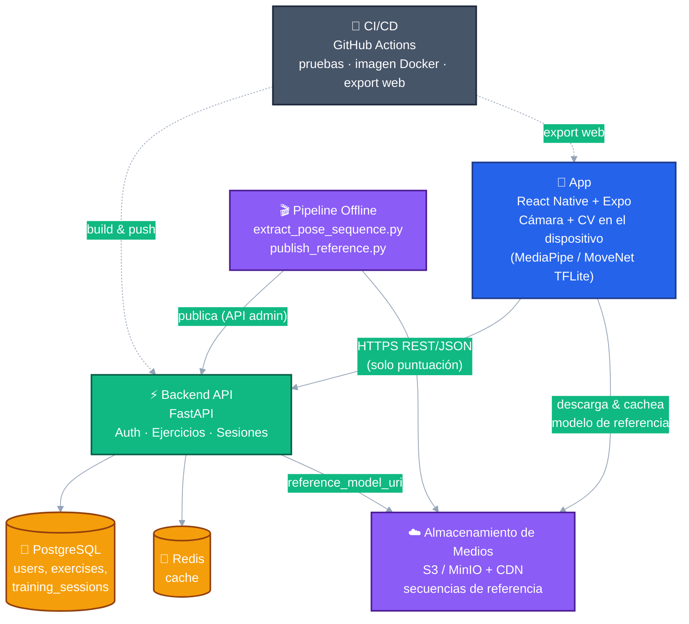
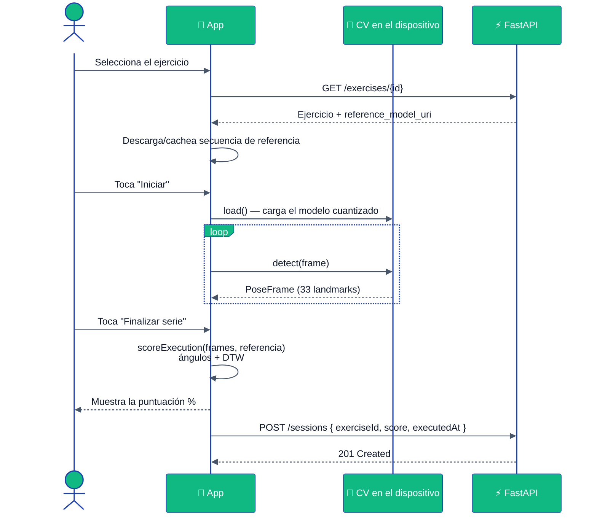
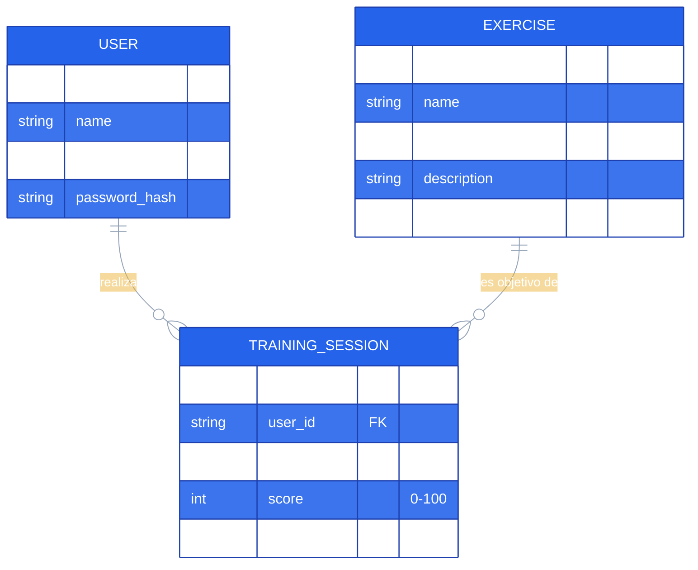

<div align="center">

# 🏋️‍♂️ Gym Execution

### Análisis de ejecución de ejercicios con IA on-device — tu celular es el único "juez" que necesitas.

[](README.md)
[](README.pt-BR.md)
[](README.es.md)

<br/>


</div>

---

Una app híbrida (mobile + web) que **graba al usuario realizando un
ejercicio con la cámara del celular** y devuelve una **puntuación de
corrección** (general + específica del ejercicio), comparando el
movimiento capturado con patrones de referencia — **todo procesado en
el propio dispositivo**. El video crudo nunca sale del celular; solo la
puntuación final se envía al backend.

## 📑 Tabla de Contenidos

- [📐 Reglas de Negocio](#-reglas-de-negocio)
- [✅ Requisitos Funcionales](#-requisitos-funcionales)
- [⚙️ Requisitos No Funcionales](#️-requisitos-no-funcionales)
- [🏗️ Arquitectura](#️-arquitectura)
  - [Diagrama de Componentes](#diagrama-de-componentes)
  - [Flujo de Ejecución (Diagrama de Secuencia)](#flujo-de-ejecución-diagrama-de-secuencia)
  - [Modelo de Datos (Diagrama ER)](#modelo-de-datos-diagrama-er)
- [🧰 Stack Tecnológico](#-stack-tecnológico)
- [📂 Estructura del Repositorio](#-estructura-del-repositorio)
- [🚀 Cómo Ejecutar](#-cómo-ejecutar)
- [🔌 Endpoints de la API](#-endpoints-de-la-api)
- [🧪 Pruebas & CI/CD](#-pruebas--cicd)
- [🚢 Despliegue](#-despliegue)
- [🔒 Seguridad & Supply Chain](#-seguridad--supply-chain)

## 📐 Reglas de Negocio

- 🔑 El usuario debe **registrarse e iniciar sesión** (JWT) para acceder
  a cualquier funcionalidad más allá de la autenticación.
- 🏃 Cada **ejecución** (una "serie") se realiza para **exactamente un
  ejercicio**, elegido de un **catálogo** compartido (sembrado de forma
  centralizada, no por usuario).
- 📊 Cada ejecución genera **una única puntuación (0–100)**, calculada
  comparando la secuencia de poses capturada con la **secuencia de
  referencia** del ejercicio (ángulos articulares + Dynamic Time
  Warping).
- 🔐 **Privacidad por diseño**: los frames/video crudos de la cámara
  **nunca** se suben — solo la puntuación calculada y los metadatos
  (ejercicio, fecha/hora) se guardan en el historial del usuario.
- 📜 El usuario solo puede ver **su propio** historial de entrenamientos
  (`GET /sessions` está restringido al usuario autenticado).
- 🎬 Las secuencias de referencia se producen **offline**, mediante un
  pipeline administrativo que procesa el video de un profesional y
  publica el resultado en `exercises.reference_model_uri` a través de un
  endpoint protegido para administradores (`X-Admin-Api-Key`).
- 🚦 Los endpoints de autenticación (`/auth/register`, `/auth/login`)
  tienen **rate limiting** para mitigar fuerza bruta/credential
  stuffing.
- ⚙️ Las preferencias del usuario (calidad de cámara, sonido de
  feedback, modo oscuro) son **solo locales al dispositivo** — nunca se
  sincronizan con el backend.

## ✅ Requisitos Funcionales

| # | Requisito |
|---|---|
| RF1 | Registro e inicio de sesión de usuario (correo + contraseña → JWT) |
| RF2 | Explorar el **catálogo de ejercicios** (nombre, grupo muscular, descripción) |
| RF3 | Capturar la ejecución de un ejercicio mediante **cámara** y detectar la pose corporal **en el dispositivo** |
| RF4 | Calcular una **puntuación %** comparando la ejecución con la secuencia de referencia del ejercicio |
| RF5 | Mostrar el resultado inmediatamente al finalizar la serie |
| RF6 | Persistir el resultado en el **historial paginado** del usuario |
| RF7 | Ver/editar **perfil** (nombre, correo) y estadísticas agregadas (series completadas, puntuación promedio) |
| RF8 | Configurar **preferencias locales**: calidad de cámara, sonido de feedback, modo oscuro |
| RF9 | Admin: publicar una **secuencia de pose de referencia** para un ejercicio |
| RF10 | Cierre de sesión / gestión de sesión mediante almacenamiento seguro de tokens |

## ⚙️ Requisitos No Funcionales

| # | Categoría | Requisito |
|---|---|---|
| RNF1 | **Rendimiento** | Fluido en dispositivos con **2GB de RAM (~2015+)**: modelos cuantizados (INT8) en el dispositivo, muestreo ~10 fps (`SAMPLE_INTERVAL_MS`), resolución de captura reducida |
| RNF2 | **Privacidad** | Ningún video/imagen crudo sale del dispositivo; solo se transmiten puntuaciones numéricas |
| RNF3 | **Seguridad** | JWT en almacenamiento seguro (`expo-secure-store`), hash de contraseñas, rate limiting en autenticación, endpoints admin protegidos por `X-Admin-Api-Key` |
| RNF4 | **Portabilidad** | Código único (React Native + Expo) para **Android, iOS y Web** |
| RNF5 | **Disponibilidad/CV offline-first** | La detección de pose funciona sin conexión (modelo embebido/cacheado en el dispositivo) |
| RNF6 | **Mantenibilidad** | Tipado de extremo a extremo (TypeScript + Pydantic), algoritmos centrales con pruebas unitarias (`pytest`, `Jest`) |
| RNF7 | **Escalabilidad** | FastAPI + PostgreSQL/Redis sin estado, containerizado, listo para hosting administrado |
| RNF8 | **Seguridad de supply-chain** | Versiones de dependencias fijadas, solo registries oficiales, instalación basada en lockfile (`npm ci`, `pip --require-hashes`) |
| RNF9 | **CI/CD** | Suites de pruebas automatizadas + build de imagen Docker + export web en cada push a `main` |

## 🏗️ Arquitectura

### Diagrama de Componentes



### Flujo de Ejecución (Diagrama de Secuencia)



### Modelo de Datos (Diagrama ER)



## 🧰 Stack Tecnológico

| Capa | Tecnología | Justificación |
|---|---|---|
| 📱 App híbrida | **React Native + Expo (SDK 51)**, TypeScript | Código único para Android/iOS/Web, excelente soporte de cámara |
| 🧠 CV en el dispositivo (web) | **`@mediapipe/tasks-vision`** (WASM) | Pose Landmarker oficial de Google, corre en el navegador |
| 🧠 CV en el dispositivo (mobile) | **MoveNet Lightning INT8** vía **`react-native-fast-tflite`** | Modelo cuantizado de ~3MB, rápido en dispositivos modestos |
| 🖼️ Preprocesamiento de imagen (mobile) | **`expo-camera`**, **`expo-image-manipulator`**, **`jpeg-js`** | Captura, recorte/redimensionado, decodificación a tensor RGB |
| ⚡ Backend / API | **Python 3.12 + FastAPI** | Rápido, tipado (Pydantic), estándar de la industria |
| 🗄️ Base de datos | **PostgreSQL 16** | Relacional, robusta, estándar para datos de usuarios/entrenamientos |
| 🚀 Caché | **Redis 7** | Consultas repetidas con baja latencia |
| 📦 Almacenamiento de medios | **S3-compatible (AWS S3 / MinIO) + CDN** | Videos de referencia y secuencias de pose cacheadas |
| 🐳 Containerización | **Docker** (multi-stage, non-root) | Despliegues reproducibles |
| 🤖 CI/CD | **GitHub Actions** | Pruebas, publicación de imagen Docker (ghcr.io), export web |
| 📲 Build/distribución mobile | **EAS (Expo Application Services)** | Builds nativos (`expo-dev-client` requerido para TFLite) |
| 🧪 Pruebas | **Pytest** (backend) / **Jest** (frontend) | Estándar de la industria |
| 🛠️ Migraciones de BD | **Alembic** | Cambios de esquema versionados |
| 🛡️ Rate limiting | **slowapi** | Protege los endpoints de autenticación |

> ⚠️ **Precaución de supply-chain**: instala solo desde registries
> oficiales (PyPI/npm), verifica que el nombre del paquete coincida
> exactamente con el oficial (evita typosquatting), revisa los lockfiles
> generados y prefiere versiones fijadas en producción. Ver
> [Seguridad & Supply Chain](#-seguridad--supply-chain).

## 📂 Estructura del Repositorio

| Directorio | Qué es | Docs |
|---|---|---|
| [`app/`](app/) | App React Native + Expo (mobile + web): pantallas, captura de cámara, puntuación de pose | [app/README.md](app/README.md) |
| [`backend/`](backend/) | API FastAPI: autenticación, catálogo de ejercicios, historial de sesiones | [backend/README.md](backend/README.md) |
| [`backend/pipeline/`](backend/pipeline/) | Pipeline offline: video de referencia → secuencia de pose → publicación | [backend/pipeline/README.md](backend/pipeline/README.md) |
| [`.github/workflows/`](.github/workflows/) | Pipelines de CI/CD (pruebas, build de imagen, export web) | — |

## 🚀 Cómo Ejecutar

```bash
# 1) Backend (API)
cd backend
cp .env.example .env            # completa los valores locales
python -m venv .venv && . .venv/Scripts/activate
pip install -r requirements.txt
alembic upgrade head
uvicorn app.main:app --reload

# 2) App (en otra terminal)
cd app
cp .env.example .env            # apunta EXPO_PUBLIC_API_BASE_URL a la API anterior
npm ci
npx expo start
```

Infraestructura local opcional (Postgres + Redis) vía Docker:

```bash
docker compose up -d
```

## 🔌 Endpoints de la API

| Método | Ruta | Descripción | Auth |
|---|---|---|---|
| `POST` | `/auth/register` | Registra un nuevo usuario | — |
| `POST` | `/auth/login` | Inicia sesión, devuelve JWT | — |
| `GET` | `/exercises` | Lista el catálogo de ejercicios | 🔑 |
| `GET` | `/exercises/{id}` | Detalle de un ejercicio | 🔑 |
| `PUT` | `/exercises/{id}/reference-model` | Publica la URI de la secuencia de referencia | 🛡️ Admin |
| `GET` | `/sessions` | Lista las sesiones de entrenamiento del usuario (paginado) | 🔑 |
| `POST` | `/sessions` | Registra el resultado de una sesión de entrenamiento | 🔑 |
| `GET` | `/users/me` | Obtiene el perfil del usuario autenticado | 🔑 |
| `PUT` | `/users/me` | Actualiza el perfil del usuario autenticado | 🔑 |

## 🧪 Pruebas & CI/CD

```bash
# Backend
cd backend && pytest

# App
cd app && npm test
```

[`.github/workflows/ci.yml`](.github/workflows/ci.yml) ejecuta ambas
suites en cada push/PR a `main`, construye y publica la imagen Docker de
la API en `ghcr.io`, exporta la app web y (programado/manual) ejecuta una
suite de integración contra un PostgreSQL real.

## 🚢 Despliegue

- **Backend**: containerizado vía [`backend/Dockerfile`](backend/Dockerfile)
  (multi-stage, non-root, ejecuta `alembic upgrade head` al iniciar).
  Pensado para un host administrado de Postgres/Redis (Railway, Render,
  Fly.io) — proveedor aún no elegido (el job `deploy-backend` es un
  placeholder).
- **App (mobile)**: builds nativos vía **EAS** (`app/eas.json`), requiere
  `expo-dev-client` por los módulos nativos de CV.
- **App (web)**: export estático vía `npx expo export --platform web`,
  listo para cualquier hosting estático (Cloudflare Pages, Netlify,
  Vercel, S3+CDN).

Detalles completos en los READMEs de [app](app/README.md) y
[backend](backend/README.md).

## 🔒 Seguridad & Supply Chain

- ⚠️ Como ya se ha visto con paquetes maliciosos de npm/PyPI: antes de
  instalar cualquier dependencia, verifica que el **nombre exacto**
  coincida con el paquete oficial (evita typosquatting), revisa el
  lockfile generado y prefiere instaladores que respeten el lockfile
  (`npm ci`, `pip install -r requirements.txt --require-hashes`).
- 🔐 Los archivos `.env` **nunca** se commitean — ver `.env.example` en
  `app/` y `backend/`, y el [`.gitignore`](.gitignore).
- 🔑 `JWT_SECRET_KEY`/`ADMIN_API_KEY` de producción deben generarse desde
  cero (`python -c "import secrets; print(secrets.token_urlsafe(64))"`)
  y almacenarse como secrets de despliegue/CI — nunca reutilizados del
  entorno de desarrollo.
- 📦 Los modelos de ML (`.tflite`/`.task`) se descargan solo de fuentes
  oficiales (TensorFlow Hub, Google AI Edge / MediaPipe), con checksums
  verificados cuando estén disponibles.
