<div align="center">

# 🏋️‍♂️ Gym Execution

### Análisis de ejecución de ejercicios con IA on-device — tu celular es el único "juez" que necesitas.

[](README.md)
[](README.pt-BR.md)
[](README.es.md)

<br/>


</div>

---

Una app híbrida (mobile + web) que **graba al usuario realizando un
ejercicio con la cámara del celular** y devuelve una **puntuación de
corrección** (general + específica del ejercicio), comparando el
movimiento capturado con patrones de referencia — **todo procesado en
el propio dispositivo**. El video crudo nunca sale del celular; solo la
puntuación final se envía al backend.

## 📑 Tabla de Contenidos

<details>
<summary><strong>📖 Haz clic para expandir el índice completo</strong></summary>

- [1️⃣ Requisitos](#1️⃣-requisitos)
  - [✅ Requisitos Funcionales (RF)](#-requisitos-funcionales-rf)
  - [⚙️ Requisitos No Funcionales (RNF)](#️-requisitos-no-funcionales-rnf)
  - [📐 Reglas de Negocio (RN)](#-reglas-de-negocio-rn)
  - [🌐 Requisitos de Dominio](#-requisitos-de-dominio)
  - [🗄️ Requisitos de Datos](#️-requisitos-de-datos)
  - [🔌 Requisitos de Interfaz](#-requisitos-de-interfaz)
- [2️⃣ Casos de Uso](#2️⃣-casos-de-uso)
- [3️⃣ Matriz de Trazabilidad de Requisitos](#3️⃣-matriz-de-trazabilidad-de-requisitos)
- [4️⃣ Especificación de Requisitos de Software (SRS)](#4️⃣-especificación-de-requisitos-de-software-srs)
- [5️⃣ Diagramas UML & Estructurales](#5️⃣-diagramas-uml--estructurales)
- [6️⃣ Modelo de Datos & Diccionario de Datos](#6️⃣-modelo-de-datos--diccionario-de-datos)
- [7️⃣ Diagrama de Flujo de Datos (DFD)](#7️⃣-diagrama-de-flujo-de-datos-dfd)
- [8️⃣ Diagrama de Arquitectura & Diagrama de Flujo](#8️⃣-diagrama-de-arquitectura--diagrama-de-flujo)
- [9️⃣ Persona & Mapa de Viaje del Usuario](#9️⃣-persona--mapa-de-viaje-del-usuario)
- [🔟 Wireframes & Mockups](#-wireframes--mockups)
- [🧰 Stack Tecnológico](#-stack-tecnológico)
- [📂 Estructura del Repositorio](#-estructura-del-repositorio)
- [🚀 Cómo Ejecutar](#-cómo-ejecutar)
- [🔌 Endpoints de la API](#-endpoints-de-la-api)
- [🧪 Pruebas & CI/CD](#-pruebas--cicd)
- [🚢 Despliegue](#-despliegue)
- [🔒 Seguridad & Supply Chain](#-seguridad--supply-chain)

</details>

---

## 1️⃣ Requisitos

### ✅ Requisitos Funcionales (RF)

<details>
<summary><strong>Haz clic para expandir — 10 requisitos funcionales</strong></summary>

| # | Requisito |
|---|---|
| RF01 | Registro e inicio de sesión de usuario (correo + contraseña → JWT) |
| RF02 | Explorar el **catálogo de ejercicios** (nombre, grupo muscular, descripción) |
| RF03 | Capturar la ejecución de un ejercicio mediante **cámara** y detectar la pose corporal **en el dispositivo** |
| RF04 | Calcular una **puntuación %** comparando la ejecución con la secuencia de referencia del ejercicio |
| RF05 | Mostrar el resultado inmediatamente al finalizar la serie |
| RF06 | Persistir el resultado en el **historial paginado** del usuario |
| RF07 | Ver/editar **perfil** (nombre, correo) y estadísticas agregadas (series completadas, puntuación promedio) |
| RF08 | Configurar **preferencias locales**: calidad de cámara, sonido de feedback, modo oscuro |
| RF09 | Admin: publicar una **secuencia de pose de referencia** para un ejercicio |
| RF10 | Cierre de sesión / gestión de sesión mediante almacenamiento seguro de tokens |

</details>

### ⚙️ Requisitos No Funcionales (RNF)

<details>
<summary><strong>Haz clic para expandir — 9 requisitos no funcionales</strong></summary>

| # | Categoría | Requisito |
|---|---|---|
| RNF01 | **Rendimiento** | Fluido en dispositivos con **2GB de RAM (~2015+)**: modelos cuantizados (INT8) en el dispositivo, muestreo ~10 fps (`SAMPLE_INTERVAL_MS`), resolución de captura reducida |
| RNF02 | **Privacidad** | Ningún video/imagen crudo sale del dispositivo; solo se transmiten puntuaciones numéricas |
| RNF03 | **Seguridad** | JWT en almacenamiento seguro (`expo-secure-store`), hash de contraseñas, rate limiting en autenticación, endpoints admin protegidos por `X-Admin-Api-Key` |
| RNF04 | **Portabilidad** | Código único (React Native + Expo) para **Android, iOS y Web** |
| RNF05 | **Disponibilidad/CV offline-first** | La detección de pose funciona sin conexión (modelo embebido/cacheado en el dispositivo) |
| RNF06 | **Mantenibilidad** | Tipado de extremo a extremo (TypeScript + Pydantic), algoritmos centrales con pruebas unitarias (`pytest`, `Jest`) |
| RNF07 | **Escalabilidad** | FastAPI + PostgreSQL/Redis sin estado, containerizado, listo para hosting administrado |
| RNF08 | **Seguridad de supply-chain** | Versiones de dependencias fijadas, solo registries oficiales, instalación basada en lockfile (`npm ci`, `pip --require-hashes`) |
| RNF09 | **CI/CD** | Suites de pruebas automatizadas + build de imagen Docker + export web en cada push a `main` |

</details>

### 📐 Reglas de Negocio (RN)

<details>
<summary><strong>Haz clic para expandir — 8 reglas de negocio</strong></summary>

| # | Regla |
|---|---|
| RN01 | 🔑 El usuario debe **registrarse e iniciar sesión** (JWT) para acceder a cualquier funcionalidad más allá de la autenticación |
| RN02 | 🏃 Cada **ejecución** (una "serie") se realiza para **exactamente un ejercicio**, elegido de un **catálogo** compartido (sembrado de forma centralizada, no por usuario) |
| RN03 | 📊 Cada ejecución genera **una única puntuación (0–100)**, calculada comparando la secuencia de poses capturada con la **secuencia de referencia** del ejercicio (ángulos articulares + Dynamic Time Warping) |
| RN04 | 🔐 **Privacidad por diseño**: los frames/video crudos de la cámara **nunca** se suben — solo la puntuación calculada y los metadatos (ejercicio, fecha/hora) se guardan en el historial del usuario |
| RN05 | 📜 El usuario solo puede ver **su propio** historial de entrenamientos (`GET /sessions` está restringido al usuario autenticado) |
| RN06 | 🎬 Las secuencias de referencia se producen **offline**, mediante un pipeline administrativo que procesa el video de un profesional y publica el resultado en `exercises.reference_model_uri` a través de un endpoint protegido para administradores (`X-Admin-Api-Key`) |
| RN07 | 🚦 Los endpoints de autenticación (`/auth/register`, `/auth/login`) tienen **rate limiting** para mitigar fuerza bruta/credential stuffing |
| RN08 | ⚙️ Las preferencias del usuario (calidad de cámara, sonido de feedback, modo oscuro) son **solo locales al dispositivo** — nunca se sincronizan con el backend |

</details>

### 🌐 Requisitos de Dominio

<details>
<summary><strong>Haz clic para expandir — restricciones específicas del dominio (visión por computadora / fitness)</strong></summary>

| # | Requisito |
|---|---|
| DOM01 | La detección de pose **debe** usar una topología de 33 landmarks corporales (compatible con BlazePose/MoveNet) para que las secuencias de referencia y capturada sean comparables |
| DOM02 | La puntuación **debe** combinar **diferencias de ángulos articulares** y **Dynamic Time Warping (DTW)** para tolerar variaciones de tiempo entre la referencia y la ejecución del usuario |
| DOM03 | El catálogo de ejercicios es **global/compartido** — los ejercicios no son creados por el usuario, garantizando que todos sean evaluados con la misma referencia |
| DOM04 | Las secuencias de pose de referencia se generan mediante un **pipeline offline** (`extract_pose_sequence.py`) a partir de la grabación de un profesional, nunca en tiempo real |
| DOM05 | La tasa de muestreo de la captura está fijada en **~10 fps** (`SAMPLE_INTERVAL_MS`) — un compromiso derivado del dominio entre precisión de la puntuación y rendimiento en dispositivos modestos |
| DOM06 | Una puntuación calculada de **0–100** siempre debe poder interpretarse como un porcentaje de similitud con el movimiento de referencia, sin importar el tipo de ejercicio |

</details>

### 🗄️ Requisitos de Datos

<details>
<summary><strong>Haz clic para expandir — reglas de persistencia y retención de datos</strong></summary>

| # | Requisito |
|---|---|
| DAT01 | `users`: `email` único, contraseña con hash (nunca almacenada en texto plano) |
| DAT02 | `exercises`: catálogo sembrado globalmente, con `reference_model_uri` opcional (nulo hasta que un admin lo publique) |
| DAT03 | `training_sessions`: una fila por ejecución — `user_id`, `exercise_id`, `score (0-100)`, `executed_at` |
| DAT04 | **Ningún medio crudo** (video/imágenes/frames de pose) se persiste en el servidor — solo la puntuación numérica final y los metadatos |
| DAT05 | Los resultados de `GET /sessions` **deben** estar paginados y filtrados por `user_id = usuario autenticado` |
| DAT06 | Los datos solo locales (calidad de cámara, sonido de feedback, modo oscuro) viven en el almacenamiento del dispositivo (`AsyncStorage`/`expo-secure-store`) y **nunca** se envían a la API |

</details>

### 🔌 Requisitos de Interfaz

<details>
<summary><strong>Haz clic para expandir — interfaces externas y de usuario</strong></summary>

| # | Requisito |
|---|---|
| INT01 | Toda comunicación cliente↔servidor usa **HTTPS REST/JSON** |
| INT02 | Las solicitudes autenticadas llevan un **token JWT Bearer** en el header `Authorization` |
| INT03 | Los endpoints exclusivos de admin requieren un header adicional `X-Admin-Api-Key` |
| INT04 | La app provee una **interfaz de captura por cámara** (`expo-camera`) con overlay de feedback de la pose en el dispositivo |
| INT05 | La UI debe ser **responsiva** entre los objetivos nativo (Android/iOS) y web a partir de un único código base React Native + Expo |
| INT06 | Los errores devueltos por la API siguen un formato JSON consistente (`{ "detail": "..." }`) para que el cliente muestre mensajes amigables |

</details>

---

## 2️⃣ Casos de Uso

### Actores

| Actor | Descripción |
|---|---|
| 🏃 **Usuario** | Atleta registrado que grava ejecuciones, ve puntuaciones e historial |
| 🛡️ **Admin** | Operador que publica secuencias de pose de referencia vía `X-Admin-Api-Key` |
| 🤖 **Sistema de CI/CD** | GitHub Actions — ejecuta pruebas, construye imágenes, exporta la app web (actor de soporte) |

### Resumen de los Casos de Uso

| ID | Caso de Uso | Actor Principal | RF Relacionado |
|---|---|---|---|
| UC01 | Registrarse | Usuario | RF01 |
| UC02 | Iniciar sesión | Usuario | RF01 |
| UC03 | Explorar el catálogo de ejercicios | Usuario | RF02 |
| UC04 | Ver detalles del ejercicio | Usuario | RF02 |
| UC05 | Capturar ejecución & obtener puntuación | Usuario | RF03, RF04, RF05 |
| UC06 | Ver historial de entrenamientos | Usuario | RF06 |
| UC07 | Ver / editar perfil | Usuario | RF07 |
| UC08 | Configurar preferencias locales | Usuario | RF08 |
| UC09 | Publicar secuencia de pose de referencia | Admin | RF09 |
| UC10 | Cerrar sesión | Usuario | RF10 |

### Especificaciones Detalladas de Casos de Uso

<details>
<summary><strong>📄 UC05 — Capturar Ejecución & Obtener Puntuación</strong></summary>

| Campo | Descripción |
|---|---|
| **Actor** | Usuario |
| **Precondiciones** | Usuario autenticado; un ejercicio con `reference_model_uri` publicado está seleccionado |
| **Flujo Principal** | 1. La app descarga/cachea la secuencia de pose de referencia del ejercicio.<br>2. El usuario toca "Iniciar"; la app carga el modelo de CV en el dispositivo.<br>3. La app muestrea frames de la cámara (~10 fps) y ejecuta la detección de pose por frame.<br>4. El usuario toca "Finalizar serie".<br>5. La app calcula la puntuación (ángulos articulares + DTW) comparando con la secuencia de referencia.<br>6. La app muestra la puntuación % inmediatamente.<br>7. La app envía `POST /sessions` con `{ exerciseId, score, executedAt }`. |
| **Flujos Alternativos** | A1. Sin red al guardar → el resultado se muestra localmente y se encola para reenvío.<br>A2. Modelo de referencia no cacheado → la app bloquea "Iniciar" hasta que termine la descarga. |
| **Postcondiciones** | Se crea una fila en `training_sessions`; el resultado queda visible en el historial del usuario |
| **Requisitos Relacionados** | RF03–RF06, RNF01, RNF02, RNF05, DOM01–DOM06, DAT03, DAT04 |

</details>

<details>
<summary><strong>📄 UC09 — Publicar Secuencia de Pose de Referencia (Admin)</strong></summary>

| Campo | Descripción |
|---|---|
| **Actor** | Admin |
| **Precondiciones** | El admin posee un `X-Admin-Api-Key` válido; existe una secuencia de pose de referencia ya procesada (salida de `extract_pose_sequence.py`) |
| **Flujo Principal** | 1. El admin ejecuta el pipeline offline sobre el video de referencia de un profesional.<br>2. El pipeline envía la secuencia de pose resultante al almacenamiento de medios.<br>3. El admin llama a `PUT /exercises/{id}/reference-model` con la URI resultante y `X-Admin-Api-Key`.<br>4. La API valida la clave de admin y actualiza `exercises.reference_model_uri`. |
| **Flujos Alternativos** | A1. `X-Admin-Api-Key` inválido/ausente → `403 Forbidden`. |
| **Postcondiciones** | El ejercicio pasa a ser "puntuable" — el `UC05` puede ejecutarse para él |
| **Requisitos Relacionados** | RF09, RN06, DOM04, INT03 |

</details>

---

## 3️⃣ Matriz de Trazabilidad de Requisitos

<details>
<summary><strong>Haz clic para expandir — mapea requisitos → casos de uso → implementación → verificación</strong></summary>

| Requisito | Descripción | Caso(s) de Uso | Implementación | Verificación |
|---|---|---|---|---|
| RF01 | Registro/Login | UC01, UC02 | `backend/app/routers/auth.py` | `backend/tests/test_auth.py` |
| RF02 | Explorar catálogo | UC03, UC04 | `backend/app/routers/exercises.py` | `backend/tests/test_exercises.py` |
| RF03 | Captura + detección de pose en el dispositivo | UC05 | `app/services/poseDetector*.ts` | `app/__tests__/poseDetector.test.ts` |
| RF04 | Calcular puntuación % | UC05 | `app/services/scoreExecution.ts` | `app/__tests__/scoreExecution.test.ts` |
| RF05 | Mostrar resultado inmediatamente | UC05 | `app/screens/ExecutionScreen.tsx` | Manual / E2E |
| RF06 | Historial paginado | UC06 | `backend/app/routers/sessions.py` | `backend/tests/test_sessions.py` |
| RF07 | Ver/editar perfil | UC07 | `backend/app/routers/users.py` | `backend/tests/test_users.py` |
| RF08 | Preferencias locales | UC08 | `app/hooks/usePreferences.ts` | `app/__tests__/usePreferences.test.ts` |
| RF09 | Publicar modelo de referencia | UC09 | `backend/app/routers/exercises.py` (admin) | `backend/tests/test_admin.py` |
| RF10 | Cerrar sesión | UC10 | `app/services/auth.ts` | `app/__tests__/auth.test.ts` |
| RNF01 | Rendimiento en dispositivos modestos | UC05 | Modelo TFLite INT8, `SAMPLE_INTERVAL_MS` | Prueba manual de rendimiento en dispositivo 2GB |
| RNF02 | Privacidad (sin medios crudos) | UC05 | `scoreExecution.ts` descarta los frames tras el procesamiento | Code review + verificación RN04 |
| RNF03 | Seguridad (JWT, hash, rate limit) | UC01, UC02, UC09 | `backend/app/core/security.py` | `backend/tests/test_auth.py` |
| RNF04 | Multiplataforma | Todos | Expo (Android/iOS/Web) | Matriz de build en CI |
| RNF05 | CV offline-first | UC05 | Modelo TFLite embebido/cacheado | Prueba manual offline |
| RNF06 | Mantenibilidad (tipado/pruebas) | Todos | TypeScript + Pydantic | `pytest`, `Jest` en CI |
| RNF07 | Escalabilidad | Todos | FastAPI + Postgres/Redis sin estado | Prueba de carga (futuro) |
| RNF08 | Seguridad de supply-chain | Todos | Lockfiles, versiones fijadas | `npm ci`, `pip --require-hashes` |
| RNF09 | CI/CD | Todos | `.github/workflows/ci.yml` | Ejecución de CI en cada push/PR |
| DOM01–DOM06 | Reglas de dominio (pose/puntuación) | UC05 | `app/services/`, `backend/pipeline/` | Pruebas unitarias + validación manual |
| DAT01–DAT06 | Reglas de persistencia de datos | UC01, UC05, UC06, UC08 | `backend/app/models/`, `app/services/storage.ts` | `backend/tests/`, code review |
| INT01–INT06 | Interfaces | Todos | API REST + UI Expo | Schema OpenAPI, `Jest`/`pytest` |

</details>

---

## 4️⃣ Especificación de Requisitos de Software (SRS)

<details>
<summary><strong>Haz clic para expandir — SRS condensada (estilo IEEE 830)</strong></summary>

### 4.1 Introducción

- **Propósito**: definir los requisitos funcionales y no funcionales de *Gym Execution*, una app híbrida que evalúa la ejecución de ejercicios usando visión por computadora en el dispositivo.
- **Alcance**: cubre el cliente mobile/web (React Native + Expo), la API backend (FastAPI) y el pipeline offline de referencia. Fuera de alcance: seguimiento nutricional, funciones sociales, integración con wearables.
- **Definiciones**: *Ejecución* = una serie grabada de un ejercicio. *Secuencia de referencia* = la secuencia de landmarks de pose extraída de la grabación de un profesional. *Puntuación* = métrica de similitud de 0–100.
- **Referencias**: ver [Requisitos](#1️⃣-requisitos), [Casos de Uso](#2️⃣-casos-de-uso), [Modelo de Datos](#6️⃣-modelo-de-datos--diccionario-de-datos).

### 4.2 Descripción General

- **Perspectiva del producto**: app + API independientes; sin dependencia de plataformas fitness de terceros.
- **Funciones del producto**: ver [Requisitos Funcionales (RF)](#-requisitos-funcionales-rf).
- **Clases de usuario**: *Usuario* (atleta) y *Admin* (curador del catálogo/referencias) — ver [Casos de Uso](#2️⃣-casos-de-uso).
- **Entorno operativo**: Android, iOS, Web (Expo); API en contenedores Linux (Docker).
- **Restricciones de diseño**: la detección de pose debe ejecutarse en **dispositivos con 2GB de RAM**; los medios crudos nunca pueden salir del dispositivo (privacidad por diseño, ver RN04 y los requisitos de dominio).
- **Supuestos & dependencias**: las secuencias de pose de referencia son preparadas offline por el Admin antes de que un ejercicio sea utilizable de extremo a extremo (UC09 precede a UC05 para cualquier ejercicio).

### 4.3 Requisitos Específicos

- Funcionales: [RF01–RF10](#-requisitos-funcionales-rf)
- No funcionales: [RNF01–RNF09](#️-requisitos-no-funcionales-rnf)
- Reglas de negocio: [RN01–RN08](#-reglas-de-negocio-rn)
- Dominio: [DOM01–DOM06](#-requisitos-de-dominio)
- Datos: [DAT01–DAT06](#-requisitos-de-datos)
- Interfaz: [INT01–INT06](#-requisitos-de-interfaz)
- Contratos de interfaz externa: [Endpoints de la API](#-endpoints-de-la-api)

### 4.4 Apéndices

- [Diagramas UML & Estructurales](#5️⃣-diagramas-uml--estructurales)
- [Modelo de Datos & Diccionario de Datos](#6️⃣-modelo-de-datos--diccionario-de-datos)
- [Matriz de Trazabilidad de Requisitos](#3️⃣-matriz-de-trazabilidad-de-requisitos)

</details>

---

## 5️⃣ Diagramas UML & Estructurales

### 1. 🎯 Diagrama de Casos de Uso

<details>
<summary><strong>Haz clic para expandir</strong></summary>

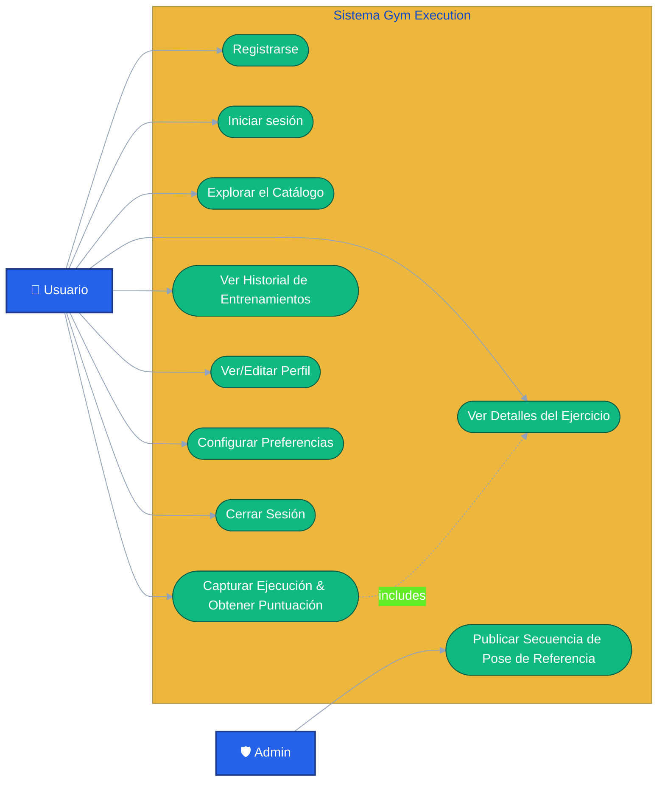
```mermaid
%%{init: {'theme':'base', 'themeVariables': {'primaryColor':'#2563EB','primaryTextColor':'#fff','primaryBorderColor':'#1E40AF','lineColor':'#94A3B8'}}}%%
graph LR
    classDef actor fill:#2563EB,color:#fff,stroke:#1E3A8A,stroke-width:2px;
    classDef usecase fill:#10B981,color:#fff,stroke:#065F46,stroke-width:1px;

    User["🏃 Usuario"]:::actor
    Admin["🛡️ Admin"]:::actor

    subgraph System["Sistema Gym Execution"]
        UC1(["Registrarse"]):::usecase
        UC2(["Iniciar sesión"]):::usecase
        UC3(["Explorar el Catálogo"]):::usecase
        UC4(["Ver Detalles del Ejercicio"]):::usecase
        UC5(["Capturar Ejecución & Obtener Puntuación"]):::usecase
        UC6(["Ver Historial de Entrenamientos"]):::usecase
        UC7(["Ver/Editar Perfil"]):::usecase
        UC8(["Configurar Preferencias"]):::usecase
        UC9(["Publicar Secuencia de Pose de Referencia"]):::usecase
        UC10(["Cerrar Sesión"]):::usecase
    end

    User --> UC1
    User --> UC2
    User --> UC3
    User --> UC4
    User --> UC5
    User --> UC6
    User --> UC7
    User --> UC8
    User --> UC10
    Admin --> UC9
    UC5 -.includes.-> UC4
```

</details>

### 2. 🧬 Diagrama de Clases

<details>
<summary><strong>Haz clic para expandir</strong></summary>

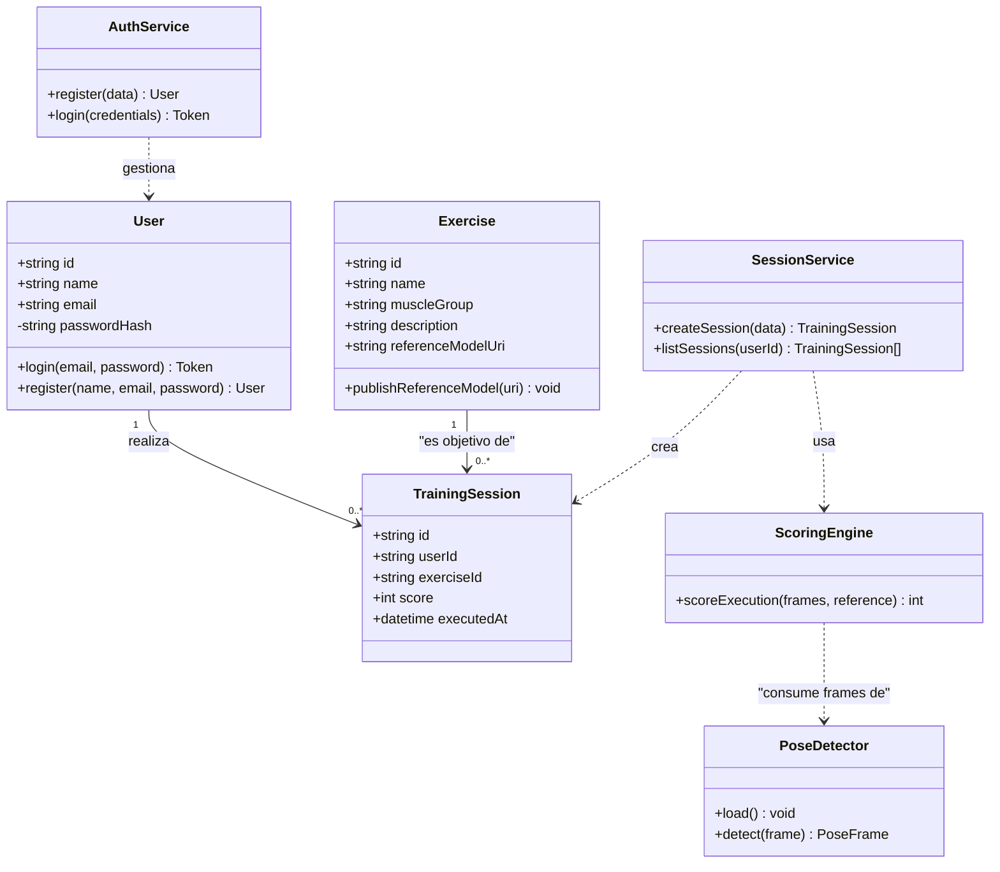
```mermaid
classDiagram
    class User {
        +string id
        +string name
        +string email
        -string passwordHash
        +login(email, password) Token
        +register(name, email, password) User
    }
    class Exercise {
        +string id
        +string name
        +string muscleGroup
        +string description
        +string referenceModelUri
        +publishReferenceModel(uri) void
    }
    class TrainingSession {
        +string id
        +string userId
        +string exerciseId
        +int score
        +datetime executedAt
    }
    class PoseDetector {
        +load() void
        +detect(frame) PoseFrame
    }
    class ScoringEngine {
        +scoreExecution(frames, reference) int
    }
    class AuthService {
        +register(data) User
        +login(credentials) Token
    }
    class SessionService {
        +createSession(data) TrainingSession
        +listSessions(userId) TrainingSession[]
    }

    User "1" --> "0..*" TrainingSession : realiza
    Exercise "1" --> "0..*" TrainingSession : "es objetivo de"
    SessionService ..> TrainingSession : crea
    SessionService ..> ScoringEngine : usa
    ScoringEngine ..> PoseDetector : "consume frames de"
    AuthService ..> User : gestiona
```

</details>

### 3. 🧩 Diagrama de Objetos

<details>
<summary><strong>Haz clic para expandir — ejemplo de instancias en un instante</strong></summary>

```mermaid
classDiagram
    class ana "ana : User" {
        id = "u_001"
        name = "Ana Silva"
        email = "ana@example.com"
    }
    class squat "squat : Exercise" {
        id = "ex_010"
        name = "Squat"
        muscleGroup = "Piernas"
        referenceModelUri = "s3://refs/squat_v2.json"
    }
    class session42 "session42 : TrainingSession" {
        id = "ts_042"
        userId = "u_001"
        exerciseId = "ex_010"
        score = 87
        executedAt = "2026-06-10T18:30:00Z"
    }
    ana --> session42
    squat --> session42
```

</details>

### 4. 🔀 Diagrama de Secuencia

<details>
<summary><strong>Haz clic para expandir — flujo de ejecución</strong></summary>

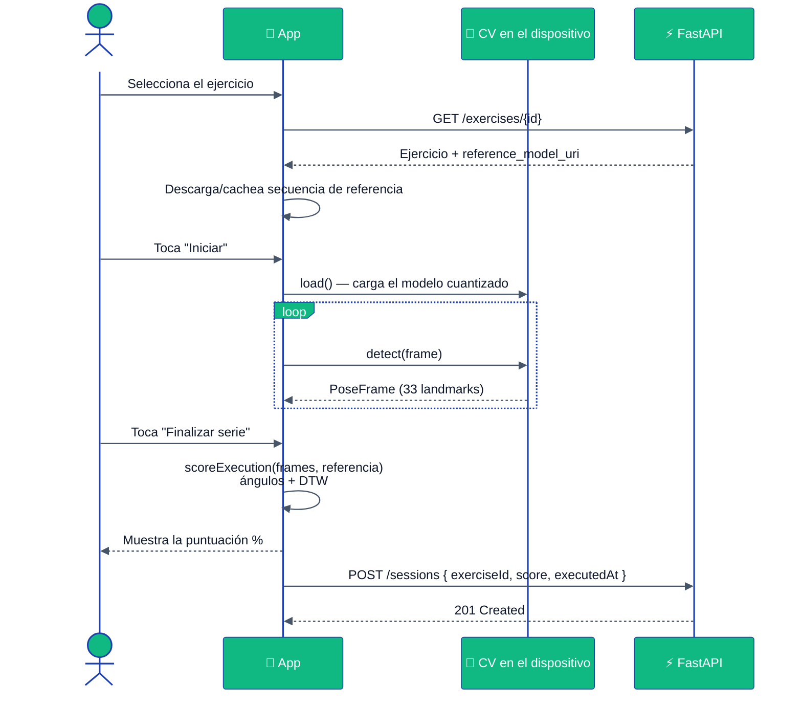
```mermaid
%%{init: {'theme':'base', 'themeVariables': {'primaryColor':'#2563EB','primaryTextColor':'#fff','primaryBorderColor':'#1E40AF','actorBkg':'#10B981','actorTextColor':'#fff','signalColor':'#475569','signalTextColor':'#0f172a'}}}%%
sequenceDiagram
    actor U as 🏃 Usuario
    participant App as 📱 App
    participant CV as 🧠 CV en el dispositivo
    participant API as ⚡ FastAPI

    U->>App: Selecciona el ejercicio
    App->>API: GET /exercises/{id}
    API-->>App: Ejercicio + reference_model_uri
    App->>App: Descarga/cachea secuencia de referencia
    U->>App: Toca "Iniciar"
    App->>CV: load() — carga el modelo cuantizado
    loop ~10 fps durante la grabación
        App->>CV: detect(frame)
        CV-->>App: PoseFrame (33 landmarks)
    end
    U->>App: Toca "Finalizar serie"
    App->>App: scoreExecution(frames, referencia)<br/>ángulos + DTW
    App-->>U: Muestra la puntuación %
    App->>API: POST /sessions { exerciseId, score, executedAt }
    API-->>App: 201 Created
```

</details>

### 5. 🗣️ Diagrama de Comunicación (Colaboración)

<details>
<summary><strong>Haz clic para expandir</strong></summary>

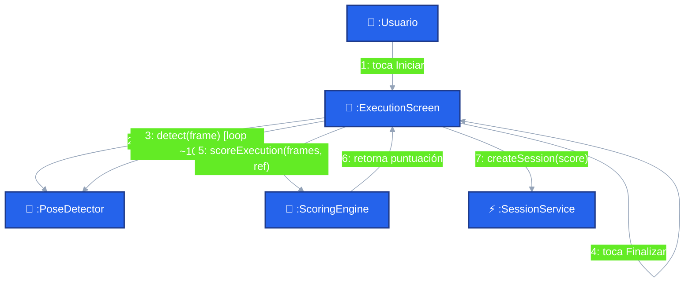
```mermaid
%%{init: {'theme':'base', 'themeVariables': {'primaryColor':'#2563EB','primaryTextColor':'#fff','primaryBorderColor':'#1E40AF','lineColor':'#94A3B8'}}}%%
graph TD
    classDef obj fill:#2563EB,color:#fff,stroke:#1E3A8A,stroke-width:2px;
    U["🏃 :Usuario"]:::obj
    A["📱 :ExecutionScreen"]:::obj
    P["🧠 :PoseDetector"]:::obj
    S["📐 :ScoringEngine"]:::obj
    API["⚡ :SessionService"]:::obj

    U -- "1: toca Iniciar" --> A
    A -- "2: load()" --> P
    A -- "3: detect(frame) [loop ~10fps]" --> P
    A -- "4: toca Finalizar" --> A
    A -- "5: scoreExecution(frames, ref)" --> S
    S -- "6: retorna puntuación" --> A
    A -- "7: createSession(score)" --> API
```

</details>

### 6. 🔁 Diagrama de Actividades

<details>
<summary><strong>Haz clic para expandir — flujo de captura y puntuación</strong></summary>

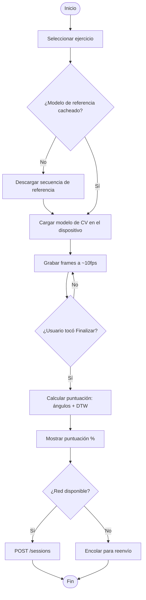
```mermaid
flowchart TD
    Start([Inicio]) --> SelectEx[Seleccionar ejercicio]
    SelectEx --> CheckRef{¿Modelo de referencia cacheado?}
    CheckRef -- No --> Download[Descargar secuencia de referencia]
    Download --> LoadModel[Cargar modelo de CV en el dispositivo]
    CheckRef -- Sí --> LoadModel
    LoadModel --> Record["Grabar frames a ~10fps"]
    Record --> Tap{¿Usuario tocó Finalizar?}
    Tap -- No --> Record
    Tap -- Sí --> Score["Calcular puntuación: ángulos + DTW"]
    Score --> Show[Mostrar puntuación %]
    Show --> Online{¿Red disponible?}
    Online -- Sí --> Save["POST /sessions"]
    Online -- No --> Queue[Encolar para reenvío]
    Save --> End([Fin])
    Queue --> End
```

</details>

### 7. 🚦 Diagrama de Máquina de Estados

<details>
<summary><strong>Haz clic para expandir — ciclo de vida de la sesión de ejecución</strong></summary>

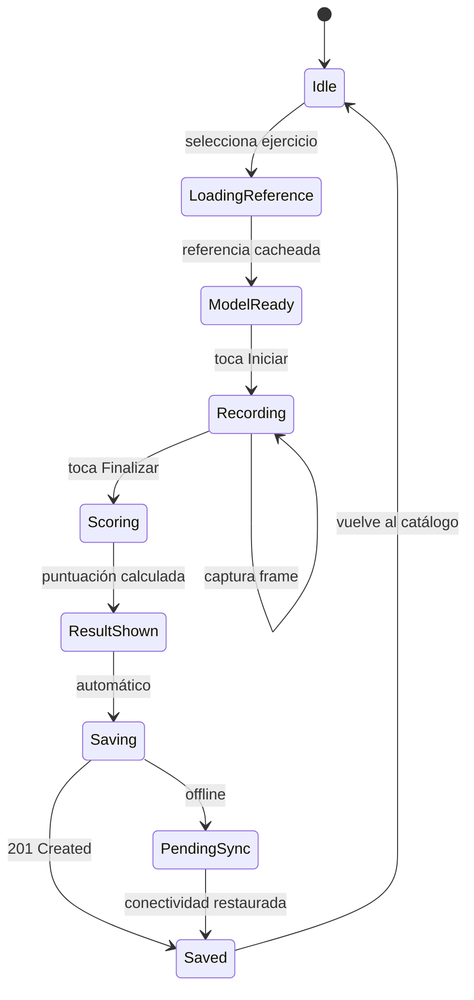
```mermaid
stateDiagram-v2
    [*] --> Idle
    Idle --> LoadingReference : selecciona ejercicio
    LoadingReference --> ModelReady : referencia cacheada
    ModelReady --> Recording : toca Iniciar
    Recording --> Recording : captura frame
    Recording --> Scoring : toca Finalizar
    Scoring --> ResultShown : puntuación calculada
    ResultShown --> Saving : automático
    Saving --> Saved : 201 Created
    Saving --> PendingSync : offline
    PendingSync --> Saved : conectividad restaurada
    Saved --> Idle : vuelve al catálogo
```

</details>

### 8. 🧱 Diagrama de Componentes

<details>
<summary><strong>Haz clic para expandir</strong></summary>

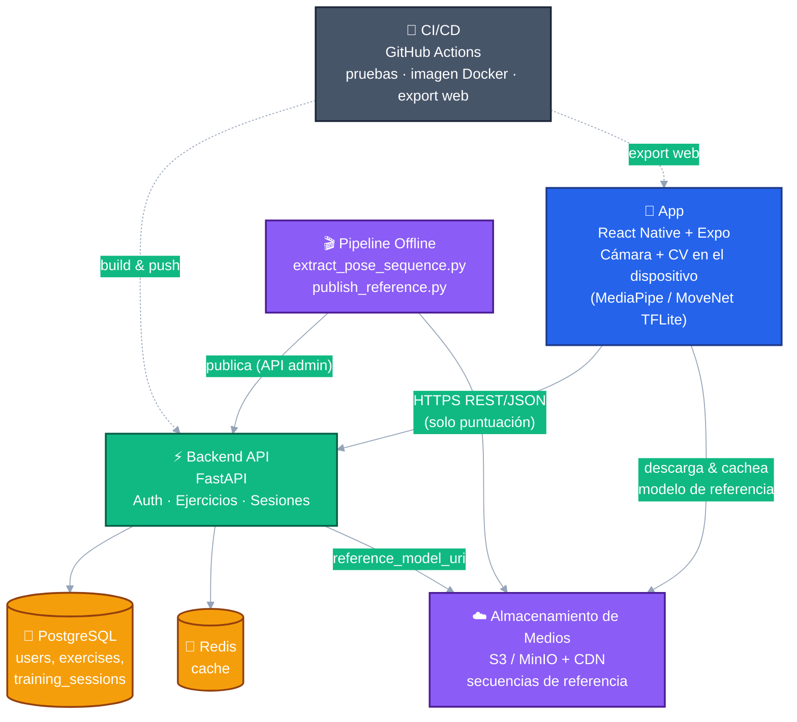
```mermaid
%%{init: {'theme':'base', 'themeVariables': {'primaryColor':'#2563EB','primaryTextColor':'#fff','primaryBorderColor':'#1E40AF','lineColor':'#94A3B8','secondaryColor':'#10B981','tertiaryColor':'#F59E0B'}}}%%
graph TD
    classDef app fill:#2563EB,color:#fff,stroke:#1E3A8A,stroke-width:2px;
    classDef api fill:#10B981,color:#fff,stroke:#065F46,stroke-width:2px;
    classDef data fill:#F59E0B,color:#fff,stroke:#92400E,stroke-width:2px;
    classDef storage fill:#8B5CF6,color:#fff,stroke:#4C1D95,stroke-width:2px;
    classDef ci fill:#475569,color:#fff,stroke:#1E293B,stroke-width:2px;

    A["📱 App<br/>React Native + Expo<br/>Cámara + CV en el dispositivo<br/>(MediaPipe / MoveNet TFLite)"]:::app
    B["⚡ Backend API<br/>FastAPI<br/>Auth · Ejercicios · Sesiones"]:::api
    C[("🐘 PostgreSQL<br/>users, exercises,<br/>training_sessions")]:::data
    D[("🔴 Redis<br/>cache")]:::data
    E["☁️ Almacenamiento de Medios<br/>S3 / MinIO + CDN<br/>secuencias de referencia"]:::storage
    F["🎬 Pipeline Offline<br/>extract_pose_sequence.py<br/>publish_reference.py"]:::storage
    G["🤖 CI/CD<br/>GitHub Actions<br/>pruebas · imagen Docker · export web"]:::ci

    A -- "HTTPS REST/JSON\n(solo puntuación)" --> B
    B --> C
    B --> D
    B -- "reference_model_uri" --> E
    A -- "descarga & cachea\nmodelo de referencia" --> E
    F -- "publica (API admin)" --> B
    F --> E
    G -. "build & push" .-> B
    G -. "export web" .-> A
```

</details>

### 9. 🚀 Diagrama de Implementación (Deployment)

<details>
<summary><strong>Haz clic para expandir</strong></summary>

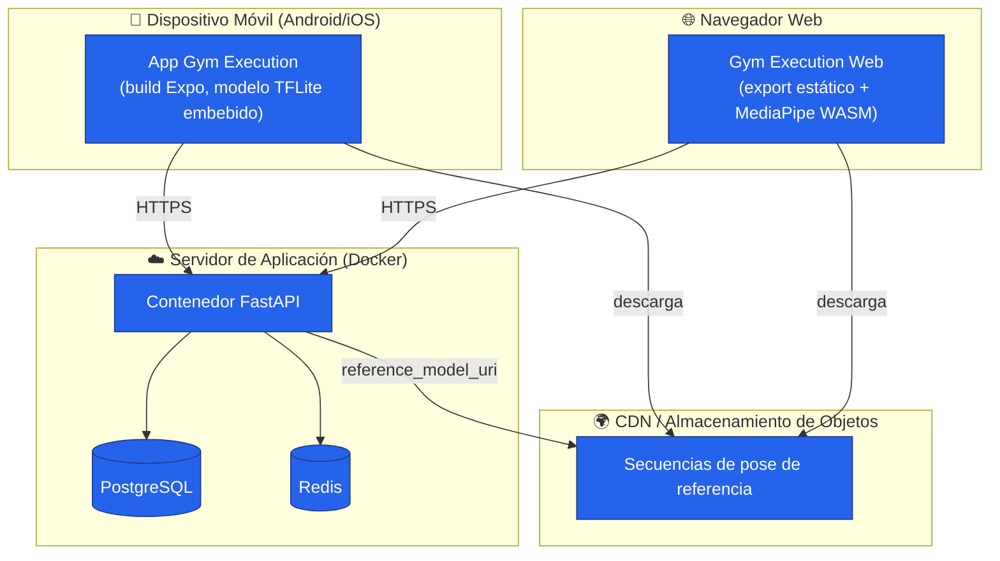
```mermaid
graph TB
    classDef artifact fill:#2563EB,color:#fff,stroke:#1E3A8A,stroke-width:1px;

    subgraph Mobile["📱 Dispositivo Móvil (Android/iOS)"]
        AppArtifact["App Gym Execution\n(build Expo, modelo TFLite embebido)"]:::artifact
    end
    subgraph Browser["🌐 Navegador Web"]
        WebArtifact["Gym Execution Web\n(export estático + MediaPipe WASM)"]:::artifact
    end
    subgraph Server["☁️ Servidor de Aplicación (Docker)"]
        APIArtifact["Contenedor FastAPI"]:::artifact
        DBArtifact[("PostgreSQL")]:::artifact
        CacheArtifact[("Redis")]:::artifact
    end
    subgraph CDN["🌍 CDN / Almacenamiento de Objetos"]
        MediaArtifact["Secuencias de pose de referencia"]:::artifact
    end

    AppArtifact -- HTTPS --> APIArtifact
    WebArtifact -- HTTPS --> APIArtifact
    APIArtifact --> DBArtifact
    APIArtifact --> CacheArtifact
    AppArtifact -- descarga --> MediaArtifact
    WebArtifact -- descarga --> MediaArtifact
    APIArtifact -- reference_model_uri --> MediaArtifact
```

</details>

### 10. 📦 Diagrama de Paquetes

<details>
<summary><strong>Haz clic para expandir</strong></summary>

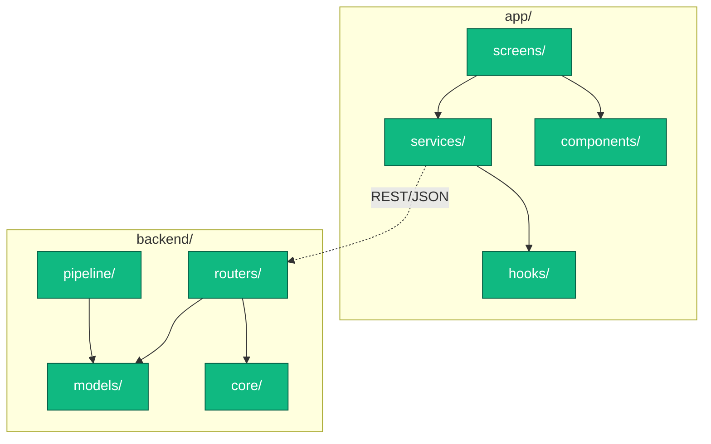
```mermaid
graph TD
    classDef pkg fill:#10B981,color:#fff,stroke:#065F46,stroke-width:1px;
    subgraph AppPkg["app/"]
        Screens["screens/"]:::pkg
        Services["services/"]:::pkg
        Hooks["hooks/"]:::pkg
        Components["components/"]:::pkg
    end
    subgraph BackendPkg["backend/"]
        Routers["routers/"]:::pkg
        Models["models/"]:::pkg
        CoreP["core/"]:::pkg
        Pipeline["pipeline/"]:::pkg
    end
    Screens --> Services
    Screens --> Components
    Services --> Hooks
    Routers --> Models
    Routers --> CoreP
    Pipeline --> Models
    Services -. "REST/JSON" .-> Routers
```

</details>

### 11. 🧩 Diagrama de Estructura Compuesta

<details>
<summary><strong>Haz clic para expandir — estructura interna del componente de CV en el dispositivo</strong></summary>

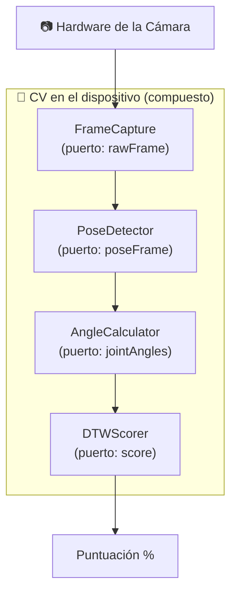
```mermaid
graph TB
    subgraph CV["🧠 CV en el dispositivo (compuesto)"]
        direction TB
        FC["FrameCapture\n(puerto: rawFrame)"]
        PD["PoseDetector\n(puerto: poseFrame)"]
        AC["AngleCalculator\n(puerto: jointAngles)"]
        DTW["DTWScorer\n(puerto: score)"]
        FC --> PD --> AC --> DTW
    end
    Camera["📷 Hardware de la Cámara"] --> FC
    DTW --> Result["Puntuación %"]
```

</details>

### 12. 🗺️ Diagrama de Visión General de Interacción

<details>
<summary><strong>Haz clic para expandir — flujo de alto nivel entre casos de uso</strong></summary>

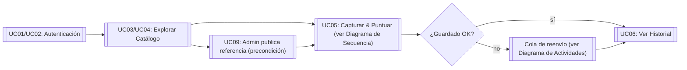
```mermaid
flowchart LR
    A[["UC01/UC02: Autenticación"]] --> B[["UC03/UC04: Explorar Catálogo"]]
    B --> C[["UC05: Capturar & Puntuar (ver Diagrama de Secuencia)"]]
    C --> D{¿Guardado OK?}
    D -- sí --> E[["UC06: Ver Historial"]]
    D -- no --> F[["Cola de reenvío (ver Diagrama de Actividades)"]]
    F --> E
    B --> G[["UC09: Admin publica referencia (precondición)"]]
    G --> C
```

</details>

### 13. ⏱️ Diagrama de Tiempo (Timing)

<details>
<summary><strong>Haz clic para expandir — tiempos aproximados de una sesión de captura</strong></summary>


```mermaid
gantt
    dateFormat  X
    axisFormat %Ss
    title Captura de Ejecución — Tiempos (aprox., una serie)
    section Estado de la App
    Idle                       :done, idle, 0, 1s
    Cargando Referencia        :active, load, 1, 1s
    Grabando (~10 fps)         : rec, 2, 15s
    Puntuando (ángulos+DTW)    : score, 17, 1s
    Resultado Mostrado         : result, 18, 3s
    Guardando                  : saving, 21, 1s
```

</details>

---

## 6️⃣ Modelo de Datos & Diccionario de Datos

### 🗺️ Modelo Conceptual de Datos

<details>
<summary><strong>Haz clic para expandir — solo entidades & relaciones</strong></summary>

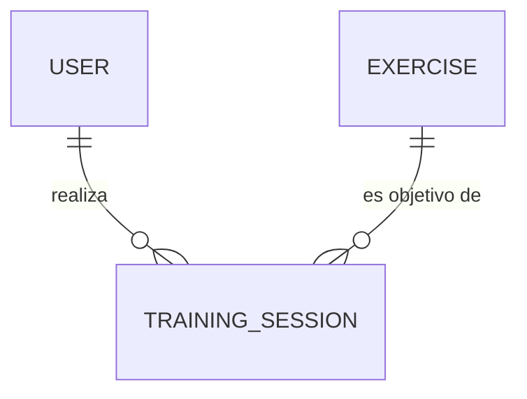
```mermaid
erDiagram
    USER ||--o{ TRAINING_SESSION : realiza
    EXERCISE ||--o{ TRAINING_SESSION : "es objetivo de"
```

</details>

### 🧮 Modelo Lógico de Datos

<details>
<summary><strong>Haz clic para expandir — entidades, atributos & tipos (independiente de plataforma)</strong></summary>

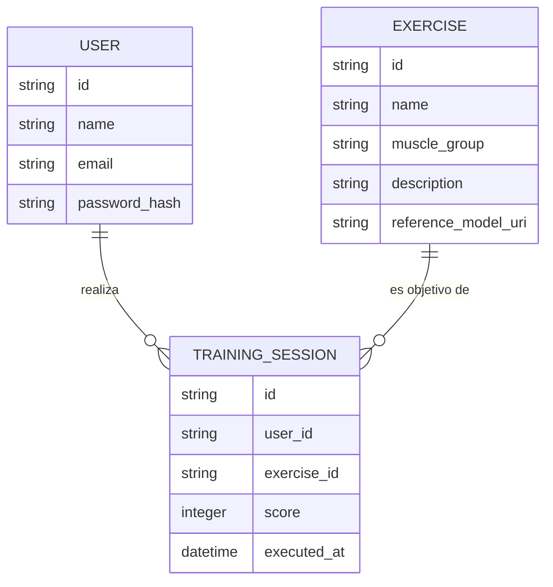
```mermaid
erDiagram
    USER {
        string id
        string name
        string email
        string password_hash
    }
    EXERCISE {
        string id
        string name
        string muscle_group
        string description
        string reference_model_uri
    }
    TRAINING_SESSION {
        string id
        string user_id
        string exercise_id
        integer score
        datetime executed_at
    }
    USER ||--o{ TRAINING_SESSION : realiza
    EXERCISE ||--o{ TRAINING_SESSION : "es objetivo de"
```

</details>

### 🐘 Modelo Físico de Datos / DER (PostgreSQL)

<details>
<summary><strong>Haz clic para expandir — tipos, claves & constraints de PostgreSQL</strong></summary>

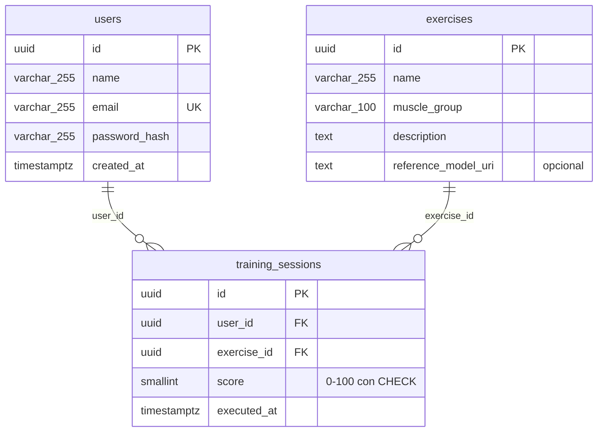
```mermaid
erDiagram
    users {
        uuid id PK
        varchar_255 name
        varchar_255 email UK
        varchar_255 password_hash
        timestamptz created_at
    }
    exercises {
        uuid id PK
        varchar_255 name
        varchar_100 muscle_group
        text description
        text reference_model_uri "opcional"
    }
    training_sessions {
        uuid id PK
        uuid user_id FK
        uuid exercise_id FK
        smallint score "0-100 con CHECK"
        timestamptz executed_at
    }
    users ||--o{ training_sessions : "user_id"
    exercises ||--o{ training_sessions : "exercise_id"
```

</details>

### 📖 Diccionario de Datos

<details>
<summary><strong>Haz clic para expandir — diccionario completo a nivel de columna</strong></summary>

| Tabla | Columna | Tipo | Constraints | Descripción |
|---|---|---|---|---|
| `users` | `id` | `uuid` | PK, default `gen_random_uuid()` | Identificador único del usuario |
| `users` | `name` | `varchar(255)` | NOT NULL | Nombre de visualización |
| `users` | `email` | `varchar(255)` | UNIQUE, NOT NULL | Identificador de login |
| `users` | `password_hash` | `varchar(255)` | NOT NULL | Hash bcrypt/argon2 — nunca texto plano |
| `users` | `created_at` | `timestamptz` | NOT NULL, default `now()` | Fecha/hora de creación de la cuenta |
| `exercises` | `id` | `uuid` | PK, default `gen_random_uuid()` | Identificador único del ejercicio |
| `exercises` | `name` | `varchar(255)` | NOT NULL | Nombre del ejercicio (ej.: "Squat") |
| `exercises` | `muscle_group` | `varchar(100)` | NOT NULL | Ej.: "Piernas", "Espalda", "Pecho" |
| `exercises` | `description` | `text` | NULLABLE | Instrucciones en texto libre |
| `exercises` | `reference_model_uri` | `text` | NULLABLE | URI de la secuencia de pose de referencia publicada (definida vía endpoint admin) |
| `training_sessions` | `id` | `uuid` | PK, default `gen_random_uuid()` | Identificador único de la ejecución |
| `training_sessions` | `user_id` | `uuid` | FK → `users.id`, NOT NULL | Dueño de la ejecución |
| `training_sessions` | `exercise_id` | `uuid` | FK → `exercises.id`, NOT NULL | Ejercicio realizado |
| `training_sessions` | `score` | `smallint` | NOT NULL, `CHECK (score BETWEEN 0 AND 100)` | Puntuación de similitud (ángulos + DTW) |
| `training_sessions` | `executed_at` | `timestamptz` | NOT NULL | Cuándo se realizó la serie |

</details>

---

## 7️⃣ Diagrama de Flujo de Datos (DFD)

### DFD — Nivel 0 (Contexto)

<details>
<summary><strong>Haz clic para expandir</strong></summary>

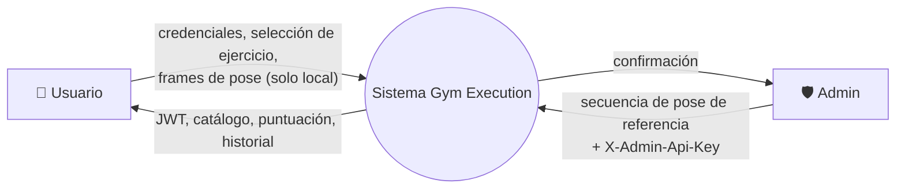
```mermaid
flowchart LR
    User["🏃 Usuario"] -- "credenciales, selección de ejercicio,\nframes de pose (solo local)" --> Sys((Sistema Gym Execution))
    Admin["🛡️ Admin"] -- "secuencia de pose de referencia\n+ X-Admin-Api-Key" --> Sys
    Sys -- "JWT, catálogo, puntuación, historial" --> User
    Sys -- "confirmación" --> Admin
```

</details>

### DFD — Nivel 1 (Procesos Descompuestos)

<details>
<summary><strong>Haz clic para expandir</strong></summary>

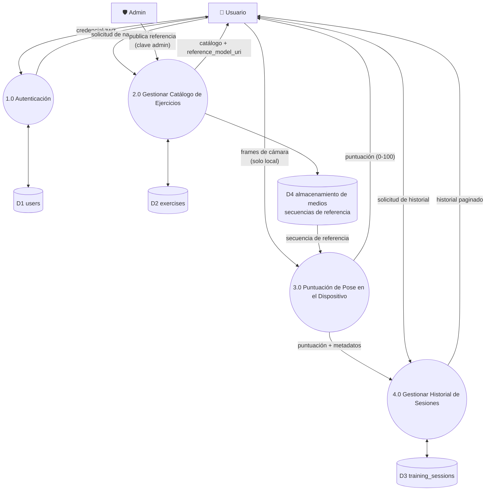
```mermaid
flowchart TD
    User["🏃 Usuario"]
    Admin["🛡️ Admin"]
    P1((1.0 Autenticación))
    P2((2.0 Gestionar Catálogo de Ejercicios))
    P3((3.0 Puntuación de Pose en el Dispositivo))
    P4((4.0 Gestionar Historial de Sesiones))
    D1[("D1 users")]
    D2[("D2 exercises")]
    D3[("D3 training_sessions")]
    D4[("D4 almacenamiento de medios\nsecuencias de referencia")]

    User -- credenciales --> P1
    P1 -- JWT --> User
    P1 <--> D1

    User -- "solicitud de navegación" --> P2
    P2 -- "catálogo + reference_model_uri" --> User
    P2 <--> D2
    Admin -- "publica referencia\n(clave admin)" --> P2
    P2 --> D4

    User -- "frames de cámara\n(solo local)" --> P3
    D4 -- "secuencia de referencia" --> P3
    P3 -- "puntuación (0-100)" --> User
    P3 -- "puntuación + metadatos" --> P4

    P4 <--> D3
    User -- "solicitud de historial" --> P4
    P4 -- "historial paginado" --> User
```

</details>

### 🧬 Diagrama de Linaje de Datos (Data Lineage)

<details>
<summary><strong>Haz clic para expandir — qué ocurre con los datos, de la cámara a la base de datos</strong></summary>

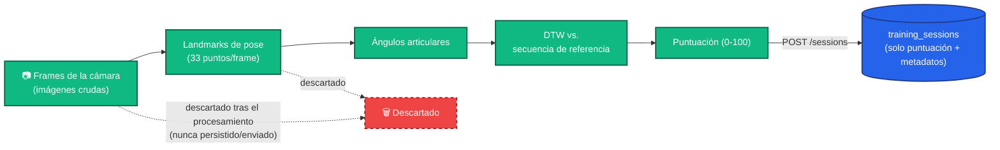
```mermaid
flowchart LR
    classDef device fill:#10B981,color:#fff,stroke:#065F46,stroke-width:2px;
    classDef server fill:#2563EB,color:#fff,stroke:#1E3A8A,stroke-width:2px;
    classDef discard fill:#EF4444,color:#fff,stroke:#991B1B,stroke-width:2px,stroke-dasharray:5 5;

    Camera["📷 Frames de la cámara\n(imágenes crudas)"]:::device --> PoseDet["Landmarks de pose\n(33 puntos/frame)"]:::device
    PoseDet --> Angles["Ángulos articulares"]:::device
    Angles --> DTWCalc["DTW vs.\nsecuencia de referencia"]:::device
    DTWCalc --> Score["Puntuación (0-100)"]:::device
    Camera -. "descartado tras el procesamiento\n(nunca persistido/enviado)" .-> Discard["🗑️ Descartado"]:::discard
    PoseDet -. descartado .-> Discard
    Score -- "POST /sessions" --> DB[("training_sessions\n(solo puntuación + metadatos)")]:::server
```

> 🔐 Este diagrama es la prueba visual de los requisitos de privacidad
> **RN04 / RNF02 / dominio**: los frames crudos de la cámara y los
> landmarks de pose se procesan íntegramente en el dispositivo y se
> descartan — solo la puntuación numérica final y el timestamp
> atraviesan la red.

</details>

---

## 8️⃣ Diagrama de Arquitectura & Diagrama de Flujo

### 🏛️ Visión General de la Arquitectura (Capas)

<details>
<summary><strong>Haz clic para expandir</strong></summary>

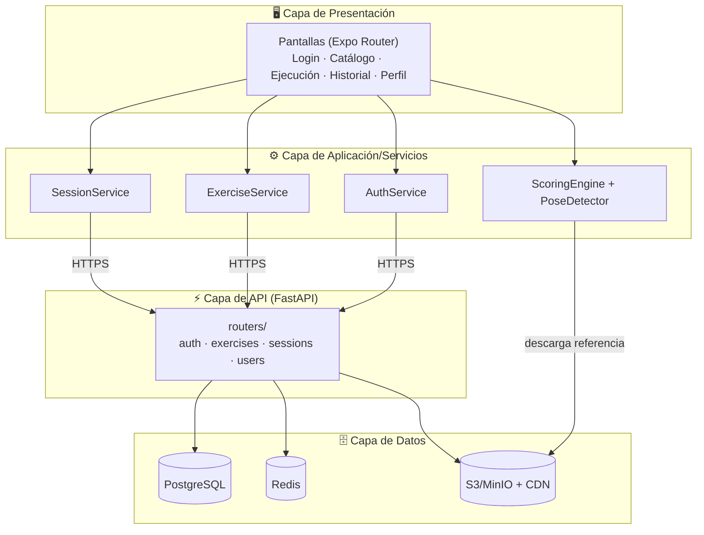
```mermaid
flowchart TB
    subgraph Presentation["🖥️ Capa de Presentación"]
        Screens["Pantallas (Expo Router)\nLogin · Catálogo · Ejecución · Historial · Perfil"]
    end
    subgraph Application["⚙️ Capa de Aplicación/Servicios"]
        AuthSvc["AuthService"]
        ExerciseSvc["ExerciseService"]
        ScoringSvc["ScoringEngine + PoseDetector"]
        SessionSvc["SessionService"]
    end
    subgraph API["⚡ Capa de API (FastAPI)"]
        Routers["routers/\nauth · exercises · sessions · users"]
    end
    subgraph DataLayer["🗄️ Capa de Datos"]
        Postgres[("PostgreSQL")]
        Redis[("Redis")]
        Media[("S3/MinIO + CDN")]
    end

    Screens --> AuthSvc
    Screens --> ExerciseSvc
    Screens --> ScoringSvc
    Screens --> SessionSvc
    AuthSvc -- HTTPS --> Routers
    ExerciseSvc -- HTTPS --> Routers
    SessionSvc -- HTTPS --> Routers
    ScoringSvc -- "descarga referencia" --> Media
    Routers --> Postgres
    Routers --> Redis
    Routers --> Media
```

> Ver también el **Diagrama de Componentes** y el **Diagrama de Implementación**
> en [Diagramas UML & Estructurales](#5️⃣-diagramas-uml--estructurales)
> (ítems 8 y 9).

</details>

### 🔀 Diagrama de Flujo General de Navegación

<details>
<summary><strong>Haz clic para expandir — flujo de pantallas de la app</strong></summary>

```mermaid
flowchart TD
    Launch([Apertura de la App]) --> HasToken{¿JWT válido almacenado?}
    HasToken -- Sí --> Home[Inicio / Catálogo de Ejercicios]
    HasToken -- No --> Auth{¿Registrarse o Iniciar sesión?}
    Auth -- Registrarse --> RegForm[Formulario de Registro] --> Home
    Auth -- "Iniciar sesión" --> LoginForm[Formulario de Login] --> Home
    Home --> SelectExercise[Seleccionar Ejercicio]
    SelectExercise --> Execution["Pantalla de Ejecución\n(captura + puntuación)"]
    Execution --> Result[Pantalla de Resultado]
    Result --> Decision{¿Qué hacer ahora?}
    Decision -- "Entrenar de nuevo" --> Home
    Decision -- "Ver historial" --> History[Pantalla de Historial]
    Decision -- "Ver perfil" --> Profile["Perfil / Preferencias"]
    History --> Home
    Profile --> Logout{¿Cerrar sesión?}
    Logout -- Sí --> Launch
    Logout -- No --> Home
```

</details>

---

## 9️⃣ Persona & Mapa de Viaje del Usuario

### 👤 Personas

<details>
<summary><strong>Haz clic para expandir — personas primarias</strong></summary>

| | 🏃 Ana Silva — Usuaria Primaria | 🛡️ Carlos Mendes — Admin/Entrenador |
|---|---|---|
| **Edad** | 28 | 41 |
| **Ocupación** | Analista de marketing, entrena en casa | Personal trainer / entrenador de gimnasio |
| **Familiaridad con tecnología** | Media — usa apps diariamente, no le gustan las configuraciones complejas | Media-alta — cómodo con herramientas admin |
| **Objetivos** | Entrenar correctamente sin un entrenador presente; seguir el progreso a lo largo del tiempo | Curar un catálogo de ejercicios confiable con movimientos de referencia precisos |
| **Frustraciones** | No sabe si la postura es correcta; miedo a lastimarse | No puede supervisar la postura de todos los alumnos remotamente |
| **Dispositivo** | Android con 3 años de uso (~3GB de RAM) | Android de gama media + notebook |
| **Frase** | *"Solo quiero saber si estoy haciendo la sentadilla correctamente — ahora, no después de una videollamada con mi entrenador."* | *"Si grabo una repetición perfecta, todos los que entrenen ese ejercicio se benefician."* |

</details>

### 🗺️ Mapa de Viaje del Usuario

<details>
<summary><strong>Haz clic para expandir — viaje del primer entrenamiento de Ana</strong></summary>

| Etapa | Descubrimiento & Registro | Explorar Catálogo | Grabar Ejecución | Recibir Puntuación | Revisar Historial |
|---|---|---|---|---|---|
| **Acciones** | Conoce la app, la descarga, se registra (RF01) | Explora ejercicios por grupo muscular (RF02) | Selecciona "Squat", toca Iniciar, ejecuta la serie (RF03) | Ve la puntuación % inmediatamente (RF05) | Abre el historial, ve sesiones anteriores (RF06) |
| **Puntos de Contacto** | App store, Pantalla de Registro | Pantalla de Catálogo | Pantalla de Ejecución + cámara | Pantalla de Resultado | Pantalla de Historial |
| **Pensamientos** | "¿Es gratis? ¿Mis datos están seguros?" | "¿Qué ejercicios necesito?" | "¿Estoy bien posicionada para la cámara?" | "¿78%? ¿Qué hice mal?" | "¿Estoy mejorando semana a semana?" |
| **Emociones** | 🙂 Curiosa | 🙂 Comprometida | 😐 Levemente ansiosa | 😀 Motivada | 😀 Confiada |
| **Puntos de Dolor** | Preocupación por la privacidad al acceder a la cámara | Demasiados ejercicios sin filtros | Necesita buena iluminación/espacio para la cámara | Puntuación sin feedback detallado sobre el *por qué* | El historial puede tener pocas sesiones al principio |
| **Oportunidades** | Destacar el mensaje de privacidad por diseño (RN04) | Agregar filtros por grupo muscular | Guía de encuadre de cámara en la app | Futuro: feedback detallado por articulación | Agregar rachas/tendencias para retener al usuario |

```mermaid
journey
    title Viaje de Ana — Primer Entrenamiento con Gym Execution
    section Descubrimiento & Registro
      Conoce la app por una amiga: 3: Ana
      Descarga & se registra: 4: Ana
    section Primera Ejecución
      Explora el catálogo de ejercicios: 4: Ana
      Selecciona "Squat": 5: Ana
      Grava una serie: 4: Ana
      Ve la puntuación (78%): 5: Ana
    section Construyendo el Hábito
      Revisa el historial tras una semana: 4: Ana
      Nota que la puntuación mejora: 5: Ana
```

</details>

---

## 🔟 Wireframes & Mockups

### 📐 Wireframes (baja fidelidad)

<details>
<summary><strong>Haz clic para expandir — Login</strong></summary>

```
┌─────────────────────────────┐
│        🏋️ Gym Execution      │
│                               │
│  Correo electrónico           │
│  ┌─────────────────────────┐ │
│  │ tu@ejemplo.com           │ │
│  └─────────────────────────┘ │
│  Contraseña                   │
│  ┌─────────────────────────┐ │
│  │ ••••••••••              │ │
│  └─────────────────────────┘ │
│                               │
│  ┌─────────────────────────┐ │
│  │         Ingresar          │ │
│  └─────────────────────────┘ │
│                               │
│      ¿No tienes una cuenta?   │
│            Regístrate         │
└─────────────────────────────┘
```

</details>

<details>
<summary><strong>Haz clic para expandir — Catálogo de Ejercicios</strong></summary>

```
┌─────────────────────────────┐
│ ☰  Ejercicios            👤  │
├─────────────────────────────┤
│ 🔍 Buscar...                  │
├─────────────────────────────┤
│ Piernas                        │
│  ▸ Squat            ⭐ listo  │
│  ▸ Lunge            ⏳ próximo│
│ Espalda                         │
│  ▸ Deadlift          ⭐ listo │
│ Pecho                           │
│  ▸ Push-up           ⭐ listo │
├─────────────────────────────┤
│ 🏠 Inicio  📜 Historial  👤 Perfil │
└─────────────────────────────┘
```

</details>

<details>
<summary><strong>Haz clic para expandir — Ejecución (Cámara + Captura)</strong></summary>

```
┌─────────────────────────────┐
│  ←  Squat               ⚙️    │
├─────────────────────────────┤
│                               │
│    [ Vista Previa de Cámara ] │
│   overlay del esqueleto 🟢    │
│                               │
│  Rep 3 · capturando ~10 fps   │
├─────────────────────────────┤
│        ┌─────────────┐        │
│        │ ⏺ Finalizar  │        │
│        └─────────────┘        │
└─────────────────────────────┘
```

</details>

<details>
<summary><strong>Haz clic para expandir — Resultado</strong></summary>

```
┌─────────────────────────────┐
│  Resultado — Squat             │
├─────────────────────────────┤
│                               │
│            78%                │
│   ████████████░░░░░░          │
│  "¡Buena ejecución! Cuida el   │
│   alineamiento de la rodilla." │
│                               │
│ ┌────────────┐ ┌────────────┐ │
│ │Entrenar de │ │Ver Historial│ │
│ │nuevo       │ │            │ │
│ └────────────┘ └────────────┘ │
└─────────────────────────────┘
```

</details>

<details>
<summary><strong>Haz clic para expandir — Historial</strong></summary>

```
┌─────────────────────────────┐
│  Historial                     │
├─────────────────────────────┤
│ Squat        2026-06-10  78%  │
│ Deadlift     2026-06-09  85%  │
│ Push-up      2026-06-08  91%  │
│ Squat        2026-06-07  72%  │
├─────────────────────────────┤
│       ◀  Página 1 de 4  ▶      │
└─────────────────────────────┘
```

</details>

### 🎨 Especificación de Mockup (guía de alta fidelidad)

<details>
<summary><strong>Haz clic para expandir — design tokens & notas por pantalla</strong></summary>

| Token | Valor | Uso |
|---|---|---|
| 🔵 Primario | `#2563EB` | Botones primarios, links, ícono de navegación activo |
| 🟢 Secundario | `#10B981` | Estados de éxito, badge "listo", esqueleto del overlay de pose |
| 🟠 Acento | `#F59E0B` | Avisos, resaltados de progreso |
| ⚫ Fondo modo oscuro | `#0F172A` | Fondo en el tema oscuro (preferencia RF08) |
| ⚪ Fondo modo claro | `#F8FAFC` | Fondo en el tema claro |
| 🔤 Fuente | Predeterminada del sistema (San Francisco / Roboto) | Todos los textos, para look nativo |

| Pantalla | Notas del Mockup |
|---|---|
| **Login/Registro** | Card centrada, botón de CTA en color primario, link para alternar entre Login/Registro |
| **Catálogo** | Lista agrupada por `muscle_group`, badge "listo" (🟢) cuando `reference_model_uri` está definido, badge "próximo" (🟠) en caso contrario |
| **Ejecución** | Vista previa de cámara a pantalla completa, overlay del esqueleto semitransparente en color secundario, botón circular grande "Finalizar" |
| **Resultado** | Porcentaje grande en color primario, barra de progreso horizontal (gradiente secundario→acento según la puntuación), dos botones de CTA |
| **Historial** | Lista en orden cronológico inverso, puntuación mostrada como píldora de color (verde ≥80, ámbar 50–79, rojo <50) |
| **Perfil/Preferencias** | Switches para calidad de cámara, sonido de feedback, modo oscuro (todos solo locales, según DAT06) |

</details>

---

## 🧰 Stack Tecnológico

| Capa | Tecnología | Justificación |
|---|---|---|
| 📱 App híbrida | **React Native + Expo (SDK 51)**, TypeScript | Código único para Android/iOS/Web, excelente soporte de cámara |
| 🧠 CV en el dispositivo (web) | **`@mediapipe/tasks-vision`** (WASM) | Pose Landmarker oficial de Google, corre en el navegador |
| 🧠 CV en el dispositivo (mobile) | **MoveNet Lightning INT8** vía **`react-native-fast-tflite`** | Modelo cuantizado de ~3MB, rápido en dispositivos modestos |
| 🖼️ Preprocesamiento de imagen (mobile) | **`expo-camera`**, **`expo-image-manipulator`**, **`jpeg-js`** | Captura, recorte/redimensionado, decodificación a tensor RGB |
| ⚡ Backend / API | **Python 3.12 + FastAPI** | Rápido, tipado (Pydantic), estándar de la industria |
| 🗄️ Base de datos | **PostgreSQL 16** | Relacional, robusta, estándar para datos de usuarios/entrenamientos |
| 🚀 Caché | **Redis 7** | Consultas repetidas con baja latencia |
| 📦 Almacenamiento de medios | **S3-compatible (AWS S3 / MinIO) + CDN** | Videos de referencia y secuencias de pose cacheadas |
| 🐳 Containerización | **Docker** (multi-stage, non-root) | Despliegues reproducibles |
| 🤖 CI/CD | **GitHub Actions** | Pruebas, publicación de imagen Docker (ghcr.io), export web |
| 📲 Build/distribución mobile | **EAS (Expo Application Services)** | Builds nativos (`expo-dev-client` requerido para TFLite) |
| 🧪 Pruebas | **Pytest** (backend) / **Jest** (frontend) | Estándar de la industria |
| 🛠️ Migraciones de BD | **Alembic** | Cambios de esquema versionados |
| 🛡️ Rate limiting | **slowapi** | Protege los endpoints de autenticación |

> ⚠️ **Precaución de supply-chain**: instala solo desde registries
> oficiales (PyPI/npm), verifica que el nombre del paquete coincida
> exactamente con el oficial (evita typosquatting), revisa los lockfiles
> generados y prefiere versiones fijadas en producción. Ver
> [Seguridad & Supply Chain](#-seguridad--supply-chain).

## 📂 Estructura del Repositorio

| Directorio | Qué es | Docs |
|---|---|---|
| [`app/`](app/) | App React Native + Expo (mobile + web): pantallas, captura de cámara, puntuación de pose | [app/README.md](app/README.md) |
| [`backend/`](backend/) | API FastAPI: autenticación, catálogo de ejercicios, historial de sesiones | [backend/README.md](backend/README.md) |
| [`backend/pipeline/`](backend/pipeline/) | Pipeline offline: video de referencia → secuencia de pose → publicación | [backend/pipeline/README.md](backend/pipeline/README.md) |
| [`.github/workflows/`](.github/workflows/) | Pipelines de CI/CD (pruebas, build de imagen, export web) | — |

## 🚀 Cómo Ejecutar

```bash
# 1) Backend (API)
cd backend
cp .env.example .env            # completa los valores locales
python -m venv .venv && . .venv/Scripts/activate
pip install -r requirements.txt
alembic upgrade head
uvicorn app.main:app --reload

# 2) App (en otra terminal)
cd app
cp .env.example .env            # apunta EXPO_PUBLIC_API_BASE_URL a la API anterior
npm ci
npx expo start
```

Infraestructura local opcional (Postgres + Redis) vía Docker:

```bash
docker compose up -d
```

## 🔌 Endpoints de la API

| Método | Ruta | Descripción | Auth |
|---|---|---|---|
| `POST` | `/auth/register` | Registra un nuevo usuario | — |
| `POST` | `/auth/login` | Inicia sesión, devuelve JWT | — |
| `GET` | `/exercises` | Lista el catálogo de ejercicios | 🔑 |
| `GET` | `/exercises/{id}` | Detalle de un ejercicio | 🔑 |
| `PUT` | `/exercises/{id}/reference-model` | Publica la URI de la secuencia de referencia | 🛡️ Admin |
| `GET` | `/sessions` | Lista las sesiones de entrenamiento del usuario (paginado) | 🔑 |
| `POST` | `/sessions` | Registra el resultado de una sesión de entrenamiento | 🔑 |
| `GET` | `/users/me` | Obtiene el perfil del usuario autenticado | 🔑 |
| `PUT` | `/users/me` | Actualiza el perfil del usuario autenticado | 🔑 |

## 🧪 Pruebas & CI/CD

```bash
# Backend
cd backend && pytest

# App
cd app && npm test
```

[`.github/workflows/ci.yml`](.github/workflows/ci.yml) ejecuta ambas
suites en cada push/PR a `main`, construye y publica la imagen Docker de
la API en `ghcr.io`, exporta la app web y (programado/manual) ejecuta una
suite de integración contra un PostgreSQL real.

## 🚢 Despliegue

- **Backend**: containerizado vía [`backend/Dockerfile`](backend/Dockerfile)
  (multi-stage, non-root, ejecuta `alembic upgrade head` al iniciar).
  Pensado para un host administrado de Postgres/Redis (Railway, Render,
  Fly.io) — proveedor aún no elegido (el job `deploy-backend` es un
  placeholder).
- **App (mobile)**: builds nativos vía **EAS** (`app/eas.json`), requiere
  `expo-dev-client` por los módulos nativos de CV.
- **App (web)**: export estático vía `npx expo export --platform web`,
  listo para cualquier hosting estático (Cloudflare Pages, Netlify,
  Vercel, S3+CDN).

Detalles completos en los READMEs de [app](app/README.md) y
[backend](backend/README.md).

## 🔒 Seguridad & Supply Chain

- ⚠️ Como ya se ha visto con paquetes maliciosos de npm/PyPI: antes de
  instalar cualquier dependencia, verifica que el **nombre exacto**
  coincida con el paquete oficial (evita typosquatting), revisa el
  lockfile generado y prefiere instaladores que respeten el lockfile
  (`npm ci`, `pip install -r requirements.txt --require-hashes`).
- 🔐 Los archivos `.env` **nunca** se commitean — ver `.env.example` en
  `app/` y `backend/`, y el [`.gitignore`](.gitignore).
- 🔑 `JWT_SECRET_KEY`/`ADMIN_API_KEY` de producción deben generarse desde
  cero (`python -c "import secrets; print(secrets.token_urlsafe(64))"`)
  y almacenarse como secrets de despliegue/CI — nunca reutilizados del
  entorno de desarrollo.
- 📦 Los modelos de ML (`.tflite`/`.task`) se descargan solo de fuentes
  oficiales (TensorFlow Hub, Google AI Edge / MediaPipe), con checksums
  verificados cuando estén disponibles.
