<div align="center">

# 🏋️‍♂️ Gym Execution

### AI-powered, on-device workout form analysis — your phone is the only "judge" you need.

[](README.md)
[](README.pt-BR.md)
[](README.es.md)

<br/>


</div>

---

A hybrid (mobile + web) gym app that **records the user performing an
exercise with the phone camera** and returns a **correctness score**
(general + exercise-specific), comparing the captured movement against
reference patterns — **all processed on-device**. Raw video never leaves
the phone; only the final score is sent to the backend.

## 📑 Table of Contents

<details>
<summary><strong>📖 Click to expand full index</strong></summary>

- [1️⃣ Requirements](#1️⃣-requirements)
  - [✅ Functional Requirements (RF)](#-functional-requirements-rf)
  - [⚙️ Non-Functional Requirements (RNF)](#️-non-functional-requirements-rnf)
  - [📐 Business Rules (RN)](#-business-rules-rn)
  - [🌐 Domain Requirements](#-domain-requirements)
  - [🗄️ Data Requirements](#️-data-requirements)
  - [🔌 Interface Requirements](#-interface-requirements)
- [2️⃣ Use Cases](#2️⃣-use-cases)
- [3️⃣ Requirements Traceability Matrix](#3️⃣-requirements-traceability-matrix)
- [4️⃣ Software Requirements Specification (SRS)](#4️⃣-software-requirements-specification-srs)
- [5️⃣ UML & Structural Diagrams](#5️⃣-uml--structural-diagrams)
- [6️⃣ Data Model & Data Dictionary](#6️⃣-data-model--data-dictionary)
- [7️⃣ Data Flow Diagram (DFD)](#7️⃣-data-flow-diagram-dfd)
- [8️⃣ Architecture Diagram & Flowchart](#8️⃣-architecture-diagram--flowchart)
- [9️⃣ Persona & User Journey Map](#9️⃣-persona--user-journey-map)
- [🔟 Wireframes & Mockups](#-wireframes--mockups)
- [🧰 Tech Stack](#-tech-stack)
- [📂 Repository Structure](#-repository-structure)
- [🚀 Getting Started](#-getting-started)
- [🔌 API Endpoints](#-api-endpoints)
- [🧪 Testing & CI/CD](#-testing--cicd)
- [🚢 Deploy](#-deploy)
- [🔒 Security & Supply Chain](#-security--supply-chain)

</details>

---

## 1️⃣ Requirements

### ✅ Functional Requirements (RF)

<details>
<summary><strong>Click to expand — 10 functional requirements</strong></summary>

| # | Requirement |
|---|---|
| RF01 | User registration and login (email + password → JWT) |
| RF02 | Browse the **exercise catalog** (name, muscle group, description) |
| RF03 | Capture an exercise execution via **camera** and detect body pose **on-device** |
| RF04 | Compute a **% score** comparing the execution to the exercise's reference sequence |
| RF05 | Show the result immediately at the end of the set |
| RF06 | Persist the result to the user's **paginated history** |
| RF07 | View/edit **profile** (name, email) and aggregated stats (sessions completed, average score) |
| RF08 | Configure **local preferences**: camera quality, corrective vibration, dark mode, accessibility (contrast, large text, colour-blind palette) |
| RF09 | Admin: publish a **reference pose sequence** for an exercise |
| RF10 | Logout / session management via secure token storage |
| RF11 | **Erase the account and all training history** (LGPD/GDPR right to erasure) |

</details>

### ⚙️ Non-Functional Requirements (RNF)

<details>
<summary><strong>Click to expand — 9 non-functional requirements</strong></summary>

| # | Category | Requirement |
|---|---|---|
| RNF01 | **Performance** | Smooth on devices with **2GB RAM (~2015+)**: quantized (INT8) on-device models, ~10 fps sampling (`SAMPLE_INTERVAL_MS`), reduced capture resolution |
| RNF02 | **Privacy** | No raw video/image leaves the device; only numeric scores are transmitted |
| RNF03 | **Security** | JWT in secure storage (`expo-secure-store`), bcrypt password hashing, rate limiting on **every** public `/auth` endpoint, refresh tokens stored as SHA-256 digests with rotation + reuse detection, revocable access tokens (`jti` denylist), admin endpoints behind `X-Admin-Api-Key` |
| RNF10 | **Observability** | Structured JSON logs correlated by `X-Request-ID`, RED metrics on `/metrics`, split liveness/readiness probes |
| RNF04 | **Portability** | Single codebase (React Native + Expo) targeting **Android, iOS and Web** |
| RNF05 | **Availability/Offline-first CV** | Pose detection works without network connectivity (model bundled/cached on-device) |
| RNF06 | **Maintainability** | End-to-end typing (TypeScript + Pydantic), unit-tested core algorithms (`pytest`, `Jest`) |
| RNF07 | **Scalability** | Stateless FastAPI + PostgreSQL/Redis, containerized, ready for managed hosting |
| RNF08 | **Supply-chain security** | Pinned dependency versions, official registries only, lockfile-based installs (`npm ci`, `pip --require-hashes`) |
| RNF09 | **CI/CD** | Automated test suites + Docker image build + web export on every push to `main` |

</details>

### 📐 Business Rules (RN)

<details>
<summary><strong>Click to expand — 8 business rules</strong></summary>

| # | Rule |
|---|---|
| RN01 | 🔑 A user must **register and log in** (JWT) to access any feature beyond authentication |
| RN02 | 🏃 Each **execution** (a "set") is performed for **exactly one exercise**, picked from a shared **catalog** (seeded centrally, not per-user) |
| RN03 | 📊 Every execution produces a **single score (0–100)**, computed by comparing the captured pose sequence against that exercise's **reference pose sequence** (joint angles + Dynamic Time Warping) |
| RN04 | 🔐 **Privacy by design**: raw camera frames/video are **never** uploaded — only the computed score and metadata (exercise, timestamp) are persisted in the user's history |
| RN05 | 📜 A user can only see **their own** training history (`GET /sessions` is scoped to the authenticated user) |
| RN06 | 🎬 Reference pose sequences are produced **offline**, by an admin pipeline that processes a professional's reference video and publishes the result to `exercises.reference_model_uri` via an admin-protected endpoint (`X-Admin-Api-Key`) |
| RN07 | 🚦 Auth endpoints (`/auth/register`, `/auth/login`) are **rate-limited** to mitigate brute-force/credential-stuffing |
| RN08 | ⚙️ User preferences (camera quality, sound feedback, dark mode) are **device-local only** — never synced to the backend |

</details>

### 🌐 Domain Requirements

<details>
<summary><strong>Click to expand — domain-specific (computer-vision / fitness) constraints</strong></summary>

| # | Requirement |
|---|---|
| DOM01 | Pose detection **must** use a 33-landmark body topology (BlazePose/MoveNet-compatible) so reference and captured sequences are comparable |
| DOM02 | Scoring **must** combine **joint-angle differences** and **Dynamic Time Warping (DTW)** to tolerate timing variations between the reference and the user's execution |
| DOM03 | The exercise catalog is **global/shared** — exercises are not user-created, ensuring all users are scored against the same reference |
| DOM04 | Reference pose sequences are generated through an **offline pipeline** (`extract_pose_sequence.py`) from a professional's recorded execution, never in real time |
| DOM05 | Capture sampling rate is fixed at **~10 fps** (`SAMPLE_INTERVAL_MS`) — a domain-derived trade-off between scoring accuracy and performance on low-end devices |
| DOM06 | A computed score of **0–100** must always be interpretable as a percentage of similarity to the reference movement, regardless of exercise type |

</details>

### 🗄️ Data Requirements

<details>
<summary><strong>Click to expand — data persistence and retention rules</strong></summary>

| # | Requirement |
|---|---|
| DAT01 | `users`: unique `email`, hashed password (never stored in plain text) |
| DAT02 | `exercises`: globally seeded catalog with optional `reference_model_uri` (nullable until an admin publishes one) |
| DAT03 | `training_sessions`: one row per execution — `user_id`, `exercise_id`, `score (0-100)`, `executed_at` |
| DAT04 | **No raw media** (video/images/pose frames) is ever persisted server-side — only the final numeric score and metadata |
| DAT05 | `GET /sessions` results **must** be paginated and filtered to `user_id = current_user` |
| DAT06 | Local-only data (camera quality, sound feedback, dark mode) lives in device storage (`AsyncStorage`/`expo-secure-store`) and is **never sent** to the API |

</details>

### 🔌 Interface Requirements

<details>
<summary><strong>Click to expand — external and user interfaces</strong></summary>

| # | Requirement |
|---|---|
| INT01 | All client↔server communication uses **HTTPS REST/JSON** |
| INT02 | Authenticated requests carry a **JWT Bearer token** in the `Authorization` header |
| INT03 | Admin-only endpoints require an additional `X-Admin-Api-Key` header |
| INT04 | The app provides a **camera capture interface** (`expo-camera`) with on-device pose overlay feedback |
| INT05 | The UI must be **responsive** across native (Android/iOS) and web targets from a single React Native + Expo codebase |
| INT06 | Errors returned by the API follow a consistent JSON shape (`{ "detail": "..." }`) so the client can render user-friendly messages |

</details>

---

## 2️⃣ Use Cases

### Actors

| Actor | Description |
|---|---|
| 🏃 **User** | Registered athlete who records executions, views scores and history |
| 🛡️ **Admin** | Operator who publishes reference pose sequences via `X-Admin-Api-Key` |
| 🤖 **CI/CD System** | GitHub Actions — runs tests, builds images, exports the web app (supporting actor) |

### Use Case Summary

| ID | Use Case | Primary Actor | Related RF |
|---|---|---|---|
| UC01 | Register | User | RF01 |
| UC02 | Login | User | RF01 |
| UC03 | Browse exercise catalog | User | RF02 |
| UC04 | View exercise details | User | RF02 |
| UC05 | Capture execution & get score | User | RF03, RF04, RF05 |
| UC06 | View training history | User | RF06 |
| UC07 | View / edit profile | User | RF07 |
| UC08 | Configure local preferences | User | RF08 |
| UC09 | Publish reference pose sequence | Admin | RF09 |
| UC10 | Logout | User | RF10 |

### Detailed Use Case Specifications

<details>
<summary><strong>📄 UC05 — Capture Execution & Get Score</strong></summary>

| Field | Description |
|---|---|
| **Actor** | User |
| **Preconditions** | User is authenticated; an exercise with a published `reference_model_uri` is selected |
| **Main Flow** | 1. App downloads/caches the exercise's reference pose sequence.<br>2. User taps "Start"; the app loads the on-device CV model.<br>3. App samples camera frames (~10 fps) and runs pose detection per frame.<br>4. User taps "Finish set".<br>5. App computes the score (joint angles + DTW) against the reference sequence.<br>6. App displays the % score immediately.<br>7. App sends `POST /sessions` with `{ exerciseId, score, executedAt }`. |
| **Alternative Flows** | A1. No network when saving → result is shown locally and queued for retry.<br>A2. Reference model not cached → app blocks "Start" until download completes. |
| **Postconditions** | A `training_sessions` row is created; result is visible in the user's history |
| **Related Requirements** | RF03–RF06, RNF01, RNF02, RNF05, DOM01–DOM06, DAT03, DAT04 |

</details>

<details>
<summary><strong>📄 UC09 — Publish Reference Pose Sequence (Admin)</strong></summary>

| Field | Description |
|---|---|
| **Actor** | Admin |
| **Preconditions** | Admin holds a valid `X-Admin-Api-Key`; a processed reference pose sequence exists (output of `extract_pose_sequence.py`) |
| **Main Flow** | 1. Admin runs the offline pipeline against a professional's reference video.<br>2. Pipeline uploads the resulting pose sequence to media storage.<br>3. Admin calls `PUT /exercises/{id}/reference-model` with the resulting URI and `X-Admin-Api-Key`.<br>4. API validates the admin key and updates `exercises.reference_model_uri`. |
| **Alternative Flows** | A1. Invalid/missing `X-Admin-Api-Key` → `403 Forbidden`. |
| **Postconditions** | Exercise becomes "scoreable" — `UC05` can run for it |
| **Related Requirements** | RF09, RN06, DOM04, INT03 |

</details>

---

## 3️⃣ Requirements Traceability Matrix

<details>
<summary><strong>Click to expand — maps requirements → use cases → implementation → verification</strong></summary>

| Requirement | Description | Use Case(s) | Implementation | Verification |
|---|---|---|---|---|
| RF01 | Register/Login | UC01, UC02 | `backend/app/routers/auth.py` | `backend/tests/test_auth.py` |
| RF02 | Browse catalog | UC03, UC04 | `backend/app/routers/exercises.py` | `backend/tests/test_exercises.py` |
| RF03 | Capture + on-device pose detection | UC05 | `app/src/services/poseDetector*.ts` | `app/src/services/__tests__/moveNetAdapter.test.ts` (adapter only — native path unverified) |
| RF04 | Compute % score | UC05 | `app/src/services/poseScoring.ts` | `app/src/services/__tests__/poseScoring.test.ts` — ⚠️ **partial**: the algorithm is tested, but it still scores against a synthetic reference, see [ADR-0001](docs/adr/0001-reference-pose-sequences-are-synthetic.md) |
| RF05 | Show result immediately | UC05 | `app/src/screens/ExecutionScreen.tsx` | Manual / E2E |
| RF06 | Paginated history | UC06 | `backend/app/routers/sessions.py` | `backend/tests/test_sessions.py` |
| RF07 | View/edit profile | UC07 | `backend/app/routers/users.py` | `backend/tests/test_users.py` |
| RF08 | Local preferences | UC08 | `app/src/services/preferencesStorage.ts`, `app/src/services/theme.ts` | `preferencesStorage.test.ts`, `theme.test.ts` — camera quality feeds the capture loop; dark mode/contrast/large text drive the app-wide theme. **Note**: the old "sound feedback" toggle is now `vibrationFeedback` and drives the corrective vibration — the app has no audio channel, so the previous label described something that did not exist |
| RF09 | Publish reference model | UC09 | `backend/app/routers/exercises.py` (admin) | `backend/tests/test_exercises.py` |
| RF10 | Logout | UC10 | `app/src/services/authService.ts`, `backend/app/services/auth_service.py` | `backend/tests/test_auth_refresh.py` |
| RNF01 | Performance on low-end devices | UC05 | INT8 TFLite model, `SAMPLE_INTERVAL_MS` | Manual perf test on 2GB device |
| RNF02 | Privacy (no raw media) | UC05 | `scoreExecution.ts` discards frames after processing | Code review + `RN04` check |
| RNF03 | Security (JWT, hashing, rate limit) | UC01, UC02, UC09 | `backend/app/core/security.py` | `backend/tests/test_auth.py` |
| RNF04 | Cross-platform | All | Expo (Android/iOS/Web) | CI build matrix |
| RNF05 | Offline-first CV | UC05 | Bundled/cached TFLite model | Manual offline test |
| RNF06 | Maintainability (typing/tests) | All | TypeScript + Pydantic | `pytest`, `Jest` and `tsc --noEmit` in CI |
| RNF07 | Scalability | All | Stateless FastAPI + Postgres/Redis | Load test (future) |
| RNF08 | Supply-chain security | All | Lockfiles, pinned versions | `npm ci`, `pip-audit` + `npm audit` in CI |
| RNF09 | CI/CD | All | `.github/workflows/ci.yml` | CI run on push/PR |
| DOM01–DOM06 | Domain rules (pose/scoring) | UC05 | `app/services/`, `backend/pipeline/` | Unit tests + manual validation |
| DAT01–DAT06 | Data persistence rules | UC01, UC05, UC06, UC08 | `backend/app/models/`, `app/services/storage.ts` | `backend/tests/`, code review |
| INT01–INT06 | Interfaces | All | REST API + Expo UI | OpenAPI schema, `Jest`/`pytest` |

</details>

---

## 4️⃣ Software Requirements Specification (SRS)

<details>
<summary><strong>Click to expand — condensed SRS (IEEE 830-style)</strong></summary>

### 4.1 Introduction

- **Purpose**: Define functional and non-functional requirements for *Gym Execution*, a hybrid app that scores exercise form using on-device computer vision.
- **Scope**: Covers the mobile/web client (React Native + Expo), the backend API (FastAPI), and the offline reference-pipeline. Out of scope: nutrition tracking, social features, wearable integration.
- **Definitions**: *Execution* = one recorded set of an exercise. *Reference sequence* = the pose-landmark sequence extracted from a professional's recording. *Score* = 0–100 similarity metric.
- **References**: see [Requirements](#1️⃣-requirements), [Use Cases](#2️⃣-use-cases), [Data Model](#6️⃣-data-model--data-dictionary).

### 4.2 Overall Description

- **Product perspective**: standalone app + API; no dependency on third-party fitness platforms.
- **Product functions**: see [Functional Requirements (RF)](#-functional-requirements-rf).
- **User classes**: *User* (athlete) and *Admin* (catalog/reference curator) — see [Use Cases](#2️⃣-use-cases).
- **Operating environment**: Android, iOS, Web (Expo); API on Linux containers (Docker).
- **Design constraints**: must run pose detection on **2GB RAM devices**; raw media must never leave the device (privacy-by-design, see RN04/DOM-level constraints).
- **Assumptions & dependencies**: reference pose sequences are prepared offline by Admin before an exercise is usable end-to-end (UC09 precedes UC05 for any given exercise).

### 4.3 Specific Requirements

- Functional: [RF01–RF10](#-functional-requirements-rf)
- Non-functional: [RNF01–RNF09](#️-non-functional-requirements-rnf)
- Business rules: [RN01–RN08](#-business-rules-rn)
- Domain: [DOM01–DOM06](#-domain-requirements)
- Data: [DAT01–DAT06](#-data-requirements)
- Interface: [INT01–INT06](#-interface-requirements)
- External interface contracts: [API Endpoints](#-api-endpoints)

### 4.4 Appendices

- [UML & Structural Diagrams](#5️⃣-uml--structural-diagrams)
- [Data Model & Data Dictionary](#6️⃣-data-model--data-dictionary)
- [Requirements Traceability Matrix](#3️⃣-requirements-traceability-matrix)

</details>

---

## 5️⃣ UML & Structural Diagrams

### 1. 🎯 Use Case Diagram

<details>
<summary><strong>Click to expand</strong></summary>

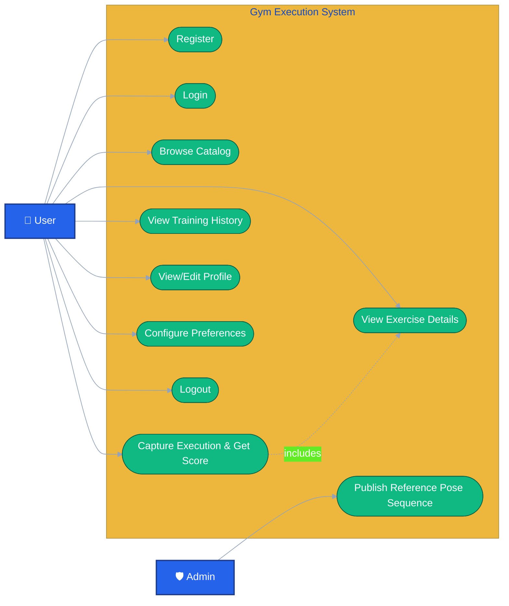
```mermaid
%%{init: {'theme':'base', 'themeVariables': {'primaryColor':'#2563EB','primaryTextColor':'#fff','primaryBorderColor':'#1E40AF','lineColor':'#94A3B8'}}}%%
graph LR
    classDef actor fill:#2563EB,color:#fff,stroke:#1E3A8A,stroke-width:2px;
    classDef usecase fill:#10B981,color:#fff,stroke:#065F46,stroke-width:1px;

    User["🏃 User"]:::actor
    Admin["🛡️ Admin"]:::actor

    subgraph System["Gym Execution System"]
        UC1(["Register"]):::usecase
        UC2(["Login"]):::usecase
        UC3(["Browse Catalog"]):::usecase
        UC4(["View Exercise Details"]):::usecase
        UC5(["Capture Execution & Get Score"]):::usecase
        UC6(["View Training History"]):::usecase
        UC7(["View/Edit Profile"]):::usecase
        UC8(["Configure Preferences"]):::usecase
        UC9(["Publish Reference Pose Sequence"]):::usecase
        UC10(["Logout"]):::usecase
    end

    User --> UC1
    User --> UC2
    User --> UC3
    User --> UC4
    User --> UC5
    User --> UC6
    User --> UC7
    User --> UC8
    User --> UC10
    Admin --> UC9
    UC5 -.includes.-> UC4
```

</details>

### 2. 🧬 Class Diagram

<details>
<summary><strong>Click to expand</strong></summary>

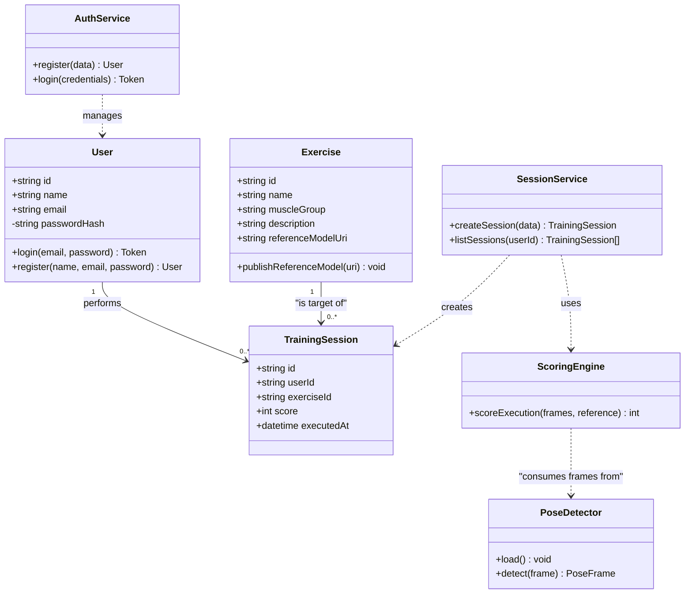
```mermaid
classDiagram
    class User {
        +string id
        +string name
        +string email
        -string passwordHash
        +login(email, password) Token
        +register(name, email, password) User
    }
    class Exercise {
        +string id
        +string name
        +string muscleGroup
        +string description
        +string referenceModelUri
        +publishReferenceModel(uri) void
    }
    class TrainingSession {
        +string id
        +string userId
        +string exerciseId
        +int score
        +datetime executedAt
    }
    class PoseDetector {
        +load() void
        +detect(frame) PoseFrame
    }
    class ScoringEngine {
        +scoreExecution(frames, reference) int
    }
    class AuthService {
        +register(data) User
        +login(credentials) Token
    }
    class SessionService {
        +createSession(data) TrainingSession
        +listSessions(userId) TrainingSession[]
    }

    User "1" --> "0..*" TrainingSession : performs
    Exercise "1" --> "0..*" TrainingSession : "is target of"
    SessionService ..> TrainingSession : creates
    SessionService ..> ScoringEngine : uses
    ScoringEngine ..> PoseDetector : "consumes frames from"
    AuthService ..> User : manages
```

</details>

### 3. 🧩 Object Diagram

<details>
<summary><strong>Click to expand — example instance snapshot</strong></summary>

```mermaid
classDiagram
    class ana "ana : User" {
        id = "u_001"
        name = "Ana Silva"
        email = "ana@example.com"
    }
    class squat "squat : Exercise" {
        id = "ex_010"
        name = "Squat"
        muscleGroup = "Legs"
        referenceModelUri = "s3://refs/squat_v2.json"
    }
    class session42 "session42 : TrainingSession" {
        id = "ts_042"
        userId = "u_001"
        exerciseId = "ex_010"
        score = 87
        executedAt = "2026-06-10T18:30:00Z"
    }
    ana --> session42
    squat --> session42
```

</details>

### 4. 🔀 Sequence Diagram

<details>
<summary><strong>Click to expand — execution flow</strong></summary>

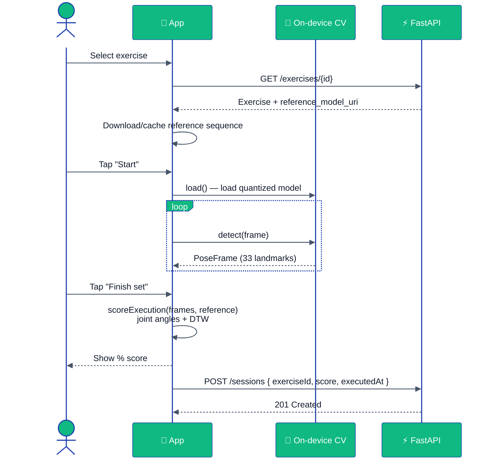
```mermaid
%%{init: {'theme':'base', 'themeVariables': {'primaryColor':'#2563EB','primaryTextColor':'#fff','primaryBorderColor':'#1E40AF','actorBkg':'#10B981','actorTextColor':'#fff','signalColor':'#475569','signalTextColor':'#0f172a'}}}%%
sequenceDiagram
    actor U as 🏃 User
    participant App as 📱 App
    participant CV as 🧠 On-device CV
    participant API as ⚡ FastAPI

    U->>App: Select exercise
    App->>API: GET /exercises/{id}
    API-->>App: Exercise + reference_model_uri
    App->>App: Download/cache reference sequence
    U->>App: Tap "Start"
    App->>CV: load() — load quantized model
    loop ~10 fps while recording
        App->>CV: detect(frame)
        CV-->>App: PoseFrame (33 landmarks)
    end
    U->>App: Tap "Finish set"
    App->>App: scoreExecution(frames, reference)<br/>joint angles + DTW
    App-->>U: Show % score
    App->>API: POST /sessions { exerciseId, score, executedAt }
    API-->>App: 201 Created
```

</details>

### 5. 🗣️ Communication (Collaboration) Diagram

<details>
<summary><strong>Click to expand</strong></summary>

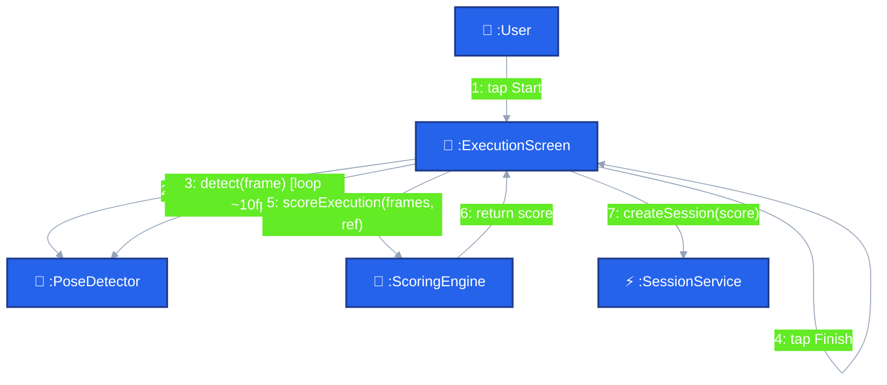
```mermaid
%%{init: {'theme':'base', 'themeVariables': {'primaryColor':'#2563EB','primaryTextColor':'#fff','primaryBorderColor':'#1E40AF','lineColor':'#94A3B8'}}}%%
graph TD
    classDef obj fill:#2563EB,color:#fff,stroke:#1E3A8A,stroke-width:2px;
    U["🏃 :User"]:::obj
    A["📱 :ExecutionScreen"]:::obj
    P["🧠 :PoseDetector"]:::obj
    S["📐 :ScoringEngine"]:::obj
    API["⚡ :SessionService"]:::obj

    U -- "1: tap Start" --> A
    A -- "2: load()" --> P
    A -- "3: detect(frame) [loop ~10fps]" --> P
    A -- "4: tap Finish" --> A
    A -- "5: scoreExecution(frames, ref)" --> S
    S -- "6: return score" --> A
    A -- "7: createSession(score)" --> API
```

</details>

### 6. 🔁 Activity Diagram

<details>
<summary><strong>Click to expand — capture & scoring flow</strong></summary>

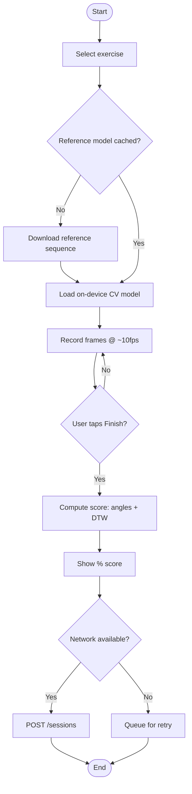
```mermaid
flowchart TD
    Start([Start]) --> SelectEx[Select exercise]
    SelectEx --> CheckRef{Reference model cached?}
    CheckRef -- No --> Download[Download reference sequence]
    Download --> LoadModel[Load on-device CV model]
    CheckRef -- Yes --> LoadModel
    LoadModel --> Record["Record frames @ ~10fps"]
    Record --> Tap{User taps Finish?}
    Tap -- No --> Record
    Tap -- Yes --> Score["Compute score: angles + DTW"]
    Score --> Show[Show % score]
    Show --> Online{Network available?}
    Online -- Yes --> Save["POST /sessions"]
    Online -- No --> Queue[Queue for retry]
    Save --> End([End])
    Queue --> End
```

</details>

### 7. 🚦 State Machine Diagram

<details>
<summary><strong>Click to expand — execution session lifecycle</strong></summary>

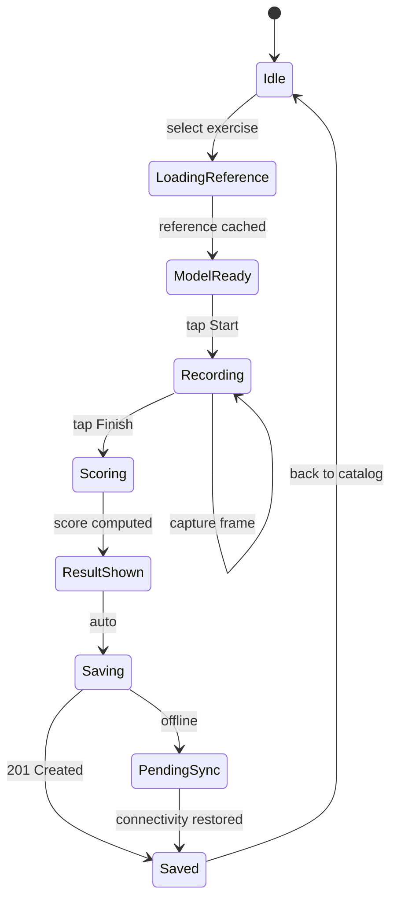
```mermaid
stateDiagram-v2
    [*] --> Idle
    Idle --> LoadingReference : select exercise
    LoadingReference --> ModelReady : reference cached
    ModelReady --> Recording : tap Start
    Recording --> Recording : capture frame
    Recording --> Scoring : tap Finish
    Scoring --> ResultShown : score computed
    ResultShown --> Saving : auto
    Saving --> Saved : 201 Created
    Saving --> PendingSync : offline
    PendingSync --> Saved : connectivity restored
    Saved --> Idle : back to catalog
```

</details>

### 8. 🧱 Component Diagram

<details>
<summary><strong>Click to expand</strong></summary>

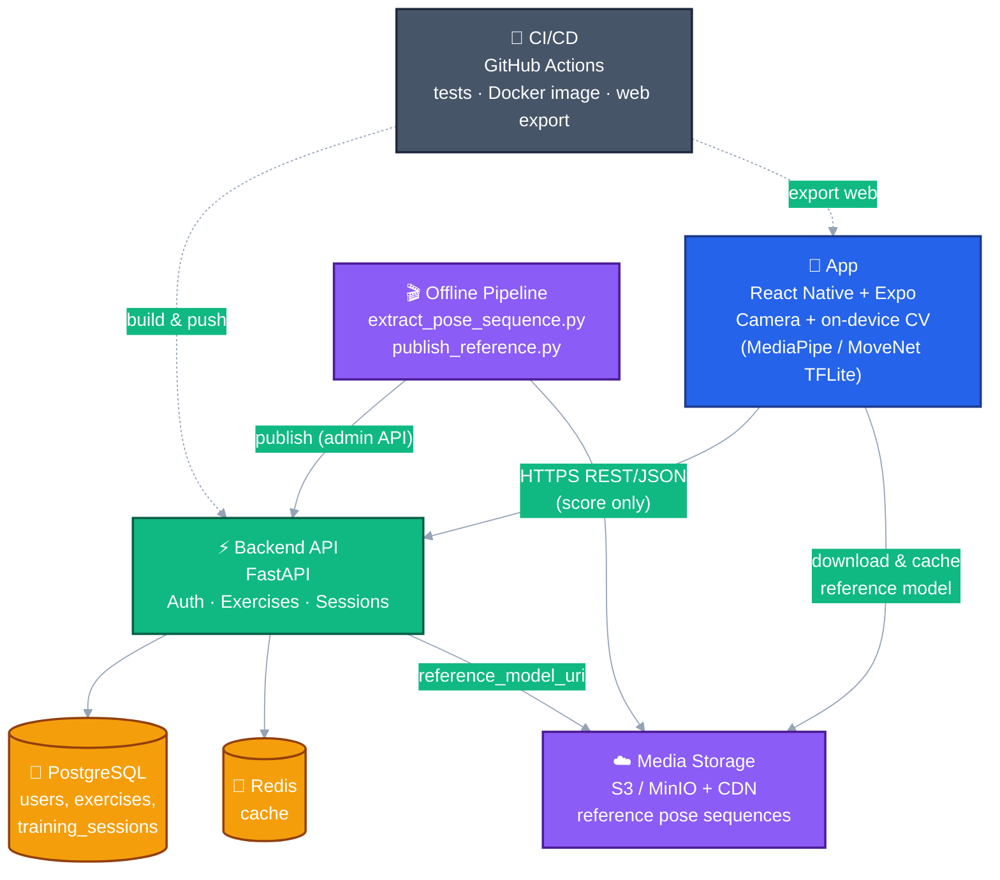
```mermaid
%%{init: {'theme':'base', 'themeVariables': {'primaryColor':'#2563EB','primaryTextColor':'#fff','primaryBorderColor':'#1E40AF','lineColor':'#94A3B8','secondaryColor':'#10B981','tertiaryColor':'#F59E0B'}}}%%
graph TD
    classDef app fill:#2563EB,color:#fff,stroke:#1E3A8A,stroke-width:2px;
    classDef api fill:#10B981,color:#fff,stroke:#065F46,stroke-width:2px;
    classDef data fill:#F59E0B,color:#fff,stroke:#92400E,stroke-width:2px;
    classDef storage fill:#8B5CF6,color:#fff,stroke:#4C1D95,stroke-width:2px;
    classDef ci fill:#475569,color:#fff,stroke:#1E293B,stroke-width:2px;

    A["📱 App<br/>React Native + Expo<br/>Camera + on-device CV<br/>(MediaPipe / MoveNet TFLite)"]:::app
    B["⚡ Backend API<br/>FastAPI<br/>Auth · Exercises · Sessions"]:::api
    C[("🐘 PostgreSQL<br/>users, exercises,<br/>training_sessions")]:::data
    D[("🔴 Redis<br/>cache")]:::data
    E["☁️ Media Storage<br/>S3 / MinIO + CDN<br/>reference pose sequences"]:::storage
    F["🎬 Offline Pipeline<br/>extract_pose_sequence.py<br/>publish_reference.py"]:::storage
    G["🤖 CI/CD<br/>GitHub Actions<br/>tests · Docker image · web export"]:::ci

    A -- "HTTPS REST/JSON\n(score only)" --> B
    B --> C
    B --> D
    B -- "reference_model_uri" --> E
    A -- "download & cache\nreference model" --> E
    F -- "publish (admin API)" --> B
    F --> E
    G -. "build & push" .-> B
    G -. "export web" .-> A
```

</details>

### 9. 🚀 Deployment Diagram

<details>
<summary><strong>Click to expand</strong></summary>

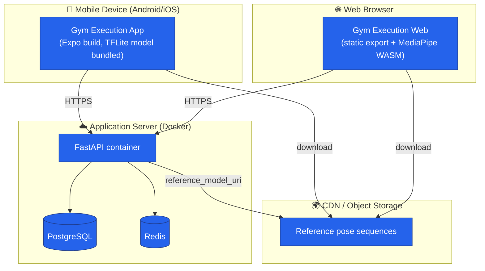
```mermaid
graph TB
    classDef artifact fill:#2563EB,color:#fff,stroke:#1E3A8A,stroke-width:1px;

    subgraph Mobile["📱 Mobile Device (Android/iOS)"]
        AppArtifact["Gym Execution App\n(Expo build, TFLite model bundled)"]:::artifact
    end
    subgraph Browser["🌐 Web Browser"]
        WebArtifact["Gym Execution Web\n(static export + MediaPipe WASM)"]:::artifact
    end
    subgraph Server["☁️ Application Server (Docker)"]
        APIArtifact["FastAPI container"]:::artifact
        DBArtifact[("PostgreSQL")]:::artifact
        CacheArtifact[("Redis")]:::artifact
    end
    subgraph CDN["🌍 CDN / Object Storage"]
        MediaArtifact["Reference pose sequences"]:::artifact
    end

    AppArtifact -- HTTPS --> APIArtifact
    WebArtifact -- HTTPS --> APIArtifact
    APIArtifact --> DBArtifact
    APIArtifact --> CacheArtifact
    AppArtifact -- download --> MediaArtifact
    WebArtifact -- download --> MediaArtifact
    APIArtifact -- reference_model_uri --> MediaArtifact
```

</details>

### 10. 📦 Package Diagram

<details>
<summary><strong>Click to expand</strong></summary>

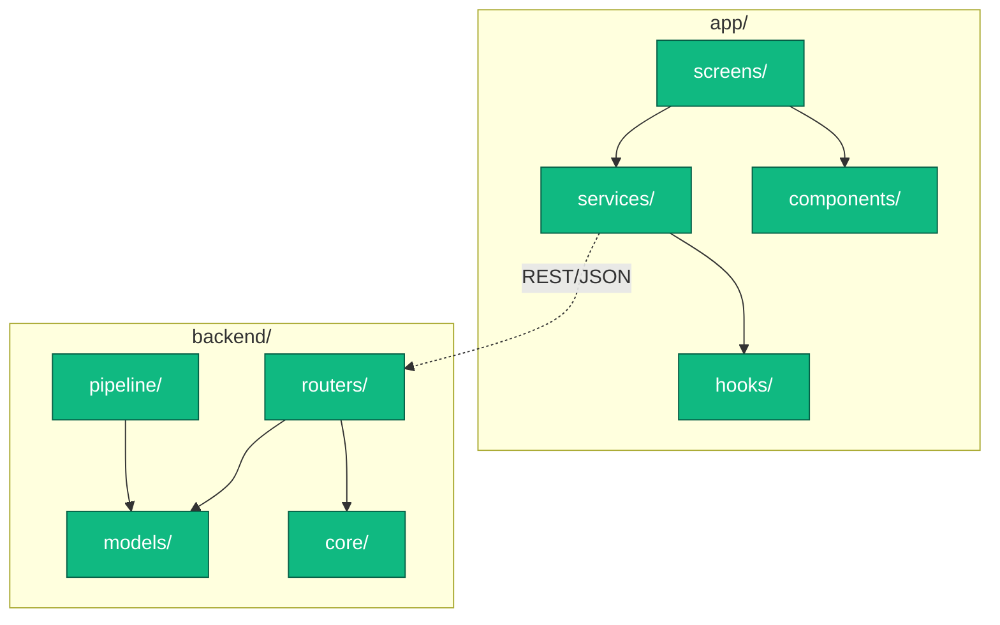
```mermaid
graph TD
    classDef pkg fill:#10B981,color:#fff,stroke:#065F46,stroke-width:1px;
    subgraph AppPkg["app/"]
        Screens["screens/"]:::pkg
        Services["services/"]:::pkg
        Hooks["hooks/"]:::pkg
        Components["components/"]:::pkg
    end
    subgraph BackendPkg["backend/"]
        Routers["routers/"]:::pkg
        Models["models/"]:::pkg
        CoreP["core/"]:::pkg
        Pipeline["pipeline/"]:::pkg
    end
    Screens --> Services
    Screens --> Components
    Services --> Hooks
    Routers --> Models
    Routers --> CoreP
    Pipeline --> Models
    Services -. "REST/JSON" .-> Routers
```

</details>

### 11. 🧩 Composite Structure Diagram

<details>
<summary><strong>Click to expand — internal structure of the On-device CV component</strong></summary>

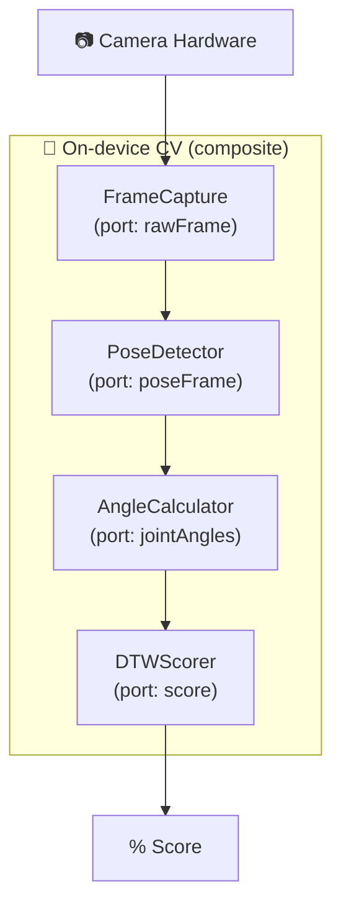
```mermaid
graph TB
    subgraph CV["🧠 On-device CV (composite)"]
        direction TB
        FC["FrameCapture\n(port: rawFrame)"]
        PD["PoseDetector\n(port: poseFrame)"]
        AC["AngleCalculator\n(port: jointAngles)"]
        DTW["DTWScorer\n(port: score)"]
        FC --> PD --> AC --> DTW
    end
    Camera["📷 Camera Hardware"] --> FC
    DTW --> Result["% Score"]
```

</details>

### 12. 🗺️ Interaction Overview Diagram

<details>
<summary><strong>Click to expand — high-level flow across use cases</strong></summary>

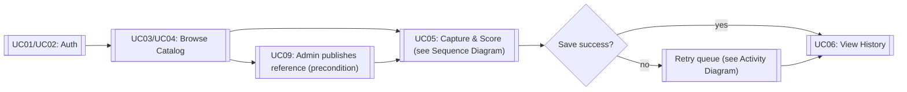
```mermaid
flowchart LR
    A[["UC01/UC02: Auth"]] --> B[["UC03/UC04: Browse Catalog"]]
    B --> C[["UC05: Capture & Score (see Sequence Diagram)"]]
    C --> D{Save success?}
    D -- yes --> E[["UC06: View History"]]
    D -- no --> F[["Retry queue (see Activity Diagram)"]]
    F --> E
    B --> G[["UC09: Admin publishes reference (precondition)"]]
    G --> C
```

</details>

### 13. ⏱️ Timing Diagram

<details>
<summary><strong>Click to expand — approximate timing of a single capture session</strong></summary>


```mermaid
gantt
    dateFormat  X
    axisFormat %Ss
    title Execution Capture — Timing (approx., single set)
    section App State
    Idle                 :done, idle, 0, 1s
    Loading Reference    :active, load, 1, 1s
    Recording (~10 fps)  : rec, 2, 15s
    Scoring (angles+DTW) : score, 17, 1s
    Result Shown         : result, 18, 3s
    Saving               : saving, 21, 1s
```

</details>

---

## 6️⃣ Data Model & Data Dictionary

### 🗺️ Conceptual Data Model

<details>
<summary><strong>Click to expand — entities & relationships only</strong></summary>

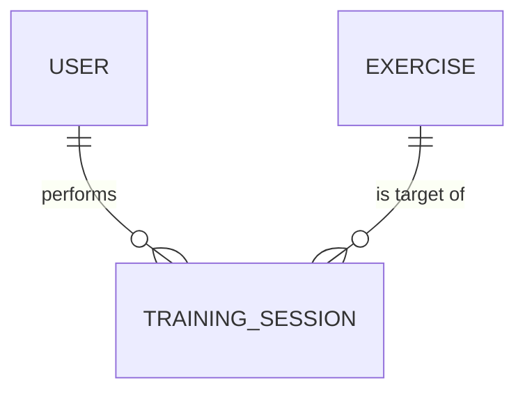
```mermaid
erDiagram
    USER ||--o{ TRAINING_SESSION : performs
    EXERCISE ||--o{ TRAINING_SESSION : "is target of"
```

</details>

### 🧮 Logical Data Model

<details>
<summary><strong>Click to expand — entities, attributes & types (platform-independent)</strong></summary>

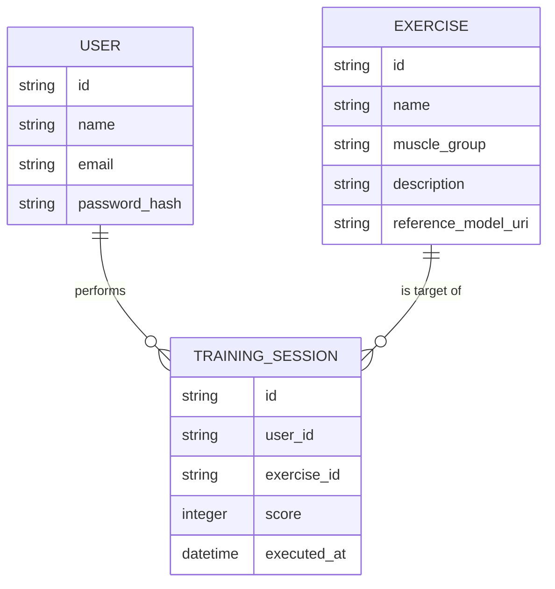
```mermaid
erDiagram
    USER {
        string id
        string name
        string email
        string password_hash
    }
    EXERCISE {
        string id
        string name
        string muscle_group
        string description
        string reference_model_uri
    }
    TRAINING_SESSION {
        string id
        string user_id
        string exercise_id
        integer score
        datetime executed_at
    }
    USER ||--o{ TRAINING_SESSION : performs
    EXERCISE ||--o{ TRAINING_SESSION : "is target of"
```

</details>

### 🐘 Physical Data Model / DER (PostgreSQL)

<details>
<summary><strong>Click to expand — PostgreSQL types, keys & constraints</strong></summary>

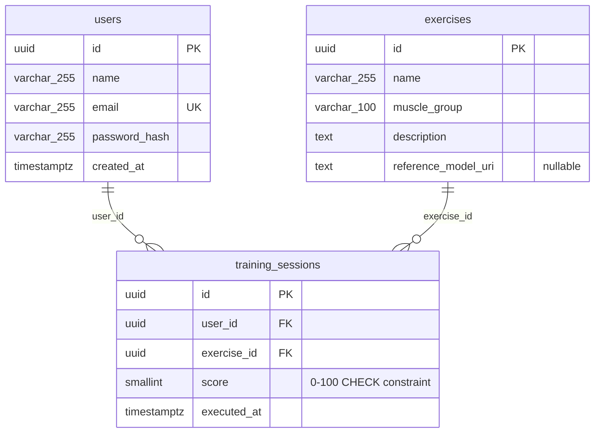
```mermaid
erDiagram
    users {
        uuid id PK
        varchar_255 name
        varchar_255 email UK
        varchar_255 password_hash
        timestamptz created_at
    }
    exercises {
        uuid id PK
        varchar_255 name
        varchar_100 muscle_group
        text description
        text reference_model_uri "nullable"
    }
    training_sessions {
        uuid id PK
        uuid user_id FK
        uuid exercise_id FK
        smallint score "0-100 CHECK constraint"
        timestamptz executed_at
    }
    users ||--o{ training_sessions : "user_id"
    exercises ||--o{ training_sessions : "exercise_id"
```

</details>

### 📖 Data Dictionary

<details>
<summary><strong>Click to expand — full column-level dictionary</strong></summary>

| Table | Column | Type | Constraints | Description |
|---|---|---|---|---|
| `users` | `id` | `uuid` | PK, default `gen_random_uuid()` | Unique user identifier |
| `users` | `name` | `varchar(255)` | NOT NULL | Display name |
| `users` | `email` | `varchar(255)` | UNIQUE, NOT NULL | Login identifier |
| `users` | `password_hash` | `varchar(255)` | NOT NULL | Bcrypt/argon2 hash — never plain text |
| `users` | `created_at` | `timestamptz` | NOT NULL, default `now()` | Account creation timestamp |
| `exercises` | `id` | `uuid` | PK, default `gen_random_uuid()` | Unique exercise identifier |
| `exercises` | `name` | `varchar(255)` | NOT NULL | Exercise name (e.g., "Squat") |
| `exercises` | `muscle_group` | `varchar(100)` | NOT NULL | e.g., "Legs", "Back", "Chest" |
| `exercises` | `description` | `text` | NULLABLE | Free-text instructions |
| `exercises` | `reference_model_uri` | `text` | NULLABLE | URI of the published reference pose sequence (set via admin endpoint) |
| `training_sessions` | `id` | `uuid` | PK, default `gen_random_uuid()` | Unique execution identifier |
| `training_sessions` | `user_id` | `uuid` | FK → `users.id`, NOT NULL | Owner of the execution |
| `training_sessions` | `exercise_id` | `uuid` | FK → `exercises.id`, NOT NULL | Exercise performed |
| `training_sessions` | `score` | `integer` | NOT NULL, `CHECK (score >= 0 AND score <= 100)` (migration `0007`) | Similarity score (angles + DTW) |
| `training_sessions` | `executed_at` | `timestamptz` | NOT NULL | When the set was performed |

</details>

---

## 7️⃣ Data Flow Diagram (DFD)

### DFD — Level 0 (Context)

<details>
<summary><strong>Click to expand</strong></summary>

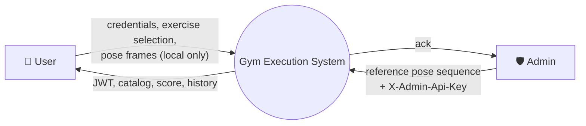
```mermaid
flowchart LR
    User["🏃 User"] -- "credentials, exercise selection,\npose frames (local only)" --> Sys((Gym Execution System))
    Admin["🛡️ Admin"] -- "reference pose sequence\n+ X-Admin-Api-Key" --> Sys
    Sys -- "JWT, catalog, score, history" --> User
    Sys -- "ack" --> Admin
```

</details>

### DFD — Level 1 (Decomposed Processes)

<details>
<summary><strong>Click to expand</strong></summary>

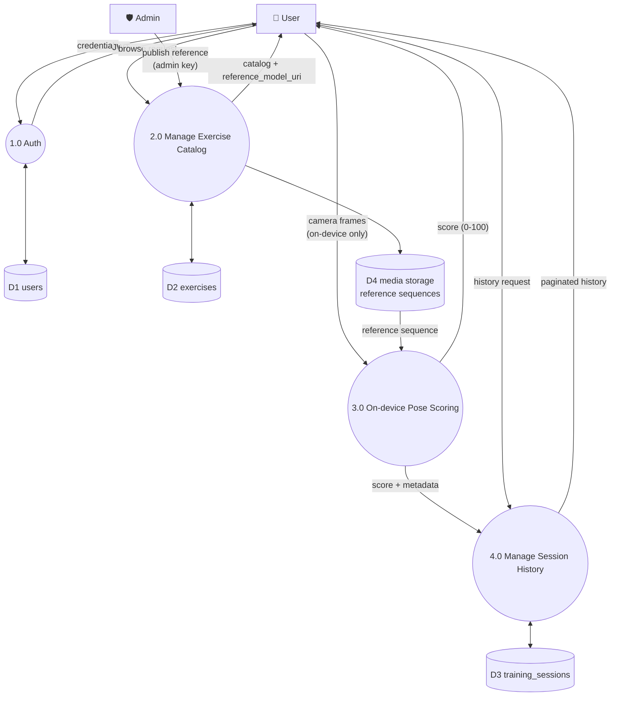
```mermaid
flowchart TD
    User["🏃 User"]
    Admin["🛡️ Admin"]
    P1((1.0 Auth))
    P2((2.0 Manage Exercise Catalog))
    P3((3.0 On-device Pose Scoring))
    P4((4.0 Manage Session History))
    D1[("D1 users")]
    D2[("D2 exercises")]
    D3[("D3 training_sessions")]
    D4[("D4 media storage\nreference sequences")]

    User -- credentials --> P1
    P1 -- JWT --> User
    P1 <--> D1

    User -- "browse request" --> P2
    P2 -- "catalog + reference_model_uri" --> User
    P2 <--> D2
    Admin -- "publish reference\n(admin key)" --> P2
    P2 --> D4

    User -- "camera frames\n(on-device only)" --> P3
    D4 -- "reference sequence" --> P3
    P3 -- "score (0-100)" --> User
    P3 -- "score + metadata" --> P4

    P4 <--> D3
    User -- "history request" --> P4
    P4 -- "paginated history" --> User
```

</details>

### 🧬 Data Lineage Diagram

<details>
<summary><strong>Click to expand — what happens to data from camera to database</strong></summary>

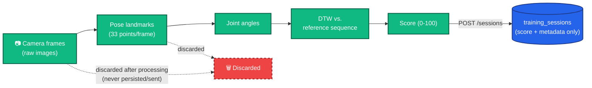
```mermaid
flowchart LR
    classDef device fill:#10B981,color:#fff,stroke:#065F46,stroke-width:2px;
    classDef server fill:#2563EB,color:#fff,stroke:#1E3A8A,stroke-width:2px;
    classDef discard fill:#EF4444,color:#fff,stroke:#991B1B,stroke-width:2px,stroke-dasharray:5 5;

    Camera["📷 Camera frames\n(raw images)"]:::device --> PoseDet["Pose landmarks\n(33 points/frame)"]:::device
    PoseDet --> Angles["Joint angles"]:::device
    Angles --> DTWCalc["DTW vs.\nreference sequence"]:::device
    DTWCalc --> Score["Score (0-100)"]:::device
    Camera -. "discarded after processing\n(never persisted/sent)" .-> Discard["🗑️ Discarded"]:::discard
    PoseDet -. discarded .-> Discard
    Score -- "POST /sessions" --> DB[("training_sessions\n(score + metadata only)")]:::server
```

> 🔐 This diagram is the visual proof of **RN04 / RNF02 / DOM-level privacy
> requirements**: raw camera frames and pose landmarks are processed
> entirely on-device and discarded — only the final numeric score and
> timestamp cross the network boundary.

</details>

---

## 8️⃣ Architecture Diagram & Flowchart

### 🏛️ Architecture Overview (Layered View)

<details>
<summary><strong>Click to expand</strong></summary>

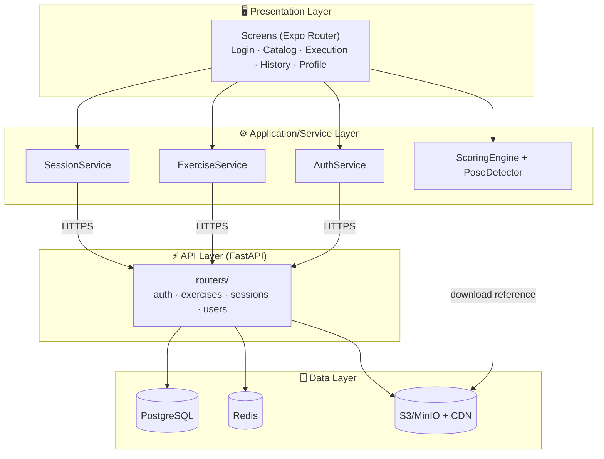
```mermaid
flowchart TB
    subgraph Presentation["🖥️ Presentation Layer"]
        Screens["Screens (Expo Router)\nLogin · Catalog · Execution · History · Profile"]
    end
    subgraph Application["⚙️ Application/Service Layer"]
        AuthSvc["AuthService"]
        ExerciseSvc["ExerciseService"]
        ScoringSvc["ScoringEngine + PoseDetector"]
        SessionSvc["SessionService"]
    end
    subgraph API["⚡ API Layer (FastAPI)"]
        Routers["routers/\nauth · exercises · sessions · users"]
    end
    subgraph DataLayer["🗄️ Data Layer"]
        Postgres[("PostgreSQL")]
        Redis[("Redis")]
        Media[("S3/MinIO + CDN")]
    end

    Screens --> AuthSvc
    Screens --> ExerciseSvc
    Screens --> ScoringSvc
    Screens --> SessionSvc
    AuthSvc -- HTTPS --> Routers
    ExerciseSvc -- HTTPS --> Routers
    SessionSvc -- HTTPS --> Routers
    ScoringSvc -- "download reference" --> Media
    Routers --> Postgres
    Routers --> Redis
    Routers --> Media
```

> See also the **Component Diagram** and **Deployment Diagram** in
> [UML & Structural Diagrams](#5️⃣-uml--structural-diagrams) (items 8 and 9).

</details>

### 🔀 General Navigation Flowchart

<details>
<summary><strong>Click to expand — app-wide screen flow</strong></summary>

```mermaid
flowchart TD
    Launch([App Launch]) --> HasToken{Valid JWT stored?}
    HasToken -- Yes --> Home[Home / Exercise Catalog]
    HasToken -- No --> Auth{Register or Login?}
    Auth -- Register --> RegForm[Registration Form] --> Home
    Auth -- Login --> LoginForm[Login Form] --> Home
    Home --> SelectExercise[Select Exercise]
    SelectExercise --> Execution["Execution Screen\n(capture + score)"]
    Execution --> Result[Result Screen]
    Result --> Decision{What next?}
    Decision -- "Train again" --> Home
    Decision -- "View history" --> History[History Screen]
    Decision -- "View profile" --> Profile["Profile / Preferences"]
    History --> Home
    Profile --> Logout{Logout?}
    Logout -- Yes --> Launch
    Logout -- No --> Home
```

</details>

---

## 9️⃣ Persona & User Journey Map

### 👤 Personas

<details>
<summary><strong>Click to expand — primary personas</strong></summary>

| | 🏃 Ana Silva — Primary User | 🛡️ Carlos Mendes — Admin/Coach |
|---|---|---|
| **Age** | 28 | 41 |
| **Occupation** | Marketing analyst, trains at home | Personal trainer / gym coach |
| **Tech comfort** | Medium — uses apps daily, dislikes complex setup | Medium-high — comfortable with admin tools |
| **Goals** | Train correctly without a coach present; track progress over time | Curate a reliable exercise catalog with accurate reference movements |
| **Frustrations** | Doesn't know if her form is correct; afraid of injury | Cannot supervise every client's form remotely |
| **Device** | 3-year-old Android phone (~3GB RAM) | Mid-range Android phone + laptop |
| **Quote** | *"I just want to know if I'm squatting correctly — right now, not after a video call with my trainer."* | *"If I record one perfect rep, everyone training that exercise benefits."* |

</details>

### 🗺️ User Journey Map

<details>
<summary><strong>Click to expand — Ana's first-workout journey</strong></summary>

| Stage | Discover & Onboard | Browse Catalog | Record Execution | Receive Score | Review History |
|---|---|---|---|---|---|
| **Actions** | Hears about the app, downloads it, registers (RF01) | Browses exercises by muscle group (RF02) | Selects "Squat", taps Start, performs the set (RF03) | Sees % score instantly (RF05) | Opens history, sees past sessions (RF06) |
| **Touchpoints** | App store, Registration screen | Catalog screen | Execution screen + camera | Result screen | History screen |
| **Thoughts** | "Is this free? Is my data safe?" | "Which exercises do I need?" | "Am I positioned correctly for the camera?" | "78%? What did I do wrong?" | "Am I improving week over week?" |
| **Emotions** | 🙂 Curious | 🙂 Engaged | 😐 Slightly anxious | 😀 Motivated | 😀 Confident |
| **Pain Points** | Privacy concerns about camera access | Too many exercises without filters | Needs good lighting/space for camera | Score without detailed feedback on *why* | History could lack enough sessions early on |
| **Opportunities** | Highlight on-device/privacy-by-design messaging (RN04) | Add muscle-group filters | In-app camera framing guide | Future: per-joint feedback breakdown | Add streaks/trends to encourage retention |

```mermaid
journey
    title Ana's Journey — First Workout with Gym Execution
    section Discover & Onboard
      Hears about app from a friend: 3: Ana
      Downloads & registers: 4: Ana
    section First Execution
      Browses exercise catalog: 4: Ana
      Selects "Squat": 5: Ana
      Records a set: 4: Ana
      Sees score (78%): 5: Ana
    section Habit Building
      Reviews history after a week: 4: Ana
      Notices score improving: 5: Ana
```

</details>

---

## 🔟 Wireframes & Mockups

### 📐 Wireframes (low-fidelity)

<details>
<summary><strong>Click to expand — Login</strong></summary>

```
┌─────────────────────────────┐
│        🏋️ Gym Execution      │
│                               │
│  Email                       │
│  ┌─────────────────────────┐ │
│  │ you@example.com         │ │
│  └─────────────────────────┘ │
│  Password                    │
│  ┌─────────────────────────┐ │
│  │ ••••••••••              │ │
│  └─────────────────────────┘ │
│                               │
│  ┌─────────────────────────┐ │
│  │         Log In           │ │
│  └─────────────────────────┘ │
│                               │
│     Don't have an account?   │
│            Register          │
└─────────────────────────────┘
```

</details>

<details>
<summary><strong>Click to expand — Exercise Catalog</strong></summary>

```
┌─────────────────────────────┐
│ ☰  Exercises            👤   │
├─────────────────────────────┤
│ 🔍 Search...                  │
├─────────────────────────────┤
│ Legs                          │
│  ▸ Squat            ⭐ ready  │
│  ▸ Lunge             ⏳ soon  │
│ Back                          │
│  ▸ Deadlift          ⭐ ready │
│ Chest                         │
│  ▸ Push-up           ⭐ ready │
├─────────────────────────────┤
│ 🏠 Home   📜 History   👤 Profile │
└─────────────────────────────┘
```

</details>

<details>
<summary><strong>Click to expand — Execution (Camera + Capture)</strong></summary>

```
┌─────────────────────────────┐
│  ←  Squat               ⚙️    │
├─────────────────────────────┤
│                               │
│      [ Camera Preview ]       │
│      pose skeleton overlay 🟢 │
│                               │
│   Rep 3 · capturing ~10 fps   │
├─────────────────────────────┤
│        ┌─────────────┐        │
│        │  ⏺ Finish    │        │
│        └─────────────┘        │
└─────────────────────────────┘
```

</details>

<details>
<summary><strong>Click to expand — Result</strong></summary>

```
┌─────────────────────────────┐
│  Result — Squat               │
├─────────────────────────────┤
│                               │
│            78%                │
│   ████████████░░░░░░          │
│  "Great form! Watch your      │
│   knee alignment."            │
│                               │
│ ┌────────────┐ ┌────────────┐ │
│ │ Train Again│ │View History│ │
│ └────────────┘ └────────────┘ │
└─────────────────────────────┘
```

</details>

<details>
<summary><strong>Click to expand — History</strong></summary>

```
┌─────────────────────────────┐
│  History                      │
├─────────────────────────────┤
│ Squat        2026-06-10  78%  │
│ Deadlift     2026-06-09  85%  │
│ Push-up      2026-06-08  91%  │
│ Squat        2026-06-07  72%  │
├─────────────────────────────┤
│        ◀  Page 1 of 4  ▶       │
└─────────────────────────────┘
```

</details>

### 🎨 Mockup Design Spec (high-fidelity guidance)

<details>
<summary><strong>Click to expand — design tokens & per-screen notes</strong></summary>

| Token | Value | Usage |
|---|---|---|
| 🔵 Primary | `#2563EB` | Primary buttons, links, active nav icon |
| 🟢 Secondary | `#10B981` | Success states, "ready" badges, pose-overlay skeleton |
| 🟠 Accent | `#F59E0B` | Warnings, progress highlights |
| ⚫ Dark mode bg | `#0F172A` | Background in dark theme (RF08 preference) |
| ⚪ Light mode bg | `#F8FAFC` | Background in light theme |
| 🔤 Font | System default (San Francisco / Roboto) | All text, for native look & feel |

| Screen | Mockup Notes |
|---|---|
| **Login/Register** | Centered card, primary-color CTA button, link to switch between Login/Register |
| **Catalog** | Grouped list by `muscle_group`, "ready" badge (🟢) when `reference_model_uri` is set, "soon" badge (🟠) otherwise |
| **Execution** | Full-screen camera preview, semi-transparent skeleton overlay in secondary color, large circular "Finish" button |
| **Result** | Large percentage in primary color, horizontal progress bar (secondary→accent gradient based on score), two CTA buttons |
| **History** | Reverse-chronological list, score shown as colored pill (green ≥80, amber 50–79, red <50) |
| **Profile/Preferences** | Toggle switches for camera quality, sound feedback, dark mode (all device-local per DAT06) |

</details>

---

## 🧰 Tech Stack

| Layer | Technology | Why |
|---|---|---|
| 📱 Hybrid app | **React Native + Expo (SDK 51)**, TypeScript | Single codebase for Android/iOS/Web, great camera support |
| 🧠 On-device CV (web) | **`@mediapipe/tasks-vision`** (WASM) | Google's official Pose Landmarker, runs in the browser |
| 🧠 On-device CV (mobile) | **MoveNet Lightning INT8** via **`react-native-fast-tflite`** | ~3MB quantized model, fast on low-end devices |
| 🖼️ Image preprocessing (mobile) | **`expo-camera`**, **`expo-image-manipulator`**, **`jpeg-js`** | Capture, crop/resize, decode to RGB tensor |
| ⚡ Backend / API | **Python 3.12 + FastAPI** | Fast, typed (Pydantic), industry standard |
| 🗄️ Database | **PostgreSQL 16** | Relational, robust, standard for user/training data |
| 🚀 Cache | **Redis 7** | Low-latency repeated lookups |
| 📦 Media storage | **S3-compatible (AWS S3 / MinIO) + CDN** | Reference videos & cached pose sequences |
| 🐳 Containerization | **Docker** (multi-stage, non-root) | Reproducible deploys |
| 🤖 CI/CD | **GitHub Actions** | Tests, Docker image publish (ghcr.io), web export |
| 📲 Mobile build/distribution | **EAS (Expo Application Services)** | Native builds (`expo-dev-client` required for TFLite) |
| 🧪 Testing | **Pytest** (backend) / **Jest** (frontend) | Industry standard |
| 🛠️ DB migrations | **Alembic** | Versioned schema changes |
| 🛡️ Rate limiting | **slowapi** | Protects auth endpoints |

> ⚠️ **Supply-chain caution**: install only from official registries
> (PyPI/npm), verify exact package names (avoid typosquatting), review
> generated lockfiles, and prefer pinned versions in production. See
> [Security & Supply Chain](#-security--supply-chain).

## 📂 Repository Structure

| Directory | What | Docs |
|---|---|---|
| [`app/`](app/) | React Native + Expo app (mobile + web): screens, camera capture, pose scoring | [app/README.md](app/README.md) |
| [`backend/`](backend/) | FastAPI API: auth, exercise catalog, session history | [backend/README.md](backend/README.md) |
| [`backend/pipeline/`](backend/pipeline/) | Offline pipeline: reference video → pose sequence → publish | [backend/pipeline/README.md](backend/pipeline/README.md) |
| [`.github/workflows/`](.github/workflows/) | CI/CD pipelines (tests, image build, web export) | — |

## 🚀 Getting Started

```bash
# 1) Backend (API)
cd backend
cp .env.example .env            # fill in local values
python -m venv .venv && . .venv/Scripts/activate
pip install -r requirements.txt
alembic upgrade head
uvicorn app.main:app --reload

# 2) App (in another terminal)
cd app
cp .env.example .env            # point EXPO_PUBLIC_API_BASE_URL to the API above
npm ci
npx expo start
```

Optional local infrastructure (Postgres + Redis) via Docker:

```bash
docker compose up -d
```

## 🔌 API Endpoints

| Method | Path | Description | Auth |
|---|---|---|---|
| `POST` | `/auth/register` | Register a new user | — (rate-limited) |
| `POST` | `/auth/login` | Login, returns access + refresh token | — (rate-limited) |
| `POST` | `/auth/refresh` | Rotate the refresh token, get a new pair | — (rate-limited) |
| `POST` | `/auth/logout` | Revoke a refresh token | — (rate-limited) |
| `GET` | `/exercises` | List the exercise catalog (paginated) | — public |
| `GET` | `/exercises/{id}` | Get exercise details | — public |
| `PUT` | `/exercises/{id}/reference-model` | Publish a reference pose sequence URI | 🛡️ Admin |
| `GET` | `/sessions` | List the user's training sessions (paginated) | 🔑 |
| `GET` | `/sessions/stats` | Aggregated stats for the current user | 🔑 |
| `POST` | `/sessions` | Record a training session result | 🔑 |
| `GET` | `/users/me` | Get current user profile | 🔑 |
| `PATCH` | `/users/me` | Partially update the current user profile | 🔑 |
| `DELETE` | `/users/me` | **Erase the account and all training history** (LGPD/GDPR) | 🔑 |
| `GET` | `/health/live` | Liveness probe (process only) | — |
| `GET` | `/health/ready` | Readiness probe (checks the database) | — |
| `GET` | `/metrics` | RED metrics, Prometheus text format | 🛡️ Admin |

> `POST /sessions` accepts an optional `Idempotency-Key` header — replaying the
> same key returns the session already created instead of duplicating it. The
> app always sends one, derived from the set's content, so draining the offline
> queue is safe to retry.
>
> Every response carries an `X-Request-ID` (echoed back if the client supplies
> one), and it appears in every log line for that request.

> The catalog endpoints are **public by design** — the app fetches the catalog
> before the user has a session. This table is generated by hand; it drifted
> before (`/exercises` was documented as authenticated, `/users/me` as `PUT`
> when it is `PATCH`, and `/auth/refresh`, `/auth/logout` and `/sessions/stats`
> were missing entirely). The authoritative contract is the OpenAPI schema:
> `python backend/scripts/export_openapi.py`.

## 🧪 Testing & CI/CD

```bash
# Backend
cd backend && pytest

# App
cd app && npm test
```

[`.github/workflows/ci.yml`](.github/workflows/ci.yml) runs both suites on
every push/PR to `main`, builds & publishes the API Docker image to
`ghcr.io`, exports the web app, and (on schedule/manual trigger) runs an
integration suite against a real PostgreSQL service.

## 🚢 Deploy

- **Backend**: containerized via [`backend/Dockerfile`](backend/Dockerfile)
  (multi-stage, non-root, runs `alembic upgrade head` on start). Designed
  for a managed Postgres/Redis host (Railway, Render, Fly.io) — provider
  not yet chosen (`deploy-backend` job is a placeholder).
- **App (mobile)**: native builds via **EAS** (`app/eas.json`), requires
  `expo-dev-client` due to native CV modules.
- **App (web)**: static export via `npx expo export --platform web`,
  ready for any static host (Cloudflare Pages, Netlify, Vercel, S3+CDN).

Full details in the [app](app/README.md) and [backend](backend/README.md)
READMEs.

## 🔒 Security & Supply Chain

- ⚠️ As seen with malicious npm/PyPI packages: before installing any
  dependency, verify the **exact name** matches the official package (no
  typosquatting), review the generated lockfile, and prefer
  lockfile-respecting installers (`npm ci`,
  `pip install -r requirements.txt --require-hashes`).
- 🔐 `.env` files are **never** committed — see `.env.example` in
  `app/` and `backend/`, and [`.gitignore`](.gitignore).
- 🔑 Production `JWT_SECRET_KEY`/`ADMIN_API_KEY` must be generated fresh
  (`python -c "import secrets; print(secrets.token_urlsafe(64))"`) and
  stored as deployment/CI secrets — never reused from development.
- 📦 ML models (`.tflite`/`.task`) are downloaded only from official
  sources (TensorFlow Hub, Google AI Edge / MediaPipe), with checksums
  verified when available.
