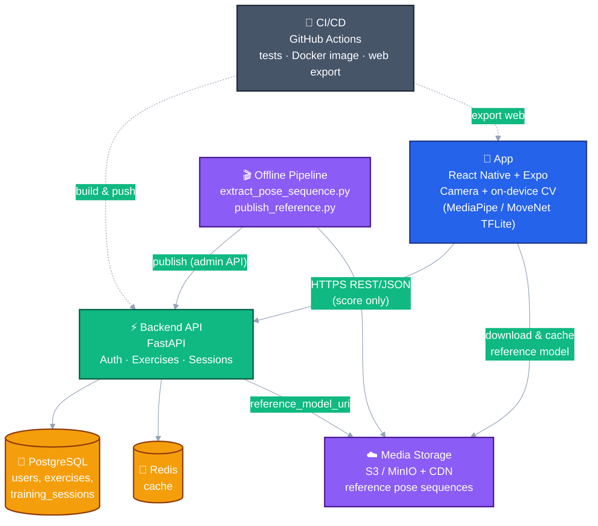
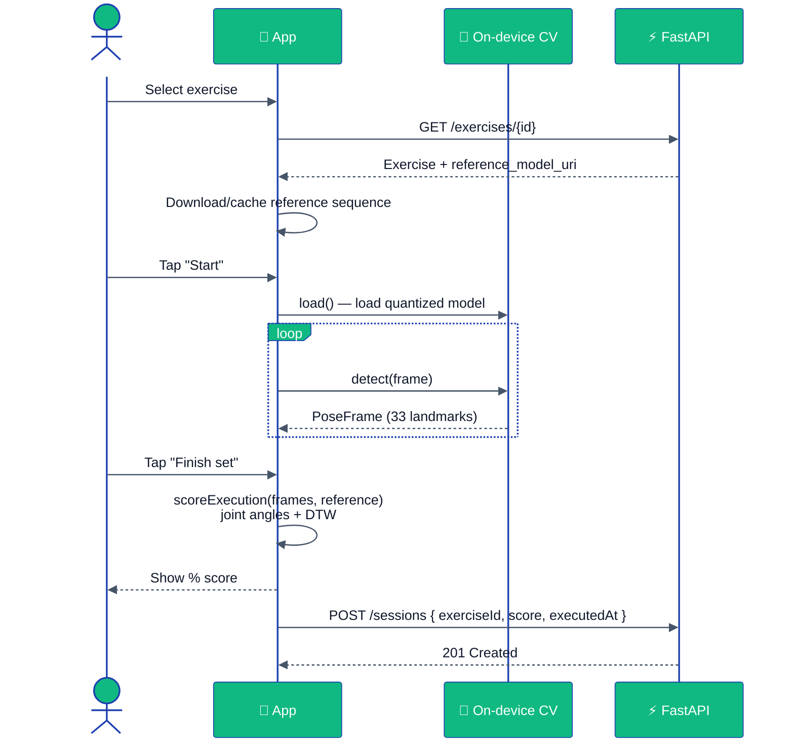
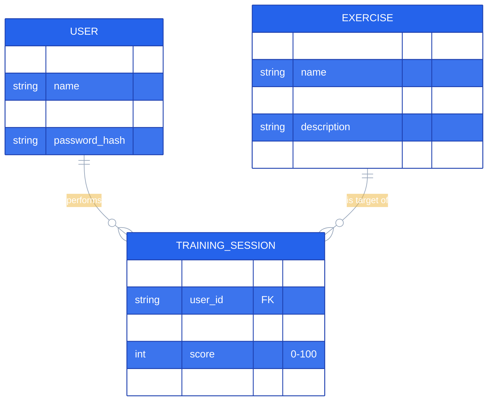

<div align="center">

# 🏋️‍♂️ Gym Execution

### AI-powered, on-device workout form analysis — your phone is the only "judge" you need.

[](README.md)
[](README.pt-BR.md)
[](README.es.md)

<br/>


</div>

---

A hybrid (mobile + web) gym app that **records the user performing an
exercise with the phone camera** and returns a **correctness score**
(general + exercise-specific), comparing the captured movement against
reference patterns — **all processed on-device**. Raw video never leaves
the phone; only the final score is sent to the backend.

## 📑 Table of Contents

- [📐 Business Rules](#-business-rules)
- [✅ Functional Requirements](#-functional-requirements)
- [⚙️ Non-Functional Requirements](#️-non-functional-requirements)
- [🏗️ Architecture](#️-architecture)
  - [Component Diagram](#component-diagram)
  - [Execution Flow (Sequence Diagram)](#execution-flow-sequence-diagram)
  - [Data Model (ER Diagram)](#data-model-er-diagram)
- [🧰 Tech Stack](#-tech-stack)
- [📂 Repository Structure](#-repository-structure)
- [🚀 Getting Started](#-getting-started)
- [🔌 API Endpoints](#-api-endpoints)
- [🧪 Testing & CI/CD](#-testing--cicd)
- [🚢 Deploy](#-deploy)
- [🔒 Security & Supply Chain](#-security--supply-chain)

## 📐 Business Rules

- 🔑 A user must **register and log in** (JWT) to access any feature
  beyond authentication.
- 🏃 Each **execution** (a "set") is performed for **exactly one
  exercise**, picked from a shared **catalog** (seeded centrally, not
  per-user).
- 📊 Every execution produces a **single score (0–100)**, computed by
  comparing the captured pose sequence against that exercise's
  **reference pose sequence** (joint angles + Dynamic Time Warping).
- 🔐 **Privacy by design**: raw camera frames/video are **never**
  uploaded — only the computed score and metadata (exercise, timestamp)
  are persisted in the user's history.
- 📜 A user can only see **their own** training history
  (`GET /sessions` is scoped to the authenticated user).
- 🎬 Reference pose sequences are produced **offline**, by an admin
  pipeline that processes a professional's reference video and publishes
  the result to `exercises.reference_model_uri` via an
  admin-protected endpoint (`X-Admin-Api-Key`).
- 🚦 Auth endpoints (`/auth/register`, `/auth/login`) are **rate-limited**
  to mitigate brute-force/credential-stuffing.
- ⚙️ User preferences (camera quality, sound feedback, dark mode) are
  **device-local only** — never synced to the backend.

## ✅ Functional Requirements

| # | Requirement |
|---|---|
| FR1 | User registration and login (email + password → JWT) |
| FR2 | Browse the **exercise catalog** (name, muscle group, description) |
| FR3 | Capture an exercise execution via **camera** and detect body pose **on-device** |
| FR4 | Compute a **% score** comparing the execution to the exercise's reference sequence |
| FR5 | Show the result immediately at the end of the set |
| FR6 | Persist the result to the user's **paginated history** |
| FR7 | View/edit **profile** (name, email) and aggregated stats (sessions completed, average score) |
| FR8 | Configure **local preferences**: camera quality, feedback sound, dark mode |
| FR9 | Admin: publish a **reference pose sequence** for an exercise |
| FR10 | Logout / session management via secure token storage |

## ⚙️ Non-Functional Requirements

| # | Category | Requirement |
|---|---|---|
| NFR1 | **Performance** | Smooth on devices with **2GB RAM (~2015+)**: quantized (INT8) on-device models, ~10 fps sampling (`SAMPLE_INTERVAL_MS`), reduced capture resolution |
| NFR2 | **Privacy** | No raw video/image leaves the device; only numeric scores are transmitted |
| NFR3 | **Security** | JWT in secure storage (`expo-secure-store`), password hashing, rate limiting on auth, admin endpoints behind `X-Admin-Api-Key` |
| NFR4 | **Portability** | Single codebase (React Native + Expo) targeting **Android, iOS and Web** |
| NFR5 | **Availability/Offline-first CV** | Pose detection works without network connectivity (model bundled/cached on-device) |
| NFR6 | **Maintainability** | End-to-end typing (TypeScript + Pydantic), unit-tested core algorithms (`pytest`, `Jest`) |
| NFR7 | **Scalability** | Stateless FastAPI + PostgreSQL/Redis, containerized, ready for managed hosting |
| NFR8 | **Supply-chain security** | Pinned dependency versions, official registries only, lockfile-based installs (`npm ci`, `pip --require-hashes`) |
| NFR9 | **CI/CD** | Automated test suites + Docker image build + web export on every push to `main` |

## 🏗️ Architecture

### Component Diagram



### Execution Flow (Sequence Diagram)



### Data Model (ER Diagram)



## 🧰 Tech Stack

| Layer | Technology | Why |
|---|---|---|
| 📱 Hybrid app | **React Native + Expo (SDK 51)**, TypeScript | Single codebase for Android/iOS/Web, great camera support |
| 🧠 On-device CV (web) | **`@mediapipe/tasks-vision`** (WASM) | Google's official Pose Landmarker, runs in the browser |
| 🧠 On-device CV (mobile) | **MoveNet Lightning INT8** via **`react-native-fast-tflite`** | ~3MB quantized model, fast on low-end devices |
| 🖼️ Image preprocessing (mobile) | **`expo-camera`**, **`expo-image-manipulator`**, **`jpeg-js`** | Capture, crop/resize, decode to RGB tensor |
| ⚡ Backend / API | **Python 3.12 + FastAPI** | Fast, typed (Pydantic), industry standard |
| 🗄️ Database | **PostgreSQL 16** | Relational, robust, standard for user/training data |
| 🚀 Cache | **Redis 7** | Low-latency repeated lookups |
| 📦 Media storage | **S3-compatible (AWS S3 / MinIO) + CDN** | Reference videos & cached pose sequences |
| 🐳 Containerization | **Docker** (multi-stage, non-root) | Reproducible deploys |
| 🤖 CI/CD | **GitHub Actions** | Tests, Docker image publish (ghcr.io), web export |
| 📲 Mobile build/distribution | **EAS (Expo Application Services)** | Native builds (`expo-dev-client` required for TFLite) |
| 🧪 Testing | **Pytest** (backend) / **Jest** (frontend) | Industry standard |
| 🛠️ DB migrations | **Alembic** | Versioned schema changes |
| 🛡️ Rate limiting | **slowapi** | Protects auth endpoints |

> ⚠️ **Supply-chain caution**: install only from official registries
> (PyPI/npm), verify exact package names (avoid typosquatting), review
> generated lockfiles, and prefer pinned versions in production. See
> [Security & Supply Chain](#-security--supply-chain).

## 📂 Repository Structure

| Directory | What | Docs |
|---|---|---|
| [`app/`](app/) | React Native + Expo app (mobile + web): screens, camera capture, pose scoring | [app/README.md](app/README.md) |
| [`backend/`](backend/) | FastAPI API: auth, exercise catalog, session history | [backend/README.md](backend/README.md) |
| [`backend/pipeline/`](backend/pipeline/) | Offline pipeline: reference video → pose sequence → publish | [backend/pipeline/README.md](backend/pipeline/README.md) |
| [`.github/workflows/`](.github/workflows/) | CI/CD pipelines (tests, image build, web export) | — |

## 🚀 Getting Started

```bash
# 1) Backend (API)
cd backend
cp .env.example .env            # fill in local values
python -m venv .venv && . .venv/Scripts/activate
pip install -r requirements.txt
alembic upgrade head
uvicorn app.main:app --reload

# 2) App (in another terminal)
cd app
cp .env.example .env            # point EXPO_PUBLIC_API_BASE_URL to the API above
npm ci
npx expo start
```

Optional local infrastructure (Postgres + Redis) via Docker:

```bash
docker compose up -d
```

## 🔌 API Endpoints

| Method | Path | Description | Auth |
|---|---|---|---|
| `POST` | `/auth/register` | Register a new user | — |
| `POST` | `/auth/login` | Login, returns JWT | — |
| `GET` | `/exercises` | List the exercise catalog | 🔑 |
| `GET` | `/exercises/{id}` | Get exercise details | 🔑 |
| `PUT` | `/exercises/{id}/reference-model` | Publish a reference pose sequence URI | 🛡️ Admin |
| `GET` | `/sessions` | List the user's training sessions (paginated) | 🔑 |
| `POST` | `/sessions` | Record a training session result | 🔑 |
| `GET` | `/users/me` | Get current user profile | 🔑 |
| `PUT` | `/users/me` | Update current user profile | 🔑 |

## 🧪 Testing & CI/CD

```bash
# Backend
cd backend && pytest

# App
cd app && npm test
```

[`.github/workflows/ci.yml`](.github/workflows/ci.yml) runs both suites on
every push/PR to `main`, builds & publishes the API Docker image to
`ghcr.io`, exports the web app, and (on schedule/manual trigger) runs an
integration suite against a real PostgreSQL service.

## 🚢 Deploy

- **Backend**: containerized via [`backend/Dockerfile`](backend/Dockerfile)
  (multi-stage, non-root, runs `alembic upgrade head` on start). Designed
  for a managed Postgres/Redis host (Railway, Render, Fly.io) — provider
  not yet chosen (`deploy-backend` job is a placeholder).
- **App (mobile)**: native builds via **EAS** (`app/eas.json`), requires
  `expo-dev-client` due to native CV modules.
- **App (web)**: static export via `npx expo export --platform web`,
  ready for any static host (Cloudflare Pages, Netlify, Vercel, S3+CDN).

Full details in the [app](app/README.md) and [backend](backend/README.md)
READMEs.

## 🔒 Security & Supply Chain

- ⚠️ As seen with malicious npm/PyPI packages: before installing any
  dependency, verify the **exact name** matches the official package (no
  typosquatting), review the generated lockfile, and prefer
  lockfile-respecting installers (`npm ci`,
  `pip install -r requirements.txt --require-hashes`).
- 🔐 `.env` files are **never** committed — see `.env.example` in
  `app/` and `backend/`, and [`.gitignore`](.gitignore).
- 🔑 Production `JWT_SECRET_KEY`/`ADMIN_API_KEY` must be generated fresh
  (`python -c "import secrets; print(secrets.token_urlsafe(64))"`) and
  stored as deployment/CI secrets — never reused from development.
- 📦 ML models (`.tflite`/`.task`) are downloaded only from official
  sources (TensorFlow Hub, Google AI Edge / MediaPipe), with checksums
  verified when available.
