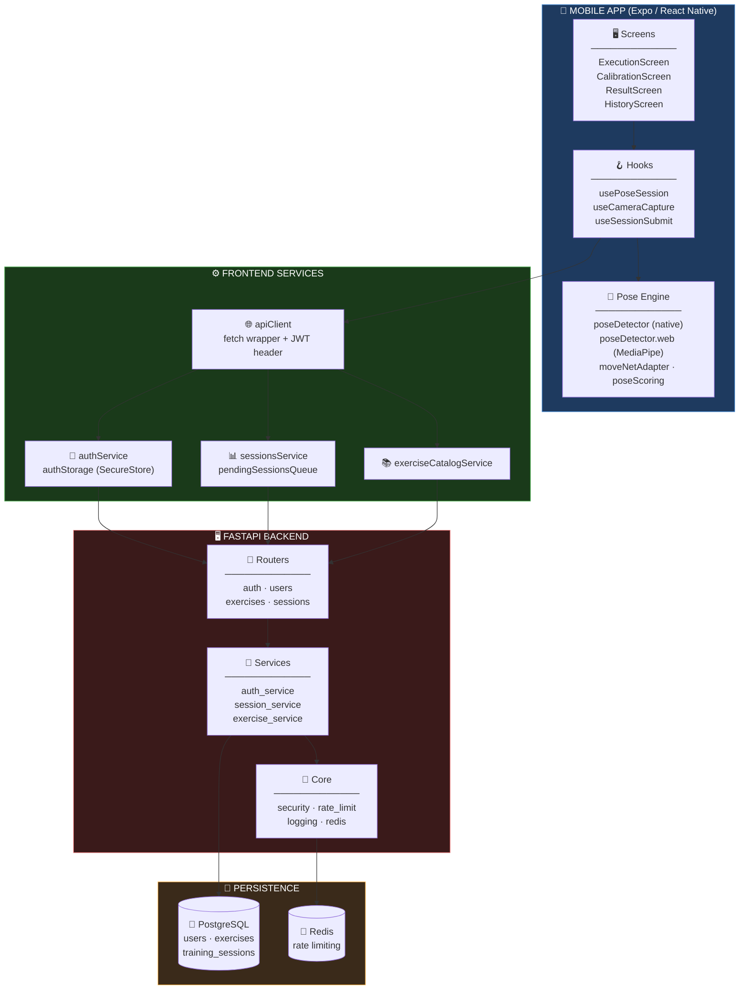
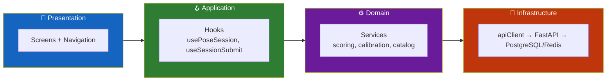
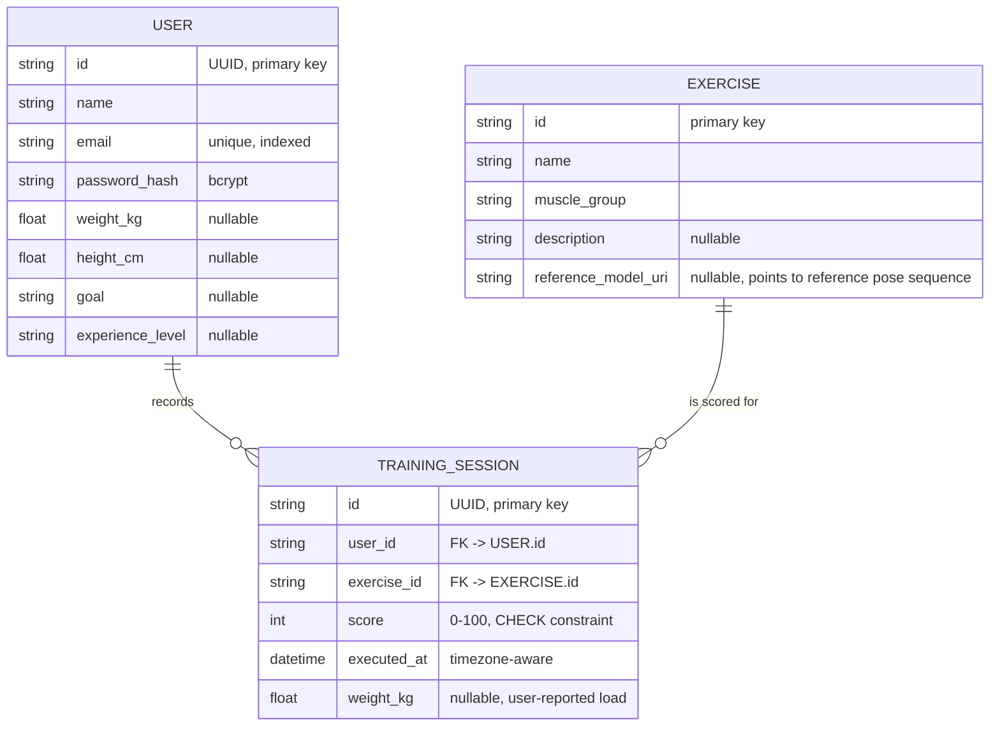
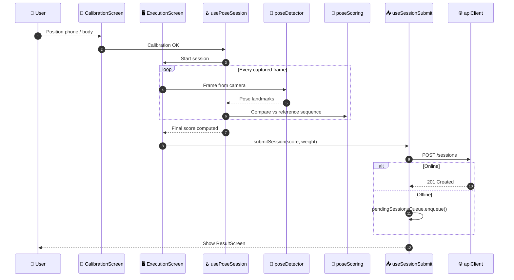
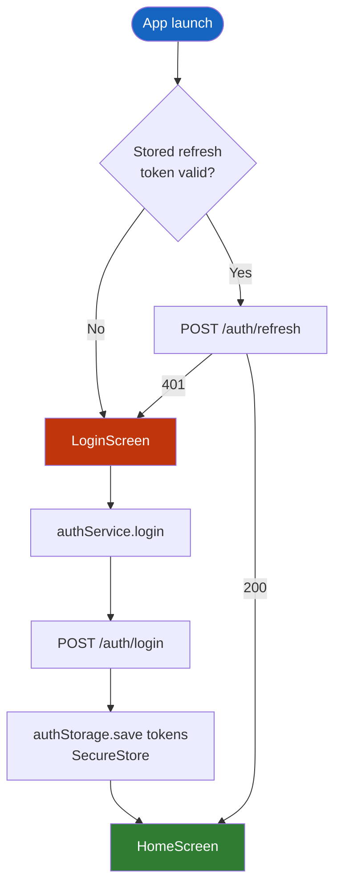
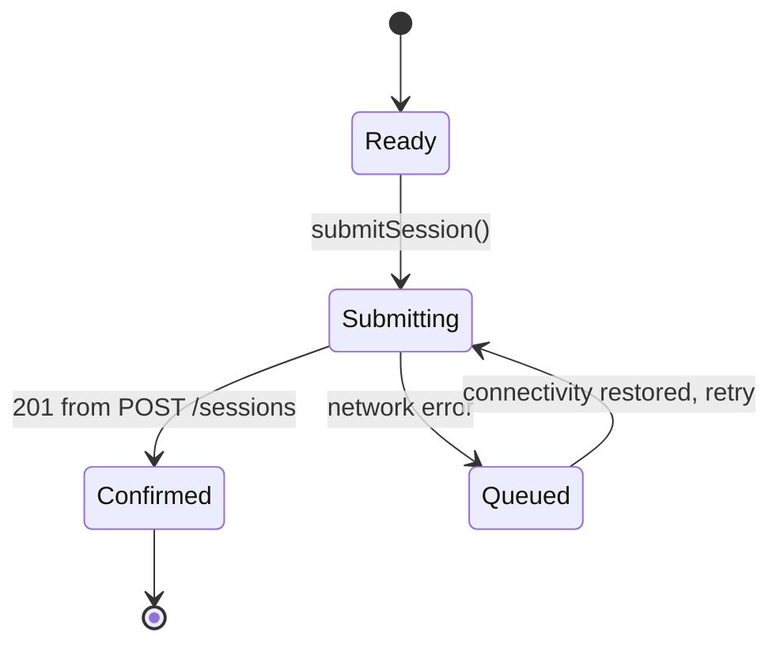
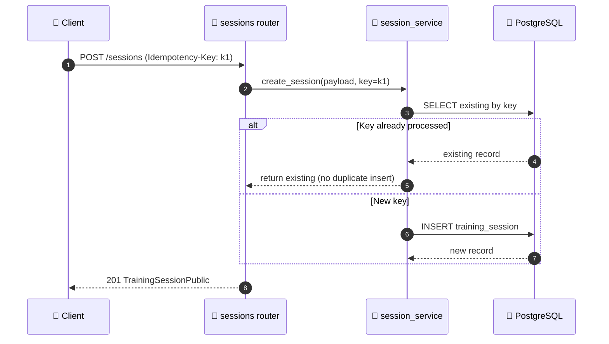
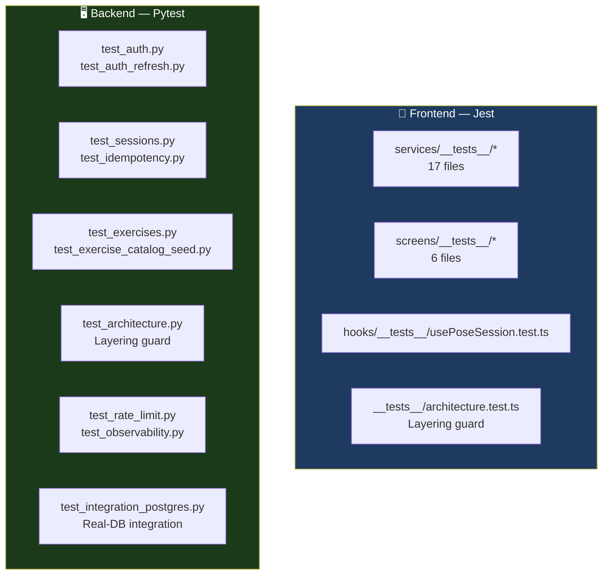

<div align="center">

**🌐 Choose Language / Selecione o Idioma / Elija el Idioma**

[](README.md)&nbsp;&nbsp;&nbsp;[](README_PT.md)&nbsp;&nbsp;&nbsp;[](README_ES.md)

</div>

---

<div align="center">

```
 ██████╗██╗   ██╗███╗   ███╗    ███████╗██╗  ██╗███████╗ ██████╗██╗   ██╗████████╗██╗ ██████╗ ███╗   ██╗
██╔════╝╚██╗ ██╔╝████╗ ████║    ██╔════╝╚██╗██╔╝██╔════╝██╔════╝██║   ██║╚══██╔══╝██║██╔═══██╗████╗  ██║
██║  ███╗╚████╔╝ ██╔████╔██║    █████╗   ╚███╔╝ █████╗  ██║     ██║   ██║   ██║   ██║██║   ██║██╔██╗ ██║
██║   ██║ ╚██╔╝  ██║╚██╔╝██║    ██╔══╝   ██╔██╗ ██╔══╝  ██║     ██║   ██║   ██║   ██║██║   ██║██║╚██╗██║
╚██████╔╝  ██║   ██║ ╚═╝ ██║    ███████╗██╔╝ ██╗███████╗╚██████╗╚██████╔╝   ██║   ██║╚██████╔╝██║ ╚████║
 ╚═════╝   ╚═╝   ╚═╝     ╚═╝    ╚══════╝╚═╝  ╚═╝╚══════╝ ╚═════╝ ╚═════╝    ╚═╝   ╚═╝ ╚═════╝ ╚═╝  ╚═══╝
                     On-device pose estimation for exercise form scoring
```

---

[](https://expo.dev/)
[](https://reactnative.dev/)
[](https://www.typescriptlang.org/)
[](https://fastapi.tiangolo.com/)
[](https://www.postgresql.org/)
[](https://www.tensorflow.org/lite)
[](https://redis.io/)

<br/>

> **A mobile app that watches you exercise through the camera and scores your form**
> using on-device pose estimation, never uploading raw video to any server.

<br/>


</div>

---

## 📑 Table of Contents

<details>
<summary>▶️ <strong>Click to expand / collapse this section</strong></summary>

<table>
<tr>
<td valign="top" width="50%">

**🏗️ System**
- [Overview](#-overview)
- [System Architecture](#-system-architecture)
- [Technology Stack](#-technology-stack)
- [Design Patterns](#-design-patterns-applied)
- [Project Structure](#-project-structure)

**📦 Modules**
- [Pose Detection Pipeline](#-system-modules)
- [Execution Screen](#-system-modules)
- [Session Services](#-system-modules)
- [Auth & API Client](#-system-modules)
- [Backend Routers](#-system-modules)
- [Reference Pipeline](#-system-modules)

</td>
<td valign="top" width="50%">

**💼 Business**
- [Business Rules](#-business-rules)
- [Functional Requirements](#-functional-requirements)
- [Non-Functional Requirements](#-non-functional-requirements)

**📐 Design**
- [Data Model](#-data-model)
- [System Flows](#-system-flows)

**🔐 Security & Ops**
- [Security](#-security)
- [Installation & Execution](#-installation--execution)
- [Automated Tests](#-automated-tests)
- [Metrics & Monitoring](#-metrics--monitoring)
- [Known Limitations](#-known-limitations)

</td>
</tr>
</table>

---

</details>

## 🌟 Overview

<details>
<summary>▶️ <strong>Click to expand / collapse this section</strong></summary>

**Gym Execution** is a two-part system: an **Expo / React Native** mobile app that scores exercise form in real time using the phone camera, and a **FastAPI** backend that stores users, exercises and completed training sessions.

The app runs pose estimation **on-device** through `react-native-fast-tflite` (a MoveNet TFLite model on native platforms) or MediaPipe Tasks Vision on web, extracts a normalized pose sequence per repetition, and compares it against a **reference pose sequence** for the selected exercise to produce a 0-100 form score. Only the resulting score and light metadata (weight, timestamp) are sent to the backend; raw video frames never leave the device.

The backend is a small, well-tested REST API: JWT auth with refresh tokens, an exercise catalog, session recording with idempotency support, rate limiting via Redis, and structured JSON logging with Prometheus-style metrics.

### 🎯 System Objectives

| Objective | Description |
|-----------|-------------|
| 📷 **On-device pose capture** | Score form without ever transmitting raw video |
| 🏋️ **Exercise catalog** | Serve a curated list of exercises with reference pose sequences |
| 🎯 **Form scoring** | Compare a captured sequence against a reference and produce a 0-100 score |
| 🔐 **Authentication** | Register, login, refresh and logout with JWT access + refresh tokens |
| 📊 **Progress tracking** | Persist sessions with score, weight and timestamp; expose aggregate stats |
| 🎯 **Personal goals** | Let the user define and track personal training goals locally |
| 📡 **Offline resilience** | Queue sessions locally and flush them once connectivity returns |
| 🧪 **Test-driven modules** | Cover services, hooks and screens with Jest; cover the API with Pytest |

---

</details>

## 🏗️ System Architecture

<details>
<summary>▶️ <strong>Click to expand / collapse this section</strong></summary>

### Module Diagram



### Architecture Layers



---

</details>

## 🛠️ Technology Stack

<details>
<summary>▶️ <strong>Click to expand / collapse this section</strong></summary>

<table>
<thead>
<tr>
<th>Layer</th>
<th>Technology</th>
<th>Version</th>
<th>Purpose</th>
</tr>
</thead>
<tbody>
<tr>
<td rowspan="4"><strong>📱 Mobile</strong></td>
<td>Expo</td>
<td>~51.0.0</td>
<td>Managed React Native toolchain, dev client</td>
</tr>
<tr>
<td>React Native</td>
<td>0.74.0</td>
<td>Cross-platform app runtime</td>
</tr>
<tr>
<td>React</td>
<td>18.2.0</td>
<td>UI component model</td>
</tr>
<tr>
<td>TypeScript</td>
<td>~5.3.3</td>
<td>Static typing across the app</td>
</tr>
<tr>
<td rowspan="4"><strong>🧠 Pose Estimation</strong></td>
<td>react-native-fast-tflite</td>
<td>2.0.0</td>
<td>On-device TFLite inference (native platforms)</td>
</tr>
<tr>
<td>@mediapipe/tasks-vision</td>
<td>0.10.35</td>
<td>Pose landmarker on web (<code>poseDetector.web.ts</code>)</td>
</tr>
<tr>
<td>expo-camera</td>
<td>~15.0.16</td>
<td>Camera frame capture</td>
</tr>
<tr>
<td>jpeg-js</td>
<td>0.4.4</td>
<td>Frame decoding for pose input tensors</td>
</tr>
<tr>
<td rowspan="4"><strong>📦 App Support</strong></td>
<td>@react-navigation/native + native-stack</td>
<td>^6.x</td>
<td>Screen navigation stack</td>
</tr>
<tr>
<td>@react-native-async-storage/async-storage</td>
<td>1.23.1</td>
<td>Local persistence (preferences, pending queue)</td>
</tr>
<tr>
<td>expo-secure-store</td>
<td>~13.0.0</td>
<td>Encrypted storage for auth tokens</td>
</tr>
<tr>
<td>expo-file-system / expo-image-manipulator</td>
<td>17.0.1 / ~12.0.5</td>
<td>Frame/file handling for capture and export</td>
</tr>
<tr>
<td rowspan="2"><strong>🧪 Frontend Testing</strong></td>
<td>Jest + jest-expo</td>
<td>^29.7.0 / ~51.0.0</td>
<td>Unit tests for services, hooks, screens</td>
</tr>
<tr>
<td>react-test-renderer</td>
<td>18.2.0</td>
<td>Screen rendering in tests</td>
</tr>
<tr>
<td rowspan="6"><strong>🖥️ Backend</strong></td>
<td>FastAPI</td>
<td>0.111.0</td>
<td>REST API framework</td>
</tr>
<tr>
<td>Uvicorn</td>
<td>0.30.1</td>
<td>ASGI server</td>
</tr>
<tr>
<td>Pydantic / pydantic-settings</td>
<td>2.9.2 / 2.3.4</td>
<td>Schemas + typed settings</td>
</tr>
<tr>
<td>SQLAlchemy</td>
<td>2.0.31</td>
<td>ORM over PostgreSQL</td>
</tr>
<tr>
<td>Alembic</td>
<td>1.13.2</td>
<td>Schema migrations</td>
</tr>
<tr>
<td>PyJWT / bcrypt</td>
<td>2.9.0 / 4.2.0</td>
<td>Token issuance and password hashing (replacing python-jose/passlib for CVE reasons)</td>
</tr>
<tr>
<td rowspan="3"><strong>💾 Data & Ops</strong></td>
<td>psycopg2-binary</td>
<td>2.9.12</td>
<td>PostgreSQL driver</td>
</tr>
<tr>
<td>Redis + slowapi</td>
<td>5.0.7 / 0.1.9</td>
<td>Rate limiting backend</td>
</tr>
<tr>
<td>python-json-logger</td>
<td>2.0.7</td>
<td>Structured JSON logging</td>
</tr>
<tr>
<td rowspan="2"><strong>🧪 Backend Testing</strong></td>
<td>pytest</td>
<td>8.2.2</td>
<td>Test runner (15 test modules)</td>
</tr>
<tr>
<td>httpx</td>
<td>0.27.0</td>
<td>Async test client for FastAPI</td>
</tr>
</tbody>
</table>

---

</details>

## 🎨 Design Patterns Applied

<details>
<summary>▶️ <strong>Click to expand / collapse this section</strong></summary>

| Pattern | Where | Rationale |
|---------|-------|-----------|
| 🧭 **Facade** | `apiClient.ts` | Single fetch wrapper hides base URL, JWT header injection and error shaping |
| 🎯 **Adapter** | `moveNetAdapter.ts`, `poseDetector.web.ts` | Normalizes native TFLite output and MediaPipe output into one `poseTypes.ts` shape |
| 🪝 **Custom Hook** | `usePoseSession`, `useCameraCapture`, `useSessionSubmit` | Encapsulates stateful pose/camera/session logic away from screen components |
| 📦 **Repository-like Service** | `sessionsService.ts`, `exerciseCatalogService.ts` | Screens never call `fetch` directly; services own the network contract |
| 🔁 **Queue / Retry** | `pendingSessionsQueue.ts` | Buffers unsent sessions and flushes them once the client is back online |
| 🧱 **Layered Backend** | `routers/` → `services/` → `models/` | Routers stay thin, business logic lives in services, persistence in SQLAlchemy models |
| 🚦 **Dependency Injection** | `core/deps.py`, FastAPI `Depends` | DB sessions, current-user resolution, admin key checks are injected, not imported |
| 🔐 **Idempotency Key** | `sessions` router, `test_idempotency.py` | Duplicate submits of the same session are detected via `Idempotency-Key` header |

---

</details>

## 📁 Project Structure

<details>
<summary>▶️ <strong>Click to expand / collapse this section</strong></summary>

```
Gym_execution/
│
├── 📂 app/                              # Expo / React Native mobile client
│   ├── 📄 package.json                  # Dependencies, Jest config, scripts
│   ├── 📂 assets/models/                # Bundled TFLite pose model(s)
│   └── 📂 src/
│       ├── 📂 screens/                  # 11 screens (Execution, Calibration, History, ...)
│       │   └── 📂 __tests__/            # Screen-level Jest tests
│       ├── 📂 hooks/                    # usePoseSession, useCameraCapture, useSessionSubmit, ...
│       ├── 📂 services/                 # 26 services: pose scoring, auth, storage, export, ...
│       │   └── 📂 __tests__/            # Service-level Jest tests
│       ├── 📂 navigation/               # AppNavigator.tsx — stack navigator
│       ├── 📂 types/                    # api.generated.ts (from openapi.json)
│       └── 📂 __tests__/                # architecture.test.ts — layering guard
│
├── 📂 backend/                          # FastAPI service
│   ├── 📄 requirements.txt              # Pinned production + test dependencies
│   ├── 📂 app/
│   │   ├── 📄 main.py                   # App wiring, middleware, health/metrics endpoints
│   │   ├── 📂 core/                     # config, database, security, rate_limit, logging, redis
│   │   ├── 📂 models/                   # user.py, exercise.py, training_session.py, base.py
│   │   ├── 📂 routers/                  # auth.py, users.py, exercises.py, sessions.py
│   │   ├── 📂 schemas/                  # Pydantic request/response schemas
│   │   └── 📂 services/                 # auth_service, session_service, exercise_service, user_service
│   ├── 📂 alembic/versions/             # Database migrations
│   ├── 📂 pipeline/                     # Offline tooling to build reference pose sequences
│   │   ├── extract_pose_sequence.py     # Extracts a pose sequence from a source video
│   │   ├── pose_sequence_format.py      # Shared sequence schema
│   │   ├── publish_reference.py         # Publishes a reference sequence for an exercise
│   │   └── README.md                    # Pipeline-specific usage notes
│   ├── 📂 scripts/                      # Operational / seed scripts
│   └── 📂 tests/                        # 15 pytest modules (auth, sessions, rate limit, ...)
│
├── 📄 docker-compose.yml                # Local Postgres + Redis + backend orchestration
├── 📄 README.md                         # 🇺🇸 English (primary)
├── 📄 README_PT.md                      # 🇧🇷 Português
└── 📄 README_ES.md                      # 🇪🇸 Español
```

---

</details>

## 📦 System Modules

<details>
<summary>▶️ <strong>Click to expand / collapse this section</strong></summary>

### 🧠 Pose Detection Pipeline

Frame capture (`useCameraCapture.ts`) feeds `poseDetector.ts` (native, TFLite via `react-native-fast-tflite`) or `poseDetector.web.ts` (MediaPipe Tasks Vision on web). Landmarks are normalized by `moveNetAdapter.ts` into the shared `poseTypes.ts` shape, then scored by `poseScoring.ts` against a reference sequence loaded through `referenceLibrary.ts`.

| Responsibility | File |
|-----------------|------|
| Frame capture / camera lifecycle | `useCameraCapture.ts` |
| Native TFLite inference | `poseDetector.ts`, `moveNetAdapter.ts` |
| Web inference (MediaPipe) | `poseDetector.web.ts` |
| Shared pose types | `poseTypes.ts` |
| Sequence vs. reference scoring | `poseScoring.ts` |
| Reference sequence loading | `referenceLibrary.ts`, `useReferenceSequence.ts` |
| Body calibration before a set | `bodyCalibration.ts`, `CalibrationScreen.tsx` |

---

### 🖥️ Execution & Result Screens

`ExecutionScreen.tsx` orchestrates a live set: it drives `usePoseSession.ts` (the central hook combining capture + scoring + rep counting), then hands off to `ResultScreen.tsx` for the final score and `useSessionSubmit.ts` to persist it.

| Screen | Role |
|--------|------|
| `CalibrationScreen.tsx` | Guides the user to position the camera correctly before a set |
| `ExecutionScreen.tsx` | Live camera + pose overlay + rep counting during the exercise |
| `ResultScreen.tsx` | Shows the final score, weight input and submit action |
| `ExerciseListScreen.tsx` | Lists the exercise catalog fetched from the backend |
| `HistoryScreen.tsx` | Shows past sessions and aggregate stats |
| `HomeScreen.tsx` | Landing / dashboard screen |
| `GoalsScreen.tsx` | Personal goal tracking (`personalGoals.ts`) |
| `ProfileScreen.tsx` / `SettingsScreen.tsx` | Account and preference management |
| `LoginScreen.tsx` / `RegisterScreen.tsx` | Auth screens backed by `authService.ts` |

---

### 📊 Session & Storage Services

| File | Responsibility |
|------|-----------------|
| `sessionsService.ts` | Submits and fetches training sessions from the backend |
| `pendingSessionsQueue.ts` | Persists unsent sessions locally and retries on reconnect |
| `exportSessions.ts` | Exports session history (e.g. CSV/share text) |
| `profileStats.ts`, `sessionInsights.ts`, `trainingReport.ts` | Derive aggregate stats and reports from session history |
| `achievements.ts` | Computes unlocked achievements from session history |
| `preferencesStorage.ts`, `exercisePreferencesStorage.ts` | AsyncStorage-backed user preferences |

---

### 🔐 Auth & API Client

| File | Responsibility |
|------|-----------------|
| `apiClient.ts` | Central fetch wrapper: base URL, JSON handling, JWT `Authorization` header |
| `authService.ts` | Register, login, refresh, logout calls against `/auth/*` |
| `authStorage.ts` | Persists access/refresh tokens in `expo-secure-store` |
| `useAuth.tsx` | React context/hook exposing auth state to the screen tree |

---

### 🚏 Backend Routers

| Router | Endpoints |
|--------|-----------|
| `auth.py` | `POST /register`, `POST /login`, `POST /refresh`, `POST /logout` |
| `users.py` | `GET /me`, `PATCH /me`, `DELETE /me` |
| `exercises.py` | `GET /`, `GET /{exercise_id}`, `PUT /{exercise_id}` |
| `sessions.py` | `POST /`, `GET /`, `GET /stats` |

Each router delegates to a matching `*_service.py` module; routers themselves contain no direct SQLAlchemy queries.

---

### 🧱 Backend Core

| File | Responsibility |
|------|-----------------|
| `core/config.py` | Typed settings via `pydantic-settings` (env-driven) |
| `core/database.py` | SQLAlchemy engine + `SessionLocal` factory |
| `core/security.py` | Password hashing (bcrypt), JWT encode/decode (PyJWT) |
| `core/deps.py` | FastAPI dependencies: DB session, current user, `require_admin_api_key` |
| `core/rate_limit.py` | `slowapi` limiter configuration |
| `core/redis.py` | Redis client used as the rate-limit backend |
| `core/logging.py` | Structured JSON logging, request-ID middleware, Prometheus metrics rendering |

---

### 🧪 Reference Pipeline (Offline Tooling)

A separate, non-served Python toolchain under `backend/pipeline/` that produces the reference pose sequences the app scores against.

| File | Responsibility |
|------|-----------------|
| `extract_pose_sequence.py` | Extracts a normalized pose sequence from a source reference video |
| `pose_sequence_format.py` | Defines the shared sequence schema used by extraction and scoring |
| `publish_reference.py` | Publishes/attaches an extracted sequence to an `Exercise.reference_model_uri` |
| `test_pose_sequence_format.py` | Unit tests for the sequence format |
| `requirements-pipeline.txt` | Isolated dependency set for this offline tooling |

---

</details>

## 💼 Business Rules

<details>
<summary>▶️ <strong>Click to expand / collapse this section</strong></summary>

### 🎯 Scoring Rules

| # | Rule | Enforcement |
|---|------|-------------|
| BR-01 | A training session score must be between 0 and 100 | `ck_training_sessions_score_range` CHECK constraint on `training_sessions` |
| BR-02 | Raw video is never uploaded; only the derived score and metadata are sent | `TrainingSession` has no video/frame column, only `score`, `weight_kg`, `executed_at` |
| BR-03 | An exercise may or may not have a reference pose sequence attached | `Exercise.reference_model_uri` is nullable |

### 🔐 Auth & Account Rules

| # | Rule | Enforcement |
|---|------|-------------|
| BR-04 | Emails must be unique across users | Unique index on `users.email` |
| BR-05 | Passwords are never stored in plaintext | `bcrypt` hash stored in `password_hash` |
| BR-06 | Access tokens are short-lived and paired with a refresh token | `POST /auth/refresh` issues a new access token from a valid refresh token |
| BR-07 | A user can permanently delete their own account | `DELETE /users/me`, covered by `test_account_deletion.py` |

### 📡 Reliability Rules

| # | Rule | Enforcement |
|---|------|-------------|
| BR-08 | Duplicate session submissions must not create duplicate records | `Idempotency-Key` header handling, covered by `test_idempotency.py` |
| BR-09 | Unauthenticated or over-limit clients are rejected before hitting business logic | `slowapi` rate limiter + JWT dependency evaluated first |
| BR-10 | `/metrics` is only reachable with the admin API key | `Depends(require_admin_api_key)` on the endpoint |

---

</details>

## ✅ Functional Requirements

<details>
<summary>▶️ <strong>Click to expand / collapse this section</strong></summary>

| ID | Requirement | Priority | Status |
|----|-------------|----------|--------|
| **RF-01** | The system shall allow a user to register with name, email and password | 🔴 High | ✅ Implemented |
| **RF-02** | The system shall allow a user to log in and receive access + refresh tokens | 🔴 High | ✅ Implemented |
| **RF-03** | The system shall allow refreshing an access token from a valid refresh token | 🔴 High | ✅ Implemented |
| **RF-04** | The system shall allow logout, invalidating the session | 🟡 Medium | ✅ Implemented |
| **RF-05** | The system shall list available exercises with muscle group and description | 🔴 High | ✅ Implemented |
| **RF-06** | The system shall fetch a single exercise by ID | 🟡 Medium | ✅ Implemented |
| **RF-07** | The system shall capture camera frames and run on-device pose estimation | 🔴 High | ✅ Implemented |
| **RF-08** | The system shall guide the user through a calibration step before execution | 🟡 Medium | ✅ Implemented |
| **RF-09** | The system shall compute a 0-100 form score by comparing to a reference sequence | 🔴 High | ✅ Implemented |
| **RF-10** | The system shall let the user submit a completed session with score and optional weight | 🔴 High | ✅ Implemented |
| **RF-11** | The system shall queue sessions locally when offline and submit them later | 🟡 Medium | ✅ Implemented |
| **RF-12** | The system shall show a history of past sessions | 🔴 High | ✅ Implemented |
| **RF-13** | The system shall expose aggregate session statistics via `GET /sessions/stats` | 🟡 Medium | ✅ Implemented |
| **RF-14** | The system shall let the user define and track personal goals | 🟡 Medium | ✅ Implemented |
| **RF-15** | The system shall let the user view and edit their profile | 🟡 Medium | ✅ Implemented |
| **RF-16** | The system shall let the user delete their account | 🟢 Low | ✅ Implemented |
| **RF-17** | The system shall let the user export their session history | 🟢 Low | ✅ Implemented |
| **RF-18** | The system shall compute achievements from session history | 🟢 Low | ✅ Implemented |
| **RF-19** | The system shall expose liveness and readiness health probes | 🟡 Medium | ✅ Implemented |
| **RF-20** | The system shall expose Prometheus-style metrics behind an admin key | 🟢 Low | ✅ Implemented |
| **RF-21** | The system shall reject duplicate session submissions using an idempotency key | 🟡 Medium | ✅ Implemented |
| **RF-22** | The system shall generate TypeScript API types from the backend OpenAPI schema | 🟢 Low | ✅ Implemented |

---

</details>

## ⚡ Non-Functional Requirements

<details>
<summary>▶️ <strong>Click to expand / collapse this section</strong></summary>

| ID | Category | Requirement | Target |
|----|----------|-------------|--------|
| **RNF-01** | ⚡ Performance | Pose inference stays on-device | No network round-trip during the exercise |
| **RNF-02** | 🔐 Security | Passwords hashed with bcrypt, never logged | `password_hash` column only |
| **RNF-03** | 🔐 Security | JWTs signed and verified with PyJWT, not python-jose | Removed for CVE-2024-33664/33663 |
| **RNF-04** | 🔐 Security | Sensitive endpoints rate-limited | `slowapi` + Redis backend |
| **RNF-05** | 🔐 Privacy | Raw video never transmitted or stored server-side | Only derived score persisted |
| **RNF-06** | 🧪 Testability | Backend logic covered by an isolated test suite | 15 pytest modules under `backend/tests/` |
| **RNF-07** | 🧪 Testability | Frontend services/hooks/screens covered by Jest | `collectCoverageFrom` targets services, hooks, screens |
| **RNF-08** | 🧱 Maintainability | Backend layered: routers → services → models | Enforced conceptually and by `test_architecture.py` |
| **RNF-09** | 🧱 Maintainability | Frontend layering enforced by a dedicated test | `app/src/__tests__/architecture.test.ts` |
| **RNF-10** | 📈 Observability | Requests logged as structured JSON with a request ID | `core/logging.py`, `REQUEST_ID_HEADER` |
| **RNF-11** | 📈 Observability | Liveness and readiness are separate probes | Avoids restart storms on transient DB slowness |
| **RNF-12** | 📡 Resilience | Client tolerates temporary loss of connectivity | `pendingSessionsQueue.ts` |
| **RNF-13** | 🔧 Reproducibility | Backend dependencies pinned with documented rationale | `requirements.txt` header comments |
| **RNF-14** | 🌍 Portability | App runs on iOS, Android and web from one codebase | Expo + `poseDetector.web.ts` platform split |
| **RNF-15** | 🗄️ Data Integrity | Session score constrained at the database level | `ck_training_sessions_score_range` |

---

</details>

## 🗄️ Data Model

<details>
<summary>▶️ <strong>Click to expand / collapse this section</strong></summary>

### Entity-Relationship Diagram



### Training Session Constraints

| Column | Type | Constraint |
|--------|------|-----------|
| `score` | `Integer` | `CHECK (score >= 0 AND score <= 100)` |
| `user_id` | `String` | `FOREIGN KEY -> users.id`, indexed |
| `exercise_id` | `String` | `FOREIGN KEY -> exercises.id`, indexed |
| `executed_at` | `DateTime(timezone=True)` | Not nullable |
| `weight_kg` | `Float` | Nullable, user-reported |

### Client-Side Pose Sequence Shape

| Field | Type | Notes |
|-------|------|-------|
| `landmarks[]` | array of `{x, y, z, score}` | Per-frame normalized keypoints, defined in `poseTypes.ts` |
| `timestampMs` | number | Frame timestamp relative to set start |
| `referenceSequenceId` | string | Matches `Exercise.reference_model_uri` |

---

</details>

## 🔄 System Flows

<details>
<summary>▶️ <strong>Click to expand / collapse this section</strong></summary>

### Exercise Execution Flow



### Authentication Flow



### Offline Queue State Machine



### Session Idempotency Flow



---

</details>

## 🔐 Security

<details>
<summary>▶️ <strong>Click to expand / collapse this section</strong></summary>

### Implemented Controls

| Control | Implementation | Effect |
|---------|---------------|--------|
| 🔐 **Password hashing** | `bcrypt` in `core/security.py` | Plaintext passwords never persisted |
| 🪪 **JWT auth** | `PyJWT` encode/decode, access + refresh pair | Short-lived access tokens limit exposure window |
| 🔑 **Secure token storage** | `expo-secure-store` via `authStorage.ts` | Tokens kept out of plain AsyncStorage on-device |
| 🚦 **Rate limiting** | `slowapi` + Redis (`core/rate_limit.py`, `core/redis.py`) | Throttles brute-force and abusive clients |
| 🔒 **Admin-gated metrics** | `require_admin_api_key` on `/metrics` | Route inventory and traffic volume not publicly exposed |
| 🧾 **Structured audit logging** | `core/logging.py`, request-ID middleware | Every request traceable end-to-end |
| 🌐 **CORS allow-list** | `CORSMiddleware` with `settings.cors_allowed_origins` | Only configured origins can call the API from a browser |
| 🚫 **CVE-driven dependency swaps** | `python-jose` → `PyJWT`, `passlib` → native `bcrypt` | Documented in `requirements.txt` header |
| 🗂️ **No raw media on server** | `TrainingSession` model has no video/frame field | Server never holds sensitive camera footage |

### Known Security Limitations

> [!WARNING]
> The following are inherent to the current design and should be understood before broader production use.

| Limitation | Risk | Mitigation path |
|------------|------|-----------------|
| 🔓 **No documented password complexity policy visible in schemas** | Weak passwords accepted | Add a minimum-strength validator in `schemas/auth.py` |
| 🧑‍💻 **On-device inference model is bundled in the app package** | Model weights are extractable from the APK/IPA | Acceptable for a public exercise model; revisit if a proprietary model is added |
| 📡 **Refresh token storage relies on client-side SecureStore only** | A compromised device can reuse a stored refresh token | Add refresh-token rotation and server-side revocation list |
| 🧾 **`/health` legacy alias is unauthenticated by design** | Minor information disclosure (service up/down) | Acceptable; contains no sensitive data |
| 🔁 **Idempotency key is client-supplied** | A malicious client could omit or forge it | Server-side, this only affects the client's own duplicate protection, not other users' data |
| 🌐 **CORS origins are configuration-driven** | A misconfigured deployment could over-allow origins | Review `settings.cors_allowed_origins` per environment before deploy |

---

</details>

## 🚀 Installation & Execution

<details>
<summary>▶️ <strong>Click to expand / collapse this section</strong></summary>

### Prerequisites

```bash
# Node.js 18+ and npm for the mobile app
node -v

# Python 3.11+ for the backend
python --version

# Docker (for local Postgres + Redis via docker-compose.yml)
docker --version
```

### Build

```bash
# --- Backend ---
cd backend
python -m venv .venv && source .venv/bin/activate   # or .venv\Scripts\activate on Windows
pip install -r requirements.txt
alembic upgrade head                                 # apply database migrations

# --- Mobile app ---
cd ../app
npm install
npm run generate:types      # generate src/types/api.generated.ts from ../openapi.json
npm run typecheck           # tsc --noEmit
```

### Execution

```bash
# Start Postgres + Redis (and optionally the backend) locally
docker-compose up -d

# Run the backend directly (if not using the compose service)
cd backend
uvicorn app.main:app --reload

# Run the mobile app
cd app
npm start          # expo start
npm run android    # or: npm run ios / npm run web
```

### Scripts & Targets

| Command | Location | Purpose |
|---------|----------|---------|
| `npm start` | `app/` | Start the Expo dev server |
| `npm run android` / `ios` / `web` | `app/` | Launch on a specific platform |
| `npm run typecheck` | `app/` | Run `tsc --noEmit` |
| `npm run generate:types` | `app/` | Regenerate typed API client from `openapi.json` |
| `npm test` / `npm run test:coverage` | `app/` | Run Jest suite / with coverage |
| `uvicorn app.main:app --reload` | `backend/` | Run the API with hot reload |
| `alembic upgrade head` | `backend/` | Apply pending migrations |
| `pytest` | `backend/` | Run the backend test suite |

### Build Configuration

| Setting | Value | Declared in |
|---------|-------|-------------|
| App name | `gym-execution-app` | `app/package.json` |
| Expo SDK | `~51.0.0` | `app/package.json` |
| Jest test timeout | `20000` ms | `app/package.json` (`jest.testTimeout`), documented as intentional |
| FastAPI app title | `settings.app_name` | `backend/app/core/config.py` |
| CORS methods | `GET, POST, PUT, PATCH, DELETE` | `backend/app/main.py` |
| Exposed header | `REQUEST_ID_HEADER` | `backend/app/main.py` |

---

</details>

## 🧪 Automated Tests

<details>
<summary>▶️ <strong>Click to expand / collapse this section</strong></summary>

### Test Architecture



| Suite | Location | Focus |
|-------|----------|-------|
| Frontend services | `app/src/services/__tests__/` | 17 files: scoring, storage, calibration, achievements, exports, ... |
| Frontend screens | `app/src/screens/__tests__/` | 6 files: List, History, Home, Login, Result, Settings |
| Frontend hooks | `app/src/hooks/__tests__/usePoseSession.test.ts` | Pose session orchestration |
| Frontend architecture | `app/src/__tests__/architecture.test.ts` | Enforces layering rules |
| Backend auth | `test_auth.py`, `test_auth_refresh.py` | Register/login/refresh/logout |
| Backend sessions | `test_sessions.py`, `test_idempotency.py` | Session CRUD and duplicate protection |
| Backend exercises | `test_exercises.py`, `test_exercise_catalog_seed.py`, `test_app_catalog_contract.py` | Catalog correctness and app/backend contract |
| Backend architecture | `test_architecture.py` | Enforces router → service → model layering |
| Backend reliability | `test_rate_limit.py`, `test_observability.py`, `test_uuid_generation.py` | Rate limiting, logging, ID generation |
| Backend integration | `test_integration_postgres.py` | Runs against a real PostgreSQL instance |
| Backend account | `test_account_deletion.py`, `test_users.py` | Profile and account lifecycle |

### Running the Tests

```bash
# Frontend
cd app
npm test
npm run test:coverage

# Backend
cd backend
pytest
pytest tests/test_integration_postgres.py   # requires a running Postgres instance
```

### Manual Acceptance Checklist

| # | Scenario | Expected result |
|---|----------|-----------------|
| 1 | Register a new account | User created, redirected to Home |
| 2 | Log in with correct credentials | Access + refresh tokens stored, Home shown |
| 3 | Select an exercise, calibrate, execute | Score 0-100 shown on ResultScreen |
| 4 | Submit a session while offline | Session queued locally, no crash |
| 5 | Regain connectivity | Queued session flushes automatically |
| 6 | View History | Past sessions listed with scores and dates |
| 7 | Attempt duplicate session submit with same idempotency key | No duplicate record created |
| 8 | Exceed rate limit on an endpoint | 429 response returned |
| 9 | Delete account | Account and dependent data removed, further auth fails |

---

</details>

## 📊 Metrics & Monitoring

<details>
<summary>▶️ <strong>Click to expand / collapse this section</strong></summary>

### Codebase Metrics

| Metric | Value |
|--------|-------|
| Frontend screens | 11 |
| Frontend services | 26 |
| Frontend hooks | 7 |
| Frontend test files | 24 (17 services + 6 screens + 1 hook) |
| Backend routers | 4 |
| Backend services | 4 |
| Backend models | 3 (`User`, `Exercise`, `TrainingSession`) |
| Backend test modules | 15 |
| Backend core modules | 6 |
| Offline pipeline scripts | 3 |

### Runtime Signals

| Signal | Source | Where to observe |
|--------|--------|------------------|
| Request rate/errors/duration | `core/logging.py` metrics render | `GET /metrics` (admin key required) |
| Liveness | Process responsiveness only | `GET /health/live` |
| Readiness | `SELECT 1` against PostgreSQL | `GET /health/ready` |
| Structured request logs | JSON logger with request ID | stdout / log aggregator |
| Rate-limit rejections | `slowapi` + Redis | 429 responses, Redis keys |

### Useful Diagnostic Commands

```bash
# Tail backend logs (structured JSON, one line per request)
uvicorn app.main:app --reload | tee backend.log

# Check readiness against the running instance
curl -s http://localhost:8000/health/ready

# Pull metrics (requires admin key header)
curl -s -H "X-Admin-Api-Key: <key>" http://localhost:8000/metrics

# Inspect Redis rate-limit keys
docker exec -it <redis_container> redis-cli KEYS "LIMITER*"
```

### Standardized Response Codes

| Code | Meaning | Where |
|------|---------|-------|
| `200` | OK | Health/readiness, GET endpoints |
| `201` | Created | Register, session create |
| `204` | No Content | Logout, account delete |
| `401` | Unauthorized | Invalid/expired JWT |
| `429` | Too Many Requests | `slowapi` rate limit exceeded |
| `500` | Internal Server Error | Caught by global exception handler, returns `requestId` |
| `503` | Service Unavailable | `/health/ready` when the database is unreachable |

---

</details>

## ⚠️ Known Limitations

<details>
<summary>▶️ <strong>Click to expand / collapse this section</strong></summary>

> [!IMPORTANT]
> This project balances an educational pose-scoring exercise with production-grade backend practices (idempotency, rate limiting, structured logging). Some frontend/backend edges are still evolving.

| Category | Issue | Status |
|----------|-------|--------|
| 🧠 **Pose model accuracy** | MoveNet/MediaPipe scoring is heuristic, not clinically validated | ➕ Intentional — form scoring is guidance, not medical assessment |
| 📡 **Offline queue durability** | Queue lives in AsyncStorage, not encrypted | ⚠️ Open — consider moving to SecureStore if session payloads become sensitive |
| 🔑 **No refresh-token rotation** | A leaked refresh token remains valid until natural expiry | ⚠️ Open — add rotation + revocation list |
| 🧪 **Integration test requires live Postgres** | `test_integration_postgres.py` cannot run in isolation | ➕ Intentional — validates real DB behavior, skip locally without Postgres |
| 🌍 **Some log/comment strings are in Portuguese** | Mixed-language codebase comments | ➕ Intentional — primary dev team is Portuguese-speaking |
| 📱 **Web pose detector path is a separate implementation** | Native and web pose code can drift | ⚠️ Open — add contract tests comparing `poseDetector` and `poseDetector.web` outputs |
| 🔧 **Pipeline tooling is manual** | `pipeline/publish_reference.py` is run by hand, not automated | ⚠️ Open — wrap in a CI job for new reference exercises |
| 📊 **No dashboard for `/metrics`** | Prometheus text format exposed but no bundled Grafana config | ⚠️ Open — ship a starter dashboard definition |

> [!TIP]
> The single highest-value improvement is adding **refresh-token rotation with server-side revocation**, since it directly hardens the account-security model without requiring any frontend redesign.

</details>

---

<div align="center">

---

### 🏋️ Gym Execution

*Score the movement, not the video*


<br/>

```
"Good form is invisible until it's measured —
 the camera only needs to see the movement once."
```

</div>
