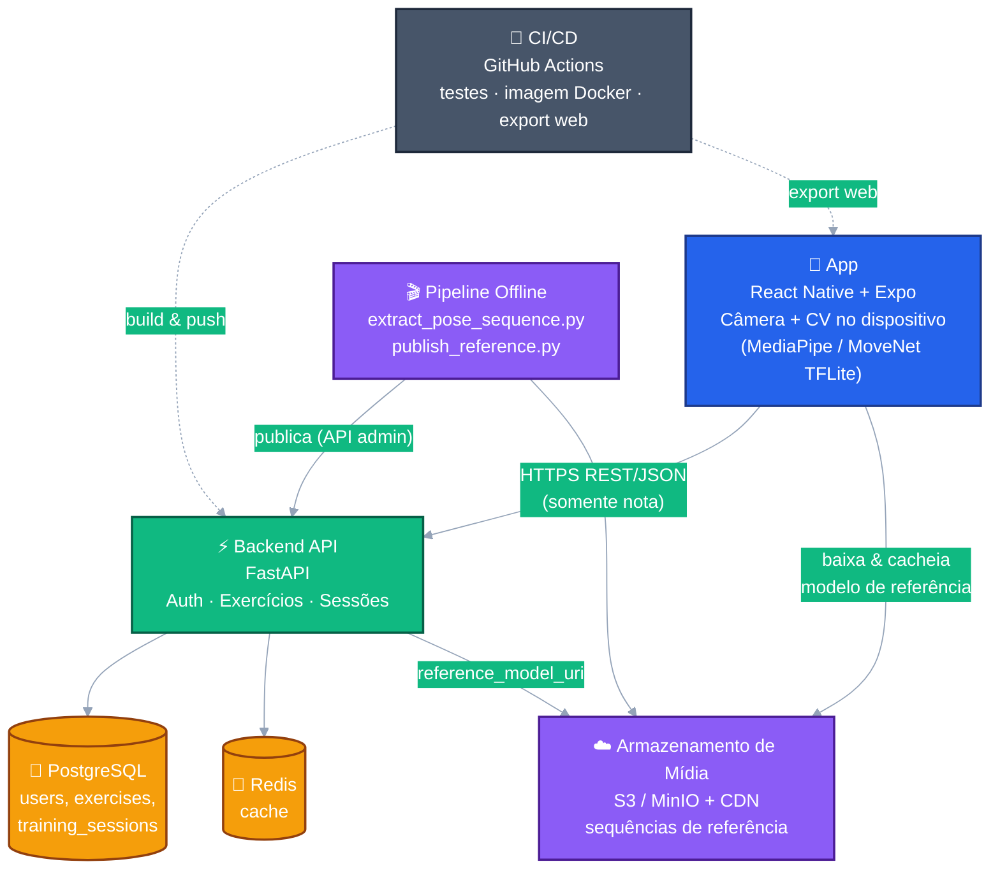
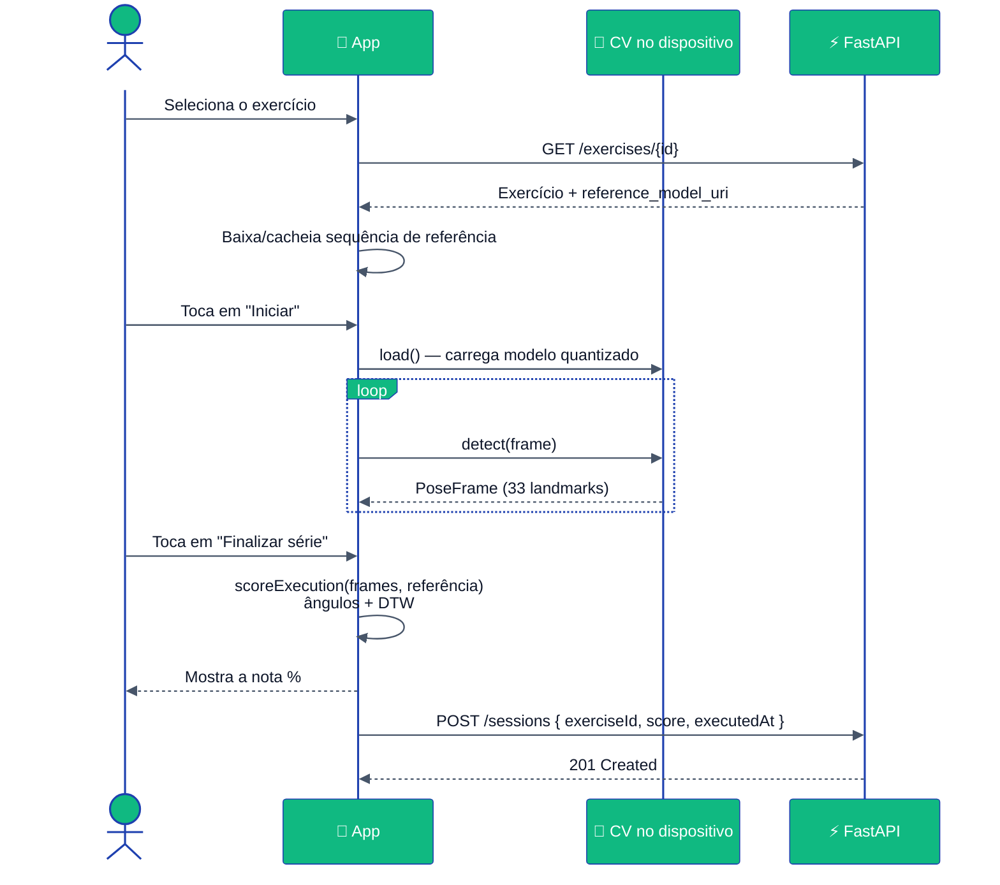
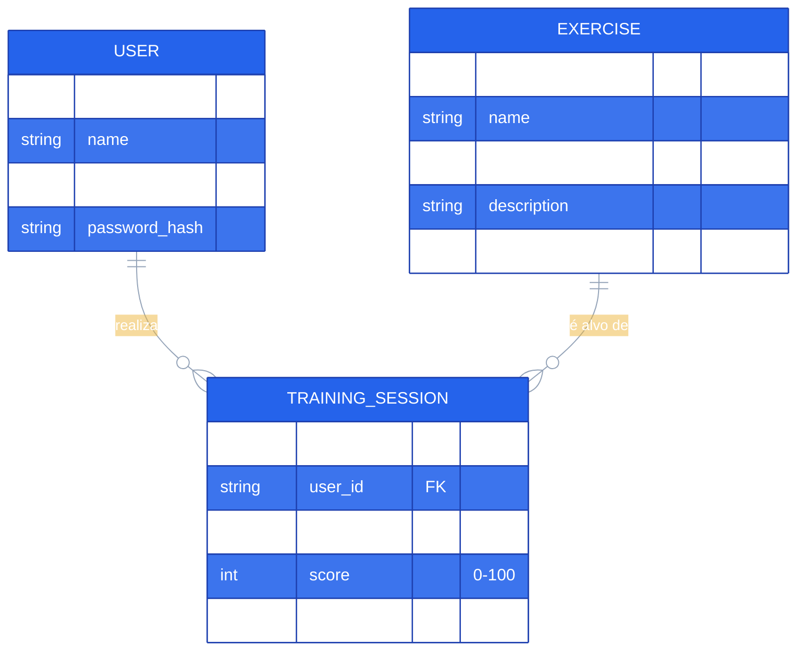

<div align="center">

# 🏋️‍♂️ Gym Execution

### Análise de execução de exercícios com IA on-device — seu celular é o único "juiz" que você precisa.

[](README.md)
[](README.pt-BR.md)
[](README.es.md)

<br/>


</div>

---

Um app híbrido (mobile + web) que **grava o usuário executando um
exercício pela câmera do celular** e devolve uma **nota de correção**
(geral + específica do exercício), comparando o movimento capturado com
padrões de referência — **tudo processado no próprio dispositivo**. O
vídeo bruto nunca sai do celular; apenas a nota final é enviada ao
backend.

## 📑 Sumário

- [📐 Regras de Negócio](#-regras-de-negócio)
- [✅ Requisitos Funcionais](#-requisitos-funcionais)
- [⚙️ Requisitos Não Funcionais](#️-requisitos-não-funcionais)
- [🏗️ Arquitetura](#️-arquitetura)
  - [Diagrama de Componentes](#diagrama-de-componentes)
  - [Fluxo de Execução (Diagrama de Sequência)](#fluxo-de-execução-diagrama-de-sequência)
  - [Modelo de Dados (Diagrama ER)](#modelo-de-dados-diagrama-er)
- [🧰 Stack Tecnológica](#-stack-tecnológica)
- [📂 Estrutura do Repositório](#-estrutura-do-repositório)
- [🚀 Como Rodar](#-como-rodar)
- [🔌 Endpoints da API](#-endpoints-da-api)
- [🧪 Testes & CI/CD](#-testes--cicd)
- [🚢 Deploy](#-deploy)
- [🔒 Segurança & Supply Chain](#-segurança--supply-chain)

## 📐 Regras de Negócio

- 🔑 O usuário precisa **se cadastrar e fazer login** (JWT) para acessar
  qualquer funcionalidade além da autenticação.
- 🏃 Cada **execução** (uma "série") é feita para **exatamente um
  exercício**, escolhido de um **catálogo** compartilhado (semeado
  centralmente, não por usuário).
- 📊 Cada execução gera **uma única nota (0–100)**, calculada comparando
  a sequência de poses capturada com a **sequência de referência** do
  exercício (ângulos articulares + Dynamic Time Warping).
- 🔐 **Privacidade desde o design**: os frames/vídeo brutos da câmera
  **nunca** são enviados — apenas a nota calculada e metadados (exercício,
  data/hora) são persistidos no histórico do usuário.
- 📜 O usuário só vê o **próprio** histórico de treinos
  (`GET /sessions` é restrito ao usuário autenticado).
- 🎬 As sequências de referência são produzidas **offline**, por um
  pipeline administrativo que processa o vídeo de um profissional e
  publica o resultado em `exercises.reference_model_uri` via um endpoint
  protegido para administradores (`X-Admin-Api-Key`).
- 🚦 Os endpoints de autenticação (`/auth/register`, `/auth/login`) têm
  **rate limiting** para mitigar força bruta/credential stuffing.
- ⚙️ Preferências do usuário (qualidade da câmera, som de feedback, modo
  escuro) são **somente locais ao dispositivo** — nunca sincronizadas com
  o backend.

## ✅ Requisitos Funcionais

| # | Requisito |
|---|---|
| RF1 | Cadastro e login de usuário (e-mail + senha → JWT) |
| RF2 | Navegar pelo **catálogo de exercícios** (nome, grupo muscular, descrição) |
| RF3 | Capturar a execução de um exercício pela **câmera** e detectar a pose corporal **no dispositivo** |
| RF4 | Calcular uma **nota %** comparando a execução com a sequência de referência do exercício |
| RF5 | Exibir o resultado imediatamente ao final da série |
| RF6 | Persistir o resultado no **histórico paginado** do usuário |
| RF7 | Ver/editar **perfil** (nome, e-mail) e estatísticas agregadas (séries concluídas, nota média) |
| RF8 | Configurar **preferências locais**: qualidade da câmera, som de feedback, modo escuro |
| RF9 | Admin: publicar uma **sequência de pose de referência** para um exercício |
| RF10 | Logout / gerenciamento de sessão via armazenamento seguro de token |

## ⚙️ Requisitos Não Funcionais

| # | Categoria | Requisito |
|---|---|---|
| RNF1 | **Performance** | Fluido em dispositivos com **2GB de RAM (~2015+)**: modelos quantizados (INT8) no dispositivo, amostragem ~10 fps (`SAMPLE_INTERVAL_MS`), resolução de captura reduzida |
| RNF2 | **Privacidade** | Nenhum vídeo/imagem bruto sai do dispositivo; apenas notas numéricas são transmitidas |
| RNF3 | **Segurança** | JWT em armazenamento seguro (`expo-secure-store`), hash de senha, rate limiting na autenticação, endpoints admin protegidos por `X-Admin-Api-Key` |
| RNF4 | **Portabilidade** | Codebase único (React Native + Expo) para **Android, iOS e Web** |
| RNF5 | **Disponibilidade/CV offline-first** | Detecção de pose funciona sem conexão (modelo embarcado/cacheado no dispositivo) |
| RNF6 | **Manutenibilidade** | Tipagem ponta a ponta (TypeScript + Pydantic), algoritmos centrais com testes unitários (`pytest`, `Jest`) |
| RNF7 | **Escalabilidade** | FastAPI + PostgreSQL/Redis stateless, containerizado, pronto para hospedagem gerenciada |
| RNF8 | **Segurança de supply-chain** | Versões de dependências fixadas, apenas registries oficiais, instalação baseada em lockfile (`npm ci`, `pip --require-hashes`) |
| RNF9 | **CI/CD** | Suítes de teste automatizadas + build de imagem Docker + export web a cada push em `main` |

## 🏗️ Arquitetura

### Diagrama de Componentes



### Fluxo de Execução (Diagrama de Sequência)



### Modelo de Dados (Diagrama ER)



## 🧰 Stack Tecnológica

| Camada | Tecnologia | Justificativa |
|---|---|---|
| 📱 App híbrido | **React Native + Expo (SDK 51)**, TypeScript | Codebase único para Android/iOS/Web, ótimo suporte a câmera |
| 🧠 CV no dispositivo (web) | **`@mediapipe/tasks-vision`** (WASM) | Pose Landmarker oficial do Google, roda no navegador |
| 🧠 CV no dispositivo (mobile) | **MoveNet Lightning INT8** via **`react-native-fast-tflite`** | Modelo quantizado de ~3MB, rápido em dispositivos modestos |
| 🖼️ Pré-processamento de imagem (mobile) | **`expo-camera`**, **`expo-image-manipulator`**, **`jpeg-js`** | Captura, recorte/resize, decodificação para tensor RGB |
| ⚡ Backend / API | **Python 3.12 + FastAPI** | Rápido, tipado (Pydantic), padrão de mercado |
| 🗄️ Banco de dados | **PostgreSQL 16** | Relacional, robusto, padrão para dados de usuários/treinos |
| 🚀 Cache | **Redis 7** | Consultas repetidas com baixa latência |
| 📦 Armazenamento de mídia | **S3-compatível (AWS S3 / MinIO) + CDN** | Vídeos de referência e sequências de pose cacheadas |
| 🐳 Containerização | **Docker** (multi-stage, non-root) | Deploys reprodutíveis |
| 🤖 CI/CD | **GitHub Actions** | Testes, publicação de imagem Docker (ghcr.io), export web |
| 📲 Build/distribuição mobile | **EAS (Expo Application Services)** | Builds nativos (`expo-dev-client` necessário para o TFLite) |
| 🧪 Testes | **Pytest** (backend) / **Jest** (frontend) | Padrão de mercado |
| 🛠️ Migrations de BD | **Alembic** | Versionamento de schema |
| 🛡️ Rate limiting | **slowapi** | Protege os endpoints de autenticação |

> ⚠️ **Cuidado com supply-chain**: instale apenas de registries oficiais
> (PyPI/npm), confira se o nome do pacote é exatamente o oficial (evite
> typosquatting), revise os lockfiles gerados e prefira versões fixadas
> em produção. Veja [Segurança & Supply Chain](#-segurança--supply-chain).

## 📂 Estrutura do Repositório

| Diretório | O que é | Docs |
|---|---|---|
| [`app/`](app/) | App React Native + Expo (mobile + web): telas, captura de câmera, pontuação de pose | [app/README.md](app/README.md) |
| [`backend/`](backend/) | API FastAPI: autenticação, catálogo de exercícios, histórico de sessões | [backend/README.md](backend/README.md) |
| [`backend/pipeline/`](backend/pipeline/) | Pipeline offline: vídeo de referência → sequência de pose → publicação | [backend/pipeline/README.md](backend/pipeline/README.md) |
| [`.github/workflows/`](.github/workflows/) | Pipelines de CI/CD (testes, build de imagem, export web) | — |

## 🚀 Como Rodar

```bash
# 1) Backend (API)
cd backend
cp .env.example .env            # preencha os valores locais
python -m venv .venv && . .venv/Scripts/activate
pip install -r requirements.txt
alembic upgrade head
uvicorn app.main:app --reload

# 2) App (em outro terminal)
cd app
cp .env.example .env            # aponte EXPO_PUBLIC_API_BASE_URL para a API acima
npm ci
npx expo start
```

Infraestrutura local opcional (Postgres + Redis) via Docker:

```bash
docker compose up -d
```

## 🔌 Endpoints da API

| Método | Caminho | Descrição | Auth |
|---|---|---|---|
| `POST` | `/auth/register` | Cadastra um novo usuário | — |
| `POST` | `/auth/login` | Login, retorna JWT | — |
| `GET` | `/exercises` | Lista o catálogo de exercícios | 🔑 |
| `GET` | `/exercises/{id}` | Detalhes de um exercício | 🔑 |
| `PUT` | `/exercises/{id}/reference-model` | Publica a URI da sequência de referência | 🛡️ Admin |
| `GET` | `/sessions` | Lista as sessões de treino do usuário (paginado) | 🔑 |
| `POST` | `/sessions` | Registra o resultado de uma sessão de treino | 🔑 |
| `GET` | `/users/me` | Obtém o perfil do usuário autenticado | 🔑 |
| `PUT` | `/users/me` | Atualiza o perfil do usuário autenticado | 🔑 |

## 🧪 Testes & CI/CD

```bash
# Backend
cd backend && pytest

# App
cd app && npm test
```

O [`.github/workflows/ci.yml`](.github/workflows/ci.yml) roda as duas
suítes a cada push/PR para `main`, builda e publica a imagem Docker da
API no `ghcr.io`, exporta o app web e (sob agendamento/manual) roda uma
suíte de integração contra um PostgreSQL real.

## 🚢 Deploy

- **Backend**: containerizado via [`backend/Dockerfile`](backend/Dockerfile)
  (multi-stage, non-root, roda `alembic upgrade head` na inicialização).
  Pensado para um host gerenciado de Postgres/Redis (Railway, Render,
  Fly.io) — provedor ainda não escolhido (job `deploy-backend` é um
  placeholder).
- **App (mobile)**: builds nativos via **EAS** (`app/eas.json`), requer
  `expo-dev-client` por causa dos módulos nativos de CV.
- **App (web)**: export estático via `npx expo export --platform web`,
  pronto para qualquer hospedagem estática (Cloudflare Pages, Netlify,
  Vercel, S3+CDN).

Detalhes completos nos READMEs do [app](app/README.md) e do
[backend](backend/README.md).

## 🔒 Segurança & Supply Chain

- ⚠️ Como já visto em pacotes maliciosos do npm/PyPI: antes de instalar
  qualquer dependência, confira se o **nome exato** corresponde ao
  pacote oficial (evite typosquatting), revise o lockfile gerado e
  prefira instaladores que respeitem o lockfile (`npm ci`,
  `pip install -r requirements.txt --require-hashes`).
- 🔐 Arquivos `.env` **nunca** são commitados — veja `.env.example` em
  `app/` e `backend/`, e o [`.gitignore`](.gitignore).
- 🔑 `JWT_SECRET_KEY`/`ADMIN_API_KEY` de produção devem ser gerados do
  zero (`python -c "import secrets; print(secrets.token_urlsafe(64))"`)
  e armazenados como secrets de deploy/CI — nunca reaproveitados do
  ambiente de desenvolvimento.
- 📦 Modelos de ML (`.tflite`/`.task`) são baixados apenas de fontes
  oficiais (TensorFlow Hub, Google AI Edge / MediaPipe), com checksums
  verificados quando disponíveis.
