<div align="center">

# 🏋️‍♂️ Gym Execution

### Análise de execução de exercícios com IA on-device — seu celular é o único "juiz" que você precisa.

[](README.md)
[](README.pt-BR.md)
[](README.es.md)

<br/>


</div>

---

Um app híbrido (mobile + web) que **grava o usuário executando um
exercício pela câmera do celular** e devolve uma **nota de correção**
(geral + específica do exercício), comparando o movimento capturado com
padrões de referência — **tudo processado no próprio dispositivo**. O
vídeo bruto nunca sai do celular; apenas a nota final é enviada ao
backend.

## 📑 Sumário

<details>
<summary><strong>📖 Clique para expandir o índice completo</strong></summary>

- [1️⃣ Requisitos](#1️⃣-requisitos)
  - [✅ Requisitos Funcionais (RF)](#-requisitos-funcionais-rf)
  - [⚙️ Requisitos Não Funcionais (RNF)](#️-requisitos-não-funcionais-rnf)
  - [📐 Regras de Negócio (RN)](#-regras-de-negócio-rn)
  - [🌐 Requisitos de Domínio](#-requisitos-de-domínio)
  - [🗄️ Requisitos de Dados](#️-requisitos-de-dados)
  - [🔌 Requisitos de Interface](#-requisitos-de-interface)
- [2️⃣ Casos de Uso](#2️⃣-casos-de-uso)
- [3️⃣ Matriz de Rastreabilidade de Requisitos](#3️⃣-matriz-de-rastreabilidade-de-requisitos)
- [4️⃣ Especificação de Requisitos de Software (SRS)](#4️⃣-especificação-de-requisitos-de-software-srs)
- [5️⃣ Diagramas UML & Estruturais](#5️⃣-diagramas-uml--estruturais)
- [6️⃣ Modelo de Dados & Dicionário de Dados](#6️⃣-modelo-de-dados--dicionário-de-dados)
- [7️⃣ Diagrama de Fluxo de Dados (DFD)](#7️⃣-diagrama-de-fluxo-de-dados-dfd)
- [8️⃣ Diagrama de Arquitetura & Fluxograma](#8️⃣-diagrama-de-arquitetura--fluxograma)
- [9️⃣ Persona & Mapa de Jornada do Usuário](#9️⃣-persona--mapa-de-jornada-do-usuário)
- [🔟 Wireframes & Mockups](#-wireframes--mockups)
- [🧰 Stack Tecnológica](#-stack-tecnológica)
- [📂 Estrutura do Repositório](#-estrutura-do-repositório)
- [🚀 Como Rodar](#-como-rodar)
- [🔌 Endpoints da API](#-endpoints-da-api)
- [🧪 Testes & CI/CD](#-testes--cicd)
- [🚢 Deploy](#-deploy)
- [🔒 Segurança & Supply Chain](#-segurança--supply-chain)

</details>

---

## 1️⃣ Requisitos

### ✅ Requisitos Funcionais (RF)

<details>
<summary><strong>Clique para expandir — 10 requisitos funcionais</strong></summary>

| # | Requisito |
|---|---|
| RF01 | Cadastro e login de usuário (e-mail + senha → JWT) |
| RF02 | Navegar pelo **catálogo de exercícios** (nome, grupo muscular, descrição) |
| RF03 | Capturar a execução de um exercício pela **câmera** e detectar a pose corporal **no dispositivo** |
| RF04 | Calcular uma **nota %** comparando a execução com a sequência de referência do exercício |
| RF05 | Exibir o resultado imediatamente ao final da série |
| RF06 | Persistir o resultado no **histórico paginado** do usuário |
| RF07 | Ver/editar **perfil** (nome, e-mail) e estatísticas agregadas (séries concluídas, nota média) |
| RF08 | Configurar **preferências locais**: qualidade da câmera, som de feedback, modo escuro |
| RF09 | Admin: publicar uma **sequência de pose de referência** para um exercício |
| RF10 | Logout / gerenciamento de sessão via armazenamento seguro de token |

</details>

### ⚙️ Requisitos Não Funcionais (RNF)

<details>
<summary><strong>Clique para expandir — 9 requisitos não funcionais</strong></summary>

| # | Categoria | Requisito |
|---|---|---|
| RNF01 | **Performance** | Fluido em dispositivos com **2GB de RAM (~2015+)**: modelos quantizados (INT8) no dispositivo, amostragem ~10 fps (`SAMPLE_INTERVAL_MS`), resolução de captura reduzida |
| RNF02 | **Privacidade** | Nenhum vídeo/imagem bruto sai do dispositivo; apenas notas numéricas são transmitidas |
| RNF03 | **Segurança** | JWT em armazenamento seguro (`expo-secure-store`), hash de senha, rate limiting na autenticação, endpoints admin protegidos por `X-Admin-Api-Key` |
| RNF04 | **Portabilidade** | Codebase único (React Native + Expo) para **Android, iOS e Web** |
| RNF05 | **Disponibilidade/CV offline-first** | Detecção de pose funciona sem conexão (modelo embarcado/cacheado no dispositivo) |
| RNF06 | **Manutenibilidade** | Tipagem ponta a ponta (TypeScript + Pydantic), algoritmos centrais com testes unitários (`pytest`, `Jest`) |
| RNF07 | **Escalabilidade** | FastAPI + PostgreSQL/Redis stateless, containerizado, pronto para hospedagem gerenciada |
| RNF08 | **Segurança de supply-chain** | Versões de dependências fixadas, apenas registries oficiais, instalação baseada em lockfile (`npm ci`, `pip --require-hashes`) |
| RNF09 | **CI/CD** | Suítes de teste automatizadas + build de imagem Docker + export web a cada push em `main` |

</details>

### 📐 Regras de Negócio (RN)

<details>
<summary><strong>Clique para expandir — 8 regras de negócio</strong></summary>

| # | Regra |
|---|---|
| RN01 | 🔑 O usuário precisa **se cadastrar e fazer login** (JWT) para acessar qualquer funcionalidade além da autenticação |
| RN02 | 🏃 Cada **execução** (uma "série") é feita para **exatamente um exercício**, escolhido de um **catálogo** compartilhado (semeado centralmente, não por usuário) |
| RN03 | 📊 Cada execução gera **uma única nota (0–100)**, calculada comparando a sequência de poses capturada com a **sequência de referência** do exercício (ângulos articulares + Dynamic Time Warping) |
| RN04 | 🔐 **Privacidade desde o design**: os frames/vídeo brutos da câmera **nunca** são enviados — apenas a nota calculada e metadados (exercício, data/hora) são persistidos no histórico do usuário |
| RN05 | 📜 O usuário só vê o **próprio** histórico de treinos (`GET /sessions` é restrito ao usuário autenticado) |
| RN06 | 🎬 As sequências de referência são produzidas **offline**, por um pipeline administrativo que processa o vídeo de um profissional e publica o resultado em `exercises.reference_model_uri` via um endpoint protegido para administradores (`X-Admin-Api-Key`) |
| RN07 | 🚦 Os endpoints de autenticação (`/auth/register`, `/auth/login`) têm **rate limiting** para mitigar força bruta/credential stuffing |
| RN08 | ⚙️ Preferências do usuário (qualidade da câmera, som de feedback, modo escuro) são **somente locais ao dispositivo** — nunca sincronizadas com o backend |

</details>

### 🌐 Requisitos de Domínio

<details>
<summary><strong>Clique para expandir — restrições específicas do domínio (visão computacional / fitness)</strong></summary>

| # | Requisito |
|---|---|
| DOM01 | A detecção de pose **deve** usar uma topologia de 33 landmarks corporais (compatível com BlazePose/MoveNet) para que as sequências de referência e capturada sejam comparáveis |
| DOM02 | A pontuação **deve** combinar **diferenças de ângulos articulares** e **Dynamic Time Warping (DTW)** para tolerar variações de tempo entre a referência e a execução do usuário |
| DOM03 | O catálogo de exercícios é **global/compartilhado** — exercícios não são criados pelo usuário, garantindo que todos sejam avaliados com a mesma referência |
| DOM04 | As sequências de pose de referência são geradas por um **pipeline offline** (`extract_pose_sequence.py`) a partir da gravação de um profissional, nunca em tempo real |
| DOM05 | A taxa de amostragem da captura é fixada em **~10 fps** (`SAMPLE_INTERVAL_MS`) — um trade-off derivado do domínio entre precisão da pontuação e performance em dispositivos modestos |
| DOM06 | Uma nota calculada de **0–100** deve sempre ser interpretável como uma porcentagem de similaridade com o movimento de referência, independentemente do tipo de exercício |

</details>

### 🗄️ Requisitos de Dados

<details>
<summary><strong>Clique para expandir — regras de persistência e retenção de dados</strong></summary>

| # | Requisito |
|---|---|
| DAT01 | `users`: `email` único, senha com hash (nunca armazenada em texto puro) |
| DAT02 | `exercises`: catálogo semeado globalmente, com `reference_model_uri` opcional (nulo até um admin publicar) |
| DAT03 | `training_sessions`: uma linha por execução — `user_id`, `exercise_id`, `score (0-100)`, `executed_at` |
| DAT04 | **Nenhuma mídia bruta** (vídeo/imagens/frames de pose) é persistida no servidor — apenas a nota numérica final e metadados |
| DAT05 | Os resultados de `GET /sessions` **devem** ser paginados e filtrados por `user_id = usuário autenticado` |
| DAT06 | Dados somente locais (qualidade da câmera, som de feedback, modo escuro) ficam no armazenamento do dispositivo (`AsyncStorage`/`expo-secure-store`) e **nunca** são enviados à API |

</details>

### 🔌 Requisitos de Interface

<details>
<summary><strong>Clique para expandir — interfaces externas e de usuário</strong></summary>

| # | Requisito |
|---|---|
| INT01 | Toda comunicação cliente↔servidor usa **HTTPS REST/JSON** |
| INT02 | Requisições autenticadas levam um **token JWT Bearer** no header `Authorization` |
| INT03 | Endpoints exclusivos de admin exigem um header adicional `X-Admin-Api-Key` |
| INT04 | O app fornece uma **interface de captura por câmera** (`expo-camera`) com overlay de feedback da pose no dispositivo |
| INT05 | A UI deve ser **responsiva** entre os alvos nativo (Android/iOS) e web a partir de um único codebase React Native + Expo |
| INT06 | Erros retornados pela API seguem um formato JSON consistente (`{ "detail": "..." }`) para que o cliente exiba mensagens amigáveis |

</details>

---

## 2️⃣ Casos de Uso

### Atores

| Ator | Descrição |
|---|---|
| 🏃 **Usuário** | Atleta cadastrado que grava execuções, vê notas e histórico |
| 🛡️ **Admin** | Operador que publica sequências de pose de referência via `X-Admin-Api-Key` |
| 🤖 **Sistema de CI/CD** | GitHub Actions — executa testes, builda imagens, exporta o app web (ator de suporte) |

### Resumo dos Casos de Uso

| ID | Caso de Uso | Ator Principal | RF Relacionado |
|---|---|---|---|
| UC01 | Cadastrar-se | Usuário | RF01 |
| UC02 | Fazer login | Usuário | RF01 |
| UC03 | Navegar pelo catálogo de exercícios | Usuário | RF02 |
| UC04 | Ver detalhes do exercício | Usuário | RF02 |
| UC05 | Capturar execução & obter nota | Usuário | RF03, RF04, RF05 |
| UC06 | Ver histórico de treinos | Usuário | RF06 |
| UC07 | Ver / editar perfil | Usuário | RF07 |
| UC08 | Configurar preferências locais | Usuário | RF08 |
| UC09 | Publicar sequência de pose de referência | Admin | RF09 |
| UC10 | Fazer logout | Usuário | RF10 |

### Especificações Detalhadas de Casos de Uso

<details>
<summary><strong>📄 UC05 — Capturar Execução & Obter Nota</strong></summary>

| Campo | Descrição |
|---|---|
| **Ator** | Usuário |
| **Pré-condições** | Usuário autenticado; um exercício com `reference_model_uri` publicado está selecionado |
| **Fluxo Principal** | 1. O app baixa/cacheia a sequência de pose de referência do exercício.<br>2. Usuário toca em "Iniciar"; o app carrega o modelo de CV no dispositivo.<br>3. O app amostra frames da câmera (~10 fps) e roda a detecção de pose por frame.<br>4. Usuário toca em "Finalizar série".<br>5. O app calcula a nota (ângulos articulares + DTW) comparando com a sequência de referência.<br>6. O app exibe a nota % imediatamente.<br>7. O app envia `POST /sessions` com `{ exerciseId, score, executedAt }`. |
| **Fluxos Alternativos** | A1. Sem rede ao salvar → o resultado é exibido localmente e colocado em fila para reenvio.<br>A2. Modelo de referência não cacheado → o app bloqueia "Iniciar" até o download terminar. |
| **Pós-condições** | Uma linha em `training_sessions` é criada; o resultado fica visível no histórico do usuário |
| **Requisitos Relacionados** | RF03–RF06, RNF01, RNF02, RNF05, DOM01–DOM06, DAT03, DAT04 |

</details>

<details>
<summary><strong>📄 UC09 — Publicar Sequência de Pose de Referência (Admin)</strong></summary>

| Campo | Descrição |
|---|---|
| **Ator** | Admin |
| **Pré-condições** | Admin possui um `X-Admin-Api-Key` válido; existe uma sequência de pose de referência já processada (saída do `extract_pose_sequence.py`) |
| **Fluxo Principal** | 1. Admin executa o pipeline offline sobre o vídeo de referência de um profissional.<br>2. O pipeline envia a sequência de pose resultante para o armazenamento de mídia.<br>3. Admin chama `PUT /exercises/{id}/reference-model` com a URI resultante e `X-Admin-Api-Key`.<br>4. A API valida a chave de admin e atualiza `exercises.reference_model_uri`. |
| **Fluxos Alternativos** | A1. `X-Admin-Api-Key` inválido/ausente → `403 Forbidden`. |
| **Pós-condições** | O exercício passa a ser "pontuável" — o `UC05` pode ser executado para ele |
| **Requisitos Relacionados** | RF09, RN06, DOM04, INT03 |

</details>

---

## 3️⃣ Matriz de Rastreabilidade de Requisitos

<details>
<summary><strong>Clique para expandir — mapeia requisitos → casos de uso → implementação → verificação</strong></summary>

| Requisito | Descrição | Caso(s) de Uso | Implementação | Verificação |
|---|---|---|---|---|
| RF01 | Cadastro/Login | UC01, UC02 | `backend/app/routers/auth.py` | `backend/tests/test_auth.py` |
| RF02 | Navegar catálogo | UC03, UC04 | `backend/app/routers/exercises.py` | `backend/tests/test_exercises.py` |
| RF03 | Captura + detecção de pose no dispositivo | UC05 | `app/services/poseDetector*.ts` | `app/__tests__/poseDetector.test.ts` |
| RF04 | Calcular nota % | UC05 | `app/services/scoreExecution.ts` | `app/__tests__/scoreExecution.test.ts` |
| RF05 | Exibir resultado imediatamente | UC05 | `app/screens/ExecutionScreen.tsx` | Manual / E2E |
| RF06 | Histórico paginado | UC06 | `backend/app/routers/sessions.py` | `backend/tests/test_sessions.py` |
| RF07 | Ver/editar perfil | UC07 | `backend/app/routers/users.py` | `backend/tests/test_users.py` |
| RF08 | Preferências locais | UC08 | `app/hooks/usePreferences.ts` | `app/__tests__/usePreferences.test.ts` |
| RF09 | Publicar modelo de referência | UC09 | `backend/app/routers/exercises.py` (admin) | `backend/tests/test_admin.py` |
| RF10 | Logout | UC10 | `app/services/auth.ts` | `app/__tests__/auth.test.ts` |
| RNF01 | Performance em dispositivos modestos | UC05 | Modelo TFLite INT8, `SAMPLE_INTERVAL_MS` | Teste manual de perf. em dispositivo 2GB |
| RNF02 | Privacidade (sem mídia bruta) | UC05 | `scoreExecution.ts` descarta os frames após o processamento | Code review + verificação RN04 |
| RNF03 | Segurança (JWT, hash, rate limit) | UC01, UC02, UC09 | `backend/app/core/security.py` | `backend/tests/test_auth.py` |
| RNF04 | Multiplataforma | Todos | Expo (Android/iOS/Web) | Matriz de build no CI |
| RNF05 | CV offline-first | UC05 | Modelo TFLite embarcado/cacheado | Teste manual offline |
| RNF06 | Manutenibilidade (tipagem/testes) | Todos | TypeScript + Pydantic | `pytest`, `Jest` no CI |
| RNF07 | Escalabilidade | Todos | FastAPI + Postgres/Redis stateless | Teste de carga (futuro) |
| RNF08 | Segurança de supply-chain | Todos | Lockfiles, versões fixadas | `npm ci`, `pip --require-hashes` |
| RNF09 | CI/CD | Todos | `.github/workflows/ci.yml` | Execução do CI em cada push/PR |
| DOM01–DOM06 | Regras de domínio (pose/pontuação) | UC05 | `app/services/`, `backend/pipeline/` | Testes unitários + validação manual |
| DAT01–DAT06 | Regras de persistência de dados | UC01, UC05, UC06, UC08 | `backend/app/models/`, `app/services/storage.ts` | `backend/tests/`, code review |
| INT01–INT06 | Interfaces | Todos | API REST + UI Expo | Schema OpenAPI, `Jest`/`pytest` |

</details>

---

## 4️⃣ Especificação de Requisitos de Software (SRS)

<details>
<summary><strong>Clique para expandir — SRS condensado (estilo IEEE 830)</strong></summary>

### 4.1 Introdução

- **Propósito**: definir os requisitos funcionais e não funcionais do *Gym Execution*, um app híbrido que avalia a execução de exercícios usando visão computacional no dispositivo.
- **Escopo**: cobre o cliente mobile/web (React Native + Expo), a API backend (FastAPI) e o pipeline offline de referência. Fora do escopo: acompanhamento nutricional, recursos sociais, integração com wearables.
- **Definições**: *Execução* = uma série gravada de um exercício. *Sequência de referência* = a sequência de landmarks de pose extraída da gravação de um profissional. *Nota* = métrica de similaridade de 0–100.
- **Referências**: ver [Requisitos](#1️⃣-requisitos), [Casos de Uso](#2️⃣-casos-de-uso), [Modelo de Dados](#6️⃣-modelo-de-dados--dicionário-de-dados).

### 4.2 Descrição Geral

- **Perspectiva do produto**: app + API independentes; sem dependência de plataformas fitness de terceiros.
- **Funções do produto**: ver [Requisitos Funcionais (RF)](#-requisitos-funcionais-rf).
- **Classes de usuário**: *Usuário* (atleta) e *Admin* (curador do catálogo/referências) — ver [Casos de Uso](#2️⃣-casos-de-uso).
- **Ambiente operacional**: Android, iOS, Web (Expo); API em containers Linux (Docker).
- **Restrições de design**: a detecção de pose precisa rodar em **dispositivos com 2GB de RAM**; mídia bruta nunca pode sair do dispositivo (privacidade desde o design, ver RN04 e os requisitos de domínio).
- **Suposições & dependências**: as sequências de pose de referência são preparadas offline pelo Admin antes que um exercício seja utilizável de ponta a ponta (UC09 antecede UC05 para qualquer exercício).

### 4.3 Requisitos Específicos

- Funcionais: [RF01–RF10](#-requisitos-funcionais-rf)
- Não funcionais: [RNF01–RNF09](#️-requisitos-não-funcionais-rnf)
- Regras de negócio: [RN01–RN08](#-regras-de-negócio-rn)
- Domínio: [DOM01–DOM06](#-requisitos-de-domínio)
- Dados: [DAT01–DAT06](#-requisitos-de-dados)
- Interface: [INT01–INT06](#-requisitos-de-interface)
- Contratos de interface externa: [Endpoints da API](#-endpoints-da-api)

### 4.4 Apêndices

- [Diagramas UML & Estruturais](#5️⃣-diagramas-uml--estruturais)
- [Modelo de Dados & Dicionário de Dados](#6️⃣-modelo-de-dados--dicionário-de-dados)
- [Matriz de Rastreabilidade de Requisitos](#3️⃣-matriz-de-rastreabilidade-de-requisitos)

</details>

---

## 5️⃣ Diagramas UML & Estruturais

### 1. 🎯 Diagrama de Casos de Uso

<details>
<summary><strong>Clique para expandir</strong></summary>

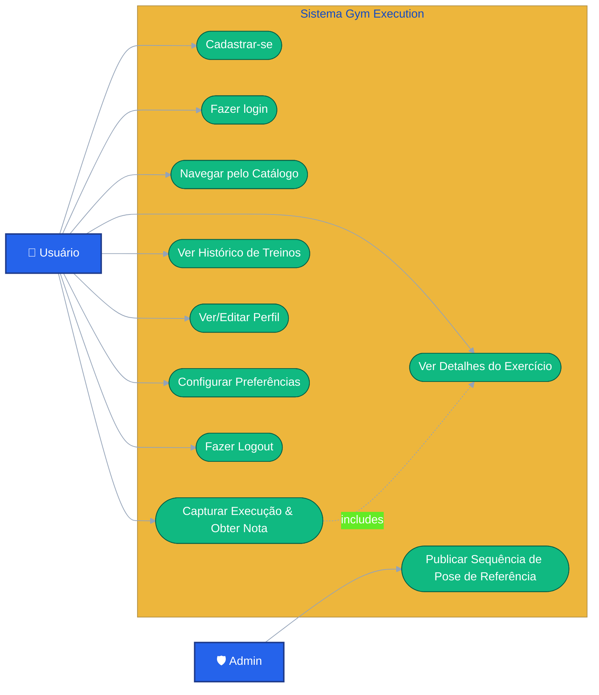
```mermaid
%%{init: {'theme':'base', 'themeVariables': {'primaryColor':'#2563EB','primaryTextColor':'#fff','primaryBorderColor':'#1E40AF','lineColor':'#94A3B8'}}}%%
graph LR
    classDef actor fill:#2563EB,color:#fff,stroke:#1E3A8A,stroke-width:2px;
    classDef usecase fill:#10B981,color:#fff,stroke:#065F46,stroke-width:1px;

    User["🏃 Usuário"]:::actor
    Admin["🛡️ Admin"]:::actor

    subgraph System["Sistema Gym Execution"]
        UC1(["Cadastrar-se"]):::usecase
        UC2(["Fazer login"]):::usecase
        UC3(["Navegar pelo Catálogo"]):::usecase
        UC4(["Ver Detalhes do Exercício"]):::usecase
        UC5(["Capturar Execução & Obter Nota"]):::usecase
        UC6(["Ver Histórico de Treinos"]):::usecase
        UC7(["Ver/Editar Perfil"]):::usecase
        UC8(["Configurar Preferências"]):::usecase
        UC9(["Publicar Sequência de Pose de Referência"]):::usecase
        UC10(["Fazer Logout"]):::usecase
    end

    User --> UC1
    User --> UC2
    User --> UC3
    User --> UC4
    User --> UC5
    User --> UC6
    User --> UC7
    User --> UC8
    User --> UC10
    Admin --> UC9
    UC5 -.includes.-> UC4
```

</details>

### 2. 🧬 Diagrama de Classes

<details>
<summary><strong>Clique para expandir</strong></summary>

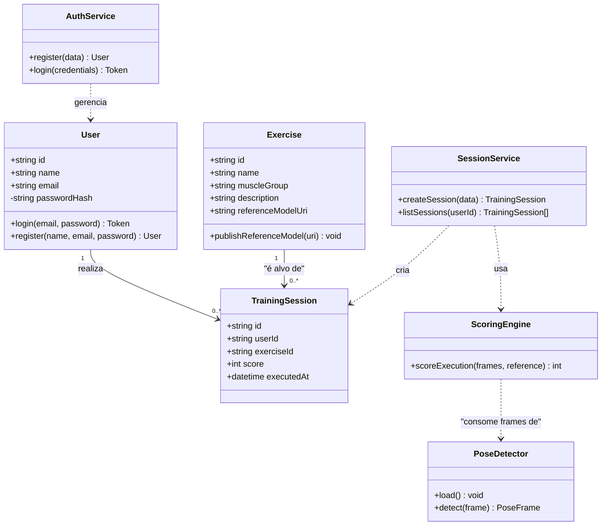
```mermaid
classDiagram
    class User {
        +string id
        +string name
        +string email
        -string passwordHash
        +login(email, password) Token
        +register(name, email, password) User
    }
    class Exercise {
        +string id
        +string name
        +string muscleGroup
        +string description
        +string referenceModelUri
        +publishReferenceModel(uri) void
    }
    class TrainingSession {
        +string id
        +string userId
        +string exerciseId
        +int score
        +datetime executedAt
    }
    class PoseDetector {
        +load() void
        +detect(frame) PoseFrame
    }
    class ScoringEngine {
        +scoreExecution(frames, reference) int
    }
    class AuthService {
        +register(data) User
        +login(credentials) Token
    }
    class SessionService {
        +createSession(data) TrainingSession
        +listSessions(userId) TrainingSession[]
    }

    User "1" --> "0..*" TrainingSession : realiza
    Exercise "1" --> "0..*" TrainingSession : "é alvo de"
    SessionService ..> TrainingSession : cria
    SessionService ..> ScoringEngine : usa
    ScoringEngine ..> PoseDetector : "consome frames de"
    AuthService ..> User : gerencia
```

</details>

### 3. 🧩 Diagrama de Objetos

<details>
<summary><strong>Clique para expandir — exemplo de instâncias em um instante</strong></summary>

```mermaid
classDiagram
    class ana "ana : User" {
        id = "u_001"
        name = "Ana Silva"
        email = "ana@example.com"
    }
    class squat "squat : Exercise" {
        id = "ex_010"
        name = "Squat"
        muscleGroup = "Pernas"
        referenceModelUri = "s3://refs/squat_v2.json"
    }
    class session42 "session42 : TrainingSession" {
        id = "ts_042"
        userId = "u_001"
        exerciseId = "ex_010"
        score = 87
        executedAt = "2026-06-10T18:30:00Z"
    }
    ana --> session42
    squat --> session42
```

</details>

### 4. 🔀 Diagrama de Sequência

<details>
<summary><strong>Clique para expandir — fluxo de execução</strong></summary>

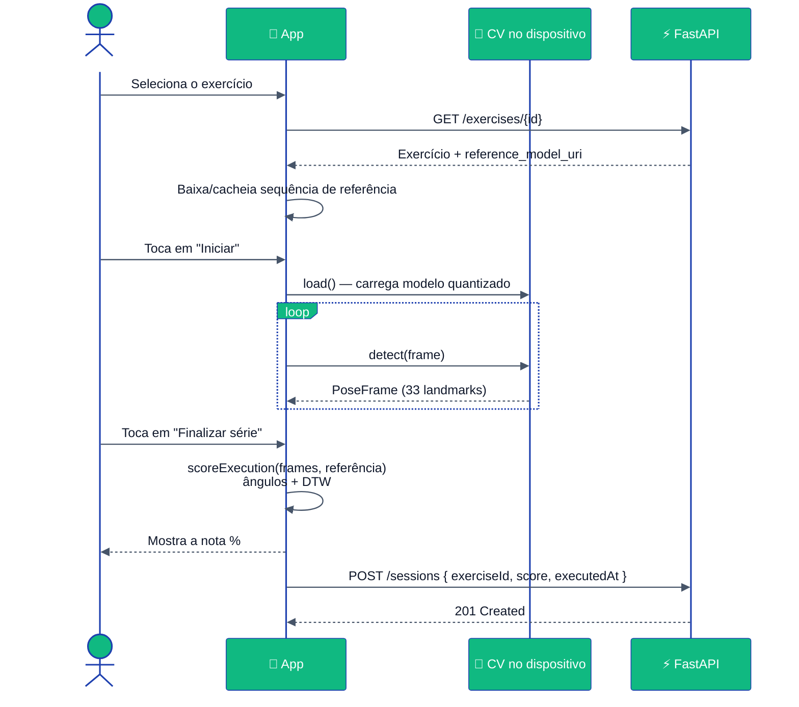
```mermaid
%%{init: {'theme':'base', 'themeVariables': {'primaryColor':'#2563EB','primaryTextColor':'#fff','primaryBorderColor':'#1E40AF','actorBkg':'#10B981','actorTextColor':'#fff','signalColor':'#475569','signalTextColor':'#0f172a'}}}%%
sequenceDiagram
    actor U as 🏃 Usuário
    participant App as 📱 App
    participant CV as 🧠 CV no dispositivo
    participant API as ⚡ FastAPI

    U->>App: Seleciona o exercício
    App->>API: GET /exercises/{id}
    API-->>App: Exercício + reference_model_uri
    App->>App: Baixa/cacheia sequência de referência
    U->>App: Toca em "Iniciar"
    App->>CV: load() — carrega modelo quantizado
    loop ~10 fps durante a gravação
        App->>CV: detect(frame)
        CV-->>App: PoseFrame (33 landmarks)
    end
    U->>App: Toca em "Finalizar série"
    App->>App: scoreExecution(frames, referência)<br/>ângulos + DTW
    App-->>U: Mostra a nota %
    App->>API: POST /sessions { exerciseId, score, executedAt }
    API-->>App: 201 Created
```

</details>

### 5. 🗣️ Diagrama de Comunicação (Colaboração)

<details>
<summary><strong>Clique para expandir</strong></summary>

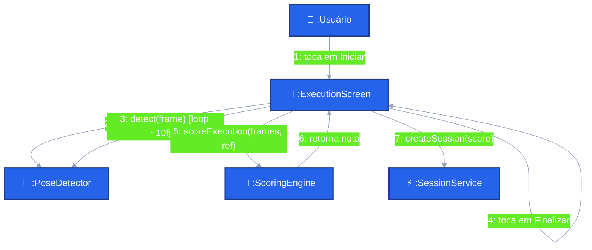
```mermaid
%%{init: {'theme':'base', 'themeVariables': {'primaryColor':'#2563EB','primaryTextColor':'#fff','primaryBorderColor':'#1E40AF','lineColor':'#94A3B8'}}}%%
graph TD
    classDef obj fill:#2563EB,color:#fff,stroke:#1E3A8A,stroke-width:2px;
    U["🏃 :Usuário"]:::obj
    A["📱 :ExecutionScreen"]:::obj
    P["🧠 :PoseDetector"]:::obj
    S["📐 :ScoringEngine"]:::obj
    API["⚡ :SessionService"]:::obj

    U -- "1: toca em Iniciar" --> A
    A -- "2: load()" --> P
    A -- "3: detect(frame) [loop ~10fps]" --> P
    A -- "4: toca em Finalizar" --> A
    A -- "5: scoreExecution(frames, ref)" --> S
    S -- "6: retorna nota" --> A
    A -- "7: createSession(score)" --> API
```

</details>

### 6. 🔁 Diagrama de Atividades

<details>
<summary><strong>Clique para expandir — fluxo de captura e pontuação</strong></summary>

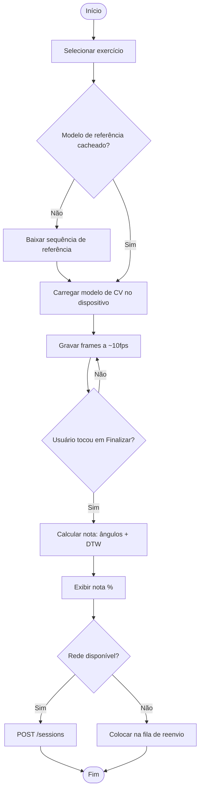
```mermaid
flowchart TD
    Start([Início]) --> SelectEx[Selecionar exercício]
    SelectEx --> CheckRef{Modelo de referência cacheado?}
    CheckRef -- Não --> Download[Baixar sequência de referência]
    Download --> LoadModel[Carregar modelo de CV no dispositivo]
    CheckRef -- Sim --> LoadModel
    LoadModel --> Record["Gravar frames a ~10fps"]
    Record --> Tap{Usuário tocou em Finalizar?}
    Tap -- Não --> Record
    Tap -- Sim --> Score["Calcular nota: ângulos + DTW"]
    Score --> Show[Exibir nota %]
    Show --> Online{Rede disponível?}
    Online -- Sim --> Save["POST /sessions"]
    Online -- Não --> Queue[Colocar na fila de reenvio]
    Save --> End([Fim])
    Queue --> End
```

</details>

### 7. 🚦 Diagrama de Máquina de Estados

<details>
<summary><strong>Clique para expandir — ciclo de vida da sessão de execução</strong></summary>

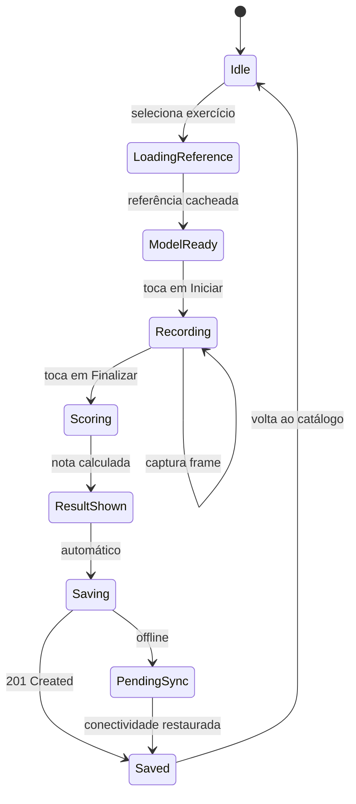
```mermaid
stateDiagram-v2
    [*] --> Idle
    Idle --> LoadingReference : seleciona exercício
    LoadingReference --> ModelReady : referência cacheada
    ModelReady --> Recording : toca em Iniciar
    Recording --> Recording : captura frame
    Recording --> Scoring : toca em Finalizar
    Scoring --> ResultShown : nota calculada
    ResultShown --> Saving : automático
    Saving --> Saved : 201 Created
    Saving --> PendingSync : offline
    PendingSync --> Saved : conectividade restaurada
    Saved --> Idle : volta ao catálogo
```

</details>

### 8. 🧱 Diagrama de Componentes

<details>
<summary><strong>Clique para expandir</strong></summary>

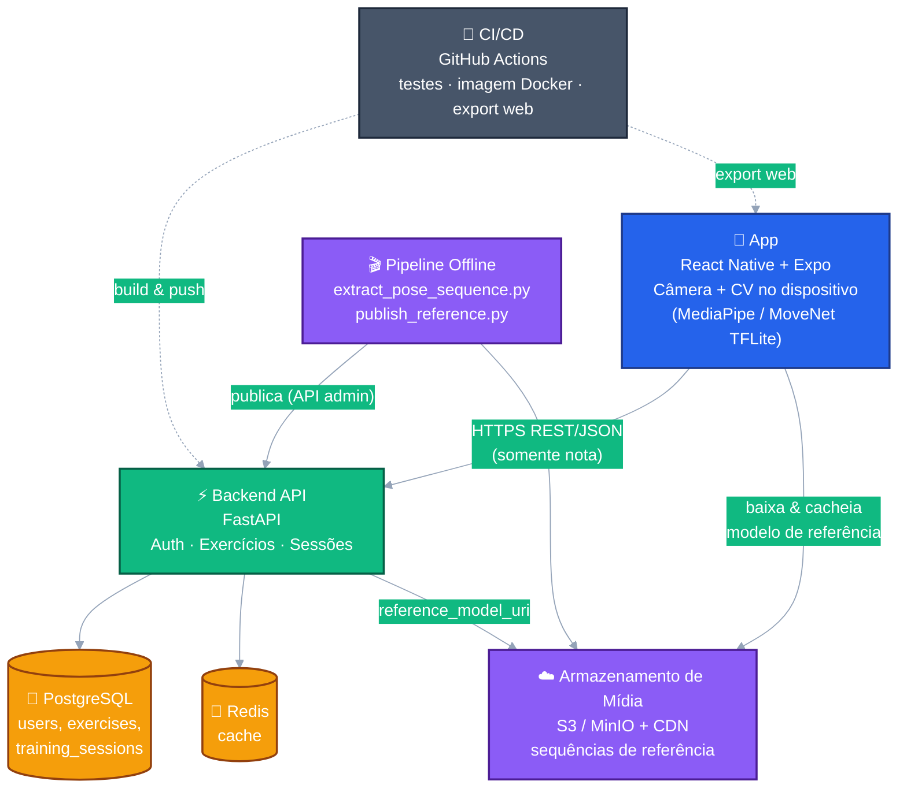
```mermaid
%%{init: {'theme':'base', 'themeVariables': {'primaryColor':'#2563EB','primaryTextColor':'#fff','primaryBorderColor':'#1E40AF','lineColor':'#94A3B8','secondaryColor':'#10B981','tertiaryColor':'#F59E0B'}}}%%
graph TD
    classDef app fill:#2563EB,color:#fff,stroke:#1E3A8A,stroke-width:2px;
    classDef api fill:#10B981,color:#fff,stroke:#065F46,stroke-width:2px;
    classDef data fill:#F59E0B,color:#fff,stroke:#92400E,stroke-width:2px;
    classDef storage fill:#8B5CF6,color:#fff,stroke:#4C1D95,stroke-width:2px;
    classDef ci fill:#475569,color:#fff,stroke:#1E293B,stroke-width:2px;

    A["📱 App<br/>React Native + Expo<br/>Câmera + CV no dispositivo<br/>(MediaPipe / MoveNet TFLite)"]:::app
    B["⚡ Backend API<br/>FastAPI<br/>Auth · Exercícios · Sessões"]:::api
    C[("🐘 PostgreSQL<br/>users, exercises,<br/>training_sessions")]:::data
    D[("🔴 Redis<br/>cache")]:::data
    E["☁️ Armazenamento de Mídia<br/>S3 / MinIO + CDN<br/>sequências de referência"]:::storage
    F["🎬 Pipeline Offline<br/>extract_pose_sequence.py<br/>publish_reference.py"]:::storage
    G["🤖 CI/CD<br/>GitHub Actions<br/>testes · imagem Docker · export web"]:::ci

    A -- "HTTPS REST/JSON\n(somente nota)" --> B
    B --> C
    B --> D
    B -- "reference_model_uri" --> E
    A -- "baixa & cacheia\nmodelo de referência" --> E
    F -- "publica (API admin)" --> B
    F --> E
    G -. "build & push" .-> B
    G -. "export web" .-> A
```

</details>

### 9. 🚀 Diagrama de Implantação (Deployment)

<details>
<summary><strong>Clique para expandir</strong></summary>

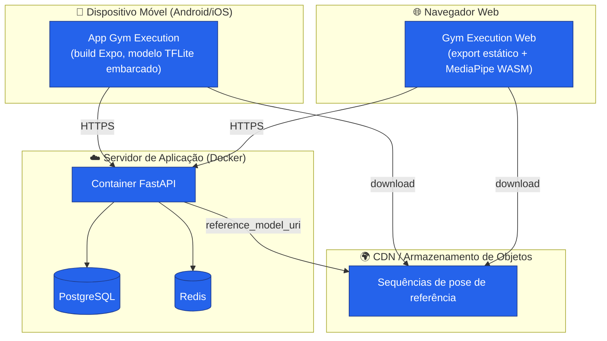
```mermaid
graph TB
    classDef artifact fill:#2563EB,color:#fff,stroke:#1E3A8A,stroke-width:1px;

    subgraph Mobile["📱 Dispositivo Móvel (Android/iOS)"]
        AppArtifact["App Gym Execution\n(build Expo, modelo TFLite embarcado)"]:::artifact
    end
    subgraph Browser["🌐 Navegador Web"]
        WebArtifact["Gym Execution Web\n(export estático + MediaPipe WASM)"]:::artifact
    end
    subgraph Server["☁️ Servidor de Aplicação (Docker)"]
        APIArtifact["Container FastAPI"]:::artifact
        DBArtifact[("PostgreSQL")]:::artifact
        CacheArtifact[("Redis")]:::artifact
    end
    subgraph CDN["🌍 CDN / Armazenamento de Objetos"]
        MediaArtifact["Sequências de pose de referência"]:::artifact
    end

    AppArtifact -- HTTPS --> APIArtifact
    WebArtifact -- HTTPS --> APIArtifact
    APIArtifact --> DBArtifact
    APIArtifact --> CacheArtifact
    AppArtifact -- download --> MediaArtifact
    WebArtifact -- download --> MediaArtifact
    APIArtifact -- reference_model_uri --> MediaArtifact
```

</details>

### 10. 📦 Diagrama de Pacotes

<details>
<summary><strong>Clique para expandir</strong></summary>

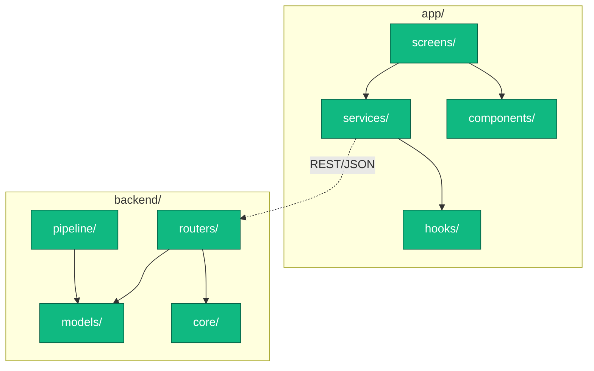
```mermaid
graph TD
    classDef pkg fill:#10B981,color:#fff,stroke:#065F46,stroke-width:1px;
    subgraph AppPkg["app/"]
        Screens["screens/"]:::pkg
        Services["services/"]:::pkg
        Hooks["hooks/"]:::pkg
        Components["components/"]:::pkg
    end
    subgraph BackendPkg["backend/"]
        Routers["routers/"]:::pkg
        Models["models/"]:::pkg
        CoreP["core/"]:::pkg
        Pipeline["pipeline/"]:::pkg
    end
    Screens --> Services
    Screens --> Components
    Services --> Hooks
    Routers --> Models
    Routers --> CoreP
    Pipeline --> Models
    Services -. "REST/JSON" .-> Routers
```

</details>

### 11. 🧩 Diagrama de Estrutura Composta

<details>
<summary><strong>Clique para expandir — estrutura interna do componente de CV no dispositivo</strong></summary>

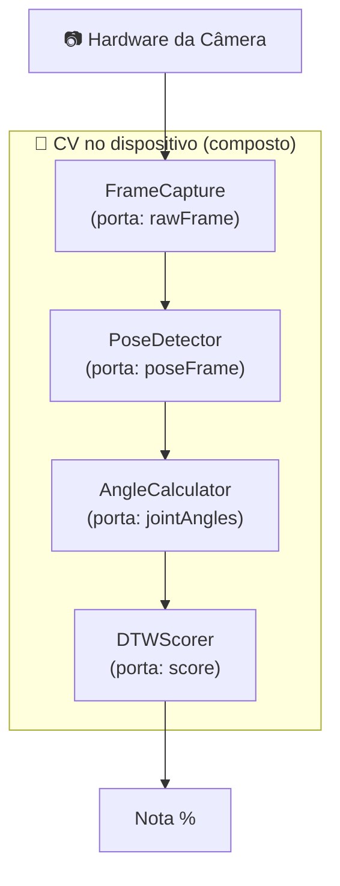
```mermaid
graph TB
    subgraph CV["🧠 CV no dispositivo (composto)"]
        direction TB
        FC["FrameCapture\n(porta: rawFrame)"]
        PD["PoseDetector\n(porta: poseFrame)"]
        AC["AngleCalculator\n(porta: jointAngles)"]
        DTW["DTWScorer\n(porta: score)"]
        FC --> PD --> AC --> DTW
    end
    Camera["📷 Hardware da Câmera"] --> FC
    DTW --> Result["Nota %"]
```

</details>

### 12. 🗺️ Diagrama de Visão Geral de Interação

<details>
<summary><strong>Clique para expandir — fluxo de alto nível entre casos de uso</strong></summary>

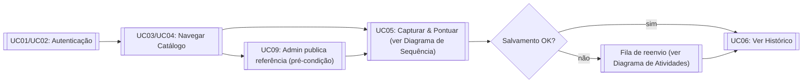
```mermaid
flowchart LR
    A[["UC01/UC02: Autenticação"]] --> B[["UC03/UC04: Navegar Catálogo"]]
    B --> C[["UC05: Capturar & Pontuar (ver Diagrama de Sequência)"]]
    C --> D{Salvamento OK?}
    D -- sim --> E[["UC06: Ver Histórico"]]
    D -- não --> F[["Fila de reenvio (ver Diagrama de Atividades)"]]
    F --> E
    B --> G[["UC09: Admin publica referência (pré-condição)"]]
    G --> C
```

</details>

### 13. ⏱️ Diagrama de Tempo (Timing)

<details>
<summary><strong>Clique para expandir — tempos aproximados de uma sessão de captura</strong></summary>


```mermaid
gantt
    dateFormat  X
    axisFormat %Ss
    title Captura de Execução — Tempos (aprox., uma série)
    section Estado do App
    Idle                       :done, idle, 0, 1s
    Carregando Referência      :active, load, 1, 1s
    Gravando (~10 fps)         : rec, 2, 15s
    Pontuando (ângulos+DTW)    : score, 17, 1s
    Resultado Exibido          : result, 18, 3s
    Salvando                   : saving, 21, 1s
```

</details>

---

## 6️⃣ Modelo de Dados & Dicionário de Dados

### 🗺️ Modelo Conceitual de Dados

<details>
<summary><strong>Clique para expandir — apenas entidades & relacionamentos</strong></summary>

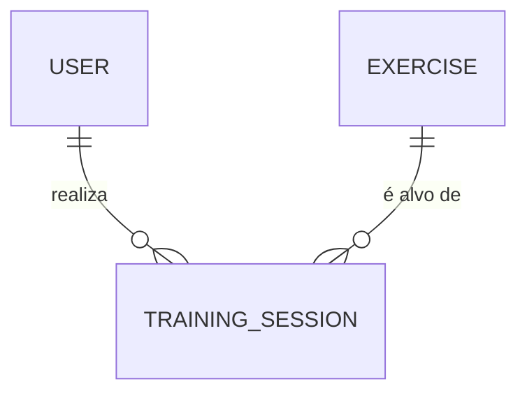
```mermaid
erDiagram
    USER ||--o{ TRAINING_SESSION : realiza
    EXERCISE ||--o{ TRAINING_SESSION : "é alvo de"
```

</details>

### 🧮 Modelo Lógico de Dados

<details>
<summary><strong>Clique para expandir — entidades, atributos & tipos (independente de plataforma)</strong></summary>

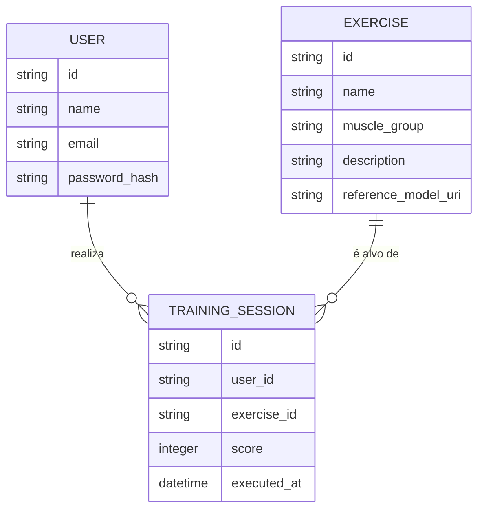
```mermaid
erDiagram
    USER {
        string id
        string name
        string email
        string password_hash
    }
    EXERCISE {
        string id
        string name
        string muscle_group
        string description
        string reference_model_uri
    }
    TRAINING_SESSION {
        string id
        string user_id
        string exercise_id
        integer score
        datetime executed_at
    }
    USER ||--o{ TRAINING_SESSION : realiza
    EXERCISE ||--o{ TRAINING_SESSION : "é alvo de"
```

</details>

### 🐘 Modelo Físico de Dados / DER (PostgreSQL)

<details>
<summary><strong>Clique para expandir — tipos, chaves & constraints do PostgreSQL</strong></summary>

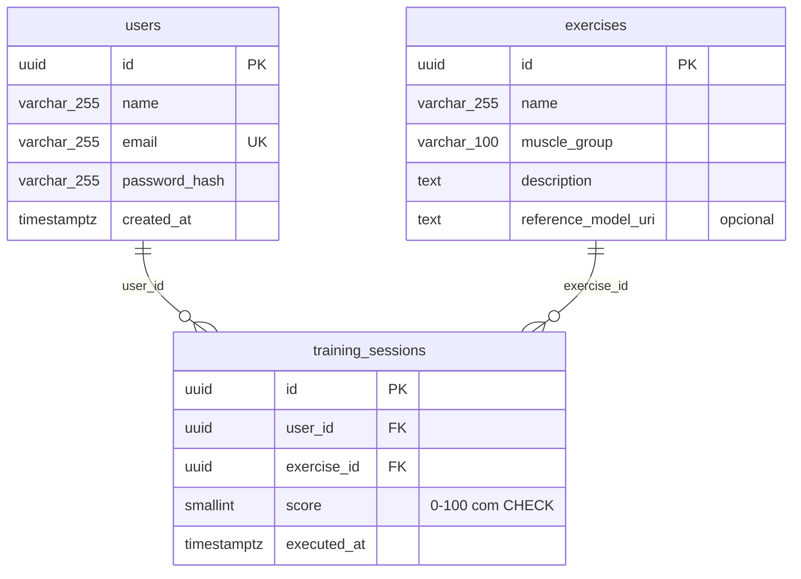
```mermaid
erDiagram
    users {
        uuid id PK
        varchar_255 name
        varchar_255 email UK
        varchar_255 password_hash
        timestamptz created_at
    }
    exercises {
        uuid id PK
        varchar_255 name
        varchar_100 muscle_group
        text description
        text reference_model_uri "opcional"
    }
    training_sessions {
        uuid id PK
        uuid user_id FK
        uuid exercise_id FK
        smallint score "0-100 com CHECK"
        timestamptz executed_at
    }
    users ||--o{ training_sessions : "user_id"
    exercises ||--o{ training_sessions : "exercise_id"
```

</details>

### 📖 Dicionário de Dados

<details>
<summary><strong>Clique para expandir — dicionário completo a nível de coluna</strong></summary>

| Tabela | Coluna | Tipo | Constraints | Descrição |
|---|---|---|---|---|
| `users` | `id` | `uuid` | PK, default `gen_random_uuid()` | Identificador único do usuário |
| `users` | `name` | `varchar(255)` | NOT NULL | Nome de exibição |
| `users` | `email` | `varchar(255)` | UNIQUE, NOT NULL | Identificador de login |
| `users` | `password_hash` | `varchar(255)` | NOT NULL | Hash bcrypt/argon2 — nunca texto puro |
| `users` | `created_at` | `timestamptz` | NOT NULL, default `now()` | Data/hora de criação da conta |
| `exercises` | `id` | `uuid` | PK, default `gen_random_uuid()` | Identificador único do exercício |
| `exercises` | `name` | `varchar(255)` | NOT NULL | Nome do exercício (ex.: "Squat") |
| `exercises` | `muscle_group` | `varchar(100)` | NOT NULL | Ex.: "Pernas", "Costas", "Peito" |
| `exercises` | `description` | `text` | NULLABLE | Instruções em texto livre |
| `exercises` | `reference_model_uri` | `text` | NULLABLE | URI da sequência de pose de referência publicada (definida via endpoint admin) |
| `training_sessions` | `id` | `uuid` | PK, default `gen_random_uuid()` | Identificador único da execução |
| `training_sessions` | `user_id` | `uuid` | FK → `users.id`, NOT NULL | Dono da execução |
| `training_sessions` | `exercise_id` | `uuid` | FK → `exercises.id`, NOT NULL | Exercício realizado |
| `training_sessions` | `score` | `smallint` | NOT NULL, `CHECK (score BETWEEN 0 AND 100)` | Nota de similaridade (ângulos + DTW) |
| `training_sessions` | `executed_at` | `timestamptz` | NOT NULL | Quando a série foi realizada |

</details>

---

## 7️⃣ Diagrama de Fluxo de Dados (DFD)

### DFD — Nível 0 (Contexto)

<details>
<summary><strong>Clique para expandir</strong></summary>

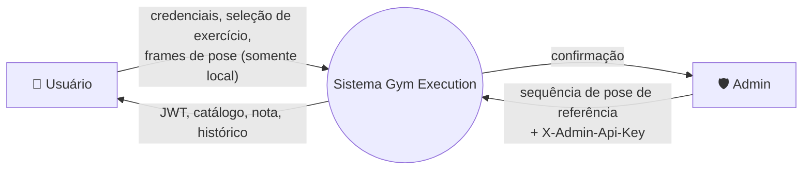
```mermaid
flowchart LR
    User["🏃 Usuário"] -- "credenciais, seleção de exercício,\nframes de pose (somente local)" --> Sys((Sistema Gym Execution))
    Admin["🛡️ Admin"] -- "sequência de pose de referência\n+ X-Admin-Api-Key" --> Sys
    Sys -- "JWT, catálogo, nota, histórico" --> User
    Sys -- "confirmação" --> Admin
```

</details>

### DFD — Nível 1 (Processos Decompostos)

<details>
<summary><strong>Clique para expandir</strong></summary>

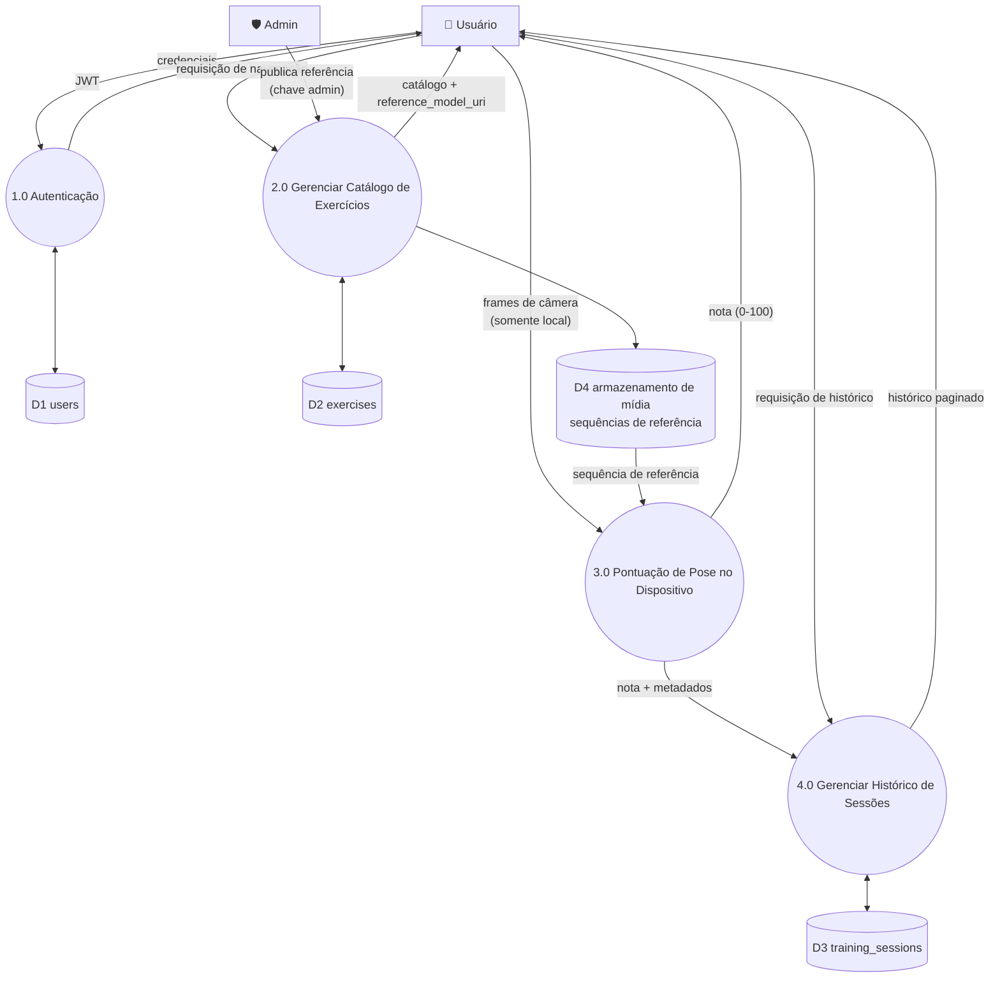
```mermaid
flowchart TD
    User["🏃 Usuário"]
    Admin["🛡️ Admin"]
    P1((1.0 Autenticação))
    P2((2.0 Gerenciar Catálogo de Exercícios))
    P3((3.0 Pontuação de Pose no Dispositivo))
    P4((4.0 Gerenciar Histórico de Sessões))
    D1[("D1 users")]
    D2[("D2 exercises")]
    D3[("D3 training_sessions")]
    D4[("D4 armazenamento de mídia\nsequências de referência")]

    User -- credenciais --> P1
    P1 -- JWT --> User
    P1 <--> D1

    User -- "requisição de navegação" --> P2
    P2 -- "catálogo + reference_model_uri" --> User
    P2 <--> D2
    Admin -- "publica referência\n(chave admin)" --> P2
    P2 --> D4

    User -- "frames de câmera\n(somente local)" --> P3
    D4 -- "sequência de referência" --> P3
    P3 -- "nota (0-100)" --> User
    P3 -- "nota + metadados" --> P4

    P4 <--> D3
    User -- "requisição de histórico" --> P4
    P4 -- "histórico paginado" --> User
```

</details>

### 🧬 Diagrama de Linhagem de Dados (Data Lineage)

<details>
<summary><strong>Clique para expandir — o que acontece com os dados, da câmera ao banco</strong></summary>

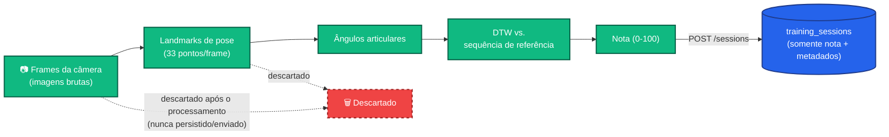
```mermaid
flowchart LR
    classDef device fill:#10B981,color:#fff,stroke:#065F46,stroke-width:2px;
    classDef server fill:#2563EB,color:#fff,stroke:#1E3A8A,stroke-width:2px;
    classDef discard fill:#EF4444,color:#fff,stroke:#991B1B,stroke-width:2px,stroke-dasharray:5 5;

    Camera["📷 Frames da câmera\n(imagens brutas)"]:::device --> PoseDet["Landmarks de pose\n(33 pontos/frame)"]:::device
    PoseDet --> Angles["Ângulos articulares"]:::device
    Angles --> DTWCalc["DTW vs.\nsequência de referência"]:::device
    DTWCalc --> Score["Nota (0-100)"]:::device
    Camera -. "descartado após o processamento\n(nunca persistido/enviado)" .-> Discard["🗑️ Descartado"]:::discard
    PoseDet -. descartado .-> Discard
    Score -- "POST /sessions" --> DB[("training_sessions\n(somente nota + metadados)")]:::server
```

> 🔐 Este diagrama é a prova visual dos requisitos de privacidade
> **RN04 / RNF02 / domínio**: os frames brutos da câmera e os landmarks
> de pose são processados inteiramente no dispositivo e descartados —
> apenas a nota numérica final e o timestamp atravessam a rede.

</details>

---

## 8️⃣ Diagrama de Arquitetura & Fluxograma

### 🏛️ Visão Geral da Arquitetura (Camadas)

<details>
<summary><strong>Clique para expandir</strong></summary>

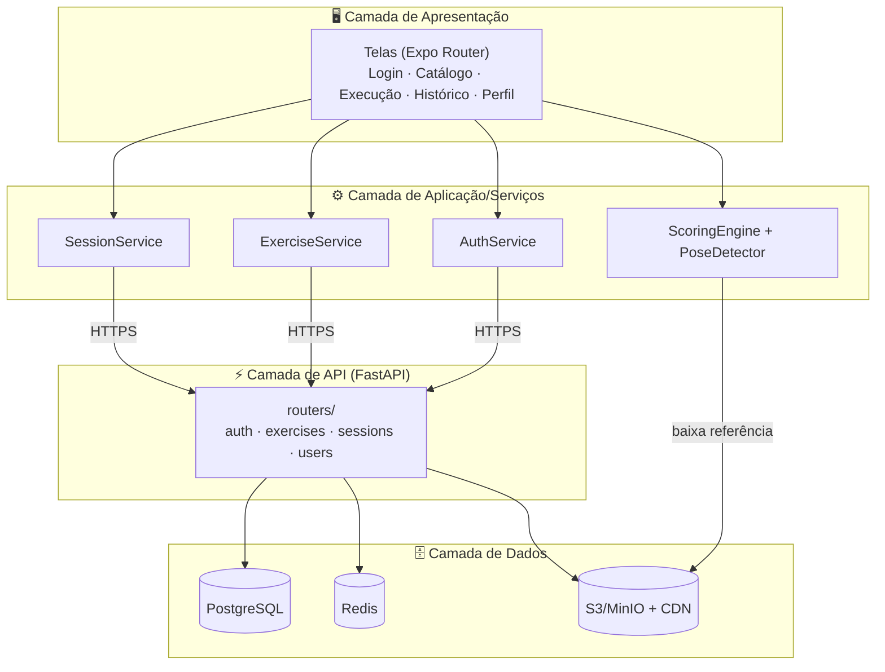
```mermaid
flowchart TB
    subgraph Presentation["🖥️ Camada de Apresentação"]
        Screens["Telas (Expo Router)\nLogin · Catálogo · Execução · Histórico · Perfil"]
    end
    subgraph Application["⚙️ Camada de Aplicação/Serviços"]
        AuthSvc["AuthService"]
        ExerciseSvc["ExerciseService"]
        ScoringSvc["ScoringEngine + PoseDetector"]
        SessionSvc["SessionService"]
    end
    subgraph API["⚡ Camada de API (FastAPI)"]
        Routers["routers/\nauth · exercises · sessions · users"]
    end
    subgraph DataLayer["🗄️ Camada de Dados"]
        Postgres[("PostgreSQL")]
        Redis[("Redis")]
        Media[("S3/MinIO + CDN")]
    end

    Screens --> AuthSvc
    Screens --> ExerciseSvc
    Screens --> ScoringSvc
    Screens --> SessionSvc
    AuthSvc -- HTTPS --> Routers
    ExerciseSvc -- HTTPS --> Routers
    SessionSvc -- HTTPS --> Routers
    ScoringSvc -- "baixa referência" --> Media
    Routers --> Postgres
    Routers --> Redis
    Routers --> Media
```

> Veja também o **Diagrama de Componentes** e o **Diagrama de Implantação**
> em [Diagramas UML & Estruturais](#5️⃣-diagramas-uml--estruturais)
> (itens 8 e 9).

</details>

### 🔀 Fluxograma Geral de Navegação

<details>
<summary><strong>Clique para expandir — fluxo de telas do app</strong></summary>

```mermaid
flowchart TD
    Launch([Abertura do App]) --> HasToken{JWT válido armazenado?}
    HasToken -- Sim --> Home[Home / Catálogo de Exercícios]
    HasToken -- Não --> Auth{Cadastrar ou Entrar?}
    Auth -- Cadastrar --> RegForm[Formulário de Cadastro] --> Home
    Auth -- Entrar --> LoginForm[Formulário de Login] --> Home
    Home --> SelectExercise[Selecionar Exercício]
    SelectExercise --> Execution["Tela de Execução\n(captura + nota)"]
    Execution --> Result[Tela de Resultado]
    Result --> Decision{O que fazer agora?}
    Decision -- "Treinar de novo" --> Home
    Decision -- "Ver histórico" --> History[Tela de Histórico]
    Decision -- "Ver perfil" --> Profile["Perfil / Preferências"]
    History --> Home
    Profile --> Logout{Fazer logout?}
    Logout -- Sim --> Launch
    Logout -- Não --> Home
```

</details>

---

## 9️⃣ Persona & Mapa de Jornada do Usuário

### 👤 Personas

<details>
<summary><strong>Clique para expandir — personas primárias</strong></summary>

| | 🏃 Ana Silva — Usuária Primária | 🛡️ Carlos Mendes — Admin/Treinador |
|---|---|---|
| **Idade** | 28 | 41 |
| **Ocupação** | Analista de marketing, treina em casa | Personal trainer / treinador de academia |
| **Conforto com tecnologia** | Médio — usa apps diariamente, não gosta de configurações complexas | Médio-alto — confortável com ferramentas admin |
| **Objetivos** | Treinar corretamente sem um treinador presente; acompanhar o progresso ao longo do tempo | Curar um catálogo de exercícios confiável com movimentos de referência precisos |
| **Frustrações** | Não sabe se a postura está correta; medo de se machucar | Não consegue supervisionar a postura de todos os alunos remotamente |
| **Dispositivo** | Android com 3 anos de uso (~3GB de RAM) | Android intermediário + notebook |
| **Frase** | *"Eu só quero saber se estou fazendo o agachamento corretamente — agora, não depois de uma chamada de vídeo com meu treinador."* | *"Se eu gravar uma repetição perfeita, todo mundo que treinar esse exercício se beneficia."* |

</details>

### 🗺️ Mapa de Jornada do Usuário

<details>
<summary><strong>Clique para expandir — jornada do primeiro treino da Ana</strong></summary>

| Etapa | Descoberta & Cadastro | Navegar Catálogo | Gravar Execução | Receber Nota | Revisar Histórico |
|---|---|---|---|---|---|
| **Ações** | Ouve falar do app, baixa, se cadastra (RF01) | Navega pelos exercícios por grupo muscular (RF02) | Seleciona "Squat", toca em Iniciar, executa a série (RF03) | Vê a nota % imediatamente (RF05) | Abre o histórico, vê sessões anteriores (RF06) |
| **Pontos de Contato** | App store, Tela de Cadastro | Tela de Catálogo | Tela de Execução + câmera | Tela de Resultado | Tela de Histórico |
| **Pensamentos** | "É gratuito? Meus dados estão seguros?" | "De quais exercícios eu preciso?" | "Estou posicionada corretamente para a câmera?" | "78%? O que eu fiz de errado?" | "Estou melhorando semana a semana?" |
| **Emoções** | 🙂 Curiosa | 🙂 Engajada | 😐 Levemente ansiosa | 😀 Motivada | 😀 Confiante |
| **Pontos de Dor** | Preocupação com privacidade no acesso à câmera | Muitos exercícios sem filtros | Precisa de boa iluminação/espaço para a câmera | Nota sem feedback detalhado sobre o *porquê* | Histórico pode ter poucas sessões no início |
| **Oportunidades** | Destacar a mensagem de privacidade desde o design (RN04) | Adicionar filtros por grupo muscular | Guia de enquadramento de câmera no app | Futuro: feedback detalhado por articulação | Adicionar sequências/tendências para reter o usuário |

```mermaid
journey
    title Jornada da Ana — Primeiro Treino com o Gym Execution
    section Descoberta & Cadastro
      Ouve falar do app por uma amiga: 3: Ana
      Baixa & se cadastra: 4: Ana
    section Primeira Execução
      Navega pelo catálogo de exercícios: 4: Ana
      Seleciona "Squat": 5: Ana
      Grava uma série: 4: Ana
      Vê a nota (78%): 5: Ana
    section Construindo o Hábito
      Revisa o histórico após uma semana: 4: Ana
      Percebe a nota melhorando: 5: Ana
```

</details>

---

## 🔟 Wireframes & Mockups

### 📐 Wireframes (baixa fidelidade)

<details>
<summary><strong>Clique para expandir — Login</strong></summary>

```
┌─────────────────────────────┐
│        🏋️ Gym Execution      │
│                               │
│  E-mail                       │
│  ┌─────────────────────────┐ │
│  │ voce@exemplo.com         │ │
│  └─────────────────────────┘ │
│  Senha                        │
│  ┌─────────────────────────┐ │
│  │ ••••••••••              │ │
│  └─────────────────────────┘ │
│                               │
│  ┌─────────────────────────┐ │
│  │          Entrar           │ │
│  └─────────────────────────┘ │
│                               │
│      Não tem uma conta?       │
│            Cadastre-se        │
└─────────────────────────────┘
```

</details>

<details>
<summary><strong>Clique para expandir — Catálogo de Exercícios</strong></summary>

```
┌─────────────────────────────┐
│ ☰  Exercícios            👤  │
├─────────────────────────────┤
│ 🔍 Buscar...                  │
├─────────────────────────────┤
│ Pernas                         │
│  ▸ Squat            ⭐ pronto │
│  ▸ Lunge            ⏳ em breve│
│ Costas                         │
│  ▸ Deadlift          ⭐ pronto │
│ Peito                           │
│  ▸ Push-up           ⭐ pronto │
├─────────────────────────────┤
│ 🏠 Início  📜 Histórico  👤 Perfil │
└─────────────────────────────┘
```

</details>

<details>
<summary><strong>Clique para expandir — Execução (Câmera + Captura)</strong></summary>

```
┌─────────────────────────────┐
│  ←  Squat               ⚙️    │
├─────────────────────────────┤
│                               │
│    [ Preview da Câmera ]      │
│   overlay do esqueleto 🟢     │
│                               │
│  Rep 3 · capturando ~10 fps   │
├─────────────────────────────┤
│        ┌─────────────┐        │
│        │ ⏺ Finalizar  │        │
│        └─────────────┘        │
└─────────────────────────────┘
```

</details>

<details>
<summary><strong>Clique para expandir — Resultado</strong></summary>

```
┌─────────────────────────────┐
│  Resultado — Squat             │
├─────────────────────────────┤
│                               │
│            78%                │
│   ████████████░░░░░░          │
│  "Boa execução! Cuide do       │
│   alinhamento do joelho."      │
│                               │
│ ┌────────────┐ ┌────────────┐ │
│ │Treinar de  │ │Ver Histórico│ │
│ │novo        │ │            │ │
│ └────────────┘ └────────────┘ │
└─────────────────────────────┘
```

</details>

<details>
<summary><strong>Clique para expandir — Histórico</strong></summary>

```
┌─────────────────────────────┐
│  Histórico                     │
├─────────────────────────────┤
│ Squat        2026-06-10  78%  │
│ Deadlift     2026-06-09  85%  │
│ Push-up      2026-06-08  91%  │
│ Squat        2026-06-07  72%  │
├─────────────────────────────┤
│       ◀  Página 1 de 4  ▶      │
└─────────────────────────────┘
```

</details>

### 🎨 Especificação de Mockup (guia de alta fidelidade)

<details>
<summary><strong>Clique para expandir — design tokens & notas por tela</strong></summary>

| Token | Valor | Uso |
|---|---|---|
| 🔵 Primária | `#2563EB` | Botões primários, links, ícone de navegação ativo |
| 🟢 Secundária | `#10B981` | Estados de sucesso, badge "pronto", esqueleto do overlay de pose |
| 🟠 Destaque | `#F59E0B` | Avisos, destaques de progresso |
| ⚫ Fundo modo escuro | `#0F172A` | Fundo no tema escuro (preferência RF08) |
| ⚪ Fundo modo claro | `#F8FAFC` | Fundo no tema claro |
| 🔤 Fonte | Padrão do sistema (San Francisco / Roboto) | Todos os textos, para visual nativo |

| Tela | Notas do Mockup |
|---|---|
| **Login/Cadastro** | Card centralizado, botão de CTA na cor primária, link para alternar entre Login/Cadastro |
| **Catálogo** | Lista agrupada por `muscle_group`, badge "pronto" (🟢) quando `reference_model_uri` está definido, badge "em breve" (🟠) caso contrário |
| **Execução** | Preview da câmera em tela cheia, overlay do esqueleto semitransparente na cor secundária, botão circular grande "Finalizar" |
| **Resultado** | Porcentagem grande na cor primária, barra de progresso horizontal (gradiente secundária→destaque conforme a nota), dois botões de CTA |
| **Histórico** | Lista em ordem cronológica inversa, nota exibida como pílula colorida (verde ≥80, âmbar 50–79, vermelho <50) |
| **Perfil/Preferências** | Switches para qualidade da câmera, som de feedback, modo escuro (todos somente locais, conforme DAT06) |

</details>

---

## 🧰 Stack Tecnológica

| Camada | Tecnologia | Justificativa |
|---|---|---|
| 📱 App híbrido | **React Native + Expo (SDK 51)**, TypeScript | Codebase único para Android/iOS/Web, ótimo suporte a câmera |
| 🧠 CV no dispositivo (web) | **`@mediapipe/tasks-vision`** (WASM) | Pose Landmarker oficial do Google, roda no navegador |
| 🧠 CV no dispositivo (mobile) | **MoveNet Lightning INT8** via **`react-native-fast-tflite`** | Modelo quantizado de ~3MB, rápido em dispositivos modestos |
| 🖼️ Pré-processamento de imagem (mobile) | **`expo-camera`**, **`expo-image-manipulator`**, **`jpeg-js`** | Captura, recorte/resize, decodificação para tensor RGB |
| ⚡ Backend / API | **Python 3.12 + FastAPI** | Rápido, tipado (Pydantic), padrão de mercado |
| 🗄️ Banco de dados | **PostgreSQL 16** | Relacional, robusto, padrão para dados de usuários/treinos |
| 🚀 Cache | **Redis 7** | Consultas repetidas com baixa latência |
| 📦 Armazenamento de mídia | **S3-compatível (AWS S3 / MinIO) + CDN** | Vídeos de referência e sequências de pose cacheadas |
| 🐳 Containerização | **Docker** (multi-stage, non-root) | Deploys reprodutíveis |
| 🤖 CI/CD | **GitHub Actions** | Testes, publicação de imagem Docker (ghcr.io), export web |
| 📲 Build/distribuição mobile | **EAS (Expo Application Services)** | Builds nativos (`expo-dev-client` necessário para o TFLite) |
| 🧪 Testes | **Pytest** (backend) / **Jest** (frontend) | Padrão de mercado |
| 🛠️ Migrations de BD | **Alembic** | Versionamento de schema |
| 🛡️ Rate limiting | **slowapi** | Protege os endpoints de autenticação |

> ⚠️ **Cuidado com supply-chain**: instale apenas de registries oficiais
> (PyPI/npm), confira se o nome do pacote é exatamente o oficial (evite
> typosquatting), revise os lockfiles gerados e prefira versões fixadas
> em produção. Veja [Segurança & Supply Chain](#-segurança--supply-chain).

## 📂 Estrutura do Repositório

| Diretório | O que é | Docs |
|---|---|---|
| [`app/`](app/) | App React Native + Expo (mobile + web): telas, captura de câmera, pontuação de pose | [app/README.md](app/README.md) |
| [`backend/`](backend/) | API FastAPI: autenticação, catálogo de exercícios, histórico de sessões | [backend/README.md](backend/README.md) |
| [`backend/pipeline/`](backend/pipeline/) | Pipeline offline: vídeo de referência → sequência de pose → publicação | [backend/pipeline/README.md](backend/pipeline/README.md) |
| [`.github/workflows/`](.github/workflows/) | Pipelines de CI/CD (testes, build de imagem, export web) | — |

## 🚀 Como Rodar

```bash
# 1) Backend (API)
cd backend
cp .env.example .env            # preencha os valores locais
python -m venv .venv && . .venv/Scripts/activate
pip install -r requirements.txt
alembic upgrade head
uvicorn app.main:app --reload

# 2) App (em outro terminal)
cd app
cp .env.example .env            # aponte EXPO_PUBLIC_API_BASE_URL para a API acima
npm ci
npx expo start
```

Infraestrutura local opcional (Postgres + Redis) via Docker:

```bash
docker compose up -d
```

## 🔌 Endpoints da API

| Método | Caminho | Descrição | Auth |
|---|---|---|---|
| `POST` | `/auth/register` | Cadastra um novo usuário | — |
| `POST` | `/auth/login` | Login, retorna JWT | — |
| `GET` | `/exercises` | Lista o catálogo de exercícios | 🔑 |
| `GET` | `/exercises/{id}` | Detalhes de um exercício | 🔑 |
| `PUT` | `/exercises/{id}/reference-model` | Publica a URI da sequência de referência | 🛡️ Admin |
| `GET` | `/sessions` | Lista as sessões de treino do usuário (paginado) | 🔑 |
| `POST` | `/sessions` | Registra o resultado de uma sessão de treino | 🔑 |
| `GET` | `/users/me` | Obtém o perfil do usuário autenticado | 🔑 |
| `PUT` | `/users/me` | Atualiza o perfil do usuário autenticado | 🔑 |

## 🧪 Testes & CI/CD

```bash
# Backend
cd backend && pytest

# App
cd app && npm test
```

O [`.github/workflows/ci.yml`](.github/workflows/ci.yml) roda as duas
suítes a cada push/PR para `main`, builda e publica a imagem Docker da
API no `ghcr.io`, exporta o app web e (sob agendamento/manual) roda uma
suíte de integração contra um PostgreSQL real.

## 🚢 Deploy

- **Backend**: containerizado via [`backend/Dockerfile`](backend/Dockerfile)
  (multi-stage, non-root, roda `alembic upgrade head` na inicialização).
  Pensado para um host gerenciado de Postgres/Redis (Railway, Render,
  Fly.io) — provedor ainda não escolhido (job `deploy-backend` é um
  placeholder).
- **App (mobile)**: builds nativos via **EAS** (`app/eas.json`), requer
  `expo-dev-client` por causa dos módulos nativos de CV.
- **App (web)**: export estático via `npx expo export --platform web`,
  pronto para qualquer hospedagem estática (Cloudflare Pages, Netlify,
  Vercel, S3+CDN).

Detalhes completos nos READMEs do [app](app/README.md) e do
[backend](backend/README.md).

## 🔒 Segurança & Supply Chain

- ⚠️ Como já visto em pacotes maliciosos do npm/PyPI: antes de instalar
  qualquer dependência, confira se o **nome exato** corresponde ao
  pacote oficial (evite typosquatting), revise o lockfile gerado e
  prefira instaladores que respeitem o lockfile (`npm ci`,
  `pip install -r requirements.txt --require-hashes`).
- 🔐 Arquivos `.env` **nunca** são commitados — veja `.env.example` em
  `app/` e `backend/`, e o [`.gitignore`](.gitignore).
- 🔑 `JWT_SECRET_KEY`/`ADMIN_API_KEY` de produção devem ser gerados do
  zero (`python -c "import secrets; print(secrets.token_urlsafe(64))"`)
  e armazenados como secrets de deploy/CI — nunca reaproveitados do
  ambiente de desenvolvimento.
- 📦 Modelos de ML (`.tflite`/`.task`) são baixados apenas de fontes
  oficiais (TensorFlow Hub, Google AI Edge / MediaPipe), com checksums
  verificados quando disponíveis.
