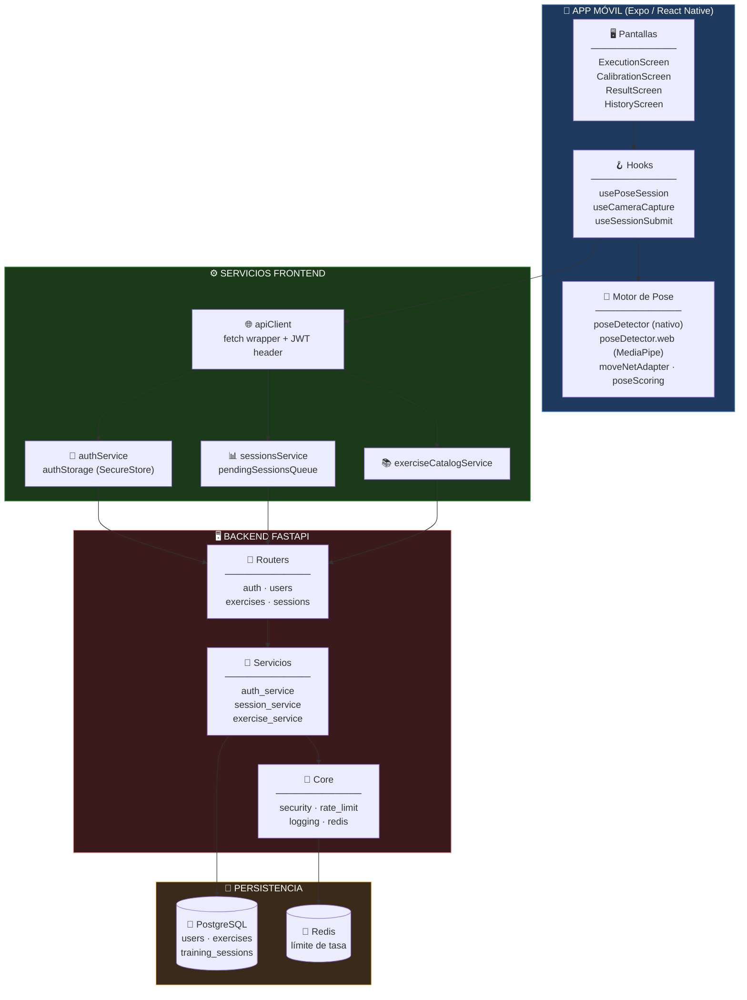
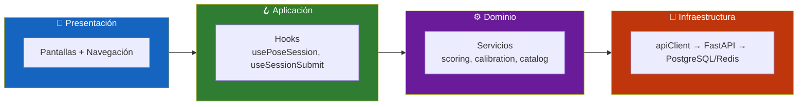
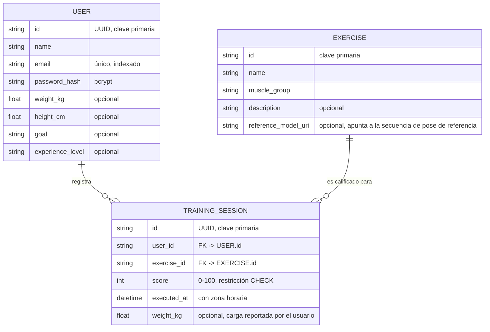
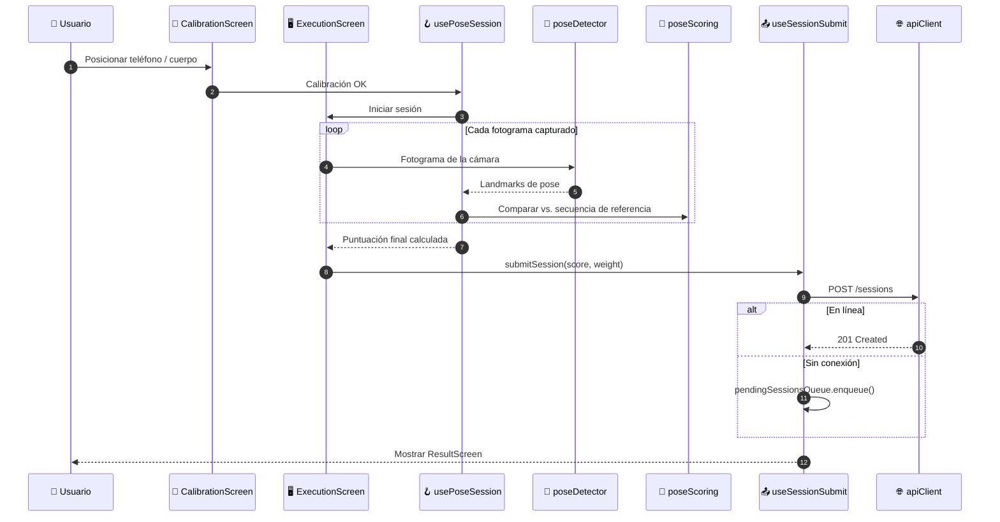
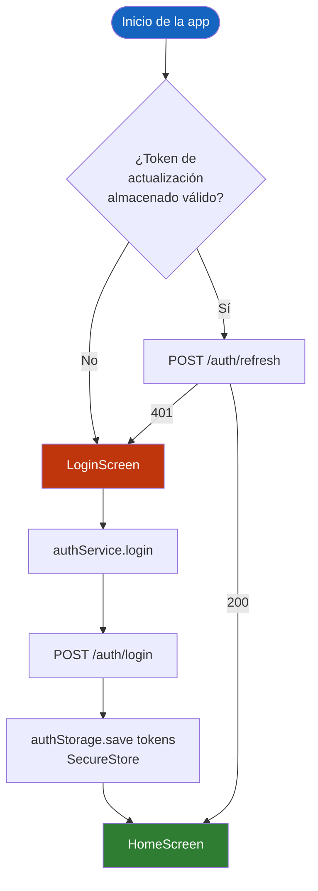
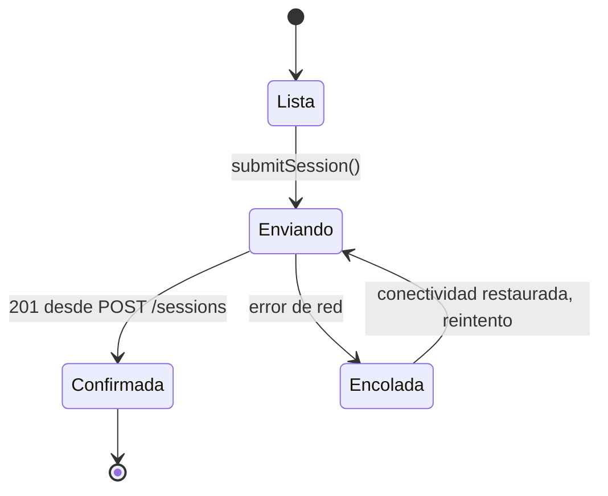
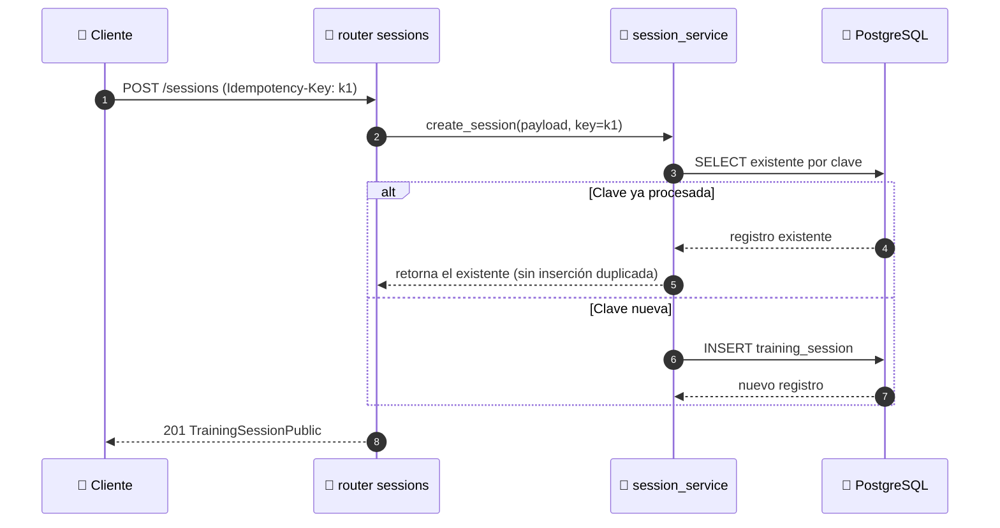
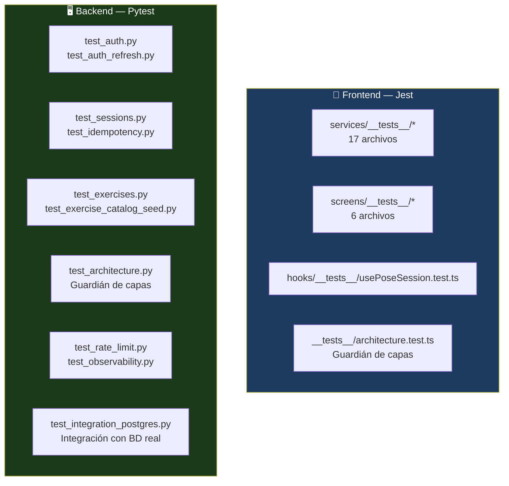

<div align="center">

**🌐 Choose Language / Selecione o Idioma / Elija el Idioma**

[](README.md)&nbsp;&nbsp;&nbsp;[](README_PT.md)&nbsp;&nbsp;&nbsp;[](README_ES.md)

</div>

---

<div align="center">

```
 ██████╗██╗   ██╗███╗   ███╗    ███████╗██╗  ██╗███████╗ ██████╗██╗   ██╗████████╗██╗ ██████╗ ███╗   ██╗
██╔════╝╚██╗ ██╔╝████╗ ████║    ██╔════╝╚██╗██╔╝██╔════╝██╔════╝██║   ██║╚══██╔══╝██║██╔═══██╗████╗  ██║
██║  ███╗╚████╔╝ ██╔████╔██║    █████╗   ╚███╔╝ █████╗  ██║     ██║   ██║   ██║   ██║██║   ██║██╔██╗ ██║
██║   ██║ ╚██╔╝  ██║╚██╔╝██║    ██╔══╝   ██╔██╗ ██╔══╝  ██║     ██║   ██║   ██║   ██║██║   ██║██║╚██╗██║
╚██████╔╝  ██║   ██║ ╚═╝ ██║    ███████╗██╔╝ ██╗███████╗╚██████╗╚██████╔╝   ██║   ██║╚██████╔╝██║ ╚████║
 ╚═════╝   ╚═╝   ╚═╝     ╚═╝    ╚══════╝╚═╝  ╚═╝╚══════╝ ╚═════╝ ╚═════╝    ╚═╝   ╚═╝ ╚═════╝ ╚═╝  ╚═══╝
                Estimación de pose en el dispositivo para calificar la técnica de ejercicio
```

---

[](https://expo.dev/)
[](https://reactnative.dev/)
[](https://www.typescriptlang.org/)
[](https://fastapi.tiangolo.com/)
[](https://www.postgresql.org/)
[](https://www.tensorflow.org/lite)
[](https://redis.io/)

<br/>

> **Una aplicación móvil que te observa mientras haces ejercicio a través de la cámara y califica tu técnica**
> usando estimación de pose en el dispositivo, sin subir nunca video sin procesar a ningún servidor.

<br/>


</div>

---

## 📑 Tabla de Contenidos

<details>
<summary>▶️ <strong>Haga clic para expandir / contraer esta sección</strong></summary>

<table>
<tr>
<td valign="top" width="50%">

**🏗️ Sistema**
- [Visión General](#-visión-general)
- [Arquitectura del Sistema](#-arquitectura-del-sistema)
- [Stack Tecnológico](#-stack-tecnológico)
- [Patrones de Diseño](#-patrones-de-diseño-aplicados)
- [Estructura del Proyecto](#-estructura-del-proyecto)

**📦 Módulos**
- [Pipeline de Detección de Pose](#-módulos-del-sistema)
- [Pantalla de Ejecución](#-módulos-del-sistema)
- [Servicios de Sesión](#-módulos-del-sistema)
- [Auth & Cliente API](#-módulos-del-sistema)
- [Routers del Backend](#-módulos-del-sistema)
- [Pipeline de Referencia](#-módulos-del-sistema)

</td>
<td valign="top" width="50%">

**💼 Negocio**
- [Reglas de Negocio](#-reglas-de-negocio)
- [Requisitos Funcionales](#-requisitos-funcionales)
- [Requisitos No Funcionales](#-requisitos-no-funcionales)

**📐 Diseño**
- [Modelo de Datos](#-modelo-de-datos)
- [Flujos del Sistema](#-flujos-del-sistema)

**🔐 Seguridad & Operaciones**
- [Seguridad](#-seguridad)
- [Instalación & Ejecución](#-instalación--ejecución)
- [Pruebas Automatizadas](#-pruebas-automatizadas)
- [Métricas & Monitoreo](#-métricas--monitoreo)
- [Limitaciones Conocidas](#-limitaciones-conocidas)

</td>
</tr>
</table>

---

</details>

## 🌟 Visión General

<details>
<summary>▶️ <strong>Haga clic para expandir / contraer esta sección</strong></summary>

**Gym Execution** es un sistema de dos partes: una aplicación móvil **Expo / React Native** que califica la técnica de ejercicio en tiempo real usando la cámara del teléfono, y un backend **FastAPI** que almacena usuarios, ejercicios y sesiones de entrenamiento completadas.

La aplicación ejecuta la estimación de pose **en el dispositivo** a través de `react-native-fast-tflite` (un modelo MoveNet TFLite en plataformas nativas) o MediaPipe Tasks Vision en web, extrae una secuencia de pose normalizada por repetición y la compara contra una **secuencia de pose de referencia** para el ejercicio seleccionado, produciendo una puntuación de 0 a 100. Solo la puntuación resultante y metadatos ligeros (peso, marca de tiempo) se envían al backend; los fotogramas de video sin procesar nunca salen del dispositivo.

El backend es una API REST pequeña y bien probada: autenticación JWT con tokens de actualización, un catálogo de ejercicios, registro de sesiones con soporte de idempotencia, límite de tasa vía Redis, y registro (logging) estructurado en JSON con métricas al estilo Prometheus.

### 🎯 Objetivos del Sistema

| Objetivo | Descripción |
|-----------|-------------|
| 📷 **Captura de pose en el dispositivo** | Calificar la técnica sin transmitir nunca video sin procesar |
| 🏋️ **Catálogo de ejercicios** | Servir una lista curada de ejercicios con secuencias de pose de referencia |
| 🎯 **Calificación de técnica** | Comparar una secuencia capturada contra una referencia y producir una puntuación de 0 a 100 |
| 🔐 **Autenticación** | Registrarse, iniciar sesión, renovar y cerrar sesión con tokens JWT de acceso + actualización |
| 📊 **Seguimiento de progreso** | Persistir sesiones con puntuación, peso y marca de tiempo; exponer estadísticas agregadas |
| 🎯 **Metas personales** | Permitir que el usuario defina y siga metas de entrenamiento personales localmente |
| 📡 **Resiliencia sin conexión** | Encolar sesiones localmente y enviarlas cuando vuelva la conectividad |
| 🧪 **Módulos guiados por pruebas** | Cubrir servicios, hooks y pantallas con Jest; cubrir la API con Pytest |

---

</details>

## 🏗️ Arquitectura del Sistema

<details>
<summary>▶️ <strong>Haga clic para expandir / contraer esta sección</strong></summary>

### Diagrama de Módulos



### Capas de Arquitectura



---

</details>

## 🛠️ Stack Tecnológico

<details>
<summary>▶️ <strong>Haga clic para expandir / contraer esta sección</strong></summary>

<table>
<thead>
<tr>
<th>Capa</th>
<th>Tecnología</th>
<th>Versión</th>
<th>Propósito</th>
</tr>
</thead>
<tbody>
<tr>
<td rowspan="4"><strong>📱 Móvil</strong></td>
<td>Expo</td>
<td>~51.0.0</td>
<td>Toolchain gestionado de React Native, dev client</td>
</tr>
<tr>
<td>React Native</td>
<td>0.74.0</td>
<td>Runtime de aplicación multiplataforma</td>
</tr>
<tr>
<td>React</td>
<td>18.2.0</td>
<td>Modelo de componentes de UI</td>
</tr>
<tr>
<td>TypeScript</td>
<td>~5.3.3</td>
<td>Tipado estático en toda la aplicación</td>
</tr>
<tr>
<td rowspan="4"><strong>🧠 Estimación de Pose</strong></td>
<td>react-native-fast-tflite</td>
<td>2.0.0</td>
<td>Inferencia TFLite en el dispositivo (plataformas nativas)</td>
</tr>
<tr>
<td>@mediapipe/tasks-vision</td>
<td>0.10.35</td>
<td>Localizador de pose en web (<code>poseDetector.web.ts</code>)</td>
</tr>
<tr>
<td>expo-camera</td>
<td>~15.0.16</td>
<td>Captura de fotogramas de cámara</td>
</tr>
<tr>
<td>jpeg-js</td>
<td>0.4.4</td>
<td>Decodificación de fotogramas para tensores de entrada de pose</td>
</tr>
<tr>
<td rowspan="4"><strong>📦 Soporte de la App</strong></td>
<td>@react-navigation/native + native-stack</td>
<td>^6.x</td>
<td>Pila de navegación entre pantallas</td>
</tr>
<tr>
<td>@react-native-async-storage/async-storage</td>
<td>1.23.1</td>
<td>Persistencia local (preferencias, cola pendiente)</td>
</tr>
<tr>
<td>expo-secure-store</td>
<td>~13.0.0</td>
<td>Almacenamiento cifrado para tokens de autenticación</td>
</tr>
<tr>
<td>expo-file-system / expo-image-manipulator</td>
<td>17.0.1 / ~12.0.5</td>
<td>Manejo de fotogramas/archivos para captura y exportación</td>
</tr>
<tr>
<td rowspan="2"><strong>🧪 Pruebas de Frontend</strong></td>
<td>Jest + jest-expo</td>
<td>^29.7.0 / ~51.0.0</td>
<td>Pruebas unitarias de servicios, hooks, pantallas</td>
</tr>
<tr>
<td>react-test-renderer</td>
<td>18.2.0</td>
<td>Renderizado de pantallas en pruebas</td>
</tr>
<tr>
<td rowspan="6"><strong>🖥️ Backend</strong></td>
<td>FastAPI</td>
<td>0.111.0</td>
<td>Framework de API REST</td>
</tr>
<tr>
<td>Uvicorn</td>
<td>0.30.1</td>
<td>Servidor ASGI</td>
</tr>
<tr>
<td>Pydantic / pydantic-settings</td>
<td>2.9.2 / 2.3.4</td>
<td>Esquemas + configuración tipada</td>
</tr>
<tr>
<td>SQLAlchemy</td>
<td>2.0.31</td>
<td>ORM sobre PostgreSQL</td>
</tr>
<tr>
<td>Alembic</td>
<td>1.13.2</td>
<td>Migraciones de esquema</td>
</tr>
<tr>
<td>PyJWT / bcrypt</td>
<td>2.9.0 / 4.2.0</td>
<td>Emisión de tokens y hash de contraseñas (reemplazando python-jose/passlib por motivos de CVE)</td>
</tr>
<tr>
<td rowspan="3"><strong>💾 Datos & Operaciones</strong></td>
<td>psycopg2-binary</td>
<td>2.9.12</td>
<td>Driver de PostgreSQL</td>
</tr>
<tr>
<td>Redis + slowapi</td>
<td>5.0.7 / 0.1.9</td>
<td>Backend de límite de tasa</td>
</tr>
<tr>
<td>python-json-logger</td>
<td>2.0.7</td>
<td>Registro (logging) estructurado en JSON</td>
</tr>
<tr>
<td rowspan="2"><strong>🧪 Pruebas de Backend</strong></td>
<td>pytest</td>
<td>8.2.2</td>
<td>Ejecutor de pruebas (15 módulos de prueba)</td>
</tr>
<tr>
<td>httpx</td>
<td>0.27.0</td>
<td>Cliente de pruebas asíncrono para FastAPI</td>
</tr>
</tbody>
</table>

---

</details>

## 🎨 Patrones de Diseño Aplicados

<details>
<summary>▶️ <strong>Haga clic para expandir / contraer esta sección</strong></summary>

| Patrón | Dónde | Justificación |
|---------|-------|-----------|
| 🧭 **Facade** | `apiClient.ts` | Un único wrapper de fetch oculta la URL base, la inyección del header JWT y el formateo de errores |
| 🎯 **Adapter** | `moveNetAdapter.ts`, `poseDetector.web.ts` | Normaliza la salida nativa de TFLite y la salida de MediaPipe en una única forma `poseTypes.ts` |
| 🪝 **Custom Hook** | `usePoseSession`, `useCameraCapture`, `useSessionSubmit` | Encapsula la lógica con estado de pose/cámara/sesión fuera de los componentes de pantalla |
| 📦 **Servicio tipo Repository** | `sessionsService.ts`, `exerciseCatalogService.ts` | Las pantallas nunca llaman a `fetch` directamente; los servicios poseen el contrato de red |
| 🔁 **Cola / Reintento** | `pendingSessionsQueue.ts` | Almacena en búfer las sesiones no enviadas y las envía cuando el cliente vuelve a estar en línea |
| 🧱 **Backend en Capas** | `routers/` → `services/` → `models/` | Los routers permanecen delgados, la lógica de negocio vive en los servicios, la persistencia en los modelos SQLAlchemy |
| 🚦 **Inyección de Dependencias** | `core/deps.py`, `Depends` de FastAPI | Las sesiones de BD, la resolución del usuario actual y las verificaciones de clave admin se inyectan, no se importan |
| 🔐 **Clave de Idempotencia** | Router `sessions`, `test_idempotency.py` | Los envíos duplicados de la misma sesión se detectan mediante el header `Idempotency-Key` |

---

</details>

## 📁 Estructura del Proyecto

<details>
<summary>▶️ <strong>Haga clic para expandir / contraer esta sección</strong></summary>

```
Gym_execution/
│
├── 📂 app/                              # Cliente móvil Expo / React Native
│   ├── 📄 package.json                  # Dependencias, configuración de Jest, scripts
│   ├── 📂 assets/models/                # Modelo(s) TFLite de pose incluidos
│   └── 📂 src/
│       ├── 📂 screens/                  # 11 pantallas (Execution, Calibration, History, ...)
│       │   └── 📂 __tests__/            # Pruebas Jest a nivel de pantalla
│       ├── 📂 hooks/                    # usePoseSession, useCameraCapture, useSessionSubmit, ...
│       ├── 📂 services/                 # 26 servicios: pose scoring, auth, storage, export, ...
│       │   └── 📂 __tests__/            # Pruebas Jest a nivel de servicio
│       ├── 📂 navigation/               # AppNavigator.tsx — stack navigator
│       ├── 📂 types/                    # api.generated.ts (a partir de openapi.json)
│       └── 📂 __tests__/                # architecture.test.ts — guardián de capas
│
├── 📂 backend/                          # Servicio FastAPI
│   ├── 📄 requirements.txt              # Dependencias de producción + pruebas fijadas
│   ├── 📂 app/
│   │   ├── 📄 main.py                   # Configuración de la app, middleware, endpoints de health/metrics
│   │   ├── 📂 core/                     # config, database, security, rate_limit, logging, redis
│   │   ├── 📂 models/                   # user.py, exercise.py, training_session.py, base.py
│   │   ├── 📂 routers/                  # auth.py, users.py, exercises.py, sessions.py
│   │   ├── 📂 schemas/                  # Esquemas Pydantic de solicitud/respuesta
│   │   └── 📂 services/                 # auth_service, session_service, exercise_service, user_service
│   ├── 📂 alembic/versions/             # Migraciones de base de datos
│   ├── 📂 pipeline/                     # Herramientas offline para construir secuencias de pose de referencia
│   │   ├── extract_pose_sequence.py     # Extrae una secuencia de pose de un video fuente
│   │   ├── pose_sequence_format.py      # Esquema de secuencia compartido
│   │   ├── publish_reference.py         # Publica una secuencia de referencia para un ejercicio
│   │   └── README.md                    # Notas de uso específicas del pipeline
│   ├── 📂 scripts/                      # Scripts operativos / de siembra (seed)
│   └── 📂 tests/                        # 15 módulos pytest (auth, sessions, rate limit, ...)
│
├── 📄 docker-compose.yml                # Orquestación local de Postgres + Redis + backend
├── 📄 README.md                         # 🇺🇸 Inglés (primario)
├── 📄 README_PT.md                      # 🇧🇷 Português
└── 📄 README_ES.md                      # 🇪🇸 Español
```

---

</details>

## 📦 Módulos del Sistema

<details>
<summary>▶️ <strong>Haga clic para expandir / contraer esta sección</strong></summary>

### 🧠 Pipeline de Detección de Pose

La captura de fotogramas (`useCameraCapture.ts`) alimenta a `poseDetector.ts` (nativo, TFLite vía `react-native-fast-tflite`) o `poseDetector.web.ts` (MediaPipe Tasks Vision en web). Los landmarks se normalizan mediante `moveNetAdapter.ts` a la forma compartida `poseTypes.ts`, y luego se califican con `poseScoring.ts` contra una secuencia de referencia cargada a través de `referenceLibrary.ts`.

| Responsabilidad | Archivo |
|-----------------|------|
| Captura de fotogramas / ciclo de vida de la cámara | `useCameraCapture.ts` |
| Inferencia TFLite nativa | `poseDetector.ts`, `moveNetAdapter.ts` |
| Inferencia web (MediaPipe) | `poseDetector.web.ts` |
| Tipos de pose compartidos | `poseTypes.ts` |
| Calificación de secuencia vs. referencia | `poseScoring.ts` |
| Carga de secuencia de referencia | `referenceLibrary.ts`, `useReferenceSequence.ts` |
| Calibración corporal antes de una serie | `bodyCalibration.ts`, `CalibrationScreen.tsx` |

---

### 🖥️ Pantallas de Ejecución y Resultado

`ExecutionScreen.tsx` orquesta una serie en vivo: impulsa `usePoseSession.ts` (el hook central que combina captura + calificación + conteo de repeticiones), y luego pasa el control a `ResultScreen.tsx` para la puntuación final y a `useSessionSubmit.ts` para persistirla.

| Pantalla | Rol |
|--------|------|
| `CalibrationScreen.tsx` | Guía al usuario para posicionar correctamente la cámara antes de una serie |
| `ExecutionScreen.tsx` | Cámara en vivo + superposición de pose + conteo de repeticiones durante el ejercicio |
| `ResultScreen.tsx` | Muestra la puntuación final, la entrada de peso y la acción de envío |
| `ExerciseListScreen.tsx` | Lista el catálogo de ejercicios obtenido del backend |
| `HistoryScreen.tsx` | Muestra sesiones pasadas y estadísticas agregadas |
| `HomeScreen.tsx` | Pantalla de inicio / panel principal |
| `GoalsScreen.tsx` | Seguimiento de metas personales (`personalGoals.ts`) |
| `ProfileScreen.tsx` / `SettingsScreen.tsx` | Gestión de cuenta y preferencias |
| `LoginScreen.tsx` / `RegisterScreen.tsx` | Pantallas de autenticación respaldadas por `authService.ts` |

---

### 📊 Servicios de Sesión y Almacenamiento

| Archivo | Responsabilidad |
|------|-----------------|
| `sessionsService.ts` | Envía y obtiene sesiones de entrenamiento del backend |
| `pendingSessionsQueue.ts` | Persiste localmente las sesiones no enviadas y reintenta al reconectar |
| `exportSessions.ts` | Exporta el historial de sesiones (p. ej. CSV/texto compartible) |
| `profileStats.ts`, `sessionInsights.ts`, `trainingReport.ts` | Derivan estadísticas agregadas e informes a partir del historial de sesiones |
| `achievements.ts` | Calcula los logros desbloqueados a partir del historial de sesiones |
| `preferencesStorage.ts`, `exercisePreferencesStorage.ts` | Preferencias de usuario respaldadas por AsyncStorage |

---

### 🔐 Auth & Cliente API

| Archivo | Responsabilidad |
|------|-----------------|
| `apiClient.ts` | Wrapper de fetch central: URL base, manejo de JSON, header `Authorization` JWT |
| `authService.ts` | Llamadas de registro, inicio de sesión, renovación y cierre de sesión contra `/auth/*` |
| `authStorage.ts` | Persiste los tokens de acceso/actualización en `expo-secure-store` |
| `useAuth.tsx` | Contexto/hook de React que expone el estado de autenticación al árbol de pantallas |

---

### 🚏 Routers del Backend

| Router | Endpoints |
|--------|-----------|
| `auth.py` | `POST /register`, `POST /login`, `POST /refresh`, `POST /logout` |
| `users.py` | `GET /me`, `PATCH /me`, `DELETE /me` |
| `exercises.py` | `GET /`, `GET /{exercise_id}`, `PUT /{exercise_id}` |
| `sessions.py` | `POST /`, `GET /`, `GET /stats` |

Cada router delega en un módulo `*_service.py` correspondiente; los routers en sí no contienen consultas SQLAlchemy directas.

---

### 🧱 Núcleo del Backend

| Archivo | Responsabilidad |
|------|-----------------|
| `core/config.py` | Configuración tipada vía `pydantic-settings` (basada en variables de entorno) |
| `core/database.py` | Motor SQLAlchemy + fábrica `SessionLocal` |
| `core/security.py` | Hash de contraseñas (bcrypt), codificación/decodificación JWT (PyJWT) |
| `core/deps.py` | Dependencias de FastAPI: sesión de BD, usuario actual, `require_admin_api_key` |
| `core/rate_limit.py` | Configuración del limitador `slowapi` |
| `core/redis.py` | Cliente Redis usado como backend de límite de tasa |
| `core/logging.py` | Registro (logging) JSON estructurado, middleware de ID de solicitud, renderizado de métricas Prometheus |

---

### 🧪 Pipeline de Referencia (Herramientas Offline)

Un conjunto de herramientas Python separado y no servido, ubicado en `backend/pipeline/`, que produce las secuencias de pose de referencia contra las que puntúa la aplicación.

| Archivo | Responsabilidad |
|------|-----------------|
| `extract_pose_sequence.py` | Extrae una secuencia de pose normalizada de un video de referencia fuente |
| `pose_sequence_format.py` | Define el esquema de secuencia compartido usado por la extracción y la calificación |
| `publish_reference.py` | Publica/adjunta una secuencia extraída a un `Exercise.reference_model_uri` |
| `test_pose_sequence_format.py` | Pruebas unitarias del formato de secuencia |
| `requirements-pipeline.txt` | Conjunto de dependencias aislado para estas herramientas offline |

---

</details>

## 💼 Reglas de Negocio

<details>
<summary>▶️ <strong>Haga clic para expandir / contraer esta sección</strong></summary>

### 🎯 Reglas de Calificación

| # | Regla | Aplicación |
|---|------|-------------|
| RN-01 | La puntuación de una sesión de entrenamiento debe estar entre 0 y 100 | Restricción CHECK `ck_training_sessions_score_range` en `training_sessions` |
| RN-02 | El video sin procesar nunca se sube; solo se envían la puntuación derivada y los metadatos | `TrainingSession` no tiene columna de video/fotograma, solo `score`, `weight_kg`, `executed_at` |
| RN-03 | Un ejercicio puede o no tener una secuencia de pose de referencia adjunta | `Exercise.reference_model_uri` es opcional (nullable) |

### 🔐 Reglas de Autenticación y Cuenta

| # | Regla | Aplicación |
|---|------|-------------|
| RN-04 | Los correos electrónicos deben ser únicos entre usuarios | Índice único en `users.email` |
| RN-05 | Las contraseñas nunca se almacenan en texto plano | Hash `bcrypt` almacenado en `password_hash` |
| RN-06 | Los tokens de acceso tienen vida corta y se emparejan con un token de actualización | `POST /auth/refresh` emite un nuevo token de acceso a partir de un token de actualización válido |
| RN-07 | Un usuario puede eliminar permanentemente su propia cuenta | `DELETE /users/me`, cubierto por `test_account_deletion.py` |

### 📡 Reglas de Confiabilidad

| # | Regla | Aplicación |
|---|------|-------------|
| RN-08 | Los envíos duplicados de sesión no deben crear registros duplicados | Manejo del header `Idempotency-Key`, cubierto por `test_idempotency.py` |
| RN-09 | Los clientes no autenticados o que exceden el límite se rechazan antes de llegar a la lógica de negocio | Limitador de tasa `slowapi` + dependencia JWT evaluada primero |
| RN-10 | `/metrics` solo es accesible con la clave de API de administrador | `Depends(require_admin_api_key)` en el endpoint |

---

</details>

## ✅ Requisitos Funcionales

<details>
<summary>▶️ <strong>Haga clic para expandir / contraer esta sección</strong></summary>

| ID | Requisito | Prioridad | Estado |
|----|-------------|----------|--------|
| **RF-01** | El sistema debe permitir que un usuario se registre con nombre, correo electrónico y contraseña | 🔴 Alta | ✅ Implementado |
| **RF-02** | El sistema debe permitir que un usuario inicie sesión y reciba tokens de acceso + actualización | 🔴 Alta | ✅ Implementado |
| **RF-03** | El sistema debe permitir renovar un token de acceso a partir de un token de actualización válido | 🔴 Alta | ✅ Implementado |
| **RF-04** | El sistema debe permitir cerrar sesión, invalidando la sesión | 🟡 Media | ✅ Implementado |
| **RF-05** | El sistema debe listar los ejercicios disponibles con grupo muscular y descripción | 🔴 Alta | ✅ Implementado |
| **RF-06** | El sistema debe obtener un único ejercicio por ID | 🟡 Media | ✅ Implementado |
| **RF-07** | El sistema debe capturar fotogramas de cámara y ejecutar estimación de pose en el dispositivo | 🔴 Alta | ✅ Implementado |
| **RF-08** | El sistema debe guiar al usuario a través de un paso de calibración antes de la ejecución | 🟡 Media | ✅ Implementado |
| **RF-09** | El sistema debe calcular una puntuación de 0 a 100 comparando con una secuencia de referencia | 🔴 Alta | ✅ Implementado |
| **RF-10** | El sistema debe permitir al usuario enviar una sesión completada con puntuación y peso opcional | 🔴 Alta | ✅ Implementado |
| **RF-11** | El sistema debe encolar sesiones localmente sin conexión y enviarlas después | 🟡 Media | ✅ Implementado |
| **RF-12** | El sistema debe mostrar un historial de sesiones pasadas | 🔴 Alta | ✅ Implementado |
| **RF-13** | El sistema debe exponer estadísticas agregadas de sesión vía `GET /sessions/stats` | 🟡 Media | ✅ Implementado |
| **RF-14** | El sistema debe permitir al usuario definir y seguir metas personales | 🟡 Media | ✅ Implementado |
| **RF-15** | El sistema debe permitir al usuario ver y editar su perfil | 🟡 Media | ✅ Implementado |
| **RF-16** | El sistema debe permitir al usuario eliminar su cuenta | 🟢 Baja | ✅ Implementado |
| **RF-17** | El sistema debe permitir al usuario exportar su historial de sesiones | 🟢 Baja | ✅ Implementado |
| **RF-18** | El sistema debe calcular logros a partir del historial de sesiones | 🟢 Baja | ✅ Implementado |
| **RF-19** | El sistema debe exponer sondas de estado de liveness y readiness | 🟡 Media | ✅ Implementado |
| **RF-20** | El sistema debe exponer métricas al estilo Prometheus detrás de una clave de administrador | 🟢 Baja | ✅ Implementado |
| **RF-21** | El sistema debe rechazar envíos de sesión duplicados usando una clave de idempotencia | 🟡 Media | ✅ Implementado |
| **RF-22** | El sistema debe generar tipos de API en TypeScript a partir del esquema OpenAPI del backend | 🟢 Baja | ✅ Implementado |

---

</details>

## ⚡ Requisitos No Funcionales

<details>
<summary>▶️ <strong>Haga clic para expandir / contraer esta sección</strong></summary>

| ID | Categoría | Requisito | Objetivo |
|----|----------|-------------|--------|
| **RNF-01** | ⚡ Rendimiento | La inferencia de pose permanece en el dispositivo | Sin ida y vuelta de red durante el ejercicio |
| **RNF-02** | 🔐 Seguridad | Contraseñas con hash bcrypt, nunca registradas en logs | Solo columna `password_hash` |
| **RNF-03** | 🔐 Seguridad | Los JWT se firman y verifican con PyJWT, no con python-jose | Eliminado por CVE-2024-33664/33663 |
| **RNF-04** | 🔐 Seguridad | Endpoints sensibles con límite de tasa | `slowapi` + backend Redis |
| **RNF-05** | 🔐 Privacidad | El video sin procesar nunca se transmite ni se almacena en el servidor | Solo se persiste la puntuación derivada |
| **RNF-06** | 🧪 Testabilidad | Lógica de backend cubierta por una suite de pruebas aislada | 15 módulos pytest en `backend/tests/` |
| **RNF-07** | 🧪 Testabilidad | Servicios/hooks/pantallas de frontend cubiertos por Jest | `collectCoverageFrom` apunta a services, hooks, screens |
| **RNF-08** | 🧱 Mantenibilidad | Backend en capas: routers → services → models | Aplicado conceptualmente y por `test_architecture.py` |
| **RNF-09** | 🧱 Mantenibilidad | Capas del frontend aplicadas por una prueba dedicada | `app/src/__tests__/architecture.test.ts` |
| **RNF-10** | 📈 Observabilidad | Las solicitudes se registran como JSON estructurado con un ID de solicitud | `core/logging.py`, `REQUEST_ID_HEADER` |
| **RNF-11** | 📈 Observabilidad | Liveness y readiness son sondas separadas | Evita tormentas de reinicio por lentitud transitoria de la BD |
| **RNF-12** | 📡 Resiliencia | El cliente tolera la pérdida temporal de conectividad | `pendingSessionsQueue.ts` |
| **RNF-13** | 🔧 Reproducibilidad | Dependencias del backend fijadas con justificación documentada | Comentarios de cabecera en `requirements.txt` |
| **RNF-14** | 🌍 Portabilidad | La app funciona en iOS, Android y web desde una sola base de código | Expo + separación de plataforma `poseDetector.web.ts` |
| **RNF-15** | 🗄️ Integridad de Datos | La puntuación de sesión está restringida a nivel de base de datos | `ck_training_sessions_score_range` |

---

</details>

## 🗄️ Modelo de Datos

<details>
<summary>▶️ <strong>Haga clic para expandir / contraer esta sección</strong></summary>

### Diagrama Entidad-Relación



### Restricciones de la Sesión de Entrenamiento

| Columna | Tipo | Restricción |
|--------|------|-----------|
| `score` | `Integer` | `CHECK (score >= 0 AND score <= 100)` |
| `user_id` | `String` | `FOREIGN KEY -> users.id`, indexado |
| `exercise_id` | `String` | `FOREIGN KEY -> exercises.id`, indexado |
| `executed_at` | `DateTime(timezone=True)` | No opcional |
| `weight_kg` | `Float` | Opcional, reportado por el usuario |

### Forma de la Secuencia de Pose en el Cliente

| Campo | Tipo | Notas |
|-------|------|-------|
| `landmarks[]` | array de `{x, y, z, score}` | Puntos clave normalizados por fotograma, definidos en `poseTypes.ts` |
| `timestampMs` | number | Marca de tiempo del fotograma relativa al inicio de la serie |
| `referenceSequenceId` | string | Coincide con `Exercise.reference_model_uri` |

---

</details>

## 🔄 Flujos del Sistema

<details>
<summary>▶️ <strong>Haga clic para expandir / contraer esta sección</strong></summary>

### Flujo de Ejecución de Ejercicio



### Flujo de Autenticación



### Máquina de Estados de la Cola sin Conexión



### Flujo de Idempotencia de Sesión



---

</details>

## 🔐 Seguridad

<details>
<summary>▶️ <strong>Haga clic para expandir / contraer esta sección</strong></summary>

### Controles Implementados

| Control | Implementación | Efecto |
|---------|---------------|--------|
| 🔐 **Hash de contraseñas** | `bcrypt` en `core/security.py` | Las contraseñas en texto plano nunca se persisten |
| 🪪 **Autenticación JWT** | Codificación/decodificación `PyJWT`, par de acceso + actualización | Los tokens de acceso de vida corta limitan la ventana de exposición |
| 🔑 **Almacenamiento seguro de tokens** | `expo-secure-store` vía `authStorage.ts` | Los tokens se mantienen fuera del AsyncStorage plano en el dispositivo |
| 🚦 **Límite de tasa** | `slowapi` + Redis (`core/rate_limit.py`, `core/redis.py`) | Frena a los clientes de fuerza bruta y abusivos |
| 🔒 **Métricas protegidas por administrador** | `require_admin_api_key` en `/metrics` | El inventario de rutas y el volumen de tráfico no quedan expuestos públicamente |
| 🧾 **Registro de auditoría estructurado** | `core/logging.py`, middleware de ID de solicitud | Cada solicitud es rastreable de extremo a extremo |
| 🌐 **Lista blanca de CORS** | `CORSMiddleware` con `settings.cors_allowed_origins` | Solo los orígenes configurados pueden llamar a la API desde un navegador |
| 🚫 **Reemplazos de dependencias por CVE** | `python-jose` → `PyJWT`, `passlib` → `bcrypt` nativo | Documentado en la cabecera de `requirements.txt` |
| 🗂️ **Sin medios sin procesar en el servidor** | El modelo `TrainingSession` no tiene campo de video/fotograma | El servidor nunca retiene grabaciones sensibles de cámara |

### Limitaciones de Seguridad Conocidas

> [!WARNING]
> Las siguientes son inherentes al diseño actual y deben entenderse antes de un uso más amplio en producción.

| Limitación | Riesgo | Ruta de mitigación |
|------------|------|-----------------|
| 🔓 **No se observa una política documentada de complejidad de contraseñas en los esquemas** | Se aceptan contraseñas débiles | Añadir un validador de fortaleza mínima en `schemas/auth.py` |
| 🧑‍💻 **El modelo de inferencia en el dispositivo viene incluido en el paquete de la app** | Los pesos del modelo son extraíbles del APK/IPA | Aceptable para un modelo de ejercicio público; revisar si se añade un modelo propietario |
| 📡 **El almacenamiento del token de actualización depende solo de SecureStore del lado del cliente** | Un dispositivo comprometido puede reutilizar un token de actualización almacenado | Añadir rotación de token de actualización y lista de revocación del lado del servidor |
| 🧾 **El alias legado `/health` no está autenticado por diseño** | Divulgación menor de información (servicio activo/inactivo) | Aceptable; no contiene datos sensibles |
| 🔁 **La clave de idempotencia es proporcionada por el cliente** | Un cliente malicioso podría omitirla o falsificarla | Del lado del servidor, esto solo afecta la propia protección contra duplicados del cliente, no los datos de otros usuarios |
| 🌐 **Los orígenes de CORS se controlan por configuración** | Una implementación mal configurada podría permitir demasiados orígenes | Revisar `settings.cors_allowed_origins` por entorno antes de desplegar |

---

</details>

## 🚀 Instalación & Ejecución

<details>
<summary>▶️ <strong>Haga clic para expandir / contraer esta sección</strong></summary>

### Prerrequisitos

```bash
# Node.js 18+ y npm para la app móvil
node -v

# Python 3.11+ para el backend
python --version

# Docker (para Postgres + Redis locales vía docker-compose.yml)
docker --version
```

### Compilación

```bash
# --- Backend ---
cd backend
python -m venv .venv && source .venv/bin/activate   # o .venv\Scripts\activate en Windows
pip install -r requirements.txt
alembic upgrade head                                 # aplicar migraciones de base de datos

# --- App móvil ---
cd ../app
npm install
npm run generate:types      # genera src/types/api.generated.ts a partir de ../openapi.json
npm run typecheck           # tsc --noEmit
```

### Ejecución

```bash
# Iniciar Postgres + Redis (y opcionalmente el backend) localmente
docker-compose up -d

# Ejecutar el backend directamente (si no se usa el servicio de compose)
cd backend
uvicorn app.main:app --reload

# Ejecutar la app móvil
cd app
npm start          # expo start
npm run android    # o: npm run ios / npm run web
```

### Scripts y Objetivos

| Comando | Ubicación | Propósito |
|---------|----------|---------|
| `npm start` | `app/` | Iniciar el servidor de desarrollo de Expo |
| `npm run android` / `ios` / `web` | `app/` | Lanzar en una plataforma específica |
| `npm run typecheck` | `app/` | Ejecutar `tsc --noEmit` |
| `npm run generate:types` | `app/` | Regenerar el cliente API tipado a partir de `openapi.json` |
| `npm test` / `npm run test:coverage` | `app/` | Ejecutar la suite de Jest / con cobertura |
| `uvicorn app.main:app --reload` | `backend/` | Ejecutar la API con recarga en caliente |
| `alembic upgrade head` | `backend/` | Aplicar migraciones pendientes |
| `pytest` | `backend/` | Ejecutar la suite de pruebas del backend |

### Configuración de Compilación

| Ajuste | Valor | Declarado en |
|---------|-------|-------------|
| Nombre de la app | `gym-execution-app` | `app/package.json` |
| SDK de Expo | `~51.0.0` | `app/package.json` |
| Tiempo de espera de pruebas Jest | `20000` ms | `app/package.json` (`jest.testTimeout`), documentado como intencional |
| Título de la app FastAPI | `settings.app_name` | `backend/app/core/config.py` |
| Métodos CORS | `GET, POST, PUT, PATCH, DELETE` | `backend/app/main.py` |
| Header expuesto | `REQUEST_ID_HEADER` | `backend/app/main.py` |

---

</details>

## 🧪 Pruebas Automatizadas

<details>
<summary>▶️ <strong>Haga clic para expandir / contraer esta sección</strong></summary>

### Arquitectura de Pruebas



| Suite | Ubicación | Enfoque |
|-------|----------|-------|
| Servicios de frontend | `app/src/services/__tests__/` | 17 archivos: scoring, storage, calibration, achievements, exports, ... |
| Pantallas de frontend | `app/src/screens/__tests__/` | 6 archivos: List, History, Home, Login, Result, Settings |
| Hooks de frontend | `app/src/hooks/__tests__/usePoseSession.test.ts` | Orquestación de la sesión de pose |
| Arquitectura de frontend | `app/src/__tests__/architecture.test.ts` | Aplica las reglas de capas |
| Autenticación de backend | `test_auth.py`, `test_auth_refresh.py` | Registro/inicio de sesión/renovación/cierre de sesión |
| Sesiones de backend | `test_sessions.py`, `test_idempotency.py` | CRUD de sesiones y protección contra duplicados |
| Ejercicios de backend | `test_exercises.py`, `test_exercise_catalog_seed.py`, `test_app_catalog_contract.py` | Corrección del catálogo y contrato app/backend |
| Arquitectura de backend | `test_architecture.py` | Aplica el orden de capas router → service → model |
| Confiabilidad de backend | `test_rate_limit.py`, `test_observability.py`, `test_uuid_generation.py` | Límite de tasa, logging, generación de ID |
| Integración de backend | `test_integration_postgres.py` | Se ejecuta contra una instancia real de PostgreSQL |
| Cuenta de backend | `test_account_deletion.py`, `test_users.py` | Perfil y ciclo de vida de la cuenta |

### Ejecución de las Pruebas

```bash
# Frontend
cd app
npm test
npm run test:coverage

# Backend
cd backend
pytest
pytest tests/test_integration_postgres.py   # requiere una instancia de Postgres en ejecución
```

### Lista de Verificación de Aceptación Manual

| # | Escenario | Resultado esperado |
|---|----------|-----------------|
| 1 | Registrar una nueva cuenta | Usuario creado, redirigido a Home |
| 2 | Iniciar sesión con credenciales correctas | Tokens de acceso + actualización almacenados, se muestra Home |
| 3 | Seleccionar un ejercicio, calibrar, ejecutar | Puntuación 0-100 mostrada en ResultScreen |
| 4 | Enviar una sesión sin conexión | Sesión encolada localmente, sin fallos |
| 5 | Recuperar conectividad | La sesión encolada se envía automáticamente |
| 6 | Ver Historial | Sesiones pasadas listadas con puntuaciones y fechas |
| 7 | Intentar enviar una sesión duplicada con la misma clave de idempotencia | No se crea ningún registro duplicado |
| 8 | Exceder el límite de tasa en un endpoint | Se devuelve una respuesta 429 |
| 9 | Eliminar cuenta | Cuenta y datos dependientes eliminados, la autenticación posterior falla |

---

</details>

## 📊 Métricas & Monitoreo

<details>
<summary>▶️ <strong>Haga clic para expandir / contraer esta sección</strong></summary>

### Métricas de la Base de Código

| Métrica | Valor |
|--------|-------|
| Pantallas de frontend | 11 |
| Servicios de frontend | 26 |
| Hooks de frontend | 7 |
| Archivos de prueba de frontend | 24 (17 servicios + 6 pantallas + 1 hook) |
| Routers de backend | 4 |
| Servicios de backend | 4 |
| Modelos de backend | 3 (`User`, `Exercise`, `TrainingSession`) |
| Módulos de prueba de backend | 15 |
| Módulos núcleo de backend | 6 |
| Scripts del pipeline offline | 3 |

### Señales en Tiempo de Ejecución

| Señal | Fuente | Dónde observar |
|--------|--------|------------------|
| Tasa de solicitudes/errores/duración | Renderizado de métricas de `core/logging.py` | `GET /metrics` (requiere clave admin) |
| Liveness | Solo capacidad de respuesta del proceso | `GET /health/live` |
| Readiness | `SELECT 1` contra PostgreSQL | `GET /health/ready` |
| Logs de solicitud estructurados | Logger JSON con ID de solicitud | stdout / agregador de logs |
| Rechazos por límite de tasa | `slowapi` + Redis | Respuestas 429, claves de Redis |

### Comandos de Diagnóstico Útiles

```bash
# Ver logs del backend en tiempo real (JSON estructurado, una línea por solicitud)
uvicorn app.main:app --reload | tee backend.log

# Verificar readiness contra la instancia en ejecución
curl -s http://localhost:8000/health/ready

# Obtener métricas (requiere header de clave admin)
curl -s -H "X-Admin-Api-Key: <key>" http://localhost:8000/metrics

# Inspeccionar las claves de límite de tasa en Redis
docker exec -it <redis_container> redis-cli KEYS "LIMITER*"
```

### Códigos de Respuesta Estandarizados

| Código | Significado | Dónde |
|------|---------|-------|
| `200` | OK | Health/readiness, endpoints GET |
| `201` | Created | Registro, creación de sesión |
| `204` | No Content | Cierre de sesión, eliminación de cuenta |
| `401` | Unauthorized | JWT inválido/expirado |
| `429` | Too Many Requests | Límite de tasa de `slowapi` excedido |
| `500` | Internal Server Error | Capturado por el manejador global de excepciones, devuelve `requestId` |
| `503` | Service Unavailable | `/health/ready` cuando la base de datos no está accesible |

---

</details>

## ⚠️ Limitaciones Conocidas

<details>
<summary>▶️ <strong>Haga clic para expandir / contraer esta sección</strong></summary>

> [!IMPORTANT]
> Este proyecto equilibra un ejercicio educativo de calificación de pose con prácticas de backend de nivel producción (idempotencia, límite de tasa, logging estructurado). Algunos bordes entre frontend/backend todavía están evolucionando.

| Categoría | Problema | Estado |
|----------|-------|--------|
| 🧠 **Precisión del modelo de pose** | La calificación de MoveNet/MediaPipe es heurística, no validada clínicamente | ➕ Intencional — la calificación de técnica es orientativa, no una evaluación médica |
| 📡 **Durabilidad de la cola sin conexión** | La cola vive en AsyncStorage, sin cifrar | ⚠️ Abierto — considerar mover a SecureStore si los payloads de sesión se vuelven sensibles |
| 🔑 **Sin rotación de token de actualización** | Un token de actualización filtrado permanece válido hasta su expiración natural | ⚠️ Abierto — añadir rotación + lista de revocación |
| 🧪 **La prueba de integración requiere Postgres en vivo** | `test_integration_postgres.py` no puede ejecutarse de forma aislada | ➕ Intencional — valida el comportamiento real de la BD, se omite localmente sin Postgres |
| 🌍 **Algunas cadenas de logs/comentarios están en portugués** | Comentarios de código en varios idiomas | ➕ Intencional — el equipo de desarrollo principal habla portugués |
| 📱 **La ruta del detector de pose web es una implementación separada** | El código de pose nativo y web puede divergir | ⚠️ Abierto — añadir pruebas de contrato comparando las salidas de `poseDetector` y `poseDetector.web` |
| 🔧 **Las herramientas del pipeline son manuales** | `pipeline/publish_reference.py` se ejecuta a mano, no está automatizado | ⚠️ Abierto — envolverlo en un job de CI para nuevos ejercicios de referencia |
| 📊 **Sin panel para `/metrics`** | Se expone el formato de texto de Prometheus pero sin configuración de Grafana incluida | ⚠️ Abierto — entregar una definición de panel inicial |

> [!TIP]
> La mejora de mayor valor es añadir **rotación de token de actualización con revocación del lado del servidor**, ya que refuerza directamente el modelo de seguridad de cuentas sin requerir ningún rediseño del frontend.

</details>

---

<div align="center">

---

### 🏋️ Gym Execution

*Califica el movimiento, no el video*


<br/>

```
"La buena técnica es invisible hasta que se mide —
 la cámara solo necesita ver el movimiento una vez."
```

</div>
