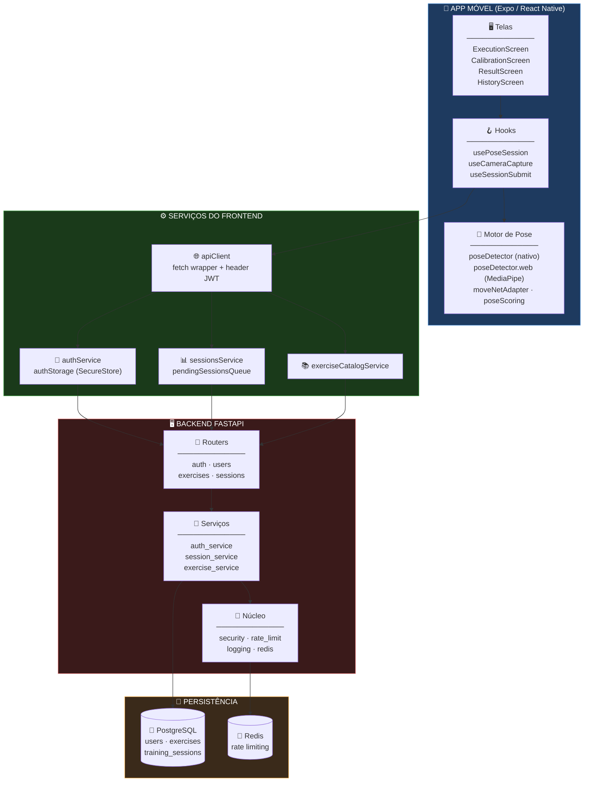
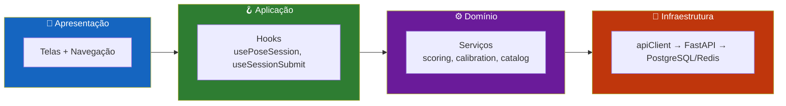
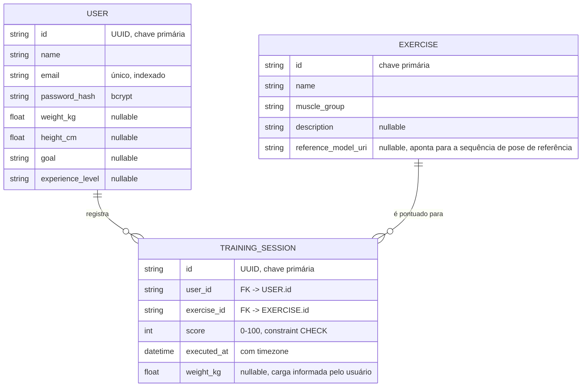
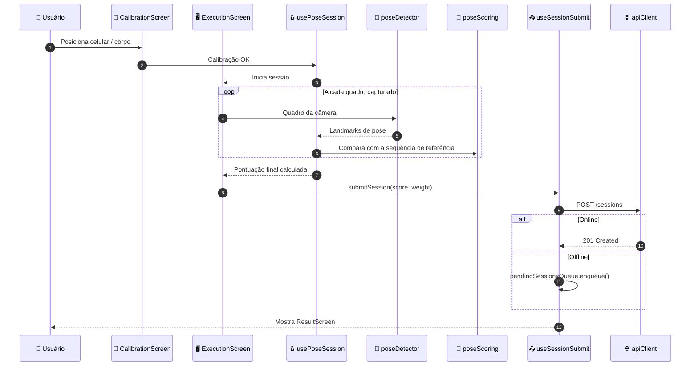
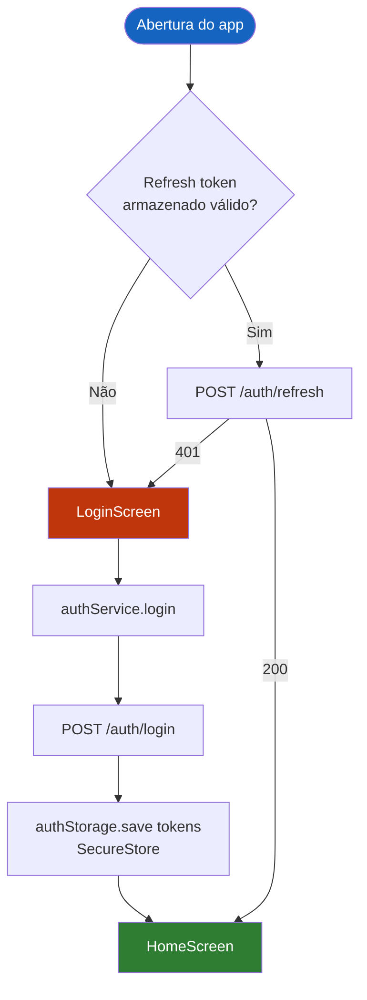
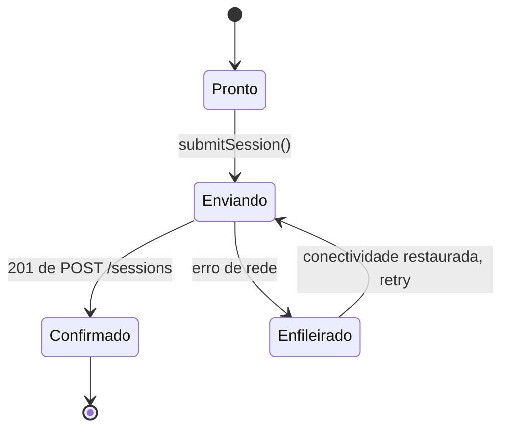
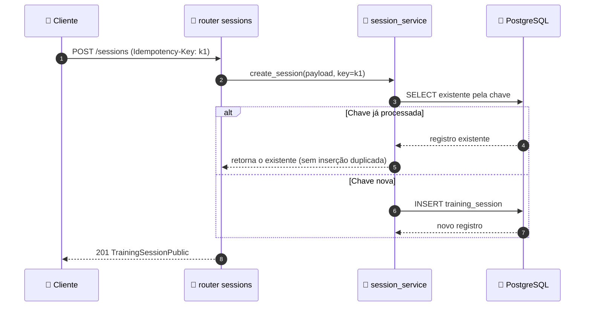
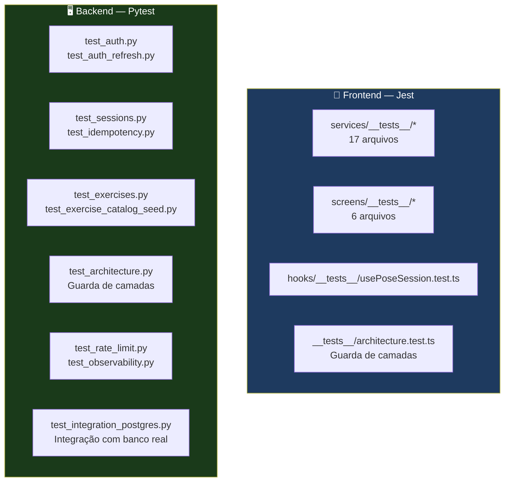

<div align="center">

**🌐 Choose Language / Selecione o Idioma / Elija el Idioma**

[](README.md)&nbsp;&nbsp;&nbsp;[](README_PT.md)&nbsp;&nbsp;&nbsp;[](README_ES.md)

</div>

---

<div align="center">

```
 ██████╗██╗   ██╗███╗   ███╗    ███████╗██╗  ██╗███████╗ ██████╗██╗   ██╗████████╗██╗ ██████╗ ███╗   ██╗
██╔════╝╚██╗ ██╔╝████╗ ████║    ██╔════╝╚██╗██╔╝██╔════╝██╔════╝██║   ██║╚══██╔══╝██║██╔═══██╗████╗  ██║
██║  ███╗╚████╔╝ ██╔████╔██║    █████╗   ╚███╔╝ █████╗  ██║     ██║   ██║   ██║   ██║██║   ██║██╔██╗ ██║
██║   ██║ ╚██╔╝  ██║╚██╔╝██║    ██╔══╝   ██╔██╗ ██╔══╝  ██║     ██║   ██║   ██║   ██║██║   ██║██║╚██╗██║
╚██████╔╝  ██║   ██║ ╚═╝ ██║    ███████╗██╔╝ ██╗███████╗╚██████╗╚██████╔╝   ██║   ██║╚██████╔╝██║ ╚████║
 ╚═════╝   ╚═╝   ╚═╝     ╚═╝    ╚══════╝╚═╝  ╚═╝╚══════╝ ╚═════╝ ╚═════╝    ╚═╝   ╚═╝ ╚═════╝ ╚═╝  ╚═══╝
                Estimativa de pose no dispositivo para pontuação de execução de exercícios
```

---

[](https://expo.dev/)
[](https://reactnative.dev/)
[](https://www.typescriptlang.org/)
[](https://fastapi.tiangolo.com/)
[](https://www.postgresql.org/)
[](https://www.tensorflow.org/lite)
[](https://redis.io/)

<br/>

> **Um aplicativo móvel que observa você se exercitando pela câmera e pontua sua execução**
> usando estimativa de pose no dispositivo, nunca enviando vídeo bruto para nenhum servidor.

<br/>


</div>

---

## 📑 Índice

<details>
<summary>▶️ <strong>Clique para expandir / recolher esta seção</strong></summary>

<table>
<tr>
<td valign="top" width="50%">

**🏗️ Sistema**
- [Visão Geral](#-visão-geral)
- [Arquitetura do Sistema](#-arquitetura-do-sistema)
- [Stack Tecnológica](#-stack-tecnológica)
- [Padrões de Projeto](#-padrões-de-projeto-aplicados)
- [Estrutura do Projeto](#-estrutura-do-projeto)

**📦 Módulos**
- [Pipeline de Detecção de Pose](#-módulos-do-sistema)
- [Tela de Execução](#-módulos-do-sistema)
- [Serviços de Sessão](#-módulos-do-sistema)
- [Auth & API Client](#-módulos-do-sistema)
- [Routers do Backend](#-módulos-do-sistema)
- [Pipeline de Referência](#-módulos-do-sistema)

</td>
<td valign="top" width="50%">

**💼 Negócio**
- [Regras de Negócio](#-regras-de-negócio)
- [Requisitos Funcionais](#-requisitos-funcionais)
- [Requisitos Não Funcionais](#-requisitos-não-funcionais)

**📐 Design**
- [Modelo de Dados](#-modelo-de-dados)
- [Fluxos do Sistema](#-fluxos-do-sistema)

**🔐 Segurança & Operações**
- [Segurança](#-segurança)
- [Instalação & Execução](#-instalação--execução)
- [Testes Automatizados](#-testes-automatizados)
- [Métricas & Monitoramento](#-métricas--monitoramento)
- [Limitações Conhecidas](#-limitações-conhecidas)

</td>
</tr>
</table>

---

</details>

## 🌟 Visão Geral

<details>
<summary>▶️ <strong>Clique para expandir / recolher esta seção</strong></summary>

**Gym Execution** é um sistema em duas partes: um aplicativo móvel **Expo / React Native** que pontua a execução de exercícios em tempo real usando a câmera do celular, e um backend **FastAPI** que armazena usuários, exercícios e sessões de treino concluídas.

O aplicativo executa a estimativa de pose **no dispositivo** por meio do `react-native-fast-tflite` (um modelo MoveNet TFLite em plataformas nativas) ou MediaPipe Tasks Vision na web, extrai uma sequência de pose normalizada por repetição e a compara com uma **sequência de pose de referência** para o exercício selecionado, produzindo uma pontuação de 0 a 100. Apenas a pontuação resultante e metadados leves (peso, timestamp) são enviados ao backend; os quadros de vídeo brutos nunca saem do dispositivo.

O backend é uma API REST pequena e bem testada: autenticação JWT com tokens de refresh, um catálogo de exercícios, gravação de sessões com suporte a idempotência, limitação de taxa via Redis e logging JSON estruturado com métricas no estilo Prometheus.

### 🎯 Objetivos do Sistema

| Objetivo | Descrição |
|-----------|-------------|
| 📷 **Captura de pose no dispositivo** | Pontuar a execução sem nunca transmitir vídeo bruto |
| 🏋️ **Catálogo de exercícios** | Servir uma lista curada de exercícios com sequências de pose de referência |
| 🎯 **Pontuação de execução** | Comparar uma sequência capturada com uma referência e produzir uma pontuação de 0 a 100 |
| 🔐 **Autenticação** | Registro, login, refresh e logout com tokens JWT de acesso + refresh |
| 📊 **Acompanhamento de progresso** | Persistir sessões com pontuação, peso e timestamp; expor estatísticas agregadas |
| 🎯 **Metas pessoais** | Permitir que o usuário defina e acompanhe metas de treino pessoais localmente |
| 📡 **Resiliência offline** | Enfileirar sessões localmente e enviá-las quando a conectividade retornar |
| 🧪 **Módulos orientados a testes** | Cobrir serviços, hooks e telas com Jest; cobrir a API com Pytest |

---

</details>

## 🏗️ Arquitetura do Sistema

<details>
<summary>▶️ <strong>Clique para expandir / recolher esta seção</strong></summary>

### Diagrama de Módulos



### Camadas da Arquitetura



---

</details>

## 🛠️ Stack Tecnológica

<details>
<summary>▶️ <strong>Clique para expandir / recolher esta seção</strong></summary>

<table>
<thead>
<tr>
<th>Camada</th>
<th>Tecnologia</th>
<th>Versão</th>
<th>Finalidade</th>
</tr>
</thead>
<tbody>
<tr>
<td rowspan="4"><strong>📱 Mobile</strong></td>
<td>Expo</td>
<td>~51.0.0</td>
<td>Toolchain gerenciada do React Native, dev client</td>
</tr>
<tr>
<td>React Native</td>
<td>0.74.0</td>
<td>Runtime de app multiplataforma</td>
</tr>
<tr>
<td>React</td>
<td>18.2.0</td>
<td>Modelo de componentes de UI</td>
</tr>
<tr>
<td>TypeScript</td>
<td>~5.3.3</td>
<td>Tipagem estática em todo o app</td>
</tr>
<tr>
<td rowspan="4"><strong>🧠 Estimativa de Pose</strong></td>
<td>react-native-fast-tflite</td>
<td>2.0.0</td>
<td>Inferência TFLite no dispositivo (plataformas nativas)</td>
</tr>
<tr>
<td>@mediapipe/tasks-vision</td>
<td>0.10.35</td>
<td>Pose landmarker na web (<code>poseDetector.web.ts</code>)</td>
</tr>
<tr>
<td>expo-camera</td>
<td>~15.0.16</td>
<td>Captura de quadros da câmera</td>
</tr>
<tr>
<td>jpeg-js</td>
<td>0.4.4</td>
<td>Decodificação de quadros para tensores de entrada da pose</td>
</tr>
<tr>
<td rowspan="4"><strong>📦 Suporte ao App</strong></td>
<td>@react-navigation/native + native-stack</td>
<td>^6.x</td>
<td>Pilha de navegação de telas</td>
</tr>
<tr>
<td>@react-native-async-storage/async-storage</td>
<td>1.23.1</td>
<td>Persistência local (preferências, fila pendente)</td>
</tr>
<tr>
<td>expo-secure-store</td>
<td>~13.0.0</td>
<td>Armazenamento criptografado para tokens de autenticação</td>
</tr>
<tr>
<td>expo-file-system / expo-image-manipulator</td>
<td>17.0.1 / ~12.0.5</td>
<td>Manipulação de quadros/arquivos para captura e exportação</td>
</tr>
<tr>
<td rowspan="2"><strong>🧪 Testes de Frontend</strong></td>
<td>Jest + jest-expo</td>
<td>^29.7.0 / ~51.0.0</td>
<td>Testes unitários para serviços, hooks e telas</td>
</tr>
<tr>
<td>react-test-renderer</td>
<td>18.2.0</td>
<td>Renderização de telas nos testes</td>
</tr>
<tr>
<td rowspan="6"><strong>🖥️ Backend</strong></td>
<td>FastAPI</td>
<td>0.111.0</td>
<td>Framework de API REST</td>
</tr>
<tr>
<td>Uvicorn</td>
<td>0.30.1</td>
<td>Servidor ASGI</td>
</tr>
<tr>
<td>Pydantic / pydantic-settings</td>
<td>2.9.2 / 2.3.4</td>
<td>Esquemas + configurações tipadas</td>
</tr>
<tr>
<td>SQLAlchemy</td>
<td>2.0.31</td>
<td>ORM sobre PostgreSQL</td>
</tr>
<tr>
<td>Alembic</td>
<td>1.13.2</td>
<td>Migrações de esquema</td>
</tr>
<tr>
<td>PyJWT / bcrypt</td>
<td>2.9.0 / 4.2.0</td>
<td>Emissão de tokens e hashing de senhas (substituindo python-jose/passlib por motivos de CVE)</td>
</tr>
<tr>
<td rowspan="3"><strong>💾 Dados & Operações</strong></td>
<td>psycopg2-binary</td>
<td>2.9.12</td>
<td>Driver PostgreSQL</td>
</tr>
<tr>
<td>Redis + slowapi</td>
<td>5.0.7 / 0.1.9</td>
<td>Backend de limitação de taxa</td>
</tr>
<tr>
<td>python-json-logger</td>
<td>2.0.7</td>
<td>Logging JSON estruturado</td>
</tr>
<tr>
<td rowspan="2"><strong>🧪 Testes de Backend</strong></td>
<td>pytest</td>
<td>8.2.2</td>
<td>Executor de testes (15 módulos de teste)</td>
</tr>
<tr>
<td>httpx</td>
<td>0.27.0</td>
<td>Cliente de teste assíncrono para FastAPI</td>
</tr>
</tbody>
</table>

---

</details>

## 🎨 Padrões de Projeto Aplicados

<details>
<summary>▶️ <strong>Clique para expandir / recolher esta seção</strong></summary>

| Padrão | Onde | Justificativa |
|---------|-------|-----------|
| 🧭 **Facade** | `apiClient.ts` | Um único wrapper de fetch esconde a URL base, a injeção do header JWT e a formatação de erros |
| 🎯 **Adapter** | `moveNetAdapter.ts`, `poseDetector.web.ts` | Normaliza a saída nativa do TFLite e a saída do MediaPipe em um único formato `poseTypes.ts` |
| 🪝 **Custom Hook** | `usePoseSession`, `useCameraCapture`, `useSessionSubmit` | Encapsula a lógica com estado de pose/câmera/sessão fora dos componentes de tela |
| 📦 **Serviço tipo Repository** | `sessionsService.ts`, `exerciseCatalogService.ts` | As telas nunca chamam `fetch` diretamente; os serviços são donos do contrato de rede |
| 🔁 **Fila / Retry** | `pendingSessionsQueue.ts` | Armazena em buffer sessões não enviadas e as envia quando o cliente volta a ficar online |
| 🧱 **Backend em Camadas** | `routers/` → `services/` → `models/` | Routers permanecem enxutos, a lógica de negócio fica nos serviços, a persistência nos models SQLAlchemy |
| 🚦 **Injeção de Dependência** | `core/deps.py`, `Depends` do FastAPI | Sessões de banco, resolução do usuário atual, verificações de chave admin são injetadas, não importadas |
| 🔐 **Chave de Idempotência** | router `sessions`, `test_idempotency.py` | Envios duplicados da mesma sessão são detectados via header `Idempotency-Key` |

---

</details>

## 📁 Estrutura do Projeto

<details>
<summary>▶️ <strong>Clique para expandir / recolher esta seção</strong></summary>

```
Gym_execution/
│
├── 📂 app/                              # Cliente móvel Expo / React Native
│   ├── 📄 package.json                  # Dependências, configuração do Jest, scripts
│   ├── 📂 assets/models/                # Modelo(s) TFLite de pose empacotado(s)
│   └── 📂 src/
│       ├── 📂 screens/                  # 11 telas (Execution, Calibration, History, ...)
│       │   └── 📂 __tests__/            # Testes Jest em nível de tela
│       ├── 📂 hooks/                    # usePoseSession, useCameraCapture, useSessionSubmit, ...
│       ├── 📂 services/                 # 26 serviços: pontuação de pose, auth, storage, exportação, ...
│       │   └── 📂 __tests__/            # Testes Jest em nível de serviço
│       ├── 📂 navigation/               # AppNavigator.tsx — stack navigator
│       ├── 📂 types/                    # api.generated.ts (a partir de openapi.json)
│       └── 📂 __tests__/                # architecture.test.ts — guarda de camadas
│
├── 📂 backend/                          # Serviço FastAPI
│   ├── 📄 requirements.txt              # Dependências de produção + teste fixadas
│   ├── 📂 app/
│   │   ├── 📄 main.py                   # Configuração do app, middleware, endpoints de health/metrics
│   │   ├── 📂 core/                     # config, database, security, rate_limit, logging, redis
│   │   ├── 📂 models/                   # user.py, exercise.py, training_session.py, base.py
│   │   ├── 📂 routers/                  # auth.py, users.py, exercises.py, sessions.py
│   │   ├── 📂 schemas/                  # Esquemas Pydantic de request/response
│   │   └── 📂 services/                 # auth_service, session_service, exercise_service, user_service
│   ├── 📂 alembic/versions/             # Migrações de banco de dados
│   ├── 📂 pipeline/                     # Ferramental offline para construir sequências de pose de referência
│   │   ├── extract_pose_sequence.py     # Extrai uma sequência de pose a partir de um vídeo de origem
│   │   ├── pose_sequence_format.py      # Esquema de sequência compartilhado
│   │   ├── publish_reference.py         # Publica uma sequência de referência para um exercício
│   │   └── README.md                    # Notas de uso específicas do pipeline
│   ├── 📂 scripts/                      # Scripts operacionais / de seed
│   └── 📂 tests/                        # 15 módulos pytest (auth, sessions, rate limit, ...)
│
├── 📄 docker-compose.yml                # Orquestração local de Postgres + Redis + backend
├── 📄 README.md                         # 🇺🇸 Inglês (principal)
├── 📄 README_PT.md                      # 🇧🇷 Português
└── 📄 README_ES.md                      # 🇪🇸 Espanhol
```

---

</details>

## 📦 Módulos do Sistema

<details>
<summary>▶️ <strong>Clique para expandir / recolher esta seção</strong></summary>

### 🧠 Pipeline de Detecção de Pose

A captura de quadros (`useCameraCapture.ts`) alimenta o `poseDetector.ts` (nativo, TFLite via `react-native-fast-tflite`) ou o `poseDetector.web.ts` (MediaPipe Tasks Vision na web). Os landmarks são normalizados pelo `moveNetAdapter.ts` no formato compartilhado `poseTypes.ts`, e então pontuados pelo `poseScoring.ts` em comparação com uma sequência de referência carregada via `referenceLibrary.ts`.

| Responsabilidade | Arquivo |
|-----------------|------|
| Captura de quadros / ciclo de vida da câmera | `useCameraCapture.ts` |
| Inferência TFLite nativa | `poseDetector.ts`, `moveNetAdapter.ts` |
| Inferência web (MediaPipe) | `poseDetector.web.ts` |
| Tipos de pose compartilhados | `poseTypes.ts` |
| Pontuação da sequência vs. referência | `poseScoring.ts` |
| Carregamento da sequência de referência | `referenceLibrary.ts`, `useReferenceSequence.ts` |
| Calibração corporal antes de uma série | `bodyCalibration.ts`, `CalibrationScreen.tsx` |

---

### 🖥️ Telas de Execução e Resultado

`ExecutionScreen.tsx` orquestra uma série ao vivo: ela conduz `usePoseSession.ts` (o hook central que combina captura + pontuação + contagem de repetições) e depois passa o controle para `ResultScreen.tsx` para a pontuação final e para `useSessionSubmit.ts` para persisti-la.

| Tela | Papel |
|--------|------|
| `CalibrationScreen.tsx` | Guia o usuário para posicionar a câmera corretamente antes de uma série |
| `ExecutionScreen.tsx` | Câmera ao vivo + sobreposição de pose + contagem de repetições durante o exercício |
| `ResultScreen.tsx` | Mostra a pontuação final, entrada de peso e ação de envio |
| `ExerciseListScreen.tsx` | Lista o catálogo de exercícios buscado do backend |
| `HistoryScreen.tsx` | Mostra sessões passadas e estatísticas agregadas |
| `HomeScreen.tsx` | Tela inicial / dashboard |
| `GoalsScreen.tsx` | Acompanhamento de metas pessoais (`personalGoals.ts`) |
| `ProfileScreen.tsx` / `SettingsScreen.tsx` | Gerenciamento de conta e preferências |
| `LoginScreen.tsx` / `RegisterScreen.tsx` | Telas de autenticação apoiadas por `authService.ts` |

---

### 📊 Serviços de Sessão e Armazenamento

| Arquivo | Responsabilidade |
|------|-----------------|
| `sessionsService.ts` | Envia e busca sessões de treino no backend |
| `pendingSessionsQueue.ts` | Persiste localmente sessões não enviadas e tenta reenviar ao reconectar |
| `exportSessions.ts` | Exporta o histórico de sessões (ex.: CSV/texto compartilhável) |
| `profileStats.ts`, `sessionInsights.ts`, `trainingReport.ts` | Derivam estatísticas agregadas e relatórios a partir do histórico de sessões |
| `achievements.ts` | Calcula conquistas desbloqueadas a partir do histórico de sessões |
| `preferencesStorage.ts`, `exercisePreferencesStorage.ts` | Preferências do usuário apoiadas em AsyncStorage |

---

### 🔐 Auth & API Client

| Arquivo | Responsabilidade |
|------|-----------------|
| `apiClient.ts` | Wrapper central de fetch: URL base, tratamento de JSON, header `Authorization` JWT |
| `authService.ts` | Chamadas de registro, login, refresh e logout contra `/auth/*` |
| `authStorage.ts` | Persiste tokens de acesso/refresh no `expo-secure-store` |
| `useAuth.tsx` | Contexto/hook React que expõe o estado de autenticação para a árvore de telas |

---

### 🚏 Routers do Backend

| Router | Endpoints |
|--------|-----------|
| `auth.py` | `POST /register`, `POST /login`, `POST /refresh`, `POST /logout` |
| `users.py` | `GET /me`, `PATCH /me`, `DELETE /me` |
| `exercises.py` | `GET /`, `GET /{exercise_id}`, `PUT /{exercise_id}` |
| `sessions.py` | `POST /`, `GET /`, `GET /stats` |

Cada router delega para um módulo `*_service.py` correspondente; os routers em si não contêm queries SQLAlchemy diretas.

---

### 🧱 Núcleo do Backend

| Arquivo | Responsabilidade |
|------|-----------------|
| `core/config.py` | Configurações tipadas via `pydantic-settings` (orientadas por variáveis de ambiente) |
| `core/database.py` | Engine SQLAlchemy + fábrica `SessionLocal` |
| `core/security.py` | Hashing de senha (bcrypt), encode/decode de JWT (PyJWT) |
| `core/deps.py` | Dependências do FastAPI: sessão de banco, usuário atual, `require_admin_api_key` |
| `core/rate_limit.py` | Configuração do limiter `slowapi` |
| `core/redis.py` | Cliente Redis usado como backend de limitação de taxa |
| `core/logging.py` | Logging JSON estruturado, middleware de request-ID, renderização de métricas Prometheus |

---

### 🧪 Pipeline de Referência (Ferramental Offline)

Um conjunto de ferramentas Python separado, não servido, em `backend/pipeline/`, que produz as sequências de pose de referência contra as quais o app pontua.

| Arquivo | Responsabilidade |
|------|-----------------|
| `extract_pose_sequence.py` | Extrai uma sequência de pose normalizada a partir de um vídeo de referência de origem |
| `pose_sequence_format.py` | Define o esquema de sequência compartilhado usado pela extração e pontuação |
| `publish_reference.py` | Publica/anexa uma sequência extraída a um `Exercise.reference_model_uri` |
| `test_pose_sequence_format.py` | Testes unitários para o formato de sequência |
| `requirements-pipeline.txt` | Conjunto de dependências isolado para este ferramental offline |

---

</details>

## 💼 Regras de Negócio

<details>
<summary>▶️ <strong>Clique para expandir / recolher esta seção</strong></summary>

### 🎯 Regras de Pontuação

| # | Regra | Aplicação |
|---|------|-------------|
| RN-01 | A pontuação de uma sessão de treino deve estar entre 0 e 100 | Constraint CHECK `ck_training_sessions_score_range` em `training_sessions` |
| RN-02 | O vídeo bruto nunca é enviado; apenas a pontuação derivada e metadados são enviados | `TrainingSession` não possui coluna de vídeo/quadro, apenas `score`, `weight_kg`, `executed_at` |
| RN-03 | Um exercício pode ou não ter uma sequência de pose de referência anexada | `Exercise.reference_model_uri` é nullable |

### 🔐 Regras de Autenticação e Conta

| # | Regra | Aplicação |
|---|------|-------------|
| RN-04 | Emails devem ser únicos entre os usuários | Índice único em `users.email` |
| RN-05 | Senhas nunca são armazenadas em texto plano | Hash `bcrypt` armazenado em `password_hash` |
| RN-06 | Tokens de acesso têm vida curta e são pareados com um token de refresh | `POST /auth/refresh` emite um novo access token a partir de um refresh token válido |
| RN-07 | Um usuário pode excluir permanentemente a própria conta | `DELETE /users/me`, coberto por `test_account_deletion.py` |

### 📡 Regras de Confiabilidade

| # | Regra | Aplicação |
|---|------|-------------|
| RN-08 | Envios duplicados de sessão não devem criar registros duplicados | Tratamento do header `Idempotency-Key`, coberto por `test_idempotency.py` |
| RN-09 | Clientes não autenticados ou acima do limite são rejeitados antes de atingir a lógica de negócio | Rate limiter `slowapi` + dependência JWT avaliada primeiro |
| RN-10 | `/metrics` só é acessível com a chave de API de admin | `Depends(require_admin_api_key)` no endpoint |

---

</details>

## ✅ Requisitos Funcionais

<details>
<summary>▶️ <strong>Clique para expandir / recolher esta seção</strong></summary>

| ID | Requisito | Prioridade | Status |
|----|-------------|----------|--------|
| **RF-01** | O sistema deve permitir que um usuário se registre com nome, email e senha | 🔴 Alta | ✅ Implementado |
| **RF-02** | O sistema deve permitir que um usuário faça login e receba tokens de acesso + refresh | 🔴 Alta | ✅ Implementado |
| **RF-03** | O sistema deve permitir renovar um access token a partir de um refresh token válido | 🔴 Alta | ✅ Implementado |
| **RF-04** | O sistema deve permitir logout, invalidando a sessão | 🟡 Média | ✅ Implementado |
| **RF-05** | O sistema deve listar os exercícios disponíveis com grupo muscular e descrição | 🔴 Alta | ✅ Implementado |
| **RF-06** | O sistema deve buscar um único exercício por ID | 🟡 Média | ✅ Implementado |
| **RF-07** | O sistema deve capturar quadros da câmera e executar estimativa de pose no dispositivo | 🔴 Alta | ✅ Implementado |
| **RF-08** | O sistema deve guiar o usuário por uma etapa de calibração antes da execução | 🟡 Média | ✅ Implementado |
| **RF-09** | O sistema deve calcular uma pontuação de 0 a 100 comparando com uma sequência de referência | 🔴 Alta | ✅ Implementado |
| **RF-10** | O sistema deve permitir que o usuário envie uma sessão concluída com pontuação e peso opcional | 🔴 Alta | ✅ Implementado |
| **RF-11** | O sistema deve enfileirar sessões localmente quando offline e enviá-las depois | 🟡 Média | ✅ Implementado |
| **RF-12** | O sistema deve mostrar um histórico de sessões passadas | 🔴 Alta | ✅ Implementado |
| **RF-13** | O sistema deve expor estatísticas agregadas de sessão via `GET /sessions/stats` | 🟡 Média | ✅ Implementado |
| **RF-14** | O sistema deve permitir que o usuário defina e acompanhe metas pessoais | 🟡 Média | ✅ Implementado |
| **RF-15** | O sistema deve permitir que o usuário visualize e edite seu perfil | 🟡 Média | ✅ Implementado |
| **RF-16** | O sistema deve permitir que o usuário exclua sua conta | 🟢 Baixa | ✅ Implementado |
| **RF-17** | O sistema deve permitir que o usuário exporte seu histórico de sessões | 🟢 Baixa | ✅ Implementado |
| **RF-18** | O sistema deve calcular conquistas a partir do histórico de sessões | 🟢 Baixa | ✅ Implementado |
| **RF-19** | O sistema deve expor sondas de liveness e readiness | 🟡 Média | ✅ Implementado |
| **RF-20** | O sistema deve expor métricas no estilo Prometheus protegidas por chave de admin | 🟢 Baixa | ✅ Implementado |
| **RF-21** | O sistema deve rejeitar envios duplicados de sessão usando uma chave de idempotência | 🟡 Média | ✅ Implementado |
| **RF-22** | O sistema deve gerar tipos de API TypeScript a partir do esquema OpenAPI do backend | 🟢 Baixa | ✅ Implementado |

---

</details>

## ⚡ Requisitos Não Funcionais

<details>
<summary>▶️ <strong>Clique para expandir / recolher esta seção</strong></summary>

| ID | Categoria | Requisito | Alvo |
|----|----------|-------------|--------|
| **RNF-01** | ⚡ Desempenho | A inferência de pose permanece no dispositivo | Nenhuma ida e volta de rede durante o exercício |
| **RNF-02** | 🔐 Segurança | Senhas com hash bcrypt, nunca registradas em log | Apenas a coluna `password_hash` |
| **RNF-03** | 🔐 Segurança | JWTs assinados e verificados com PyJWT, não python-jose | Removido por causa das CVE-2024-33664/33663 |
| **RNF-04** | 🔐 Segurança | Endpoints sensíveis com limitação de taxa | `slowapi` + backend Redis |
| **RNF-05** | 🔐 Privacidade | Vídeo bruto nunca é transmitido ou armazenado no servidor | Apenas a pontuação derivada é persistida |
| **RNF-06** | 🧪 Testabilidade | Lógica do backend coberta por uma suíte de testes isolada | 15 módulos pytest em `backend/tests/` |
| **RNF-07** | 🧪 Testabilidade | Serviços/hooks/telas do frontend cobertos por Jest | `collectCoverageFrom` mira serviços, hooks e telas |
| **RNF-08** | 🧱 Manutenibilidade | Backend em camadas: routers → services → models | Reforçado conceitualmente e por `test_architecture.py` |
| **RNF-09** | 🧱 Manutenibilidade | Camadas do frontend reforçadas por um teste dedicado | `app/src/__tests__/architecture.test.ts` |
| **RNF-10** | 📈 Observabilidade | Requisições registradas como JSON estruturado com um request ID | `core/logging.py`, `REQUEST_ID_HEADER` |
| **RNF-11** | 📈 Observabilidade | Liveness e readiness são sondas separadas | Evita tempestades de reinício em lentidão transitória do banco |
| **RNF-12** | 📡 Resiliência | O cliente tolera perda temporária de conectividade | `pendingSessionsQueue.ts` |
| **RNF-13** | 🔧 Reprodutibilidade | Dependências do backend fixadas com justificativa documentada | Comentários de cabeçalho em `requirements.txt` |
| **RNF-14** | 🌍 Portabilidade | O app roda em iOS, Android e web a partir de uma única base de código | Divisão de plataforma Expo + `poseDetector.web.ts` |
| **RNF-15** | 🗄️ Integridade de Dados | Pontuação da sessão restrita no nível do banco de dados | `ck_training_sessions_score_range` |

---

</details>

## 🗄️ Modelo de Dados

<details>
<summary>▶️ <strong>Clique para expandir / recolher esta seção</strong></summary>

### Diagrama Entidade-Relacionamento



### Restrições da Sessão de Treino

| Coluna | Tipo | Restrição |
|--------|------|-----------|
| `score` | `Integer` | `CHECK (score >= 0 AND score <= 100)` |
| `user_id` | `String` | `FOREIGN KEY -> users.id`, indexado |
| `exercise_id` | `String` | `FOREIGN KEY -> exercises.id`, indexado |
| `executed_at` | `DateTime(timezone=True)` | Não nullable |
| `weight_kg` | `Float` | Nullable, informado pelo usuário |

### Formato da Sequência de Pose no Cliente

| Campo | Tipo | Notas |
|-------|------|-------|
| `landmarks[]` | array de `{x, y, z, score}` | Keypoints normalizados por quadro, definidos em `poseTypes.ts` |
| `timestampMs` | number | Timestamp do quadro relativo ao início da série |
| `referenceSequenceId` | string | Corresponde a `Exercise.reference_model_uri` |

---

</details>

## 🔄 Fluxos do Sistema

<details>
<summary>▶️ <strong>Clique para expandir / recolher esta seção</strong></summary>

### Fluxo de Execução do Exercício



### Fluxo de Autenticação



### Máquina de Estados da Fila Offline



### Fluxo de Idempotência de Sessão



---

</details>

## 🔐 Segurança

<details>
<summary>▶️ <strong>Clique para expandir / recolher esta seção</strong></summary>

### Controles Implementados

| Controle | Implementação | Efeito |
|---------|---------------|--------|
| 🔐 **Hashing de senha** | `bcrypt` em `core/security.py` | Senhas em texto plano nunca são persistidas |
| 🪪 **Autenticação JWT** | Encode/decode `PyJWT`, par de acesso + refresh | Access tokens de vida curta limitam a janela de exposição |
| 🔑 **Armazenamento seguro de tokens** | `expo-secure-store` via `authStorage.ts` | Tokens mantidos fora do AsyncStorage simples no dispositivo |
| 🚦 **Limitação de taxa** | `slowapi` + Redis (`core/rate_limit.py`, `core/redis.py`) | Restringe força bruta e clientes abusivos |
| 🔒 **Métricas protegidas por admin** | `require_admin_api_key` em `/metrics` | Inventário de rotas e volume de tráfego não expostos publicamente |
| 🧾 **Logging de auditoria estruturado** | `core/logging.py`, middleware de request-ID | Toda requisição rastreável de ponta a ponta |
| 🌐 **Lista de permissão CORS** | `CORSMiddleware` com `settings.cors_allowed_origins` | Apenas origens configuradas podem chamar a API a partir de um navegador |
| 🚫 **Substituição de dependências por CVE** | `python-jose` → `PyJWT`, `passlib` → `bcrypt` nativo | Documentado no cabeçalho de `requirements.txt` |
| 🗂️ **Nenhuma mídia bruta no servidor** | O model `TrainingSession` não tem campo de vídeo/quadro | O servidor nunca mantém filmagens sensíveis da câmera |

### Limitações de Segurança Conhecidas

> [!WARNING]
> As limitações a seguir são inerentes ao design atual e devem ser compreendidas antes de um uso em produção mais amplo.

| Limitação | Risco | Caminho de mitigação |
|------------|------|-----------------|
| 🔓 **Nenhuma política de complexidade de senha documentada visível nos esquemas** | Senhas fracas são aceitas | Adicionar um validador de força mínima em `schemas/auth.py` |
| 🧑‍💻 **O modelo de inferência no dispositivo é empacotado junto com o app** | Os pesos do modelo são extraíveis do APK/IPA | Aceitável para um modelo de exercício público; revisar se um modelo proprietário for adicionado |
| 📡 **O armazenamento do refresh token depende apenas do SecureStore no cliente** | Um dispositivo comprometido pode reutilizar um refresh token armazenado | Adicionar rotação de refresh token e lista de revogação no servidor |
| 🧾 **O alias legado `/health` é não autenticado por design** | Exposição menor de informação (serviço ativo/inativo) | Aceitável; não contém dados sensíveis |
| 🔁 **A chave de idempotência é fornecida pelo cliente** | Um cliente malicioso poderia omiti-la ou forjá-la | No servidor, isso afeta apenas a proteção contra duplicidade do próprio cliente, não dados de outros usuários |
| 🌐 **As origens CORS são orientadas por configuração** | Uma implantação mal configurada poderia permitir origens em excesso | Revisar `settings.cors_allowed_origins` por ambiente antes do deploy |

---

</details>

## 🚀 Instalação & Execução

<details>
<summary>▶️ <strong>Clique para expandir / recolher esta seção</strong></summary>

### Pré-requisitos

```bash
# Node.js 18+ e npm para o app móvel
node -v

# Python 3.11+ para o backend
python --version

# Docker (para Postgres + Redis local via docker-compose.yml)
docker --version
```

### Build

```bash
# --- Backend ---
cd backend
python -m venv .venv && source .venv/bin/activate   # ou .venv\Scripts\activate no Windows
pip install -r requirements.txt
alembic upgrade head                                 # aplica as migrações do banco de dados

# --- App móvel ---
cd ../app
npm install
npm run generate:types      # gera src/types/api.generated.ts a partir de ../openapi.json
npm run typecheck           # tsc --noEmit
```

### Execução

```bash
# Inicia Postgres + Redis (e opcionalmente o backend) localmente
docker-compose up -d

# Executa o backend diretamente (se não estiver usando o serviço do compose)
cd backend
uvicorn app.main:app --reload

# Executa o app móvel
cd app
npm start          # expo start
npm run android    # ou: npm run ios / npm run web
```

### Scripts & Alvos

| Comando | Local | Finalidade |
|---------|----------|---------|
| `npm start` | `app/` | Inicia o servidor de desenvolvimento do Expo |
| `npm run android` / `ios` / `web` | `app/` | Executa em uma plataforma específica |
| `npm run typecheck` | `app/` | Executa `tsc --noEmit` |
| `npm run generate:types` | `app/` | Regenera o cliente de API tipado a partir de `openapi.json` |
| `npm test` / `npm run test:coverage` | `app/` | Executa a suíte Jest / com cobertura |
| `uvicorn app.main:app --reload` | `backend/` | Executa a API com hot reload |
| `alembic upgrade head` | `backend/` | Aplica migrações pendentes |
| `pytest` | `backend/` | Executa a suíte de testes do backend |

### Configuração de Build

| Configuração | Valor | Declarado em |
|---------|-------|-------------|
| Nome do app | `gym-execution-app` | `app/package.json` |
| Expo SDK | `~51.0.0` | `app/package.json` |
| Timeout de teste do Jest | `20000` ms | `app/package.json` (`jest.testTimeout`), documentado como intencional |
| Título do app FastAPI | `settings.app_name` | `backend/app/core/config.py` |
| Métodos CORS | `GET, POST, PUT, PATCH, DELETE` | `backend/app/main.py` |
| Header exposto | `REQUEST_ID_HEADER` | `backend/app/main.py` |

---

</details>

## 🧪 Testes Automatizados

<details>
<summary>▶️ <strong>Clique para expandir / recolher esta seção</strong></summary>

### Arquitetura de Testes



| Suíte | Local | Foco |
|-------|----------|-------|
| Serviços do frontend | `app/src/services/__tests__/` | 17 arquivos: pontuação, storage, calibração, conquistas, exportações, ... |
| Telas do frontend | `app/src/screens/__tests__/` | 6 arquivos: List, History, Home, Login, Result, Settings |
| Hooks do frontend | `app/src/hooks/__tests__/usePoseSession.test.ts` | Orquestração da sessão de pose |
| Arquitetura do frontend | `app/src/__tests__/architecture.test.ts` | Reforça as regras de camadas |
| Autenticação do backend | `test_auth.py`, `test_auth_refresh.py` | Registro/login/refresh/logout |
| Sessões do backend | `test_sessions.py`, `test_idempotency.py` | CRUD de sessão e proteção contra duplicidade |
| Exercícios do backend | `test_exercises.py`, `test_exercise_catalog_seed.py`, `test_app_catalog_contract.py` | Corretude do catálogo e contrato app/backend |
| Arquitetura do backend | `test_architecture.py` | Reforça o camadeamento router → service → model |
| Confiabilidade do backend | `test_rate_limit.py`, `test_observability.py`, `test_uuid_generation.py` | Limitação de taxa, logging, geração de IDs |
| Integração do backend | `test_integration_postgres.py` | Executa contra uma instância real do PostgreSQL |
| Conta do backend | `test_account_deletion.py`, `test_users.py` | Ciclo de vida de perfil e conta |

### Executando os Testes

```bash
# Frontend
cd app
npm test
npm run test:coverage

# Backend
cd backend
pytest
pytest tests/test_integration_postgres.py   # requer uma instância do Postgres em execução
```

### Checklist de Aceitação Manual

| # | Cenário | Resultado esperado |
|---|----------|-----------------|
| 1 | Registrar uma nova conta | Usuário criado, redirecionado para Home |
| 2 | Fazer login com credenciais corretas | Tokens de acesso + refresh armazenados, Home exibida |
| 3 | Selecionar um exercício, calibrar, executar | Pontuação de 0-100 exibida na ResultScreen |
| 4 | Enviar uma sessão enquanto offline | Sessão enfileirada localmente, sem crash |
| 5 | Recuperar conectividade | A sessão enfileirada é enviada automaticamente |
| 6 | Visualizar o Histórico | Sessões passadas listadas com pontuações e datas |
| 7 | Tentar envio duplicado de sessão com a mesma chave de idempotência | Nenhum registro duplicado criado |
| 8 | Exceder o limite de taxa em um endpoint | Resposta 429 retornada |
| 9 | Excluir conta | Conta e dados dependentes removidos, autenticações futuras falham |

---

</details>

## 📊 Métricas & Monitoramento

<details>
<summary>▶️ <strong>Clique para expandir / recolher esta seção</strong></summary>

### Métricas da Base de Código

| Métrica | Valor |
|--------|-------|
| Telas do frontend | 11 |
| Serviços do frontend | 26 |
| Hooks do frontend | 7 |
| Arquivos de teste do frontend | 24 (17 serviços + 6 telas + 1 hook) |
| Routers do backend | 4 |
| Serviços do backend | 4 |
| Models do backend | 3 (`User`, `Exercise`, `TrainingSession`) |
| Módulos de teste do backend | 15 |
| Módulos core do backend | 6 |
| Scripts do pipeline offline | 3 |

### Sinais em Tempo de Execução

| Sinal | Origem | Onde observar |
|--------|--------|------------------|
| Taxa de requisições/erros/duração | Renderização de métricas de `core/logging.py` | `GET /metrics` (requer chave de admin) |
| Liveness | Apenas responsividade do processo | `GET /health/live` |
| Readiness | `SELECT 1` contra o PostgreSQL | `GET /health/ready` |
| Logs de requisição estruturados | Logger JSON com request ID | stdout / agregador de logs |
| Rejeições de rate limit | `slowapi` + Redis | Respostas 429, chaves no Redis |

### Comandos de Diagnóstico Úteis

```bash
# Acompanhar logs do backend (JSON estruturado, uma linha por requisição)
uvicorn app.main:app --reload | tee backend.log

# Verificar readiness contra a instância em execução
curl -s http://localhost:8000/health/ready

# Buscar métricas (requer header de chave de admin)
curl -s -H "X-Admin-Api-Key: <key>" http://localhost:8000/metrics

# Inspecionar chaves de rate limit no Redis
docker exec -it <redis_container> redis-cli KEYS "LIMITER*"
```

### Códigos de Resposta Padronizados

| Código | Significado | Onde |
|------|---------|-------|
| `200` | OK | Health/readiness, endpoints GET |
| `201` | Created | Registro, criação de sessão |
| `204` | No Content | Logout, exclusão de conta |
| `401` | Unauthorized | JWT inválido/expirado |
| `429` | Too Many Requests | Limite do `slowapi` excedido |
| `500` | Internal Server Error | Capturado pelo handler global de exceções, retorna `requestId` |
| `503` | Service Unavailable | `/health/ready` quando o banco de dados está inacessível |

---

</details>

## ⚠️ Limitações Conhecidas

<details>
<summary>▶️ <strong>Clique para expandir / recolher esta seção</strong></summary>

> [!IMPORTANT]
> Este projeto equilibra um exercício educacional de pontuação de pose com práticas de backend de nível de produção (idempotência, limitação de taxa, logging estruturado). Algumas fronteiras entre frontend/backend ainda estão evoluindo.

| Categoria | Problema | Status |
|----------|-------|--------|
| 🧠 **Precisão do modelo de pose** | A pontuação com MoveNet/MediaPipe é heurística, não validada clinicamente | ➕ Intencional — a pontuação de execução é orientação, não avaliação médica |
| 📡 **Durabilidade da fila offline** | A fila vive no AsyncStorage, sem criptografia | ⚠️ Aberto — considerar migrar para SecureStore se os payloads de sessão se tornarem sensíveis |
| 🔑 **Sem rotação de refresh token** | Um refresh token vazado permanece válido até a expiração natural | ⚠️ Aberto — adicionar rotação + lista de revogação |
| 🧪 **Teste de integração requer Postgres ativo** | `test_integration_postgres.py` não pode rodar isoladamente | ➕ Intencional — valida o comportamento real do banco, pular localmente sem Postgres |
| 🌍 **Algumas strings de log/comentários estão em português** | Comentários de código em idiomas mistos | ➕ Intencional — a equipe principal de desenvolvimento fala português |
| 📱 **O caminho do detector de pose web é uma implementação separada** | O código de pose nativo e o web podem divergir | ⚠️ Aberto — adicionar testes de contrato comparando as saídas de `poseDetector` e `poseDetector.web` |
| 🔧 **O ferramental do pipeline é manual** | `pipeline/publish_reference.py` é executado manualmente, não automatizado | ⚠️ Aberto — envolver em um job de CI para novos exercícios de referência |
| 📊 **Sem dashboard para `/metrics`** | Formato de texto Prometheus exposto, mas sem configuração de Grafana empacotada | ⚠️ Aberto — disponibilizar uma definição inicial de dashboard |

> [!TIP]
> A melhoria de maior valor isolada é adicionar **rotação de refresh token com revogação no servidor**, já que isso fortalece diretamente o modelo de segurança de conta sem exigir nenhum redesenho do frontend.

</details>

---

<div align="center">

---

### 🏋️ Gym Execution

*Pontue o movimento, não o vídeo*


<br/>

```
"Uma boa execução é invisível até ser medida —
 a câmera só precisa ver o movimento uma vez."
```

</div>
